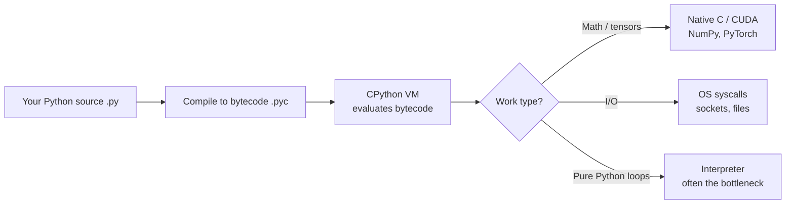
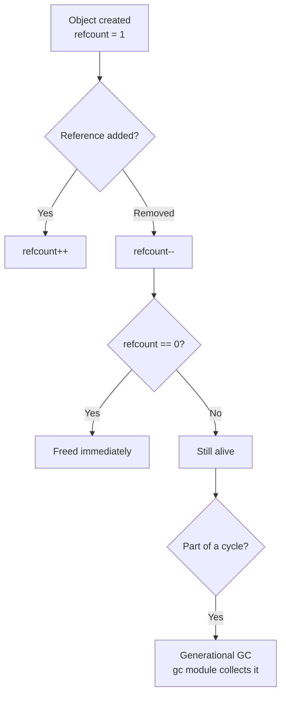
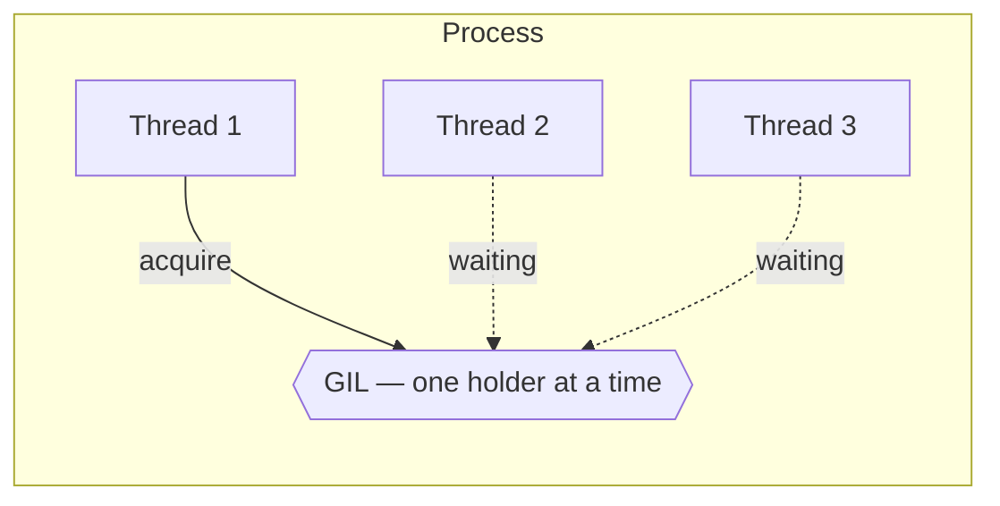
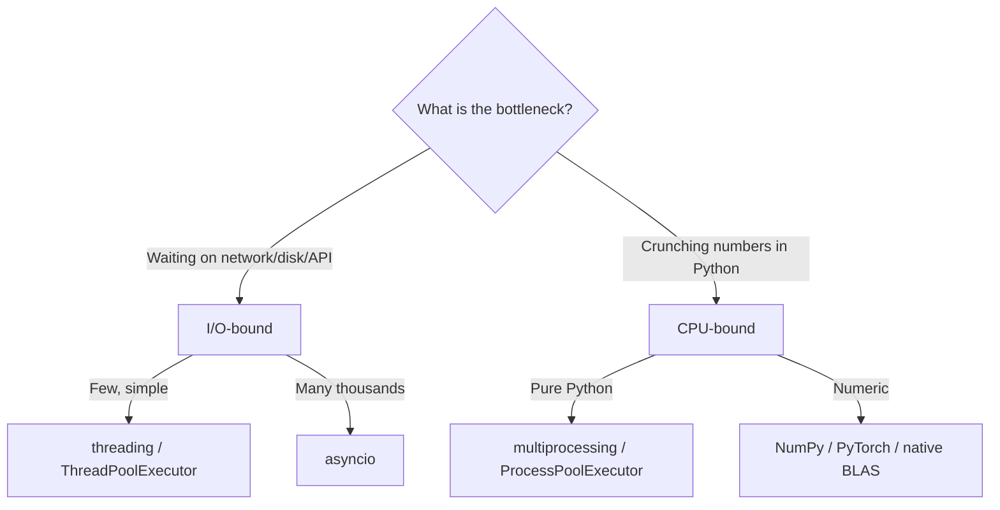
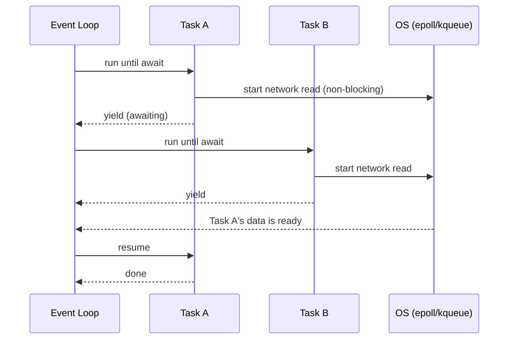
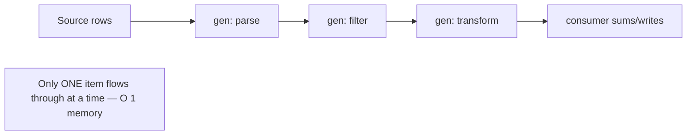
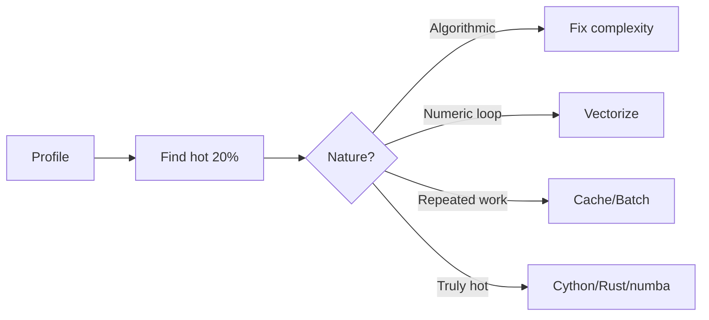
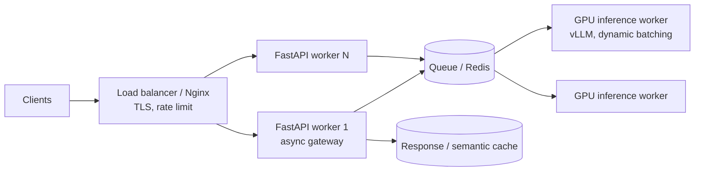

# Python for AI Engineering — Detailed Learning

> A deep, practical guide to the Python you actually need to build and ship AI systems.
> Written to be readable top-to-bottom, but also skimmable by section. Every concept ties
> back to *why it matters when you are serving models, moving data, or scaling a service*.

---

## Table of Contents

1. [How to think about Python](#1-how-to-think-about-python)
2. [The Python data model & object model](#2-the-python-data-model--object-model)
3. [Mutability, identity, and copying](#3-mutability-identity-and-copying)
4. [Memory management & garbage collection](#4-memory-management--garbage-collection)
5. [The GIL (and the 2025 free-threaded era)](#5-the-gil-and-the-2025-free-threaded-era)
6. [Concurrency: threading vs multiprocessing vs asyncio](#6-concurrency-threading-vs-multiprocessing-vs-asyncio)
7. [asyncio and the event loop, deeply](#7-asyncio-and-the-event-loop-deeply)
8. [Generators, iterators & lazy evaluation](#8-generators-iterators--lazy-evaluation)
9. [Decorators, closures & context managers](#9-decorators-closures--context-managers)
10. [Typing & Pydantic](#10-typing--pydantic)
11. [Dataclasses](#11-dataclasses)
12. [Performance optimization & profiling](#12-performance-optimization--profiling)
13. [NumPy: vectorization & broadcasting](#13-numpy-vectorization--broadcasting)
14. [Pandas & Polars](#14-pandas--polars)
15. [Packaging (uv / poetry / pip)](#15-packaging-uv--poetry--pip)
16. [Testing with pytest](#16-testing-with-pytest)
17. [FastAPI for serving models](#17-fastapi-for-serving-models)
18. [Common pitfalls](#18-common-pitfalls)
19. [Further reading](#19-further-reading)

---

## 1. How to think about Python

Python is a **dynamically typed, garbage-collected, interpreted** language whose reference
implementation (CPython) compiles your source to **bytecode** and runs it on a stack-based
virtual machine. For AI engineering this matters because:

- **Glue + orchestration**: Python is the control plane. The heavy math runs in C/CUDA
  (NumPy, PyTorch, vLLM). Your job is often to keep the fast native code fed and to not
  become the bottleneck.
- **Latency shape**: Most AI backends are **I/O-bound** (waiting on GPUs, model APIs,
  databases, vector stores). This is why `asyncio` matters so much.
- **Correctness at scale**: Type hints, Pydantic validation, and good packaging are what
  separate a demo notebook from a service that survives production.



**Interview framing:** "Python is fast to write and fast enough when the hot path is in C.
The engineering skill is knowing which parts must leave Python."

---

## 2. The Python data model & object model

**Everything is an object** — including functions, classes, and modules. Every object has:

- an **identity** (its address, via `id(obj)`),
- a **type** (`type(obj)`),
- a **value**.

The "data model" is the set of **dunder (double-underscore) methods** that hook your objects
into language syntax. When you write `a + b`, Python calls `a.__add__(b)`. When you write
`len(x)`, it calls `x.__len__()`. This is why Python feels consistent: operators are just
method calls.

```python
class Vector:
    def __init__(self, x, y):
        self.x, self.y = x, y
    def __add__(self, other):           # enables  v1 + v2
        return Vector(self.x + other.x, self.y + other.y)
    def __repr__(self):                 # what you see in a debugger / REPL
        return f"Vector({self.x}, {self.y})"
    def __eq__(self, other):            # enables  v1 == v2
        return (self.x, self.y) == (other.x, other.y)

print(Vector(1, 2) + Vector(3, 4))      # Vector(4, 6)
```

### Attribute lookup and `__slots__`

By default every instance stores attributes in a per-instance `__dict__`, which is flexible
but memory-hungry. When you create **millions** of small objects (e.g., data records,
tokens), `__slots__` removes the per-instance dict and stores attributes in a fixed layout:

```python
class Point:
    __slots__ = ("x", "y")   # no __dict__, ~40-50% less memory, faster attribute access
    def __init__(self, x, y):
        self.x, self.y = x, y
```

**When to use:** high-cardinality small objects on a hot path. **When not to:** you need
dynamic attributes, multiple inheritance flexibility, or the object count is small.

---

## 3. Mutability, identity, and copying

- **Immutable**: `int`, `float`, `str`, `bytes`, `tuple`, `frozenset`. Safe to share.
- **Mutable**: `list`, `dict`, `set`, most custom objects.

`==` compares **values**; `is` compares **identity**. Never use `is` to compare values
(the small-int and string-interning caches make it *look* like it works, then it silently
breaks).

### The mutable default argument trap (a classic interview gotcha)

```python
def add(item, bucket=[]):     # BUG: the list is created ONCE, at def time
    bucket.append(item)
    return bucket

add(1)  # [1]
add(2)  # [1, 2]  <-- surprise! shared state across calls

def add(item, bucket=None):   # FIX
    if bucket is None:
        bucket = []
    bucket.append(item)
    return bucket
```

### Shallow vs deep copy

```python
import copy
data = {"weights": [1, 2, 3]}
shallow = copy.copy(data)      # new dict, SAME inner list
deep = copy.deepcopy(data)     # fully independent clone
shallow["weights"].append(4)   # also mutates data["weights"]!
```

**Why it matters in AI:** accidentally sharing a mutable config or feature buffer between
requests causes race-condition-like bugs that are brutal to reproduce.

---

## 4. Memory management & garbage collection

CPython uses **reference counting** as the primary mechanism: each object tracks how many
references point to it; when the count hits zero the memory is freed **immediately and
deterministically**. A secondary **generational garbage collector** exists only to break
**reference cycles** (A points to B, B points to A) that ref-counting alone can't reclaim.



Key points for interviews:
- Ref-counting is why `with open(...)` frees the file promptly and why context managers work.
- The GC has **3 generations**; young objects are checked more often (generational hypothesis:
  most objects die young).
- `del x` decrements the refcount; it does not necessarily free memory instantly if other
  references exist.
- Tune with `gc.disable()` / `gc.freeze()` in latency-sensitive services (e.g., disable GC
  during a request and collect between requests) — but **measure first**.
- **Memory doesn't always return to the OS.** CPython keeps freed small-object arenas in
  internal pools (`pymalloc`). A process that spiked to 8 GB may keep reserving it.

---

## 5. The GIL (and the 2025 free-threaded era)

The **Global Interpreter Lock** is a mutex that lets **only one thread execute Python
bytecode at a time** inside a single CPython process. It exists to keep reference counting
thread-safe cheaply.



Consequences:
- **CPU-bound + threads = no speedup** (threads take turns). Use **multiprocessing** or
  native code that releases the GIL (NumPy/PyTorch release it during heavy math).
- **I/O-bound + threads = great**, because a thread **releases the GIL while waiting** on
  I/O, letting others run.

### 2025-2026: the GIL is becoming optional

This is a current hot topic — know it:

- **PEP 703** added a build flag (`--disable-gil`) for a **free-threaded** ("no-GIL")
  CPython. It first shipped as an **experimental** build in **Python 3.13 (Oct 2024)**.
- **PEP 779** was accepted (mid-2025) defining the criteria for support; the free-threaded
  build became **officially supported (but still optional, not the default)** in
  **Python 3.14 (Oct 2025)**. Free-threaded binaries carry the ABI tag **`t`** (e.g.
  `python3.14t`).
- **What it means:** real multi-core parallelism for pure-Python threads becomes possible.
  Single-thread performance can be slightly lower, and the whole C-extension ecosystem
  (NumPy, etc.) is being made thread-safe incrementally.

**Interview-ready summary:** "The GIL simplifies memory management but blocks CPU parallelism
in threads. Historically we reached for multiprocessing, asyncio, or native extensions.
As of 3.13/3.14 there's an officially supported free-threaded build that removes the GIL,
though it's opt-in and the ecosystem is still catching up."

Content reflects current (2025-2026) status; rephrased for compliance with licensing restrictions.

---

## 6. Concurrency: threading vs multiprocessing vs asyncio

| Model | Parallel? | Best for | Cost / caveat |
|---|---|---|---|
| **threading** | No (with GIL) | Blocking I/O, calling C libs that release GIL | Shared memory → locks, races |
| **multiprocessing** | Yes | CPU-bound pure Python | High memory, IPC/pickling overhead |
| **asyncio** | No | Massive concurrent I/O (thousands of sockets) | Everything must be non-blocking |
| **concurrent.futures** | Either | Simple pool API over threads/processes | Thin wrapper, easy to start with |



**Rule of thumb for AI backends:** the API layer that fans out to model providers, vector
DBs, and caches is I/O-bound → **asyncio**. The tokenizer/feature-engineering step that's
pure-Python and CPU-heavy → **multiprocessing** or push it into vectorized/native code.

```python
# CPU-bound: processes give real parallelism
from concurrent.futures import ProcessPoolExecutor
def heavy(n): return sum(i*i for i in range(n))
with ProcessPoolExecutor() as ex:
    results = list(ex.map(heavy, [10_000_000] * 8))

# I/O-bound (blocking libs): threads are fine because they release the GIL on I/O
from concurrent.futures import ThreadPoolExecutor
import requests
with ThreadPoolExecutor(max_workers=32) as ex:
    pages = list(ex.map(requests.get, urls))
```

---

## 7. asyncio and the event loop, deeply

`asyncio` gives **concurrency, not parallelism**. A single thread runs an **event loop**
that juggles many tasks. A `coroutine` runs until it hits an `await` on something not ready
(a network read); it **yields control** back to the loop, which runs other ready tasks.
When the awaited I/O completes, the loop resumes the coroutine.



### Core building blocks

```python
import asyncio, httpx

async def fetch(client, url):
    r = await client.get(url)          # yields to loop while waiting
    return r.status_code

async def main(urls):
    async with httpx.AsyncClient() as client:
        # gather runs them concurrently on ONE thread
        return await asyncio.gather(*(fetch(client, u) for u in urls))

asyncio.run(main(["https://example.com"] * 100))
```

Key tools & rules:
- `asyncio.gather(*tasks)` — run concurrently, collect results.
- `asyncio.TaskGroup` (3.11+) — structured concurrency; if one task fails, siblings are
  cancelled cleanly. Prefer it over bare `gather` for new code.
- `asyncio.Semaphore(n)` — cap concurrency (don't open 10k sockets at once).
- `asyncio.wait_for(coro, timeout)` — always add timeouts to external calls.
- `asyncio.to_thread(fn, ...)` — run a **blocking** function without freezing the loop.

### The cardinal sin: blocking the event loop

One synchronous CPU-bound or blocking call (`time.sleep`, `requests.get`, a big pure-Python
loop, blocking DB driver) **freezes every concurrent request**, because it's all one thread.

```python
# BAD inside async code — blocks the whole loop
import time
async def handler():
    time.sleep(2)              # freezes ALL requests for 2s

# GOOD — offload blocking work to a thread
async def handler():
    await asyncio.to_thread(blocking_inference, payload)
```

**Interview one-liner:** "asyncio is cooperative multitasking on a single thread. It shines
for high-concurrency I/O. The failure mode is one blocking call starving everyone — so keep
the loop pure and offload CPU/blocking work."

---

## 8. Generators, iterators & lazy evaluation

An **iterator** implements `__next__`; an **iterable** implements `__iter__`. A **generator**
is the easy way to build an iterator using `yield`. It computes values **lazily**, one at a
time, holding only the current item in memory.

```python
def read_large_file(path):
    with open(path) as f:
        for line in f:          # file objects are lazy iterators already
            yield line.strip()   # one line in memory at a time, not the whole file

# Process a 50 GB log with tiny memory:
lengths = (len(line) for line in read_large_file("huge.log"))   # generator expression
total = sum(lengths)
```

Why AI engineers care:
- **Streaming datasets** that don't fit in RAM (training data, embeddings, log processing).
- **Streaming LLM tokens** to the client (`yield` chunks as they arrive).
- **Pipelines**: chain generators so data flows without materializing intermediate lists.



`yield from` delegates to a sub-generator. `itertools` (`islice`, `chain`, `groupby`,
`batched` in 3.12+) is your lazy-pipeline toolkit.

---

## 9. Decorators, closures & context managers

### Closures
A closure is a function that remembers variables from the scope where it was defined.

```python
def make_multiplier(factor):
    def multiply(x):
        return x * factor        # `factor` is captured (closed over)
    return multiply
double = make_multiplier(2)
```

### Decorators
A decorator wraps a function to add behavior without changing its body — used everywhere in
AI code for timing, retries, caching, auth, and routing (`@app.get` in FastAPI).

```python
import functools, time

def timed(fn):
    @functools.wraps(fn)                 # preserves name/docstring/signature
    def wrapper(*args, **kwargs):
        start = time.perf_counter()
        try:
            return fn(*args, **kwargs)
        finally:
            print(f"{fn.__name__} took {time.perf_counter() - start:.3f}s")
    return wrapper

@timed
def embed(texts): ...
```

`functools.lru_cache` / `cache` memoizes expensive pure functions (e.g., repeated
tokenization or config parsing).

### Context managers
`with` guarantees setup/teardown even on exceptions — files, locks, DB sessions, timers,
GPU/model resource handles.

```python
from contextlib import contextmanager

@contextmanager
def timer(label):
    start = time.perf_counter()
    try:
        yield                    # body of the `with` runs here
    finally:
        print(f"{label}: {time.perf_counter() - start:.3f}s")

with timer("inference"):
    run_model()
```

---

## 10. Typing & Pydantic

Type hints are optional at runtime but invaluable for tooling (`mypy`, `pyright`),
readability, and IDE help. They do **not** enforce types at runtime by themselves.

```python
from typing import Optional, Union, Callable

def top_k(scores: list[float], k: int = 5) -> list[int]:
    ...

Handler = Callable[[str], str]          # type alias
def score(x: int | None) -> float:      # 3.10+ union syntax
    ...
```

### Pydantic — validation at the boundary
Pydantic **does** validate and coerce at runtime, which is why it's the backbone of FastAPI
request/response models and LLM structured output.

```python
from pydantic import BaseModel, Field, field_validator

class ChatRequest(BaseModel):
    prompt: str = Field(min_length=1, max_length=8000)
    temperature: float = Field(0.7, ge=0.0, le=2.0)
    max_tokens: int = Field(512, gt=0, le=4096)

    @field_validator("prompt")
    @classmethod
    def no_control_chars(cls, v: str) -> str:
        if "\x00" in v:
            raise ValueError("null byte not allowed")
        return v

# Invalid input raises a clean, structured error at the edge — not deep in your model code.
```

**Why it matters (security + reliability):** validate at the boundary so malformed or
malicious input never reaches your inference code. Pydantic v2's core is written in Rust and
is dramatically faster than v1 — relevant when validating high request volume.

---

## 11. Dataclasses

`@dataclass` auto-generates `__init__`, `__repr__`, `__eq__`, etc. Great for internal,
trusted data structures where you don't need runtime validation.

```python
from dataclasses import dataclass, field

@dataclass(slots=True, frozen=True)      # slots=fast/low-mem, frozen=immutable/hashable
class ModelConfig:
    name: str
    max_tokens: int = 512
    stop: list[str] = field(default_factory=list)   # never use a mutable literal default
```

**Dataclass vs Pydantic:** dataclass = lightweight, no validation, internal use.
Pydantic = validation/serialization, use at trust boundaries (API in/out, config from env,
LLM outputs). `pydantic.dataclasses` bridges the two.

---

## 12. Performance optimization & profiling

**Measure before optimizing.** The bottleneck is rarely where you guess.

| Tool | Measures | Use when |
|---|---|---|
| `time.perf_counter()` | wall time of a block | quick spot checks |
| `timeit` | micro-benchmarks | comparing tiny snippets |
| `cProfile` + `snakeviz` | per-function call counts/time | find hot functions |
| `py-spy` | sampling profiler, no code change, prod-safe | profile a live process |
| `line_profiler` | per-line time | drill into one hot function |
| `memory_profiler` / `tracemalloc` | memory usage | find leaks / bloat |

```python
import cProfile, pstats
cProfile.run("main()", "out.prof")
pstats.Stats("out.prof").sort_stats("cumulative").print_stats(15)
```

Optimization ladder (cheapest wins first):
1. **Better algorithm/data structure** — `set`/`dict` O(1) lookups vs `list` O(n); avoid
   accidental O(n²).
2. **Vectorize** — replace Python loops with NumPy/Pandas/Polars.
3. **Batch** — amortize per-call overhead (embeddings, DB writes, GPU inference).
4. **Cache** — `lru_cache`, Redis, semantic caches for LLM calls.
5. **Concurrency** — asyncio for I/O, processes for CPU.
6. **Native** — Cython, `numba`, or a Rust extension (`pyo3`) for true hot loops.



---

## 13. NumPy: vectorization & broadcasting

NumPy stores data in a **contiguous C array** and runs operations in compiled code, so
vectorized ops are 10-100x faster than Python loops and use far less memory.

```python
import numpy as np
a = np.arange(1_000_000)
# Slow: Python loop.  Fast: vectorized (loop runs in C)
squares = a ** 2
```

### Broadcasting
NumPy stretches smaller arrays across larger ones without copying, following shape rules
(align from the right; dims must be equal or 1).

```python
X = np.random.rand(1000, 768)        # 1000 embeddings, dim 768
mean = X.mean(axis=0)                # shape (768,)
centered = X - mean                  # (1000,768) - (768,) broadcasts across rows

# Cosine similarity of a query against all rows, fully vectorized:
q = np.random.rand(768)
sims = (X @ q) / (np.linalg.norm(X, axis=1) * np.linalg.norm(q))
```

**Why it matters:** embeddings, similarity search, feature transforms — all live or die on
vectorization. A Python `for` loop over vectors is an instant red flag in an AI code review.

---

## 14. Pandas & Polars

**Pandas** is the ubiquitous dataframe library. Key performance rules:
- **Never iterate rows** (`iterrows`) on a hot path — vectorize or use `.apply` sparingly.
- Use appropriate dtypes (`category` for low-cardinality strings, `float32` where precision
  allows) to cut memory.
- `groupby`, `merge`, and vectorized column ops are your workhorses.

**Polars** is a newer, Rust-based dataframe library built on Apache Arrow. It offers:
- **Multi-threaded** execution (no GIL bottleneck — the engine is in Rust),
- a **lazy API** with query optimization (`pl.scan_parquet(...).filter(...).collect()`),
- often **much lower memory** and **faster** performance on large data.

| | Pandas | Polars |
|---|---|---|
| Engine | Python/C, single-thread core | Rust, multi-threaded |
| Execution | Eager | Eager **and** lazy (optimized) |
| Memory | Higher | Lower (Arrow) |
| Ecosystem | Huge, mature | Growing fast |
| Use when | Interop, small/medium data, familiarity | Large data, performance, pipelines |

```python
import polars as pl
# Lazy: Polars optimizes the whole plan, reads only needed columns, pushes filters down
out = (
    pl.scan_parquet("events.parquet")
      .filter(pl.col("event") == "click")
      .group_by("user_id")
      .agg(pl.len().alias("clicks"))
      .collect()
)
```

---

## 15. Packaging (uv / poetry / pip)

Reproducible environments are a production requirement, not a nicety.

- **pip + venv** — the built-in baseline; slowest resolver, most universally compatible.
- **poetry** — lockfile-first, great for publishing libraries; resolver can be slow on big
  trees.
- **uv** (Astral, written in Rust) — the **emerging 2025-2026 standard for services**:
  10-100x faster than pip, a universal lockfile, manages Python versions and virtualenvs,
  and mirrors pip's CLI (`uv pip ...`). Huge win for CI/CD and Docker build times.

```bash
# uv: create project, add deps, lock, run — all fast
uv init myservice && cd myservice
uv add fastapi uvicorn pydantic numpy
uv run uvicorn app:app --reload      # runs inside the managed venv
uv sync                              # reproduce the locked environment exactly
```

**Interview note:** "For a new AI service in 2025-2026 I default to `uv` for speed and a
single lockfile; I keep existing Poetry projects on Poetry unless there's a concrete reason
to migrate. Conda/mamba only when I need non-Python native deps (e.g., CUDA toolchains)."

Also pin `python-version`, use a `pyproject.toml`, and build slim, multi-stage Docker images.

---

## 16. Testing with pytest

```python
import pytest

def cosine(a, b): ...

@pytest.fixture
def sample_vectors():
    return [1.0, 0.0], [1.0, 0.0]

def test_identical_vectors(sample_vectors):
    a, b = sample_vectors
    assert cosine(a, b) == pytest.approx(1.0)   # float-safe comparison

@pytest.mark.parametrize("a,b,expected", [
    ([1, 0], [0, 1], 0.0),
    ([1, 0], [1, 0], 1.0),
])
def test_cases(a, b, expected):
    assert cosine(a, b) == pytest.approx(expected)
```

Essentials: **fixtures** (setup/teardown & dependency injection), **parametrize** (data-driven
tests), `pytest.raises` (error paths), `pytest-asyncio` (test coroutines), `monkeypatch`/mocks
(isolate external APIs), and coverage gates in CI. For AI: test tokenization edge cases,
schema validation, and prompt/response contracts — and mock the model provider so tests are
fast and deterministic.

---

## 17. FastAPI for serving models

FastAPI is async-first (built on Starlette + Pydantic) and is the default choice for serving
models behind HTTP. The production patterns below come straight up in interviews.

```python
from contextlib import asynccontextmanager
from fastapi import FastAPI
from pydantic import BaseModel

ml = {}

@asynccontextmanager
async def lifespan(app: FastAPI):
    # LOAD THE MODEL ONCE at startup, keep it in memory for the process lifetime.
    ml["model"] = load_model()          # never load per-request (huge latency)
    yield
    ml.clear()                          # cleanup on shutdown

app = FastAPI(lifespan=lifespan)

class Req(BaseModel):
    prompt: str

@app.post("/generate")
async def generate(req: Req):
    # Inference is CPU/GPU-bound and often blocking -> don't block the event loop.
    import asyncio
    text = await asyncio.to_thread(ml["model"].run, req.prompt)
    return {"text": text}
```



Production checklist (architecture • scale • perf • security):
- **Load model once** at startup (`lifespan`); pre-warm to avoid cold-start latency spikes.
- **Never block the loop** — offload sync inference with `asyncio.to_thread` or a separate
  worker pool; for real GPU throughput, put a **batching inference server (vLLM)** behind a
  **queue** and keep the API stateless.
- **Scale**: multiple Uvicorn/Gunicorn workers behind a load balancer; separate GPU workers
  from the API tier so each scales independently.
- **Stream** tokens with SSE/`StreamingResponse` for perceived latency.
- **Security**: validate everything with Pydantic, enforce auth (API keys/JWT), rate-limit,
  set timeouts, cap payload sizes, and never echo secrets in errors.
- **Observability**: structured logs, request IDs, latency/percentile metrics (p50/p95/p99),
  health/readiness probes.

---

## 18. Common pitfalls

- **Mutable default arguments** (`def f(x=[])`) — shared across calls.
- **Blocking the asyncio event loop** with `time.sleep`, `requests`, or heavy pure-Python loops.
- **Using threads for CPU-bound work** and expecting speedup (GIL).
- **`is` vs `==`** — using `is` to compare values.
- **Late binding in closures/loops** — `[lambda: i for i in range(3)]` all return `2`;
  fix with `lambda i=i: i`.
- **Modifying a list while iterating it** — iterate a copy or build a new list.
- **Loading a model per request** in a web service — kills latency and memory.
- **Row-wise loops over DataFrames / vectors** instead of vectorizing.
- **Catching bare `except:`** — hides bugs and swallows `KeyboardInterrupt`/`SystemExit`.
- **Floating-point equality** — use `math.isclose` / `pytest.approx`.
- **Leaking file/socket handles** — always use `with`.
- **Global mutable state shared across async requests** — subtle data races.

---

## 19. Further reading

- Python Language Reference (data model): https://docs.python.org/3/reference/datamodel.html
- `asyncio` docs: https://docs.python.org/3/library/asyncio.html
- PEP 703 — making the GIL optional: https://peps.python.org/pep-0703/
- PEP 779 — supported free-threaded Python: https://peps.python.org/pep-0779/
- Free-threading guide: https://py-free-threading.github.io/
- NumPy broadcasting: https://numpy.org/doc/stable/user/basics.broadcasting.html
- Polars user guide: https://docs.pola.rs/
- Pydantic v2: https://docs.pydantic.dev/latest/
- FastAPI: https://fastapi.tiangolo.com/
- uv (Astral): https://docs.astral.sh/uv/
- Fluent Python, 2nd ed. (Luciano Ramalho); High Performance Python (Gorelick & Ozsvald)

> Content synthesized from general domain knowledge and current (2025-2026) trends;
> rephrased for compliance with licensing restrictions.
