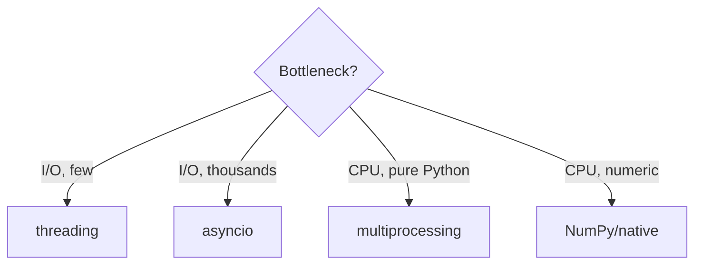

# Python for AI Engineering — Medium Interview Questions

> These separate people who *use* Python from people who *understand* it. Expect follow-ups
> ("why?", "what breaks at scale?"). Answers give the mental model, code, and trade-offs.

## Quick Coverage Map

| # | Question | Theme |
|---|---|---|
| 1 | Explain the GIL and its impact | Concurrency |
| 2 | threading vs multiprocessing vs asyncio | Concurrency |
| 3 | How does asyncio achieve concurrency? | Async |
| 4 | Iterators vs iterables vs generators | Lazy eval |
| 5 | Context managers & `with` | Resource mgmt |
| 6 | Closures & late binding | Functions |
| 7 | dataclass vs Pydantic | Data modeling |
| 8 | NumPy vectorization & broadcasting | Performance |
| 9 | Pandas vs Polars | Data |
| 10 | Memory management & GC | Internals |
| 11 | `lru_cache` / memoization | Performance |
| 12 | Type hints & static checking | Quality |

---

### 1. Explain the GIL. How does it affect CPU-bound vs I/O-bound work?

**Answer.** The Global Interpreter Lock is a mutex that allows only **one thread to run Python
bytecode at a time** per CPython process. It makes reference counting thread-safe cheaply.

- **CPU-bound + threads:** no speedup — threads take turns holding the GIL. Use
  **multiprocessing** (separate interpreters, real parallelism) or native code that releases
  the GIL (NumPy/PyTorch do during heavy math).
- **I/O-bound + threads:** great — a thread **releases the GIL while waiting** on network/disk,
  so others run.

```python
# CPU-bound: processes win
from concurrent.futures import ProcessPoolExecutor
with ProcessPoolExecutor() as ex:
    ex.map(cpu_heavy, tasks)

# I/O-bound: threads fine (GIL released on I/O), or asyncio for huge fan-out
```

**2025-2026 update:** the **free-threaded (no-GIL) build** (PEP 703) shipped experimentally in
3.13 and became **officially supported but optional** in 3.14 (PEP 779). It enables true
multi-core threading, at some single-thread cost, while the C-extension ecosystem adapts.

---

### 2. threading vs multiprocessing vs asyncio — how do you choose?

**Answer.** Match the tool to the bottleneck.

| Model | Parallel | Best for | Watch out |
|---|---|---|---|
| threading | No (GIL) | Blocking I/O, GIL-releasing C libs | Locks, races on shared state |
| multiprocessing | Yes | CPU-bound pure Python | Memory cost, pickling/IPC |
| asyncio | No | Thousands of concurrent I/O ops | Must be non-blocking end-to-end |



**AI framing:** API gateway fanning out to model providers/vector DBs → asyncio; heavy
pure-Python preprocessing → multiprocessing; matrix math → native/vectorized.

---

### 3. How does asyncio achieve concurrency without extra threads?

**Answer.** A single-threaded **event loop** runs many coroutines cooperatively. A coroutine
runs until it `await`s something not ready (I/O), then **yields control** to the loop, which
runs other ready tasks. When the I/O completes, the loop resumes the coroutine.

```python
import asyncio, httpx
async def fetch(client, url):
    r = await client.get(url)      # yields while waiting
    return r.status_code
async def main(urls):
    async with httpx.AsyncClient() as c:
        return await asyncio.gather(*(fetch(c, u) for u in urls))
```

**Key risk:** one blocking call (`time.sleep`, `requests`, a heavy loop) freezes the whole
loop. Offload with `await asyncio.to_thread(...)`. Add timeouts (`asyncio.wait_for`) and cap
concurrency (`asyncio.Semaphore`).

---

### 4. Iterators vs iterables vs generators?

**Answer.**
- **Iterable**: implements `__iter__` (can be looped over) — e.g., list, dict, file.
- **Iterator**: implements `__next__` (produces the next value; is exhausted once consumed).
- **Generator**: a concise iterator built with `yield`; computes lazily.

```python
nums = [1, 2, 3]            # iterable
it = iter(nums)            # iterator
next(it)                   # 1

def gen():                 # generator function
    yield from range(3)
```

**Why it matters:** generators power streaming pipelines and let you process data larger than
memory; understanding "exhausted once" avoids the bug of iterating the same generator twice.

---

### 5. What is a context manager and why use `with`?

**Answer.** A context manager defines setup (`__enter__`) and guaranteed teardown (`__exit__`),
so resources are released even if an exception occurs.

```python
from contextlib import contextmanager
import time
@contextmanager
def timer(label):
    t = time.perf_counter()
    try:
        yield
    finally:
        print(f"{label}: {time.perf_counter()-t:.3f}s")

with timer("inference"), open("out.txt") as f:   # multiple managers
    f.write(run_model())
```

**Why it matters:** files, DB sessions, locks, GPU/model handles, and timers all need
deterministic cleanup. `with` prevents leaks under errors.

---

### 6. What is a closure, and what is the "late binding" gotcha?

**Answer.** A closure is a nested function that captures variables from its enclosing scope.
The classic bug: closures capture the **variable**, not its value at creation time.

```python
funcs = [lambda: i for i in range(3)]
[f() for f in funcs]          # [2, 2, 2]  <- all see final i

funcs = [lambda i=i: i for i in range(3)]   # bind now via default arg
[f() for f in funcs]          # [0, 1, 2]
```

**Why it matters:** shows up when building lists of callbacks/handlers dynamically (e.g., a set
of per-model request functions).

---

### 7. dataclass vs Pydantic model — when do you use each?

**Answer.** Both reduce boilerplate, but validation differs.

| | `@dataclass` | Pydantic `BaseModel` |
|---|---|---|
| Runtime validation | No | Yes (coerces + validates) |
| Serialization | Manual | Built-in (`model_dump`, JSON) |
| Speed | Very fast | Fast (v2 core in Rust) |
| Use for | Internal, trusted data | Trust boundaries: API I/O, config, LLM outputs |

```python
from dataclasses import dataclass
@dataclass(slots=True, frozen=True)
class Config: name: str; max_tokens: int = 512

from pydantic import BaseModel, Field
class Req(BaseModel):
    prompt: str = Field(min_length=1)
    temperature: float = Field(0.7, ge=0, le=2)
```

**Rule:** validate untrusted input with Pydantic at the edge; use dataclasses for fast internal
structures.

---

### 8. Explain NumPy vectorization and broadcasting.

**Answer.** **Vectorization** replaces Python loops with array operations that run in compiled
C over contiguous memory — 10-100x faster. **Broadcasting** lets arrays of different but
compatible shapes combine without explicit copies (align shapes from the right; each dim must
match or be 1).

```python
import numpy as np
X = np.random.rand(1000, 768)     # 1000 embeddings
mean = X.mean(axis=0)             # (768,)
centered = X - mean               # (1000,768) - (768,) broadcasts across rows
sims = X @ X[0]                   # dot product with first vector, vectorized
```

**Why it matters:** any per-element Python loop over vectors/matrices is a red flag; vectorize
it. This directly affects embedding and similarity throughput.

---

### 9. Pandas vs Polars?

**Answer.** Pandas is the mature, ubiquitous single-threaded-core dataframe library. Polars is
a newer Rust/Arrow library that is multi-threaded, has a lazy optimized query engine, and uses
less memory — great for large data and pipelines.

```python
import polars as pl
out = (pl.scan_parquet("events.parquet")   # lazy: reads only needed columns
         .filter(pl.col("event") == "click")
         .group_by("user").agg(pl.len())
         .collect())               # optimized plan runs here
```

**Trade-off:** Pandas wins on ecosystem/interop and familiarity; Polars wins on performance and
memory at scale. In Pandas, **never** `iterrows` on a hot path — vectorize.

---

### 10. How does Python manage memory and garbage collection?

**Answer.** Primary mechanism is **reference counting** — an object is freed the instant its
refcount hits zero (deterministic). A **generational garbage collector** handles reference
**cycles** that ref-counting can't. Three generations; younger objects are scanned more often.

```python
import gc
gc.collect()          # force a cycle collection
gc.disable()          # e.g., disable during a latency-critical request, collect between
```

**Why it matters:** deterministic cleanup is why `with` frees files promptly; understanding GC
lets you tune latency-sensitive services and reason about why memory doesn't always shrink
(pymalloc arenas are retained).

---

### 11. What is memoization / `functools.lru_cache`?

**Answer.** Caching a pure function's results by its arguments so repeated calls are instant.
`lru_cache` bounds cache size with a least-recently-used policy; arguments must be hashable.

```python
from functools import lru_cache
@lru_cache(maxsize=1024)
def tokenize(text: str) -> tuple[int, ...]:
    return tuple(expensive_tokenizer(text))
```

**Why it matters:** cheap win for repeated tokenization, config parsing, or deterministic
lookups. For cross-process/service caching, reach for Redis instead. Watch memory growth with
`maxsize=None`.

---

### 12. Do type hints do anything at runtime? Why bother?

**Answer.** By themselves, type hints are **not enforced at runtime** — they're metadata for
humans and tools. Static checkers (`mypy`, `pyright`) catch type errors before deploy; IDEs use
them for autocomplete; Pydantic/FastAPI use them to *actually* validate at runtime.

```python
def top_k(scores: list[float], k: int = 5) -> list[int]: ...
```

**Why it matters:** on large AI codebases, types catch whole classes of bugs (wrong tensor
shape wrappers, None handling) early, and make refactors safe. FastAPI turns hints into request
validation and OpenAPI docs for free.

---

## Further Reading

- asyncio docs: https://docs.python.org/3/library/asyncio.html
- concurrency guide (real-world): https://docs.python.org/3/library/concurrency.html
- PEP 703 / PEP 779 (free-threading): https://peps.python.org/pep-0703/ , https://peps.python.org/pep-0779/
- NumPy broadcasting: https://numpy.org/doc/stable/user/basics.broadcasting.html
- Polars: https://docs.pola.rs/ • Pydantic v2: https://docs.pydantic.dev/latest/

> Content synthesized from general domain knowledge and current (2025-2026) interview trends;
> rephrased for compliance with licensing restrictions.
