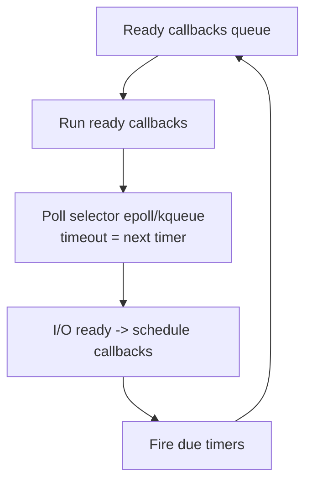
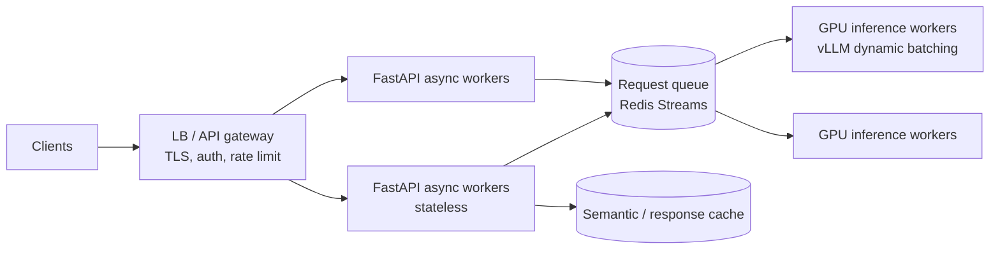

# Python for AI Engineering — Advanced / Expert Interview Questions

> Senior/Staff-level. Interviewers here probe **internals, trade-offs, and production behavior
> at scale**. The goal is to show you can reason about latency, memory, and correctness in a
> real distributed AI system — not just recite definitions.

## Quick Coverage Map

| # | Question | Theme |
|---|---|---|
| 1 | GIL internals & when it's released | CPython internals |
| 2 | asyncio internals (loop, futures, selectors) | Async internals |
| 3 | Free-threaded / no-GIL Python trade-offs | Concurrency 2025-2026 |
| 4 | Diagnosing a memory leak in prod | Memory |
| 5 | Speeding up a hot loop (C-extensions) | Performance |
| 6 | Scaling a model-serving API | Architecture/scale |
| 7 | `__slots__`, descriptors, metaclasses | Object model |
| 8 | GC tuning for low latency | GC internals |
| 9 | Pickling & multiprocessing pitfalls | IPC |
| 10 | Packaging for production/Docker | Deployment |
| 11 | Structured concurrency & cancellation | Async correctness |
| 12 | Security hardening a Python AI service | Security |

---

### 1. Explain GIL internals. When exactly is it released?

**Answer.** The GIL is a per-interpreter mutex protecting CPython internals (chiefly reference
counts). A running thread holds it and periodically yields based on a **switch interval**
(default ~5 ms, `sys.setswitchinterval`), giving other threads a chance. It is **released**:

1. During **blocking I/O** (socket/file syscalls) — this is why threads help I/O-bound work.
2. Inside **C extensions** that explicitly wrap heavy work in `Py_BEGIN_ALLOW_THREADS` /
   `Py_END_ALLOW_THREADS` (NumPy, PyTorch, compression, hashing).

```c
// Pattern inside a C extension so other Python threads can run:
Py_BEGIN_ALLOW_THREADS
    do_heavy_native_work();      // no Python objects touched here
Py_END_ALLOW_THREADS
```

**Staff-level nuance:** the old check-every-N-bytecodes scheme was replaced (3.2) by the
time-based switch interval to reduce thrashing. Convoy effects can still occur when a CPU-bound
thread repeatedly reacquires the GIL, starving an I/O thread — a real latency bug in mixed
workloads. Mitigate by isolating CPU work in processes or native code.

---

### 2. Walk through asyncio internals: event loop, futures, tasks, selectors.

**Answer.** The event loop is a single-threaded scheduler built on the OS **selector**
(`epoll` on Linux, `kqueue` on macOS, IOCP on Windows).

- A **coroutine** is a resumable function (built on generators/`send`).
- A **Future** is a placeholder for a result not yet available.
- A **Task** wraps a coroutine and drives it, scheduling callbacks.
- On each loop iteration: run ready callbacks, poll the selector for I/O readiness (with a
  timeout derived from the nearest scheduled timer), then resume the coroutines whose I/O
  completed.



**Why it matters:** explains why a blocking call is catastrophic (the single thread can't poll
the selector while stuck), why `loop.run_in_executor`/`asyncio.to_thread` exists (offload
blocking work), and why CPU-bound coroutines never truly parallelize. `await` == a point where
control can return to the loop.

---

### 3. What are the trade-offs of the free-threaded (no-GIL) build?

**Answer.** PEP 703 introduced `--disable-gil`; it shipped **experimental in 3.13 (2024)** and
became **officially supported but optional in 3.14 (2025)** per PEP 779 (free-threaded binaries
use the ABI tag `t`, e.g. `python3.14t`).

Trade-offs:
- **Pro:** pure-Python threads can finally use multiple cores → real parallelism for CPU-bound
  Python without multiprocessing's memory/IPC cost.
- **Con:** single-threaded code can be somewhat slower (ref-counting must be made thread-safe:
  biased reference counting, deferred/immortal objects). Memory overhead changes.
- **Con:** every C extension must be audited/rebuilt for thread safety; the scientific/ML stack
  (NumPy, PyTorch, etc.) is being migrated incrementally.
- **Practical stance:** for CPU-bound Python today, multiprocessing/native code is still the
  safe default; adopt free-threading deliberately once your critical deps declare support.

**Interview signal:** know it's real, opt-in, and ecosystem-gated — don't overstate that "the
GIL is gone" for everyone.

---

### 4. A production service's memory grows over hours. How do you diagnose it?

**Answer.** Systematic approach:

1. **Confirm the shape** — is it a true leak (monotonic growth) or fragmentation/cache growth
   that plateaus? Watch RSS over time.
2. **Snapshot allocations** with `tracemalloc` and diff two snapshots to see which lines
   allocate the growing memory.
3. **Find cycles / lingering refs** — `gc.collect()`, `gc.get_objects()`, `objgraph` to see
   what holds references (often an unbounded cache, a growing list/dict, or logging handlers).
4. **Profile live** with `py-spy dump`/`memray` without stopping the process.

```python
import tracemalloc
tracemalloc.start()
snap1 = tracemalloc.take_snapshot()
# ... run workload ...
snap2 = tracemalloc.take_snapshot()
for stat in snap2.compare_to(snap1, "lineno")[:10]:
    print(stat)
```

**Common culprits in AI services:** unbounded `lru_cache`/dict caches, accumulating request
history, model/tensor objects not released, per-request loading, retained CUDA buffers, and
module-level lists that only grow. Fix: bound caches, use `weakref`, release big objects, and
recycle workers periodically (`--max-requests` in Gunicorn) as a pragmatic backstop.

---

### 5. A pure-Python hot loop dominates your profile. How do you speed it up?

**Answer.** In order of effort/payoff:

1. **Algorithm/data structure** — remove accidental O(n²), use `set`/`dict` lookups, precompute.
2. **Vectorize** with NumPy so the loop runs in C.
3. **`numba`** `@njit` for numeric loops (JIT to machine code) if vectorizing is awkward.
4. **Cython** — add types, compile to C; great for tight numeric/string loops.
5. **Native extension via Rust (`pyo3`/`maturin`)** — best for a long-lived, well-defined hot
   path; can release the GIL for parallelism.

```python
from numba import njit
@njit
def pairwise_sum(a):
    total = 0.0
    for i in range(a.shape[0]):
        total += a[i]
    return total
```

**Staff nuance:** always profile first (`cProfile` + `py-spy` + `line_profiler`), optimize the
top 20%, and keep a pure-Python reference implementation for correctness tests. Measure the
data-marshaling cost of crossing the Python/native boundary — batching across the boundary
often matters more than the kernel itself.

---

### 6. Design a scalable, low-latency model-serving API. What are the bottlenecks?

**Answer.** Separate concerns so each scales independently.



Principles:
- **Load models once** at startup; pre-warm replicas to avoid 30-60s cold starts.
- **Keep the API async and stateless**; never block the event loop — offload inference to a
  **GPU worker pool** behind a queue.
- **Dynamic/continuous batching** (vLLM) is the single biggest GPU throughput lever.
- **Autoscale API and GPU tiers separately** (they have different cost/latency profiles).
- **Cache** identical/near-identical prompts (exact + semantic cache).
- **Stream** tokens (SSE) to cut perceived latency.
- **Backpressure**: bounded queues + load shedding beat unbounded latency collapse.

Bottlenecks to name: cold starts, GIL/blocking in the API tier, GPU memory (KV cache),
per-request model loading, unbounded queues, and network egress to model providers.
**Track p50/p95/p99**, not averages.

---

### 7. Explain `__slots__`, descriptors, and metaclasses. When are they justified?

**Answer.**
- **`__slots__`**: replaces the per-instance `__dict__` with a fixed layout → less memory and
  faster attribute access. Justified for millions of small objects on a hot path.
- **Descriptors**: objects implementing `__get__/__set__/__delete__`; the machinery behind
  `property`, methods, and ORM/`pydantic` fields. Use for reusable, validated attributes.
- **Metaclasses**: classes whose instances are classes; customize class creation. Justified for
  frameworks (ORMs, serialization) that register/rewrite classes — rarely in app code.

```python
class Positive:                       # a data descriptor
    def __set_name__(self, owner, name): self.name = f"_{name}"
    def __get__(self, obj, owner): return getattr(obj, self.name)
    def __set__(self, obj, value):
        if value <= 0: raise ValueError("must be positive")
        setattr(obj, self.name, value)

class Layer:
    units = Positive()
```

**Staff nuance:** "prefer composition and simple classes; reach for descriptors/metaclasses
only when you're building infrastructure many others will use." Overuse hurts readability.

---

### 8. How do you tune GC for a low-latency service?

**Answer.** The generational GC can introduce occasional pause spikes. Strategies:

- **`gc.freeze()`** after startup/model load so long-lived objects (the model) aren't rescanned.
- **`gc.disable()`** during a latency-critical request path and run `gc.collect()` between
  requests or on idle — trades throughput for predictable tail latency.
- **Tune thresholds** (`gc.set_threshold`) to collect less aggressively.
- **Reduce cyclic garbage** (avoid unnecessary back-references; use `weakref`).

```python
import gc
model = load_model()
gc.collect(); gc.freeze()     # promote long-lived objects out of routine scans
```

**Nuance:** most objects are freed by ref-counting immediately; GC only handles cycles. Always
**measure p99 latency** before/after — GC tuning can backfire if it delays reclaiming cycles
and grows memory.

---

### 9. What breaks when you use multiprocessing, and why? (pickling, fork/spawn)

**Answer.** Processes don't share memory, so arguments/results are **pickled** and sent over a
pipe. Problems:

- **Unpicklable objects** (lambdas, local functions, open sockets, DB connections, some model
  handles) raise errors.
- **Start method matters**: `fork` (Linux default historically) is fast but unsafe with threads
  and can duplicate locks/CUDA state; `spawn` re-imports the module (must guard with
  `if __name__ == "__main__":`) and is safer. On recent versions the default is shifting toward
  `spawn`.
- **Serialization cost**: sending large arrays repeatedly is expensive → use shared memory
  (`multiprocessing.shared_memory`, Arrow) or memory-map.
- **CUDA + fork = trouble**: initialize GPU in the child (spawn), not before forking.

```python
import multiprocessing as mp
if __name__ == "__main__":
    ctx = mp.get_context("spawn")     # explicit, safe with threads/CUDA
    with ctx.Pool(4) as p:
        p.map(work, chunks)
```

**Why it matters:** data-loading and preprocessing pools are everywhere in ML; these bugs cause
mysterious hangs and deadlocks in training/serving.

---

### 10. How do you package a Python AI service for production/Docker?

**Answer.**
- **Pin everything** via a lockfile for reproducible builds. In 2025-2026, **uv** is a strong
  default (Rust-based, 10-100x faster resolves/installs → faster CI and Docker layers);
  **poetry** for libraries; **conda/mamba** when you need native/CUDA toolchains.
- **Multi-stage Docker**: build wheels in a builder stage, copy into a slim runtime image; run
  as non-root; leverage layer caching (copy lockfile → install → then copy code).
- **Separate CPU vs GPU images**; pin CUDA/cuDNN to match the framework.
- **Config via env** validated by `pydantic-settings`; no secrets in the image.

```dockerfile
FROM python:3.12-slim AS build
COPY pyproject.toml uv.lock ./
RUN pip install uv && uv sync --frozen --no-dev
FROM python:3.12-slim
COPY --from=build /app/.venv /app/.venv
COPY . /app
ENV PATH=/app/.venv/bin:$PATH
USER 1000
CMD ["uvicorn", "app:app", "--host", "0.0.0.0", "--port", "8000"]
```

**Nuance:** deterministic builds + small images + fast cold starts are what make autoscaling and
rollbacks safe.

---

### 11. What is structured concurrency, and how do you handle cancellation/timeouts?

**Answer.** Structured concurrency ties task lifetimes to a scope: if the scope exits (or one
child fails), all children are cancelled and awaited — no orphaned tasks leaking. Python 3.11+
provides `asyncio.TaskGroup`.

```python
import asyncio
async def main():
    async with asyncio.TaskGroup() as tg:   # if any task raises, siblings are cancelled
        tg.create_task(call_model_a())
        tg.create_task(call_model_b())
    # both guaranteed finished/cancelled here

# Timeouts (3.11+):
async def guarded():
    async with asyncio.timeout(2.0):        # cancels the block if it overruns
        return await slow_call()
```

**Nuance:** cancellation raises `CancelledError` inside the coroutine at the next `await` — do
cleanup in `finally`, and **don't swallow** `CancelledError`. Always bound external calls with
timeouts to protect tail latency and avoid pileups.

---

### 12. How do you harden a Python AI service against security threats?

**Answer.** Defense in depth at every layer:

- **Validate at the boundary** — Pydantic schemas reject malformed/oversized input before it
  reaches inference; cap prompt/payload sizes.
- **Never `eval`/`exec`/`pickle.load`** untrusted data (pickle is arbitrary code execution);
  prefer JSON / safetensors for model weights.
- **Secrets** from a secret manager/env, never in code or logs; scrub PII and secrets from logs
  and error responses.
- **AuthN/AuthZ**: API keys/JWT, per-tenant rate limiting, quotas.
- **Dependency hygiene**: lockfiles, `pip-audit`/vulnerability scanning, minimal images,
  non-root containers.
- **Prompt-injection & output handling**: treat LLM output as untrusted; sanitize before it
  hits tools, shells, or SQL; use allow-lists for tool calls.
- **Resource limits & timeouts**: prevent DoS via unbounded generation, concurrency caps,
  circuit breakers.

```python
from pydantic import BaseModel, Field
class Req(BaseModel):
    prompt: str = Field(min_length=1, max_length=8000)   # cap size to limit abuse/cost
```

**Nuance:** in AI systems the model output itself is an attack surface (prompt injection,
data exfiltration). Isolate tool execution and apply least privilege.

---

## Further Reading

- CPython internals / GIL: https://peps.python.org/pep-0703/ , https://peps.python.org/pep-0779/
- asyncio dev guide: https://docs.python.org/3/library/asyncio-dev.html
- tracemalloc: https://docs.python.org/3/library/tracemalloc.html
- py-spy: https://github.com/benfred/py-spy • memray: https://github.com/bloomberg/memray
- Cython: https://cython.org/ • numba: https://numba.pydata.org/ • PyO3: https://pyo3.rs/
- uv: https://docs.astral.sh/uv/ • FastAPI deployment: https://fastapi.tiangolo.com/deployment/
- High Performance Python (Gorelick & Ozsvald); CPython Internals (Anthony Shaw)

> Content synthesized from general domain knowledge and current (2025-2026) interview trends;
> rephrased for compliance with licensing restrictions.
