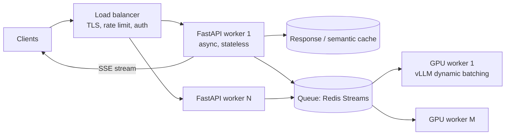
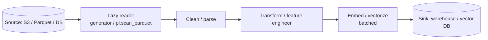
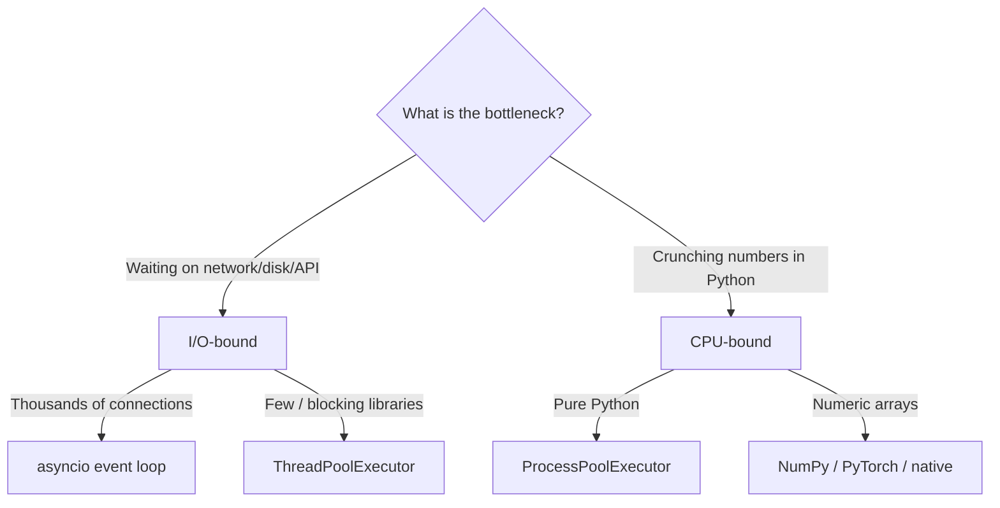
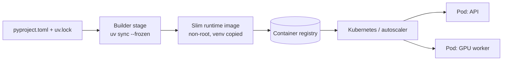
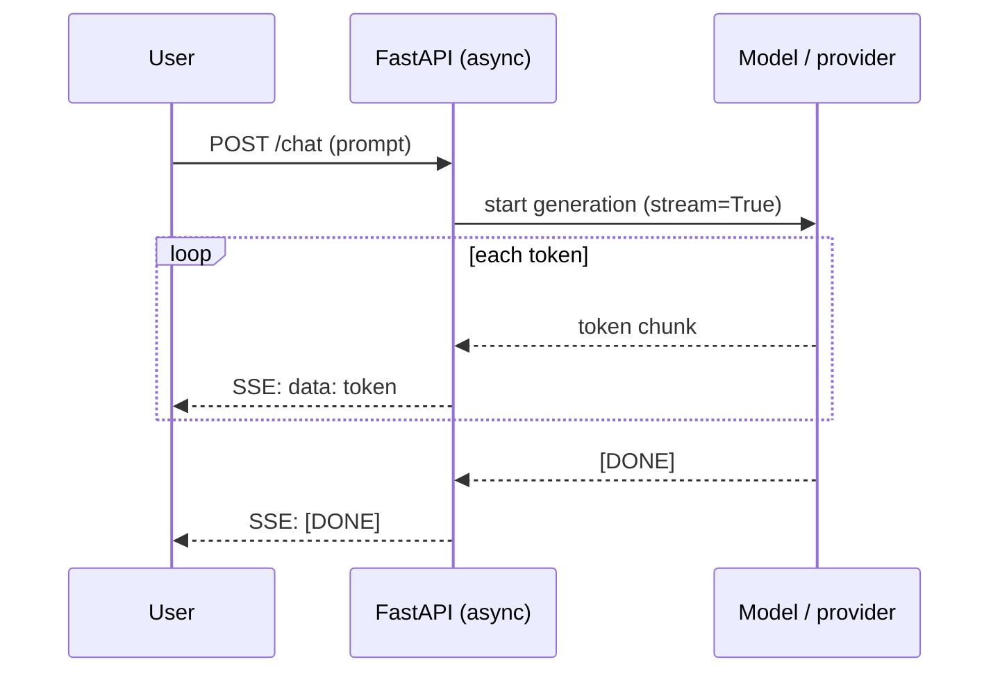
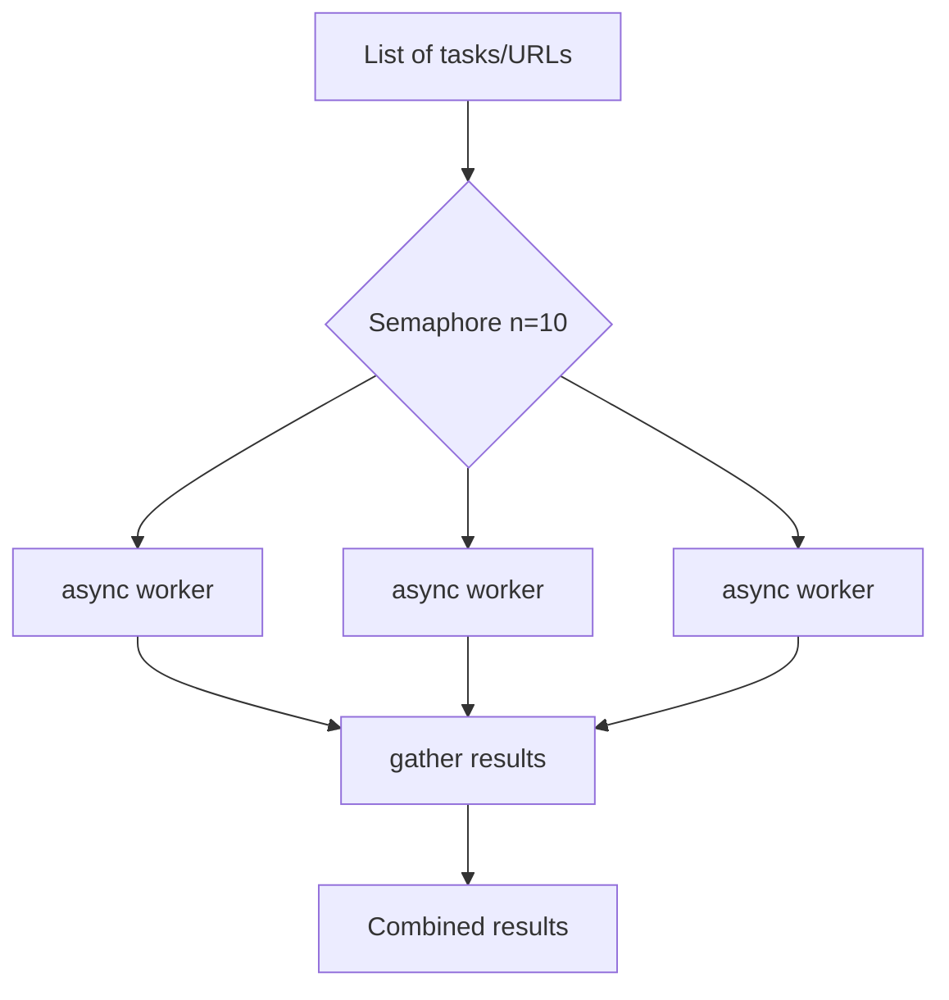
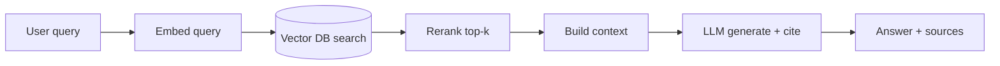
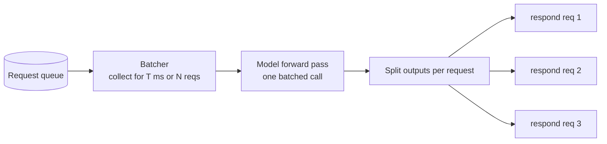

# Python for AI Engineering — Use-Case Diagrams

> Common Python-in-AI architectures as Mermaid diagrams. Each has the **problem** it solves and
> **design notes** covering architecture, scale, performance, and security.

---

## 1. Async model-serving API

**Problem:** Serve an LLM/ML model over HTTP to many concurrent clients with low latency,
without reloading the model or blocking on I/O.

**Design notes.**
- *Architecture*: model loaded once at startup (`lifespan`); API tier is stateless so it scales
  horizontally; GPU inference is a separate pool behind a queue.
- *Performance*: dynamic/continuous batching on GPU; exact + semantic caching; token streaming
  (SSE) for perceived latency; never block the event loop (offload with `to_thread`).
- *Scale*: autoscale API and GPU tiers independently; bounded queue + load shedding for
  backpressure. Track p50/p95/p99.
- *Security*: validate with Pydantic, auth (JWT/API keys), per-tenant rate limits, payload caps.

---

## 2. Batch data / feature pipeline

**Problem:** Transform large datasets (logs, documents, events) into features/embeddings that
don't fit in memory.

**Design notes.**
- *Architecture*: streaming with generators / Polars lazy scan so only needed data is
  materialized; push filters down to the source.
- *Performance*: vectorize with NumPy/Polars; **batch** embedding calls to amortize overhead;
  parallelize CPU-bound stages with `ProcessPoolExecutor`.
- *Scale*: chunk by partition/date; checkpoint progress for restartability; idempotent writes.
- *Security*: least-privilege data access; scrub PII before persisting.

---

## 3. Concurrency model selection

**Problem:** Pick the right execution model for a given workload.

**Design notes.**
- *Architecture*: mixing models is fine — an async API can offload CPU work to a process pool.
- *Performance*: asyncio maximizes I/O concurrency on one thread; processes give real CPU
  parallelism (bypassing the GIL); native libs release the GIL during math.
- *Scale*: cap concurrency (semaphores, pool sizes) to protect downstreams and memory.
- *Note*: free-threaded Python (3.13/3.14) may let threads do CPU parallelism as the ecosystem
  matures.

---

## 4. Packaging & deployment flow

**Problem:** Ship a reproducible, small, secure container for an AI service.

**Design notes.**
- *Architecture*: multi-stage Docker; separate CPU vs GPU images; config via env
  (`pydantic-settings`).
- *Performance*: `uv` for fast, deterministic installs → faster CI and cold starts; layer
  caching (copy lockfile → install → then code).
- *Scale*: pre-warm replicas to avoid 30-60s model cold starts; readiness/liveness probes.
- *Security*: pinned lockfile, `pip-audit` scanning, non-root user, no secrets baked in.

---

## 5. Streaming token response (SSE)

**Problem:** Return LLM tokens as they are generated so users see output immediately.

**Design notes.**
- *Architecture*: async generator yields chunks into a `StreamingResponse`.
- *Performance*: cuts perceived latency dramatically vs waiting for the full response.
- *Scale*: keep connections cheap (async), set idle timeouts, handle client disconnects
  (cancellation) to free resources.
- *Security*: still validate input; enforce max output tokens to bound cost/DoS.

---

## 6. Rate-limited async fan-out (scraper / multi-provider calls)

**Problem:** Call many URLs / model providers concurrently without overwhelming them.

**Design notes.**
- *Architecture*: `asyncio` + `httpx.AsyncClient`; `Semaphore` caps in-flight requests.
- *Performance/robustness*: per-request timeouts (`asyncio.timeout`), retries with backoff,
  `TaskGroup` for clean cancellation on failure.
- *Scale*: tune concurrency to provider rate limits; add jitter to avoid thundering herds.
- *Security*: respect robots/ToS; never leak API keys; validate/parse responses defensively.

---

## 7. Retrieval-augmented generation (RAG) request path

**Problem:** Ground an LLM answer in your own data with citations.

**Design notes.**
- *Architecture*: async I/O across embed → search → rerank → generate; each hop has a timeout.
- *Performance*: cache embeddings and frequent queries; batch where possible; keep top-k small.
- *Scale*: pre-filter by metadata/ACL before vector search; shard the index.
- *Security*: enforce per-user access control **before** retrieval; treat retrieved text and LLM
  output as untrusted (prompt-injection defense).

---

## 8. GPU worker with dynamic batching

**Problem:** Maximize expensive GPU throughput under bursty request loads.

**Design notes.**
- *Architecture*: decouple API from GPU via a queue; a batcher forms micro-batches.
- *Performance*: batching is the biggest GPU throughput lever; tune batch window vs latency SLA;
  continuous batching (vLLM) for token generation.
- *Scale*: multiple GPU workers; monitor KV-cache/GPU memory; shed load when saturated.
- *Security*: isolate workers; cap max tokens per request to protect memory and cost.

> Content synthesized from general domain knowledge and current (2025-2026) trends;
> rephrased for compliance with licensing restrictions.
