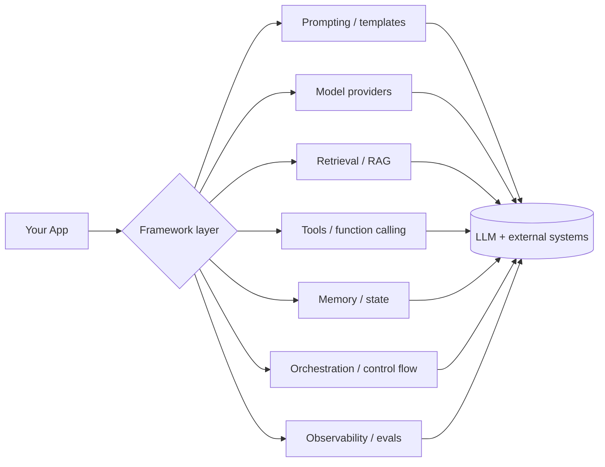
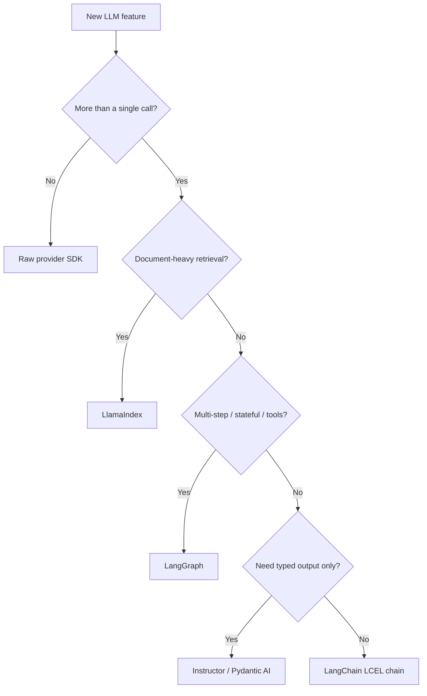
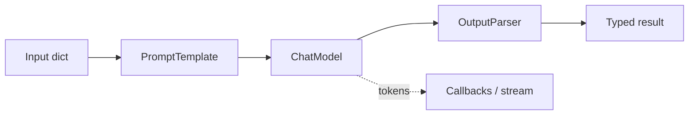
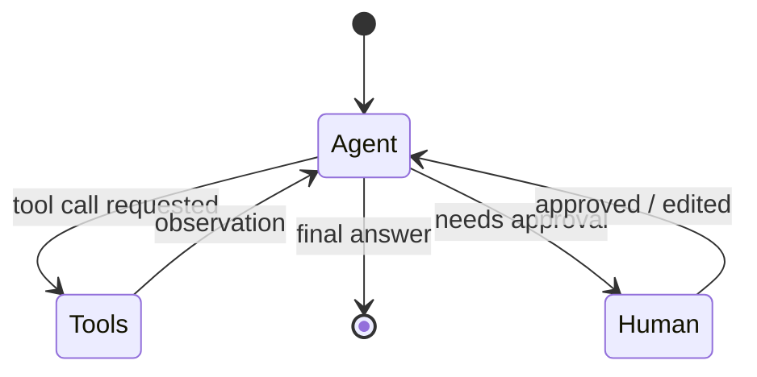
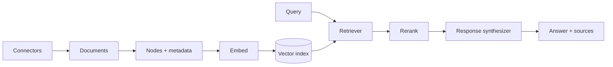
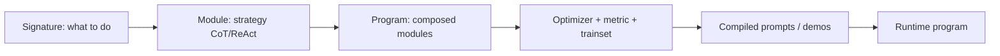
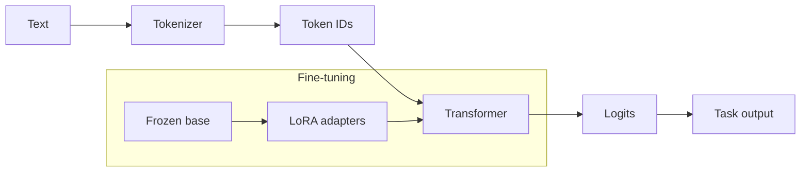
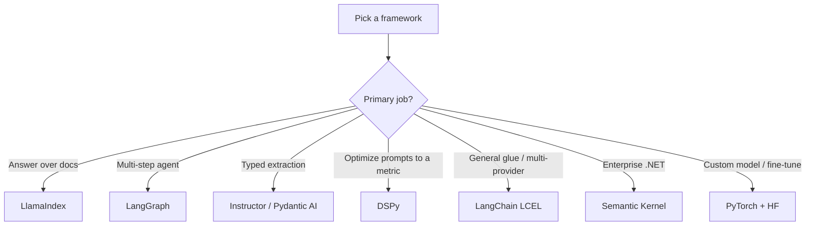
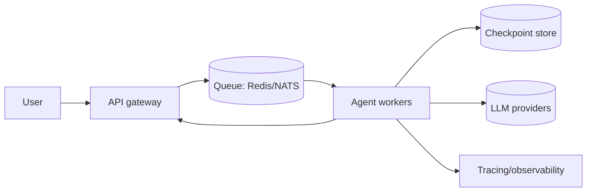

# AI Frameworks — Detailed Learning (Deep Dive)

> This is the "read-everything-here-and-you-can-defend-any-AI-framework-choice-in-an-interview" guide. It goes from first principles ("do I even need a framework?") to production system design, with the *why* behind every decision, current (2025–2026) reality, trade-offs, Mermaid diagrams, and real code. Read top to bottom once, then use the headings as a revision index.

---

## Table of Contents
1. [The big picture — what problem do frameworks solve?](#1-the-big-picture)
2. [When to use a framework vs. the raw API](#2-framework-vs-raw-api)
3. [The 2025–2026 landscape (what changed)](#3-the-2025-2026-landscape)
4. [LangChain & LCEL](#4-langchain--lcel)
5. [LangGraph — stateful agent runtime](#5-langgraph)
6. [LlamaIndex — the data/RAG framework](#6-llamaindex)
7. [DSPy — programming, not prompting](#7-dspy)
8. [Instructor & Pydantic AI — typed structured output](#8-instructor--pydantic-ai)
9. [Haystack — declarative production pipelines](#9-haystack)
10. [Semantic Kernel — the enterprise/.NET orchestrator](#10-semantic-kernel)
11. [Foundational: PyTorch](#11-pytorch)
12. [Foundational: Hugging Face Transformers & PEFT](#12-hugging-face)
13. [Framework trade-offs & selection](#13-framework-trade-offs)
14. [Production concerns: observability, cost, versioning, scale](#14-production-concerns)
15. [Security](#15-security)
16. [Interview power-answers](#16-interview-power-answers)
17. [Further reading](#17-further-reading)

---

## 1. The big picture

An LLM by itself is a **text-in, text-out function**. Real applications need much more around that function:

- Prompt templating and versioning
- Talking to many model providers behind one interface
- Retrieval (RAG), memory, and tool/function calling
- Multi-step control flow, retries, and error handling
- Streaming, async, batching
- Observability (traces, tokens, cost) and evaluation

A **framework** is the glue that gives you these building blocks so you don't re-implement them for every project. The catch: frameworks add **abstraction**, and the wrong abstraction hides the one thing you need to debug at 2 a.m. The whole skill is knowing *how much* framework to adopt.



> **Interview framing:** "A framework is a bet that its abstractions match my problem. I pick the lightest layer that removes real boilerplate, and I stay close to the raw provider API for anything latency- or correctness-critical."

---

## 2. Framework vs raw API

The single most common senior-level question is *"why not just call the API directly?"* Here is the honest decision table.

| Situation | Use raw API (`openai`, `anthropic`) | Use a framework |
|---|---|---|
| One prompt, one response | ✅ | ❌ overkill |
| Prototyping quickly across providers | ⚠️ | ✅ swap models with one line |
| RAG over many document types | ❌ lots of glue | ✅ LlamaIndex / LangChain |
| Multi-step agent with tools + retries | ❌ you'll rebuild an agent loop | ✅ LangGraph |
| Strict latency budget (<300ms overhead) | ✅ full control | ⚠️ measure the tax |
| Need typed/validated output | ⚠️ providers now support it natively | ✅ Instructor / Pydantic AI |
| Auto-optimizing prompts against a metric | ❌ | ✅ DSPy |

**Rules of thumb**
- Start raw for a spike; adopt a framework when boilerplate hurts.
- Never let a framework hide token counts, prompts sent, or errors. If it does, wrap it in tracing.
- You can mix: LlamaIndex for retrieval, raw API for the final generate call, LangGraph for the outer loop. Frameworks are libraries, not religions.



---

## 3. The 2025–2026 landscape

A few shifts you *must* know so you don't sound outdated in an interview:

- **LangChain 1.0 shipped (Oct 2025).** Agents now run on the **LangGraph runtime**. The legacy classes people memorized in 2023 — `LLMChain`, `SequentialChain`, `initialize_agent` — moved into a separate `langchain-classic` package. Quoting those as "current" is a red flag to interviewers. Content rephrased from public release notes for compliance.
- **LCEL (LangChain Expression Language)** with the pipe operator (`prompt | model | parser`) is the idiomatic way to compose.
- **Structured output went native.** OpenAI/Anthropic now support schema-constrained output, so "structured output" libraries compete on retries, validation, and provider-agnosticism rather than being the only option.
- **Agents are the default unit of work.** Interviews grade you on typed state, checkpointing, human-in-the-loop, and evaluating *trajectories* (the path), not just final answers.
- **"Compound AI systems"** (many small LM calls wired together) are the mental model; DSPy leans into optimizing these end-to-end.

---

## 4. LangChain & LCEL

**What it is:** the broadest LLM app framework — hundreds of integrations, prompts, output parsers, retrievers, memory, and the LCEL composition layer.

### 4.1 LCEL and Runnables
Everything composable in LangChain implements the **Runnable** interface: `.invoke()`, `.batch()`, `.stream()`, and async variants (`.ainvoke()` etc.). Because they share this interface, you compose them with a pipe:

```python
from langchain_openai import ChatOpenAI
from langchain_core.prompts import ChatPromptTemplate
from langchain_core.output_parsers import StrOutputParser

prompt = ChatPromptTemplate.from_template("Explain {topic} to a {level} in 3 bullets.")
model = ChatOpenAI(model="gpt-4o-mini", temperature=0)
parser = StrOutputParser()

# The pipe wires output of one Runnable into the next.
chain = prompt | model | parser

print(chain.invoke({"topic": "vector databases", "level": "beginner"}))
# Free features because it's a Runnable:
#   chain.batch([...])       -> parallelism
#   chain.stream({...})      -> token streaming
#   await chain.ainvoke(...) -> async
```

Why LCEL matters: you get **streaming, batching, async, and retries for free**, and the graph is introspectable for tracing. That is the real payoff over hand-written glue.

### 4.2 Prompts, output parsers, memory, callbacks
- **Prompt templates** — parameterized, versionable, support few-shot and chat roles.
- **Output parsers** — coerce text into structured data (increasingly delegated to native structured output / `with_structured_output`).
- **Memory** — conversation history injected into prompts; in modern code this lives in LangGraph state or a message store rather than the old `ConversationBufferMemory`.
- **Callbacks/streaming** — hooks that fire on token, tool start/end, errors; the backbone of observability (LangSmith taps into these).



**Pros:** huge ecosystem, fast prototyping, provider-agnostic, great for glue.
**Cons:** abstraction churn between versions; deep call stacks can hide what prompt was actually sent — always attach tracing.

**When to use:** general LLM apps, quick multi-provider prototypes, moderate chains.

---

## 5. LangGraph

**What it is:** a low-level **runtime for stateful, cyclic, durable** agent workflows. Philosophy (from the LangChain team): the right abstraction for agents is *almost none* — give developers **control and durability** instead of hiding the loop.

### 5.1 Core model
You define a **graph**: nodes are functions that read and write a shared, typed **state**; edges (including conditional edges) decide what runs next. Unlike a DAG, LangGraph allows **cycles** — essential for agent "think → act → observe → repeat" loops.



```python
from typing import Annotated, TypedDict
from langgraph.graph import StateGraph, START, END
from langgraph.graph.message import add_messages

class State(TypedDict):
    # add_messages is a reducer: new messages are appended, not overwritten.
    messages: Annotated[list, add_messages]

def agent(state: State):
    # ... call model, maybe request a tool ...
    return {"messages": [("ai", "thinking...")]}

builder = StateGraph(State)
builder.add_node("agent", agent)
builder.add_edge(START, "agent")
builder.add_edge("agent", END)
graph = builder.compile()  # optionally compile(checkpointer=...) for durability
```

### 5.2 Why it wins in production
- **Checkpointing / durability** — state is persisted after each step. If the LLM returns garbage, an API times out, or the process crashes, you resume instead of restarting. Long-running agents *will* fail; persistence turns a catastrophe into a retry.
- **Human-in-the-loop** — pause at a node, wait for human approval or edits, then continue. Critical for high-stakes tool calls (payments, deletes).
- **Typed state + reducers** — explicit control over how each step updates state (append vs. replace).
- **Time-travel / replay** — inspect and rewind to a prior checkpoint to debug.

**Pros:** control, durability, cycles, HITL, first-class observability.
**Cons:** more ceremony than a simple chain; you think in graphs/state, which is a learning curve.

**When to use:** anything agentic, multi-step, long-running, or requiring approval gates and resumability.

---

## 6. LlamaIndex

**What it is:** a **data framework** purpose-built for connecting LLMs to your data — 300+ data connectors and deep indexing/query primitives. If your problem is "answer questions over my documents," this is often the fastest, cleanest path.

### 6.1 Building blocks
- **Data connectors (LlamaHub)** — pull from PDFs, Notion, Slack, SQL, S3, APIs.
- **Nodes & Documents** — documents are chunked into nodes with metadata.
- **Indexes** — `VectorStoreIndex` (semantic), `SummaryIndex`, `KeywordTableIndex`, `PropertyGraphIndex` (knowledge graph).
- **Ingestion pipeline** — transformations (split → extract metadata → embed) with caching so re-ingestion is cheap.
- **Query engines & retrievers** — retrieve → (rerank) → synthesize an answer; routers pick the right index per query.



```python
from llama_index.core import VectorStoreIndex, SimpleDirectoryReader

docs = SimpleDirectoryReader("data").load_data()      # connector
index = VectorStoreIndex.from_documents(docs)          # chunk + embed + store
qe = index.as_query_engine(similarity_top_k=4)         # retriever + synthesizer
print(qe.query("What is our refund policy?"))          # RAG in 4 lines
```

**Pros:** best-in-class retrieval/indexing ergonomics, mature RAG, great for document Q&A and enterprise search, lower memory footprint at retrieval scale.
**Cons:** narrower than LangChain for general agent orchestration and multi-tool workflows.

**When to use:** document-heavy RAG, knowledge bases, enterprise search. Many teams combine LlamaIndex (retrieval) with LangGraph (orchestration).

---

## 7. DSPy

**What it is:** a Stanford framework for **programming, not prompting** LMs. Instead of hand-tuning prompt strings, you declare *what* each step should do with a **Signature**, compose **Modules**, define a **metric**, and let an **optimizer** compile the actual prompts (and few-shot examples) for you.

### 7.1 The three abstractions
- **Signature** — a declarative contract: input fields → output fields + task description. e.g. `"question -> answer"` or a typed class.
- **Module** — a strategy that uses a signature: `dspy.Predict`, `dspy.ChainOfThought`, `dspy.ReAct`. Modules compose like layers in a neural net.
- **Optimizer (teleprompter)** — algorithms like **BootstrapFewShot** and **MIPROv2** that tune instructions and demonstrations against your metric. MIPROv2 jointly proposes instructions and selects few-shot examples.



```python
import dspy

dspy.configure(lm=dspy.LM("openai/gpt-4o-mini"))

class QA(dspy.Signature):
    """Answer the question using the context."""
    context: str = dspy.InputField()
    question: str = dspy.InputField()
    answer: str = dspy.OutputField()

program = dspy.ChainOfThought(QA)          # strategy over the signature
# Later: optimizer = dspy.MIPROv2(metric=my_metric); compiled = optimizer.compile(program, trainset=...)
```

**Why it matters:** it turns prompt engineering into an *optimization* problem, so when you swap models the framework re-compiles prompts instead of you rewriting them by hand.

**Pros:** systematic, reproducible, model-portable, strong for multi-stage pipelines.
**Cons:** compile step costs LLM calls; smaller ecosystem; mental shift required.

**When to use:** you have a metric and eval set and want to squeeze quality out of a multi-step pipeline without manual prompt fiddling.

---

## 8. Instructor & Pydantic AI

Both solve **"give me typed, validated output,"** but at different scopes.

### 8.1 Instructor
A thin layer that **patches** your existing LLM client so every call returns a validated **Pydantic** object, with **automatic retries** when validation fails. Vendor-agnostic (OpenAI, Anthropic, etc.). No agent loop — that's the point.

```python
import instructor
from openai import OpenAI
from pydantic import BaseModel, Field

class User(BaseModel):
    name: str
    age: int = Field(ge=0, le=120)   # validation the LLM must satisfy

client = instructor.from_openai(OpenAI())
user = client.chat.completions.create(
    model="gpt-4o-mini",
    response_model=User,             # <- guaranteed shape or retry
    messages=[{"role": "user", "content": "Extract: Jane is 29."}],
)
assert isinstance(user, User)
```

### 8.2 Pydantic AI
A full **agent framework** from the Pydantic team: typed outputs *plus* tool use, dependency injection, streaming, and tracing. Choose it when you need a framework, not just parsing.

| | Instructor | Pydantic AI |
|---|---|---|
| Scope | Structured output only | Full agent framework |
| Agent loop / tools | ❌ | ✅ |
| Setup | Patch a client | Define an `Agent` |
| Best for | "Just give me typed JSON" | Typed agents with tools + DI |

> **Nuance interviewers love:** a valid schema guarantees *shape*, not *correctness*. `{"total": 3}` can be well-formed and still wrong. You still need field-level evals and cross-field checks.

---

## 9. Haystack

**What it is:** a production-focused framework built around **declarative pipelines** — you wire **components** (retrievers, rankers, prompt builders, generators) into an explicit graph. Strong for search/RAG systems that need fine-grained, inspectable pipeline control.

**Pros:** clear component model, production/deploy focus, good for search-heavy systems.
**Cons:** smaller ecosystem than LangChain; less "agent-first" than LangGraph.

**When to use:** teams that want an explicit, testable pipeline graph for RAG/search in production.

---

## 10. Semantic Kernel

**What it is:** Microsoft's orchestration SDK (strong **C#/.NET** and Python support) built around **plugins/functions**, **planners**, and **memory**. It fits enterprises already on the Microsoft/Azure stack.

**Pros:** enterprise integration, multi-language, Azure-native, good governance story.
**Cons:** less mindshare in the Python-first research community; abstractions differ from the LangChain world.

**When to use:** .NET/enterprise shops, Azure OpenAI deployments, strict governance.

---

## 11. PyTorch

**What it is:** the dominant deep-learning framework for research and increasingly production. You need enough of it to fine-tune, run, and reason about models even if you mostly use higher-level tools.

### 11.1 Core concepts
- **Tensors** — n-dimensional arrays with GPU support.
- **autograd** — automatic differentiation; `loss.backward()` computes gradients.
- **`nn.Module`** — the unit of a model; `forward()` defines the compute.
- **Training loop** — forward → loss → `backward()` → `optimizer.step()` → `zero_grad()`.
- **`eval()` vs `train()`** — toggles dropout/batchnorm behavior; forgetting this is a classic bug.

```python
import torch, torch.nn as nn

class MLP(nn.Module):
    def __init__(self):
        super().__init__()
        self.net = nn.Sequential(nn.Linear(10, 32), nn.ReLU(), nn.Linear(32, 1))
    def forward(self, x):
        return self.net(x)

model, opt = MLP(), None
opt = torch.optim.Adam(model.parameters(), lr=1e-3)
loss_fn = nn.MSELoss()

x, y = torch.randn(16, 10), torch.randn(16, 1)
pred = model(x)                 # forward
loss = loss_fn(pred, y)
opt.zero_grad(); loss.backward(); opt.step()   # backprop + update
```

**When to use:** custom model architectures, fine-tuning, research, anything below the "just call an LLM" layer.

---

## 12. Hugging Face Transformers & PEFT

**What it is:** the standard library for pretrained models — pipelines, tokenizers, `Trainer`, and the model hub. It's the bridge between raw PyTorch and "I want a working model now."

### 12.1 Building blocks
- **`pipeline`** — one-liner inference for a task (`sentiment-analysis`, `summarization`, etc.).
- **Tokenizers** — turn text into token IDs. Tokenization drives **cost and latency** (you pay per token) and context limits. Subword tokenizers (BPE/WordPiece) balance vocab size vs. sequence length.
- **`Trainer` / `TrainingArguments`** — batteries-included training/eval loop.
- **PEFT (LoRA/QLoRA)** — parameter-efficient fine-tuning: freeze the base model, train small low-rank adapters. Slashes memory/cost and lets you keep many task adapters over one base model.

```python
from transformers import pipeline
clf = pipeline("sentiment-analysis")          # downloads a default model
print(clf("Frameworks are great but leaky."))  # [{'label': 'POSITIVE', ...}]
```



**Why tokenizers matter in interviews:** "3 words" ≠ "3 tokens." Cost, latency, and context-window budgeting all key off token counts, and different models tokenize differently, so the same text can cost different amounts across providers.

---

## 13. Framework trade-offs

| Framework | Sweet spot | Abstraction level | Watch out for |
|---|---|---|---|
| **Raw API** | Single/simple calls, tight latency | None | You rebuild glue |
| **LangChain (LCEL)** | General apps, glue, multi-provider | Medium | Version churn, hidden prompts |
| **LangGraph** | Stateful/cyclic agents, HITL | Low (by design) | Graph learning curve |
| **LlamaIndex** | Document RAG, enterprise search | Medium | Narrower for agents |
| **DSPy** | Optimizing multi-step pipelines | Medium (declarative) | Compile cost, ecosystem |
| **Instructor** | Typed output, minimal | Very thin | Shape ≠ correctness |
| **Pydantic AI** | Typed agents with tools | Medium | Newer ecosystem |
| **Haystack** | Explicit production RAG pipelines | Medium | Smaller community |
| **Semantic Kernel** | .NET/enterprise/Azure | Medium | Python mindshare |
| **PyTorch** | Custom models, fine-tuning | Low | Steep for app devs |
| **HF Transformers** | Pretrained models, PEFT | Medium | Model/version sprawl |

**Benchmark folklore (rephrased from public write-ups for compliance):** at high request volume, general orchestration frameworks tend to strain on **memory/state**, while pure-retrieval frameworks strain on **routing complexity**. Translation: pick the tool whose failure mode you can live with, and load-test early.



---

## 14. Production concerns

### 14.1 Observability
- **Trace every call**: prompt, model, tokens in/out, latency, cost, tool calls, retries. Tools: LangSmith, OpenTelemetry-based tracing, Arize/Phoenix.
- Log the **actual prompt sent**, not just the template — framework abstractions can silently mutate it.

### 14.2 Cost
- Cost ≈ tokens × price. Control it with: smaller models for easy steps (routing/cascades), caching (prompt + semantic), trimming context, and capping agent loop iterations.

### 14.3 Reliability & scale
- **Decouple orchestration from execution** — never run long LLM calls inside the HTTP request handler; use a queue so a slow model call doesn't tie up web workers.
- **Checkpoint long agent runs** (LangGraph) so failures resume.
- **Timeouts, retries with backoff, circuit breakers** around every external call.
- **Bound the loop** — always cap max steps/tool calls to prevent runaway agents.



### 14.4 Versioning
- Pin framework versions (they change fast — see LangChain 1.0's package split).
- Version prompts and eval sets alongside code; treat a prompt change like a deploy.

---

## 15. Security

- **Prompt injection** — untrusted content (web pages, docs, tool output) can carry instructions. Never let retrieved text control privileged actions; separate "data" from "instructions," and gate destructive tools behind human approval (LangGraph HITL).
- **Tool sandboxing** — restrict what tools can do (no arbitrary shell/SQL); validate arguments with schemas; least-privilege credentials.
- **Data governance & tenancy** — enforce access control at retrieval time (filter by `tenant_id`/`access_level`); don't index secrets you can't protect.
- **Output validation** — validate/parse structured output before it hits downstream systems (Instructor/Pydantic).
- **PII & logging** — redact secrets/PII from traces; be careful what you send to third-party providers.
- **Supply chain** — pin dependencies; frameworks pull huge trees of transitive deps.

---

## 16. Interview power-answers

- *"Framework or raw API?"* → "Lightest layer that removes real boilerplate; stay raw for latency/correctness-critical paths; always keep tracing so no abstraction hides the prompt."
- *"LangChain vs LangGraph?"* → "LangChain (LCEL) composes stateless steps; LangGraph is the runtime for stateful, cyclic, durable agents with checkpointing and human-in-the-loop. In LangChain 1.0 agents run on the LangGraph runtime."
- *"LangChain vs LlamaIndex?"* → "LlamaIndex is a focused data/RAG framework with deep indexing and connectors; LangChain is a broad app framework. Pure document RAG → LlamaIndex; RAG + agents + tools → LangChain, and they compose."
- *"What does DSPy buy me?"* → "It turns prompt engineering into optimization: declare signatures, define a metric, and let an optimizer (e.g., MIPROv2) compile prompts/few-shot examples — model-portable and reproducible."
- *"How do you guarantee JSON?"* → "Native structured output or Instructor/Pydantic with retries — but shape isn't correctness, so I still eval field values."
- *"Why do tokenizers matter?"* → "Cost, latency, and context budgeting all key off token counts, and tokenization differs per model."
- *"Keeping an agent reliable at scale?"* → "Decouple orchestration from execution via a queue, checkpoint runs, bound the loop, add timeouts/retries/circuit breakers, and trace everything."

---

## 17. Further reading
- LangChain (Python): https://python.langchain.com/
- LangGraph: https://langchain-ai.github.io/langgraph/
- LlamaIndex: https://docs.llamaindex.ai/
- DSPy: https://dspy.ai/
- Instructor: https://python.useinstructor.com/
- Pydantic AI: https://ai.pydantic.dev/
- Haystack: https://haystack.deepset.ai/
- Semantic Kernel: https://learn.microsoft.com/semantic-kernel/
- PyTorch: https://pytorch.org/docs/
- Hugging Face Transformers: https://huggingface.co/docs/transformers/
- PEFT: https://huggingface.co/docs/peft/

> Content synthesized from general domain knowledge and current (2025–2026) documentation and interview trends; rephrased for compliance with licensing restrictions.
