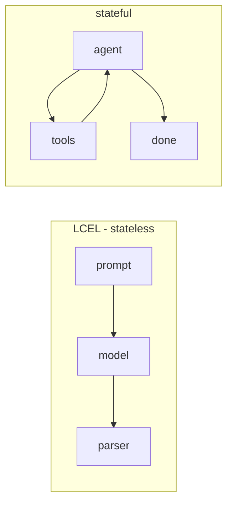

# AI Frameworks — Medium Interview Questions

> Mid-level questions where you show you've actually built things. Expect follow-ups on trade-offs, failure modes, and "why."

## Quick Coverage Map
| # | Question | Theme |
|---|---|---|
| 1 | LangChain vs LangGraph | Orchestration |
| 2 | LangChain vs LlamaIndex | Selection |
| 3 | How LangGraph handles state & cycles | LangGraph |
| 4 | Checkpointing & why it matters | Reliability |
| 5 | Human-in-the-loop | Agents |
| 6 | What DSPy solves vs manual prompting | DSPy |
| 7 | Instructor vs Pydantic AI | Structured output |
| 8 | Memory in modern LangChain | Memory |
| 9 | Streaming & why | UX/perf |
| 10 | PEFT / LoRA | Fine-tuning |
| 11 | Controlling cost | Production |
| 12 | Evaluating agents | Evals |

---

### 1. LangChain vs LangGraph — when each?
LangChain (LCEL) composes **stateless** steps into a pipeline — great for chains and simple flows. LangGraph is a **runtime for stateful, cyclic, durable** agents: shared typed state, conditional edges, loops, checkpointing, and human-in-the-loop. In LangChain 1.0, agents actually run on the LangGraph runtime.

**Use LangChain** for sequential/simple tasks; **use LangGraph** for multi-step agents that loop, branch, need approval gates, or must resume after failure.



---

### 2. LangChain vs LlamaIndex — how do you choose?
LlamaIndex is a **focused data/RAG framework**: deep indexing, 300+ connectors, mature retrieval. LangChain is a **broad app framework** where RAG is one capability among many.

- Pure document RAG / enterprise search → **LlamaIndex**.
- RAG + agents + many tools + general workflows → **LangChain/LangGraph**.
- Common real-world answer: **combine them** — LlamaIndex for retrieval, LangGraph for orchestration.

At scale (folklore from public benchmarks, rephrased): broad orchestration frameworks tend to strain on memory/state; pure-retrieval frameworks strain on routing complexity. Load-test early.

---

### 3. How does LangGraph handle state and cycles?
You define a typed **state** (often a `TypedDict`). Each node returns a partial update; **reducers** decide how updates merge (append vs. replace). Edges — including **conditional edges** — route to the next node based on state, and because you can route back to a previous node, you get **cycles** (the agent loop). This is the key difference from a plain DAG.

```python
from typing import Annotated, TypedDict
from langgraph.graph.message import add_messages
class State(TypedDict):
    messages: Annotated[list, add_messages]  # reducer appends
```

---

### 4. What is checkpointing and why does it matter?
LangGraph can persist state after each step to a **checkpointer**. If the model returns garbage, a tool times out, or the process crashes, you **resume from the last checkpoint** instead of restarting from scratch. Long-running agents *will* fail — checkpointing turns a catastrophe into a retry, and enables time-travel debugging and human-in-the-loop pauses.

---

### 5. Explain human-in-the-loop and when you'd use it.
You pause the graph at a node, surface the proposed action to a human, and only continue once it's approved or edited. Essential for **high-stakes tool calls** — payments, deletes, sending emails, code execution. It's built on the same checkpointing that lets a run suspend and resume.

---

### 6. What does DSPy solve that manual prompting doesn't?
Manual prompting is brittle string-tuning that breaks when you change models. DSPy turns it into **optimization**: you declare a **Signature** (inputs → outputs), pick a **Module** (`Predict`, `ChainOfThought`, `ReAct`), define a **metric**, and an **optimizer** (e.g., `BootstrapFewShot`, `MIPROv2`) compiles the prompts and few-shot examples for you.

**Why/when:** you have an eval set and metric and want reproducible, model-portable quality on a multi-step pipeline. Trade-off: the compile step costs LLM calls.

---

### 7. Instructor vs Pydantic AI?
Both give typed output, different scope:
- **Instructor** — a thin layer that patches your client so every call returns a validated Pydantic object, with retries. No agent loop.
- **Pydantic AI** — a full agent framework (tools, dependency injection, streaming, tracing) from the Pydantic team.

Choose Instructor for "just give me typed JSON"; Pydantic AI when you need a whole framework.

---

### 8. How does memory work in modern LangChain?
The old `ConversationBufferMemory` classes moved to legacy. Today, conversation history lives in **graph state** (LangGraph) or a message store, and you inject the relevant slice into the prompt. Strategies: keep last-N turns, summarize older turns, or retrieve relevant past messages (vector memory) to stay within the context window and control cost.

---

### 9. What is streaming and why bother?
Instead of waiting for the full response, you stream tokens as they're generated. It slashes **perceived latency** (time-to-first-token) and enables live UIs. LCEL Runnables support `.stream()`/`.astream()` out of the box; callbacks fire per token so you can pipe to a UI or SSE endpoint.

---

### 10. What is PEFT / LoRA and why use it?
**PEFT** = parameter-efficient fine-tuning. **LoRA** freezes the base model and trains small low-rank adapter matrices instead of all weights. **QLoRA** adds quantization to shrink memory further. Benefits: far less GPU memory and cost, faster training, and you can keep many task-specific adapters over one base model.

```python
from peft import LoraConfig, get_peft_model
config = LoraConfig(r=8, lora_alpha=16, target_modules=["q_proj", "v_proj"])
# model = get_peft_model(base_model, config)  # only adapters train
```

---

### 11. How do you control cost in a framework-based app?
- **Model cascades/routing** — cheap model for easy steps, escalate only when needed.
- **Caching** — exact and semantic caching of prompts/responses.
- **Trim context** — retrieve fewer/tighter chunks; summarize history.
- **Bound agent loops** — cap max steps/tool calls.
- **Observe** — trace tokens/cost per step so you know where the money goes.

---

### 12. How do you evaluate an agent (not just a chain)?
Evaluate the **trajectory**, not only the final answer: did it pick the right tools, in a reasonable order, without looping? Techniques: golden trajectories, LLM-as-judge for answer quality, tool-call accuracy, step count/cost, and regression suites tied to versioned prompts. Final-answer-only evals hide agents that got lucky.

---

## Further Reading
- LangGraph concepts: https://langchain-ai.github.io/langgraph/concepts/
- DSPy: https://dspy.ai/
- Instructor: https://python.useinstructor.com/
- Pydantic AI: https://ai.pydantic.dev/
- PEFT: https://huggingface.co/docs/peft/

> Content synthesized from general domain knowledge and current (2025-2026) interview trends; rephrased for compliance with licensing restrictions.
