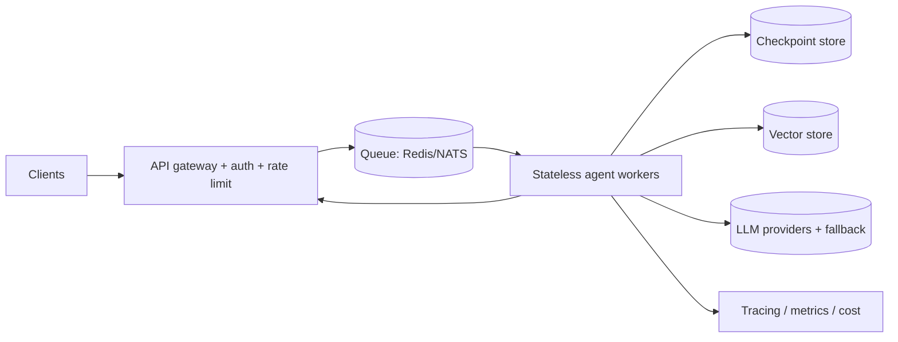

# AI Frameworks — Advanced / Expert Interview Questions

> Senior/staff-level questions. Here you're graded on judgment, system design, failure modes, and being current. Answers include trade-offs, diagrams, and "when this breaks."

## Quick Coverage Map
| # | Question | Theme |
|---|---|---|
| 1 | Design an agent runtime at scale | System design |
| 2 | Abstraction tax & when to drop the framework | Judgment |
| 3 | Durable execution & exactly-once tools | Reliability |
| 4 | Prompt injection in agent/RAG systems | Security |
| 5 | DSPy optimizer selection (MIPROv2 etc.) | DSPy depth |
| 6 | Multi-agent architectures & pitfalls | Agents |
| 7 | Structured output at scale — shape vs correctness | Output/evals |
| 8 | Migrating to LangChain 1.0 | Versioning |
| 9 | Latency budgeting under 800ms | Performance |
| 10 | Multi-tenant RAG security | Security/scale |
| 11 | Framework lock-in strategy | Architecture |
| 12 | Observability & evals in CI | MLOps |

---

### 1. Design a production agent runtime for high traffic.
Key idea: **decouple orchestration from execution**. Never run LLM calls inside the HTTP handler — a slow frontier-model call would tie up web workers and cascade failures.

Design points: stateless workers that load state from a checkpointer (LangGraph); bounded loops; per-call timeouts, retries with backoff, circuit breakers; provider fallback; streaming back to clients via SSE/websockets; autoscale workers on queue depth. **Failure modes to name:** runaway loops (cap steps), memory blowups from unbounded history (summarize/trim), and thundering herds on a cold cache (jittered retries).

---

### 2. How do you reason about the "abstraction tax," and when do you drop the framework?
Every abstraction trades boilerplate for opacity. I measure the tax: framework overhead per call (often tens of ms, sometimes more with deep stacks), and — more importantly — **debuggability**. If I can't see the exact prompt/tokens sent, that's a correctness risk. I drop or bypass the framework for hot paths where latency/cost is critical, or where a leaky abstraction keeps biting, and keep it for glue. Pragmatic answer: use the framework's escape hatches (custom Runnables, raw model calls inside a node) rather than all-or-nothing.

---

### 3. What is durable execution and how do you get exactly-once tool effects?
Durable execution persists progress so a crash resumes mid-workflow (LangGraph checkpointing). But resuming can **re-run a node**, so side-effecting tools need **idempotency**: idempotency keys on external calls, dedup tables, or a two-phase "record intent → confirm" pattern. LLM steps are safe to re-run; **money-moving tools are not** — wrap them so replay doesn't double-charge. This is the classic "at-least-once delivery + idempotent consumer" pattern applied to agents.

---

### 4. How do you defend an agentic/RAG system against prompt injection?
Treat all retrieved/tool-returned content as **untrusted data, never instructions**.
- **Separation:** keep system instructions structurally distinct from injected context; don't let a document's text redefine the agent's goals.
- **Least privilege + gating:** destructive tools require human-in-the-loop approval; scope credentials tightly; validate tool arguments with schemas.
- **Sandboxing:** no arbitrary shell/SQL; allowlist actions.
- **Output filtering:** validate structured output before it hits downstream systems; strip/deny exfiltration attempts (e.g., "email these secrets").
- **Defense in depth:** injection can't be fully "prompted away," so the real control is limiting what a compromised agent is *allowed to do*.

---

### 5. DSPy has a dozen optimizers — how do you pick?
It depends on data volume and what you're tuning:
- **BootstrapFewShot** — small data; bootstraps few-shot demonstrations from your program. Cheap, good baseline.
- **MIPROv2** — jointly proposes **instructions** and selects **few-shot examples**; strong when you have a decent trainset and want quality gains without hand-tuning.
- **Fine-tuning optimizers** — when you're willing to update model weights, not just prompts.

You always need a **metric** and a **trainset**; the optimizer spends LLM calls at compile time to maximize that metric. Trade-off: compile cost and potential overfitting to the eval set — hold out a test set.

---

### 6. Compare multi-agent architectures and their pitfalls.
Patterns: **supervisor/orchestrator** (a router delegates to specialist agents), **network/peer** (agents talk to each other), **hierarchical** (teams of teams). Benefits: separation of concerns, specialized tools/prompts. Pitfalls: **context fragmentation** (agents lose shared state), **cost explosion** (every hop is more tokens), **error compounding**, and **coordination loops**. Senior answer: prefer the simplest topology that works — often a single well-tooled agent beats a fragile committee. Add agents only when a clear boundary (distinct tools/skills) justifies the coordination cost, and make state-sharing explicit.

---

### 7. Structured output guarantees shape — how do you guarantee correctness at scale?
Schema validation (Instructor/native) ensures the JSON is **well-formed**, not **right**. `{"total": 3}` can validate and still be wrong. Layered approach:
- **Field-level validators** (Pydantic constraints, `ge/le`, regex, enums).
- **Cross-field checks** (line items sum to total; dates ordered).
- **Grounding checks** — verify extracted values appear in the source.
- **LLM-as-judge / sampled human review** for semantic correctness.
- **Retries with feedback** — feed validation errors back to the model.
Track a **content-accuracy** metric separate from parse-success rate.

---

### 8. What breaks when migrating to LangChain 1.0, and how do you handle it?
1.0 (Oct 2025) moved agents onto the **LangGraph runtime** and shifted legacy classes (`LLMChain`, `SequentialChain`, `initialize_agent`) into **`langchain-classic`**. Migration plan: pin versions; inventory legacy imports; move agent logic to LangGraph graphs; replace ad-hoc memory with graph state/message stores; re-run eval suites to catch behavior drift; roll out behind a flag. Governance lesson: fast-moving frameworks demand pinned versions and eval regression tests so an upgrade can't silently change outputs. (Rephrased from public release notes for compliance.)

---

### 9. How do you hit a sub-800ms P95 with frontier-model calls?
Budget every millisecond:
- **Stream** — optimize time-to-first-token; users perceive speed even if total time is longer.
- **Parallelize** — fire independent retrievals/tools concurrently (`.batch()`, async).
- **Cascade** — small/fast model for routing and easy turns; escalate only when needed.
- **Cache** — semantic + exact caches; precompute embeddings.
- **Trim** — fewer retrieved chunks, tighter prompts (fewer tokens = faster).
- **Cut hops** — collapse chains; avoid unnecessary agent loops.
- **Co-locate** — keep vector store/model region close to workers.
Then **measure** P95 per stage in traces; the tail is usually one slow tool or a cold cache.

---

### 10. Design multi-tenant RAG so tenant A never sees tenant B's data.
Security must live at **retrieval time**, not the prompt:
- Tag every chunk with `tenant_id` (+ `access_level`) in metadata.
- **Enforce metadata filters** on every query; better yet, physical isolation (per-tenant namespaces/indexes) for strict tenants.
- Scope credentials per tenant; never share a global retriever without a filter.
- Validate that citations returned belong to the requesting tenant.
- Redact PII in logs/traces.
**Failure mode to call out:** a missing filter defaults to "search everything" — that's a data breach, so fail closed (deny if no tenant context).

---

### 11. How do you avoid framework lock-in?
Program to **your own interfaces**, not the framework's. Wrap model calls, retrieval, and tools behind thin internal abstractions so you can swap LangChain ↔ LlamaIndex ↔ raw API without rewriting business logic. Keep prompts and eval sets as first-class, framework-agnostic assets. Use frameworks as **libraries, not architecture**. This is exactly why LangGraph's "little to no abstraction" philosophy resonates — less to lock into.

---

### 12. What does observability + evals look like in CI for LLM apps?
- **Tracing** on every call: prompt sent, model, tokens in/out, latency, cost, tool calls, retries (LangSmith / OpenTelemetry / Phoenix).
- **Offline eval suite** in CI: golden datasets, LLM-as-judge, trajectory checks, structured-output accuracy — gate merges on regressions.
- **Versioning:** prompts, models, and eval sets versioned with code; a prompt change is a deploy.
- **Online monitoring:** live quality signals, cost/latency dashboards, drift alerts, and sampled human review.
The point: you can't ship reliably what you can't measure, and LLM behavior drifts with every model/prompt change.

---

## Further Reading
- LangGraph (durability, HITL): https://langchain-ai.github.io/langgraph/
- Designing an agent runtime: https://www.langchain.com/blog/building-langgraph
- DSPy optimizers: https://dspy.ai/learn/optimization/optimizers/
- MIPROv2 paper: https://arxiv.org/abs/2406.11695
- Structured output/eval: https://python.useinstructor.com/

> Content synthesized from general domain knowledge and current (2025-2026) interview trends; rephrased for compliance with licensing restrictions.
