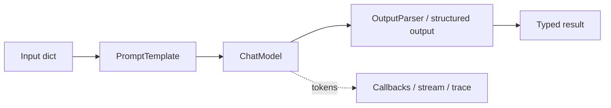
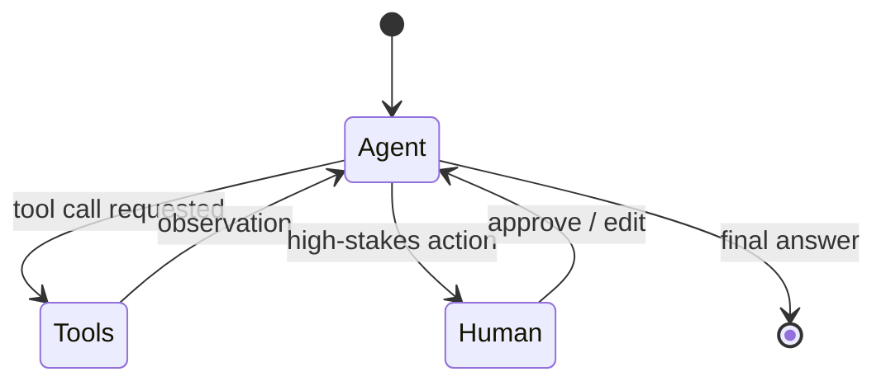
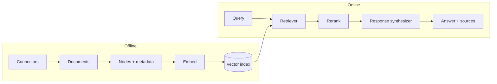
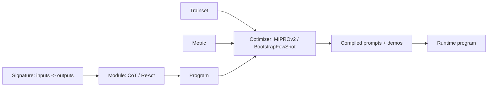
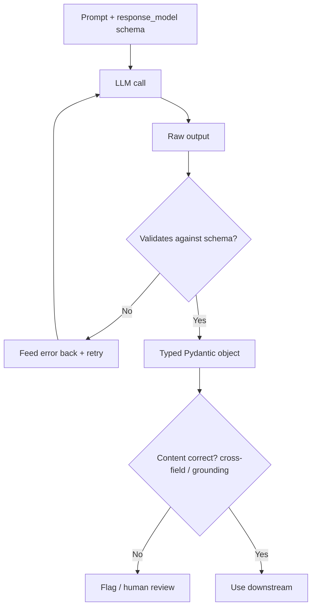
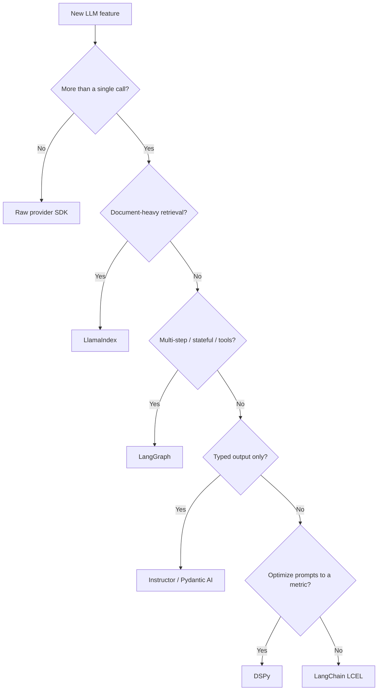
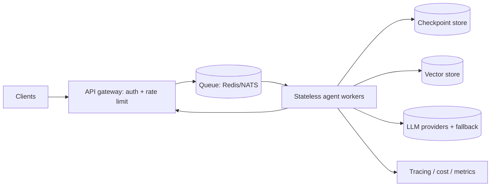
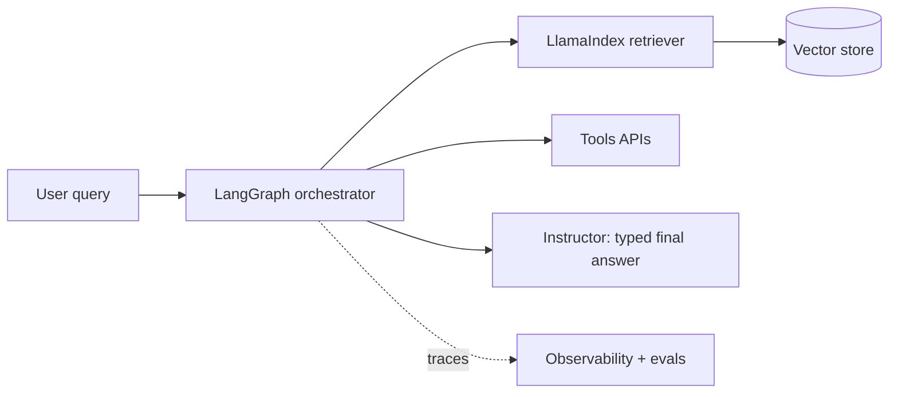
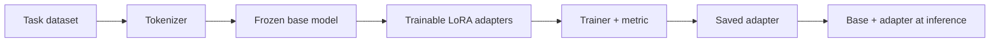

# AI Frameworks — Use-Case Diagrams

> Mermaid diagrams for the patterns you'll be asked to whiteboard. Each has a one-line "when to use."

---

## 1. LCEL chain (stateless composition)
**When:** fixed, predictable pipeline with no branching/loops.

---

## 2. LangGraph agent loop (stateful + cyclic)
**When:** open-ended tasks needing dynamic tool use and a think-act-observe loop.

---

## 3. LlamaIndex RAG pipeline
**When:** answering questions over your documents / enterprise search.

---

## 4. DSPy compile pipeline
**When:** you have a metric + trainset and want optimized, model-portable prompts.

---

## 5. Structured-output flow (Instructor / Pydantic)
**When:** you need validated, typed data out of an LLM.

---

## 6. Framework-selection flowchart
**When:** starting a new LLM feature and choosing tooling.

---

## 7. Production agent runtime at scale
**When:** high-traffic agents that must stay reliable and resumable.

---

## 8. Combined stack (real-world composition)
**When:** production RAG + agent — mix focused tools.

---

## 9. Fine-tuning with PEFT/LoRA
**When:** adapting a base model cheaply for a specific task.

> Content synthesized from general domain knowledge and current (2025-2026) documentation and interview trends; rephrased for compliance with licensing restrictions.
