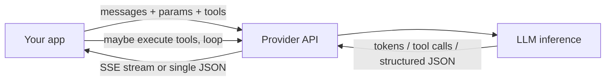
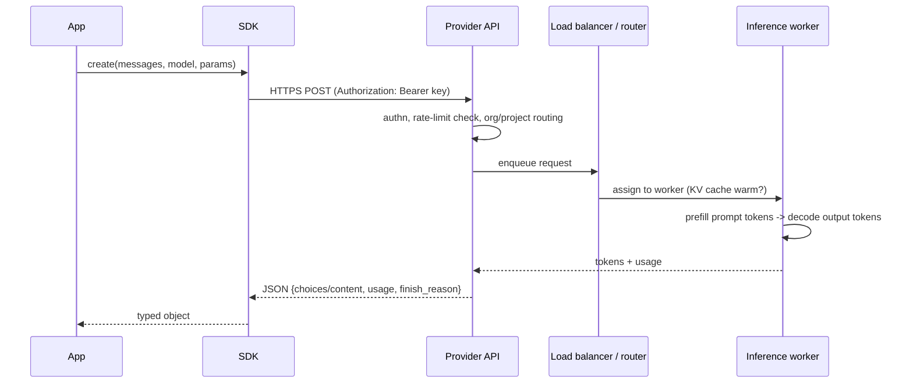
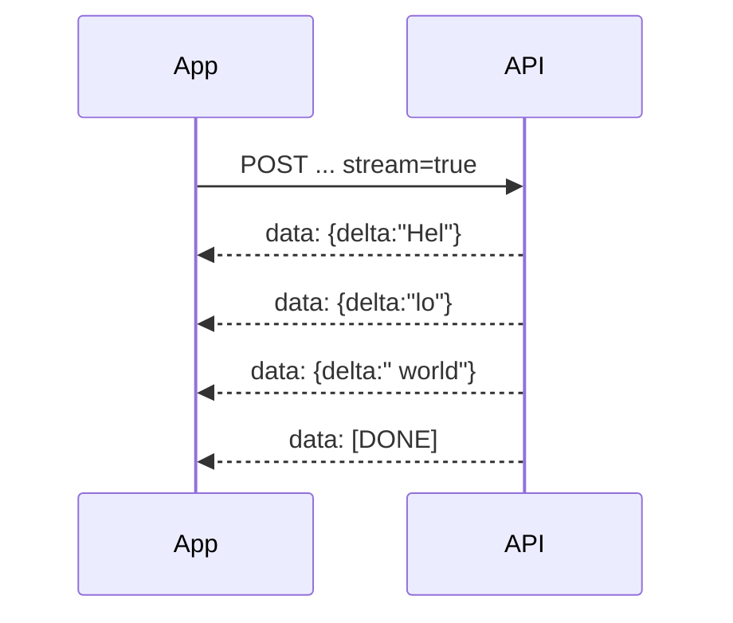
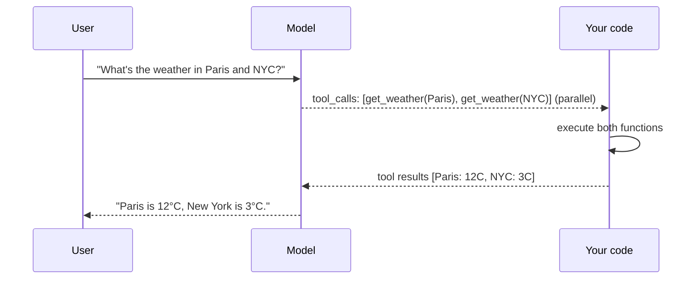
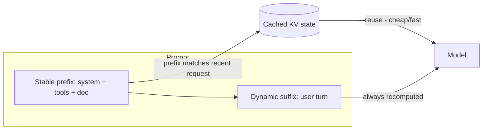
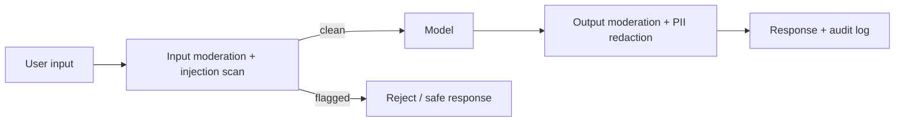
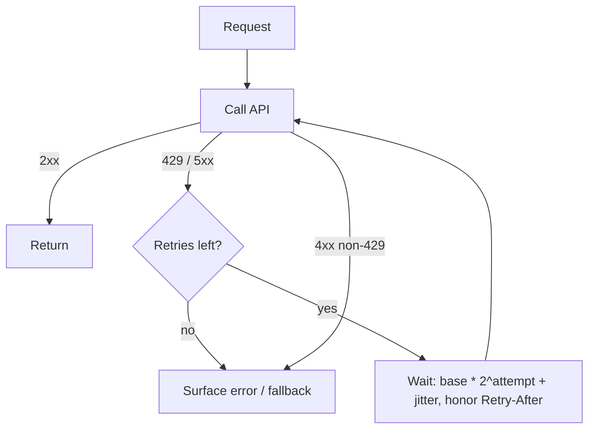
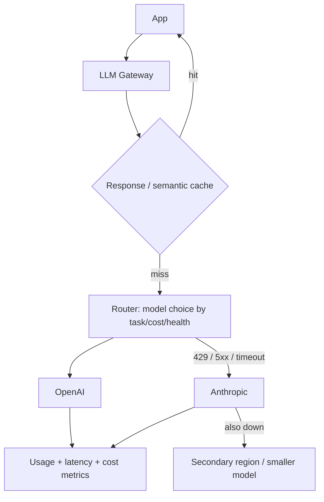
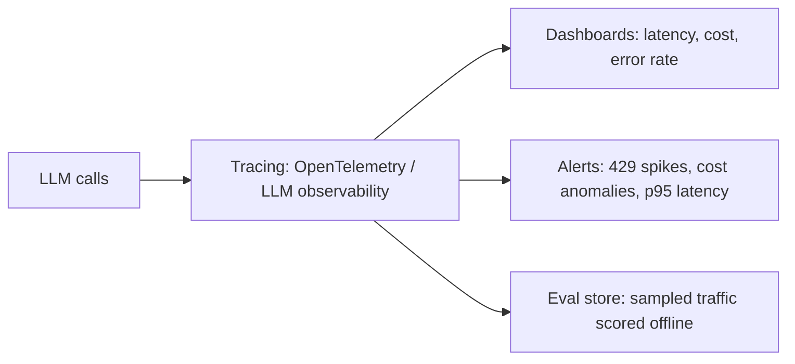

# OpenAI / Claude (LLM Provider APIs) — Detailed Learning (Deep Dive)

> This is the "read-everything-here-and-you-can-defend-LLM-API-design-in-any-interview" guide. It goes from the request/response lifecycle to production-grade reliability, cost, and security, with the *why* behind every decision, current (2025–2026) provider features, trade-offs, Mermaid diagrams, and real code. Read top to bottom once, then use the headings as a revision index.

> **Note on model names & prices:** provider model names and per-token prices change every few months. Treat every number here as an *order-of-magnitude* anchor for reasoning about cost, not a live price sheet. The *mental models* (how caching bills, how the tool loop works, how retries should behave) are stable; the digits are not.

---

## Table of Contents
1. [The big picture — one mental model for both providers](#1-the-big-picture)
2. [Request/response lifecycle](#2-requestresponse-lifecycle)
3. [Roles: system / user / assistant (and tool)](#3-roles)
4. [Sampling parameters (temperature, top_p, max_tokens, stop, seed)](#4-sampling-parameters)
5. [Streaming (SSE) — why and how](#5-streaming-sse)
6. [Tool / function calling loop](#6-tool--function-calling-loop)
7. [Structured outputs & JSON mode](#7-structured-outputs--json-mode)
8. [Prompt engineering](#8-prompt-engineering)
9. [Prompt caching (OpenAI & Anthropic)](#9-prompt-caching)
10. [Multimodal inputs](#10-multimodal-inputs)
11. [Embeddings](#11-embeddings)
12. [Moderation & safety](#12-moderation--safety)
13. [Token counting & cost estimation](#13-token-counting--cost-estimation)
14. [Rate limits, retries, backoff, idempotency, timeouts](#14-rate-limits-retries-backoff)
15. [Fallback, failover & multi-provider gateways](#15-fallback--failover)
16. [Observability](#16-observability)
17. [OpenAI vs Claude — the nuance table](#17-openai-vs-claude)
18. [Interview power-answers](#18-interview-power-answers)
19. [Further Reading](#19-further-reading)

---

## 1. The big picture

At the core, both OpenAI and Anthropic expose the same primitive: **you send a list of messages + parameters, the model streams back tokens.** Everything else (tools, JSON schemas, caching, vision, reasoning) is a layer on top of that primitive.



Three APIs you must be able to name:
- **OpenAI Chat Completions** (`/v1/chat/completions`) — the classic, still fully supported, stateless.
- **OpenAI Responses API** (`/v1/responses`, launched March 2025) — OpenAI's newer, recommended surface for new projects. It moves conversation state, reasoning-token persistence, and hosted tool execution to the *server* (`previous_response_id`), and is the home for built-in tools (web search, file search, code interpreter). The older Assistants API is being sunset (~2026) in its favor. [OpenAI: new tools in the Responses API](https://openai.com/index/new-tools-and-features-in-the-responses-api/)
- **Anthropic Messages API** (`/v1/messages`) — Claude's single chat surface. Stateless; the `system` prompt is a **top-level field**, not a message.

> **Interview framing:** "OpenAI is betting state belongs on the *server* (Responses API + `previous_response_id`). Anthropic keeps the Messages API stateless and pushes efficiency through explicit prompt caching. Knowing which model of state you're using changes how you design retries, caching, and multi-turn memory."

---

## 2. Request/response lifecycle

A single non-streaming call, end to end:



Key response fields to know:
- **`usage`** — `prompt_tokens` / `input_tokens`, `completion_tokens` / `output_tokens`, and (crucially) **cached token counts**. This is how you compute cost per call.
- **`finish_reason` / `stop_reason`** — `stop` (natural end), `length` (hit `max_tokens` — output was truncated!), `tool_calls` / `tool_use` (model wants a tool), `content_filter`. Always check this; a truncated JSON blob is the #1 cause of "the parser broke in prod."
- **`id`** — log it; it's your correlation key with provider support and your traces.

**Two cost phases inside the model:** *prefill* (reading your prompt — cheap per token, parallelizable) and *decode* (generating output — sequential, latency-dominant). This is why output tokens usually cost 4–5× input tokens, and why long outputs hurt latency far more than long inputs.

---

## 3. Roles

| Role | Purpose | Notes |
|---|---|---|
| **system** | Global instructions, persona, rules, guardrails | OpenAI: first message in the list (or `instructions` in Responses). Anthropic: a **top-level `system` param**, not in `messages`. |
| **user** | The human's turn / retrieved context / tool schemas' triggers | Can contain text + images (multimodal). |
| **assistant** | The model's prior turns | You replay these to give the model memory (stateless APIs). |
| **tool** / **tool_result** | The output you return after executing a tool call | OpenAI: role `tool` with `tool_call_id`. Anthropic: a `user` message containing a `tool_result` block. |

**Gotcha:** conversation *memory* in stateless APIs is just you resending the whole message list each turn. Every turn re-bills the full history as input tokens — which is exactly why prompt caching (§9) matters so much for chat.

---

## 4. Sampling parameters

These control *how* the next token is chosen from the probability distribution.

| Param | What it does | Typical | Interview-worthy nuance |
|---|---|---|---|
| **temperature** | Scales the logits before softmax. Low = sharp/deterministic, high = flat/creative | 0–0.3 extraction, 0.7–1.0 creative | At `temperature=0` you get *near*-greedy, not perfectly reproducible output (floating-point + MoE routing still cause drift). |
| **top_p** (nucleus) | Sample only from the smallest set of tokens whose cumulative prob ≥ p | 0.9–1.0 | It's a *truncation* of the tail; changes the candidate set, then temperature picks within it. |
| **top_k** (Anthropic) | Keep only the k highest-probability tokens | usually leave default | Another tail truncation. |
| **max_tokens** / **max_output_tokens** | Hard cap on generated tokens | set it! | If output hits this, `finish_reason=length` and JSON/tool args get truncated. On Anthropic `max_tokens` is **required**. |
| **stop** / stop sequences | Strings that end generation | e.g. `"\n\nUser:"` | Great for cheap formatting control. |
| **seed** (OpenAI) | Best-effort reproducibility | for evals/tests | Pair with `system_fingerprint`; if the fingerprint changes, reproducibility is off. |
| **frequency_penalty / presence_penalty** (OpenAI) | Discourage repetition / encourage new topics | 0 by default | Useful against loops in long generations. |

> **temperature vs top_p (the classic question):** temperature reshapes the *whole* distribution; top_p *truncates* it to the top mass. They're often used together but you usually tune **one**. For deterministic extraction, set `temperature=0` (and don't fight it with a high penalty). Reasoning models (OpenAI o-series, Claude extended thinking) often ignore/limit these knobs.

---

## 5. Streaming (SSE)

Without streaming, the user stares at a spinner for the *entire* generation (seconds). With streaming, tokens appear as they're produced — **time-to-first-token (TTFT)** drops to a fraction of a second and perceived latency collapses.

Both providers stream via **Server-Sent Events (SSE)**: a long-lived HTTP response of `data:` chunks, terminated by `data: [DONE]` (OpenAI) or a `message_stop` event (Anthropic).



```python
# OpenAI Chat Completions streaming
from openai import OpenAI
client = OpenAI()
stream = client.chat.completions.create(
    model="gpt-4o", stream=True,
    messages=[{"role": "user", "content": "Explain SSE in one sentence."}],
    stream_options={"include_usage": True},  # get token usage on the final chunk
)
for chunk in stream:
    delta = chunk.choices[0].delta.content
    if delta:
        print(delta, end="", flush=True)
```

**Production caveats:**
- You lose the single `usage` object — request `include_usage` (OpenAI) or read the final `message_delta` (Anthropic) to still bill correctly.
- Streaming + tool calls: arguments arrive **as fragments** — you must accumulate JSON deltas by `index`/`tool_call_id` before parsing.
- Behind a proxy/load balancer, disable response buffering (`X-Accel-Buffering: no` for nginx) or streaming silently becomes non-streaming.
- Handle mid-stream disconnects: a dropped socket after 200 tokens still cost you 200 output tokens.

---

## 6. Tool / function calling loop

Tool calling lets the model *ask your code to run a function* and use the result. The model never executes anything — **you** do. It only emits a structured request.



The loop:
1. Send `messages` + a **tools** list (each tool = name + description + JSON Schema of args).
2. Model returns `finish_reason=tool_calls` (OpenAI) / `stop_reason=tool_use` (Anthropic) with one or more calls.
3. You execute each tool, then append the results back to the conversation.
4. Call the model again; it either calls more tools or produces the final answer.
5. Repeat until no more tool calls — **always cap the number of iterations** to avoid infinite loops.

```python
# OpenAI tool-calling: one round
tools = [{
  "type": "function",
  "function": {
    "name": "get_weather",
    "description": "Get current temperature for a city.",
    "parameters": {
      "type": "object",
      "properties": {"city": {"type": "string"}},
      "required": ["city"], "additionalProperties": False,
    },
  },
}]
msgs = [{"role": "user", "content": "Weather in Paris?"}]
r = client.chat.completions.create(model="gpt-4o", messages=msgs, tools=tools)
call = r.choices[0].message.tool_calls[0]
args = json.loads(call.function.arguments)          # {"city": "Paris"}
result = get_weather(**args)                          # your function
msgs.append(r.choices[0].message)                     # the assistant's tool-call turn
msgs.append({"role": "tool", "tool_call_id": call.id, # the tool result turn
             "content": json.dumps(result)})
final = client.chat.completions.create(model="gpt-4o", messages=msgs, tools=tools)
```

**Parallel tool calls:** the model can request several independent tools in one turn so you can run them concurrently and cut round-trips. Turn it off (`parallel_tool_calls=False`) when you need strict schema enforcement or ordered side-effects.

**`tool_choice`:** `auto` (model decides), `required`/`any` (must call *some* tool), or force a specific function. Use forcing when a step *must* produce a structured call.

**Provider difference:** Anthropic returns a `tool_use` content block; you reply with a `user` message containing a `tool_result` block that references the `tool_use_id`. OpenAI uses a dedicated `tool` role keyed by `tool_call_id`. Same loop, different envelope.

---

## 7. Structured outputs & JSON mode

Getting *reliably parseable* output is a top-3 production concern. There's a ladder of reliability:

| Level | Mechanism | Guarantee |
|---|---|---|
| 1. Prompt only | "Reply with JSON…" | None — model may add prose/markdown fences |
| 2. **JSON mode** | OpenAI `response_format={"type":"json_object"}` | Valid JSON, but **not your schema** |
| 3. **Structured Outputs** | OpenAI `response_format={"type":"json_schema", ..., "strict": true}` | Output **conforms to your JSON Schema** (constrained decoding) |
| 4. **Tool schema** | Define the shape as a tool's `parameters` | Args match schema; works on both providers |

```python
# OpenAI Structured Outputs with Pydantic — guaranteed schema
from pydantic import BaseModel
class Ticket(BaseModel):
    title: str
    priority: str   # ideally an Enum
    tags: list[str]

r = client.chat.completions.parse(
    model="gpt-4o",
    messages=[{"role": "user", "content": "File a P1 bug: login broken on Safari"}],
    response_format=Ticket,          # SDK builds strict json_schema for you
)
ticket = r.choices[0].message.parsed  # already a Ticket instance
```

**Why Structured Outputs beat "please output JSON":** with `strict: true` the decoder is *constrained* to tokens allowed by the grammar, so it *cannot* emit invalid JSON or extra keys. Requirements: every field `required` (use unions with `null` for optionals), `additionalProperties: false`, and a bounded schema.

**Anthropic equivalent:** define a **tool** whose input schema is your target object and use `tool_choice` to force that tool — the `input` block is your structured data. (Claude doesn't have OpenAI's `json_schema` response format; the forced-tool pattern is the idiom.)

**Always still validate.** Constrained decoding guarantees *shape*, never *semantics* (a valid-schema object can still contain a wrong value or a hallucinated enum member if you didn't enumerate it).

---

## 8. Prompt engineering

Prompting is applied control theory for a stochastic system. The high-leverage techniques:

- **System prompt** = the contract: role, scope, tone, hard rules, refusal policy, output format. Keep it *stable* (it's your cache prefix — see §9).
- **Few-shot examples** — show 2–5 input→output pairs. Best lever for format/style consistency; costs input tokens.
- **Chain-of-Thought (CoT)** — "think step by step" for reasoning tasks. On modern **reasoning models** (o-series, Claude extended thinking) you *don't* hand-write CoT — the model reasons internally and you pay for hidden "reasoning/thinking tokens." Ask for a *summary* of reasoning, not the raw chain.
- **Delimiters & structure** — fence untrusted/retrieved text (`<context>…</context>`) so the model treats it as *data*, not instructions (injection defense).
- **Instruction ordering & specificity** — put the most important rules first and last; be concrete ("max 3 bullet points" beats "be concise").
- **Prefilling (Anthropic)** — you can start the assistant turn (e.g., with `{`) to force JSON or a format. OpenAI leans on Structured Outputs instead.

> **Anti-pattern:** cramming everything into one giant prompt. Prefer: stable system prompt (cached) + minimal dynamic user content. It's cheaper *and* more reliable.

---

## 9. Prompt caching

Re-sending the same long prefix (system prompt, tool defs, big document, few-shot block) every turn is wasteful. **Prompt caching reuses the model's already-computed KV state for a matching prefix**, cutting cost and latency dramatically. Both providers offer it, but the ergonomics differ.



### OpenAI — automatic
- **No code change.** Enabled for recent models on prompts **≥ 1024 tokens**; caches the longest matching prefix in **128-token increments**. Cached input tokens are billed at a **discount** (commonly ~50% off input) and can cut **time-to-first-token by up to ~80%**. You see `cached_tokens` in `usage.prompt_tokens_details`. [OpenAI: Prompt Caching in the API](https://openai.com/index/api-prompt-caching/)
- **Design rule:** put *static* content (system, tools, RAG context template) at the **front**, dynamic content (the user's message) at the **end**. Cache matches from the start of the prompt, so any early change busts everything after it.

### Anthropic — explicit `cache_control`
- You **mark breakpoints** with `cache_control: {"type": "ephemeral"}` on the blocks you want cached (system prompt, tool defs, documents). Up to 4 breakpoints.
- Billing model: a **cache write costs ~1.25×** a normal input token (5-minute TTL) or **~2×** (1-hour TTL); a **cache read costs ~0.1×** (a ~90% discount). So caching pays off once a prefix is reused more than ~once or twice. [Anthropic: Prompt caching](https://docs.anthropic.com/en/docs/build-with-claude/prompt-caching)
- **Prefix-exact:** the cache key is the exact bytes up to the breakpoint. A single changed byte early (a timestamp, a reordered JSON key, a swapped tool) invalidates everything after it. Keep the prefix byte-stable.

| | OpenAI | Anthropic |
|---|---|---|
| Trigger | Automatic (≥1024 tok) | Explicit `cache_control` breakpoints |
| Read discount | ~50% off input | ~90% off input (0.1×) |
| Write surcharge | none | ~1.25× (5m) / ~2× (1h) |
| TTL | short, provider-managed | 5 min default, 1 hour option |
| Best for | any repeated prefix, zero effort | large stable system/docs/tools reused many times |

> **Cost intuition:** an agent that resends a 20k-token system+tools prefix on every step of a 30-step loop will pay for that prefix ~30 times *without* caching. With caching it's roughly 1 write + 29 cheap reads — often a 5–10× cost cut on that workload.

---

## 10. Multimodal inputs

Modern models accept **images** (and increasingly audio/PDF) alongside text in the same `user` message.

```python
# OpenAI vision: image via URL or base64
client.chat.completions.create(model="gpt-4o", messages=[{
  "role": "user",
  "content": [
     {"type": "text", "text": "What's in this diagram?"},
     {"type": "image_url", "image_url": {"url": "data:image/png;base64,..."}},
  ],
}])
```
Anthropic uses a `source` block (`{"type":"base64","media_type":"image/png","data":...}`) inside the content list.

**What to know:**
- **Images cost tokens too** — they're tiled and each tile bills as input tokens; big images can be surprisingly expensive. Downscale to the smallest size that preserves the detail you need.
- Use vision for OCR, chart/diagram reading, UI understanding, document extraction. Combine with Structured Outputs to get typed data out of a screenshot.
- Detail/resolution settings trade accuracy vs cost.

---

## 11. Embeddings

Embeddings map text → a dense vector for semantic search, clustering, classification, dedup, and RAG retrieval. (Anthropic doesn't ship a first-party embedding model; teams typically use OpenAI, Cohere, Voyage, or open-source embedders alongside Claude.)

```python
e = client.embeddings.create(model="text-embedding-3-small",
                             input=["hello world", "hola mundo"])
vec = e.data[0].embedding          # list[float], normalize before cosine
```

**Interview points:**
- **Same model for index & query** — mixing versions silently tanks recall.
- **Dimensions param / Matryoshka** — `text-embedding-3-*` support requesting fewer dimensions (truncation with graceful loss) to save storage/compute at billions of vectors.
- **Batch** inputs (send many strings per call) to cut overhead and stay under rate limits.
- Normalize vectors so cosine == dot product; cache embeddings (they're deterministic per input+model).
- Cost is per input token and *far* cheaper than generation — but at corpus scale (100M+ chunks) it still adds up; use batch endpoints for 50% off.

---

## 12. Moderation & safety

Two layers:
- **Provider moderation endpoint** (OpenAI's is free) — classify text/images into harm categories *before* you send to the model or *after* you get output. Cheap pre-filter.
- **Built-in safety** — both providers refuse disallowed content and set `finish_reason=content_filter` / a stop reason you must handle gracefully (don't crash, show a friendly message).

```python
m = client.moderations.create(model="omni-moderation-latest", input=user_text)
if m.results[0].flagged:
    return "Sorry, I can't help with that."
```

**Production safety architecture:**

Also: strip secrets/PII, delimit untrusted retrieved text as data, least-privilege tools, and log decisions for audit/compliance.

---

## 13. Token counting & cost estimation

You can't manage cost you can't measure. **Cost is driven by tokens, split by direction:**

```
cost = input_tokens/1e6 * price_in
     + output_tokens/1e6 * price_out
     + cache_write_tokens/1e6 * price_in * write_mult   # Anthropic
     - cached_read_savings                              # both
```

- **Count before you send** with the provider tokenizer (`tiktoken` for OpenAI; Anthropic's SDK `count_tokens`). A rough English heuristic: **~4 characters ≈ 1 token**, ~0.75 tokens/word — fine for capacity planning, not billing.
- **Output tokens dominate** (usually 4–5× the input price) — capping `max_tokens` and asking for concise output is the biggest lever.
- **Reasoning models** bill hidden thinking tokens as output — a "short" answer can cost thousands of tokens. Budget for it.

**Worked example (Sonnet-class, ~$3/1M in, ~$15/1M out — illustrative):**
A chat turn with 8k input + 500 output tokens ≈ `8000/1e6*3 + 500/1e6*15` = `$0.024 + $0.0075` ≈ **$0.031/turn**. At 1M turns/month ≈ **$31k/mo** — before caching. Move the 6k-token static prefix to cache reads (~0.1×) and input drops from $0.024 to ~$0.0084 → ~**$16k/mo**. This kind of napkin math is exactly what senior interviews probe.

**Levers:** prompt caching · model routing (cheap model for easy turns) · shorter outputs · batch API (~50% off for async) · trimming history / summarizing old turns · smaller/embedded models for classification.

---

## 14. Rate limits, retries, backoff, idempotency, timeouts

Provider limits are enforced as **RPM** (requests/min) and **TPM** (tokens/min), per model, per org/project, often tiered by spend. Exceed them → **HTTP 429**. Transient server issues → **500/503**. Your job: absorb these gracefully.



**Rules:**
- **Retry only idempotent-safe/transient errors:** 429, 500, 502, 503, 504, and network timeouts. **Never** blindly retry 400/401/403/422 (bad request, auth, validation) — you'll just fail again.
- **Exponential backoff + full jitter** — `sleep = random(0, base * 2**attempt)`. Jitter prevents a synchronized "thundering herd" retry storm.
- **Honor `Retry-After`** headers when present — the server is telling you exactly how long to wait.
- **Idempotency keys** — pass an `idempotency-key` so a retried POST doesn't double-charge / double-act. Essential when a request *succeeded* but the response was lost.
- **Timeouts** — set a per-request timeout (and a total deadline). Streaming needs an *inter-token* timeout, not just a total one, to detect a stalled stream.
- **Client-side rate limiting** — a token-bucket limiter keeps you *under* TPM/RPM so you avoid 429s instead of reacting to them.
- **Concurrency control** — bound in-flight requests (semaphore/queue) so bursts don't self-inflict 429s.

```python
import random, time
def with_backoff(fn, max_retries=5, base=0.5):
    for attempt in range(max_retries):
        try:
            return fn()
        except RateLimitError as e:               # 429
            if attempt == max_retries - 1: raise
            wait = getattr(e, "retry_after", None) or random.uniform(0, base * 2**attempt)
            time.sleep(wait)                        # full jitter
        except (APITimeoutError, InternalServerError):
            if attempt == max_retries - 1: raise
            time.sleep(random.uniform(0, base * 2**attempt))
```
(The official SDKs already retry with backoff a few times; tune `max_retries`/`timeout` and add your own for full control.)

---

## 15. Fallback & failover

Single-provider dependency is a single point of failure — and a single point of *price*. A **gateway/router** in front of providers buys you reliability, cost control, and vendor flexibility.



Patterns:
- **Failover** — on 429/5xx/timeout from provider A, retry the *same logical request* on provider B. Requires a **provider-agnostic request shape** (normalize messages/tools/roles) so you can swap without rewriting.
- **Cost routing** — send easy/short turns to a cheap model (Haiku/mini), escalate hard ones to a frontier model. Route by task type, input length, or a cheap classifier.
- **Health-aware routing** — track per-provider error rate/latency; open a **circuit breaker** to stop hammering a degraded provider, and half-open to probe recovery.
- **Semantic cache** — cache answers to semantically similar prompts; can remove 30–50% of calls in FAQ/support workloads.
- **Watch the differences you must translate:** system-prompt placement, tool-result envelope, structured-output mechanism, `max_tokens` required-ness, stop-reason names. A good gateway hides these behind one interface.

> Off-the-shelf options exist (LiteLLM, OpenRouter, cloud AI gateways), but interviewers want to hear you can reason about *why* — normalization, circuit breaking, cost routing, and graceful degradation.

---

## 16. Observability

If you can't see it, you can't operate it. Log per request:
- **Correlation:** request id, session/user id, provider, model, region.
- **Tokens & cost:** input/output/cached tokens → derive $ per request, per user, per feature.
- **Latency, split out:** TTFT (streaming) vs total; queue vs generation.
- **Outcomes:** `finish_reason`/`stop_reason`, retries, fallbacks triggered, tool calls made, errors.
- **Quality:** thumbs up/down, eval scores, guardrail flags.


Tools: OpenTelemetry, Langfuse, Helicone, Arize/Phoenix, provider dashboards. **Attribute cost to a feature/tenant** — the single most useful thing you can build for a team shipping LLM features.

---

## 17. OpenAI vs Claude

| Dimension | OpenAI | Anthropic Claude |
|---|---|---|
| Primary API | Chat Completions + **Responses API** (stateful, hosted tools) | **Messages API** (stateless) |
| System prompt | First message / `instructions` field | **Top-level `system`** param |
| Tool result envelope | role `tool` + `tool_call_id` | `user` msg with `tool_result` block + `tool_use_id` |
| Structured output | **JSON mode** + **Structured Outputs** (`json_schema`, `strict`) | **Forced tool** with input schema (+ prefill) |
| Prompt caching | **Automatic** (≥1024 tok, ~50% read discount) | **Explicit** `cache_control` (~90% read discount, write surcharge) |
| Reasoning | **o-series** reasoning models, reasoning summaries | **Extended thinking** (visible/summarized thinking, budget tokens) |
| Multimodal | Images, audio, files | Images, PDFs |
| Embeddings | First-party (`text-embedding-3-*`) | None first-party (use Voyage/Cohere/OSS) |
| Batch / async | Batch API (~50% off) | Batch API / Message Batches (~50% off) |
| State | Server-side via `previous_response_id` | Client resends history (stateless) |
| `max_tokens` | Optional (defaults exist) | **Required** |
| Context window | Large (model-dependent) | Large (up to ~200K–1M, model-dependent) |

**When to pick which (defensible answer):** it's rarely "X is better." Match model tier to task, and design a gateway so you can route per-request. Anthropic's explicit caching + long context shines for big-document/agent workloads; OpenAI's Responses API + automatic caching + first-party embeddings streamline the full stack. Multi-provider is a reliability and pricing hedge, not a religion.

---

## 18. Interview power-answers

- *"Both APIs are the same primitive — messages in, tokens out. Tools, JSON schemas, caching, and vision are layers on top. Once you see that, provider differences are just envelope translation."*
- *"Output tokens cost ~4–5× input and dominate latency because decoding is sequential — so my first cost lever is capping and shortening output, then prompt caching the static prefix."*
- *"The tool loop is: model requests a call, my code executes it, I append the result, I call again — with a hard iteration cap so an agent can't loop forever."*
- *"For reliable JSON I use Structured Outputs with `strict:true` (OpenAI) or a forced tool schema (Claude), and I still validate, because constrained decoding guarantees shape, not semantics."*
- *"I retry only 429/5xx/timeouts with exponential backoff + full jitter, honor Retry-After, and use idempotency keys so a lost-response retry doesn't double-charge."*
- *"I put a gateway in front of providers for failover, cost routing, semantic caching, and circuit breaking — normalizing the request shape so I can swap OpenAI↔Claude without rewriting the app."*
- *"Prompt caching billing differs: OpenAI is automatic ~50% off reads; Anthropic charges a write surcharge but ~90% off reads, so I keep the prefix byte-stable and put dynamic content last."*

---

## 19. Further Reading
- [OpenAI API docs](https://platform.openai.com/docs) · [Responses API](https://openai.com/index/new-tools-and-features-in-the-responses-api/)
- [OpenAI Structured Outputs guide](https://platform.openai.com/docs/guides/structured-outputs) · [Function calling](https://platform.openai.com/docs/guides/function-calling)
- [OpenAI Prompt Caching](https://openai.com/index/api-prompt-caching/)
- [Anthropic API docs](https://docs.anthropic.com/) · [Messages API](https://docs.anthropic.com/en/api/messages)
- [Anthropic Prompt caching](https://docs.anthropic.com/en/docs/build-with-claude/prompt-caching) · [Extended thinking](https://docs.anthropic.com/en/docs/build-with-claude/extended-thinking)
- [Anthropic tool use](https://docs.anthropic.com/en/docs/build-with-claude/tool-use)

*Content synthesized from general domain knowledge and current (2025–2026) provider documentation and interview trends; rephrased for compliance with licensing restrictions.*
