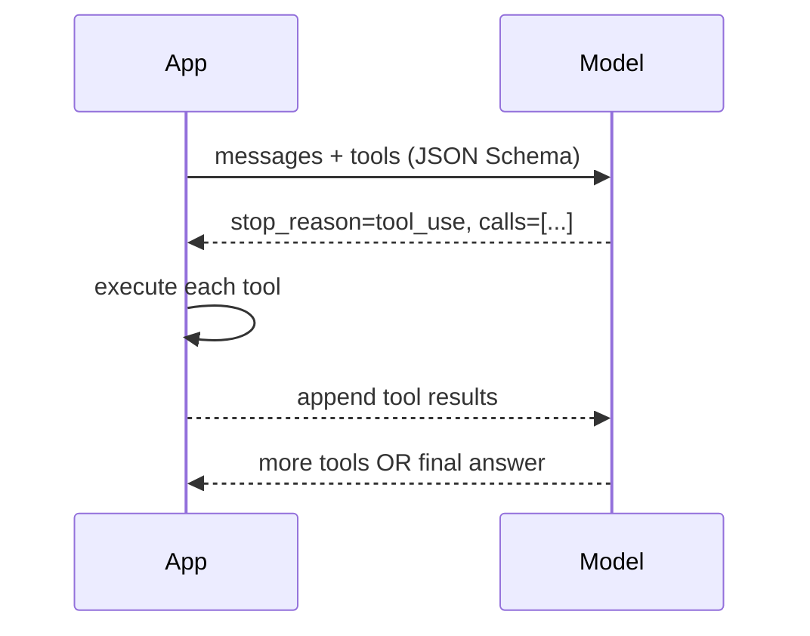

# OpenAI / Claude APIs — Medium Interview Questions

> Intermediate Q&A: the mechanics you must actually implement in production — tool loops, streaming with tools, structured outputs, caching, retries, and cost math.

## Quick Coverage Map
| # | Question | Theme |
|---|---|---|
| 1 | Walk through the full tool-calling loop | Tools |
| 2 | Parallel tool calls — what and when? | Tools |
| 3 | Structured Outputs vs JSON mode vs tools | Structured output |
| 4 | How does prompt caching work & save money? | Caching |
| 5 | Handling tool calls while streaming | Streaming |
| 6 | Retry strategy for 429/5xx | Reliability |
| 7 | RPM vs TPM rate limits | Rate limits |
| 8 | How to reduce cost of a long chat | Cost |
| 9 | Reasoning models & thinking tokens | Reasoning |
| 10 | Idempotency keys — why? | Reliability |
| 11 | Multimodal cost gotchas | Multimodal |
| 12 | Detecting & handling truncated output | Robustness |

---

### 1. Walk through the full tool-calling loop.

1. Send messages + a `tools` list.
2. Model replies with `finish_reason=tool_calls` (OpenAI) / `stop_reason=tool_use` (Anthropic).
3. Parse args, **execute your functions**.
4. Append the assistant tool-call turn **and** the tool results to the message list.
5. Call again → repeat until no tool calls, capping iterations (e.g., max 8) to avoid loops.

The model *plans*; your code *acts*. Never let the model execute anything directly.

---

### 2. What are parallel tool calls and when do you use them?
The model can request **several independent tool calls in one turn** (e.g., weather for 3 cities). You run them **concurrently** and return all results together — fewer round-trips, lower latency.

**When to disable** (`parallel_tool_calls=False`): when you need strict schema enforcement (OpenAI's strict grammar isn't applied inside parallel-call wrappers), or when tools have ordering/side-effect dependencies (write-then-read).

---

### 3. Structured Outputs vs JSON mode vs tool schemas — when each?
| Mechanism | Guarantee | Use when |
|---|---|---|
| **JSON mode** | Valid JSON, any shape | You just need parseable JSON |
| **Structured Outputs** (`strict:true`) | Matches *your* JSON Schema | You need exact typed data (extraction, forms) |
| **Tool schema** | Args match schema | You're already calling tools / on Claude |

Structured Outputs uses **constrained decoding** — the model literally can't emit tokens outside the grammar. Requirements: all fields `required` (use `null` unions for optional), `additionalProperties:false`. Claude has no `json_schema` response format, so force a tool whose input schema is your target object.

---

### 4. How does prompt caching work and how much does it save?
It reuses the model's precomputed **KV state for a matching prompt prefix**, so repeated context isn't recomputed.
- **OpenAI:** automatic on prompts ≥1024 tokens, matches the longest prefix in 128-token steps, ~50% cheaper cached input, up to ~80% faster TTFT.
- **Anthropic:** explicit `cache_control` breakpoints; cache **write** costs ~1.25× (5-min) or ~2× (1-hr), cache **read** ~0.1× (≈90% off).

**Design rule:** static content (system, tools, docs) at the **front**, dynamic (user turn) at the **end**, and keep the prefix **byte-stable** — one changed byte early busts the cache. Best ROI: agents/chat that resend a big prefix many times.

---

### 5. How do you handle tool calls when streaming?
Tool-call **arguments arrive as fragments**. You must accumulate them by index/`tool_call_id` until the stream signals the call is complete, *then* `json.loads` the assembled string.

```python
calls = {}
for chunk in stream:
    for tc in (chunk.choices[0].delta.tool_calls or []):
        c = calls.setdefault(tc.index, {"name": "", "args": ""})
        if tc.function.name:      c["name"] = tc.function.name
        if tc.function.arguments: c["args"] += tc.function.arguments
# after stream ends:
args = json.loads(calls[0]["args"])
```
Parsing a fragment mid-stream will throw — wait for completion.

---

### 6. What's a solid retry strategy for 429 / 5xx?
- Retry **only** transient errors: 429, 500/502/503/504, network timeouts. Never retry 400/401/403/422.
- **Exponential backoff with full jitter:** `sleep = random(0, base * 2**attempt)` — jitter avoids a synchronized retry storm.
- **Honor `Retry-After`** if the server sends it.
- Cap retries (e.g., 5) and add a **total deadline** so you don't wait minutes.
- Combine with a client-side rate limiter so you avoid most 429s in the first place.

---

### 7. What's the difference between RPM and TPM limits?
- **RPM** = requests per minute (how many calls).
- **TPM** = tokens per minute (how much *content*, input + output).

You can blow the TPM budget with a few huge-context calls even at low RPM, or hit RPM with many tiny calls. At scale you shape traffic against **both** with a token-bucket limiter and bounded concurrency. Limits are per-model, per-org/project, and usually rise with your spend tier.

---

### 8. How do you reduce the cost of a long-running chat?
- **Prompt caching** for the stable system/tool/context prefix.
- **Trim/summarize old turns** — replace the earliest turns with a running summary (sliding window + summary).
- **Cap `max_tokens`** and prompt for concise answers (output is the priciest tokens).
- **Model routing** — cheap model (Haiku/mini) for simple turns, escalate only hard ones.
- **Batch API** (~50% off) for anything async.

---

### 9. What are reasoning models and thinking tokens?
Reasoning models (OpenAI o-series, Claude **extended thinking**) do internal step-by-step reasoning before answering. That hidden reasoning is billed as **output/thinking tokens**, so a "short" answer can quietly cost thousands of tokens. You often can't hand-write CoT for them (they reason internally); you can request a **summary** and set a thinking-token budget. Use them for hard math/planning/coding; use standard models for simple tasks to save money and latency.

---

### 10. Why use idempotency keys?
If a POST **succeeds but the response is lost** (network blip, timeout), a naive retry runs it **again** — double charge, double side-effect. An `idempotency-key` lets the provider recognize the retry and return the original result instead of re-executing. Essential for anything with side-effects or metered cost.

---

### 11. What are the cost gotchas with multimodal inputs?
Images aren't "free context" — they're **tiled and billed as input tokens**, and a high-resolution image can cost hundreds to thousands of tokens. Downscale to the smallest resolution that preserves the detail you need, and use the provider's detail/resolution setting. PDFs and audio similarly expand into many tokens. Always check `usage` after your first few calls to calibrate.

---

### 12. How do you detect and handle truncated output?
Check **`finish_reason`/`stop_reason`**:
- `length` → you hit `max_tokens`; output is cut off. Either raise the cap, ask for shorter output, or continue the generation.
- `content_filter` → blocked; return a safe fallback, don't crash.
- `tool_calls`/`tool_use` → run the loop, don't treat it as the final answer.

For JSON, a `length` finish almost always means a broken object — never `json.loads` it blindly; detect the truncation first.

---

## Further Reading
- [OpenAI Structured Outputs](https://platform.openai.com/docs/guides/structured-outputs)
- [Anthropic Prompt caching](https://docs.anthropic.com/en/docs/build-with-claude/prompt-caching)
- [OpenAI Prompt Caching](https://openai.com/index/api-prompt-caching/)
- [Anthropic tool use](https://docs.anthropic.com/en/docs/build-with-claude/tool-use)

*Content synthesized from general domain knowledge and current (2025-2026) interview trends; rephrased for compliance with licensing restrictions.*
