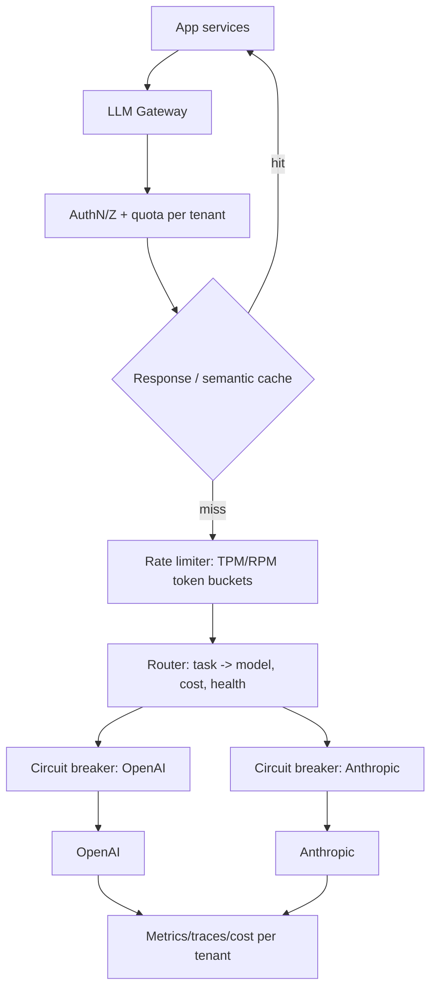
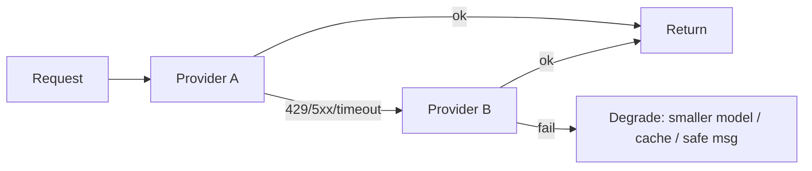
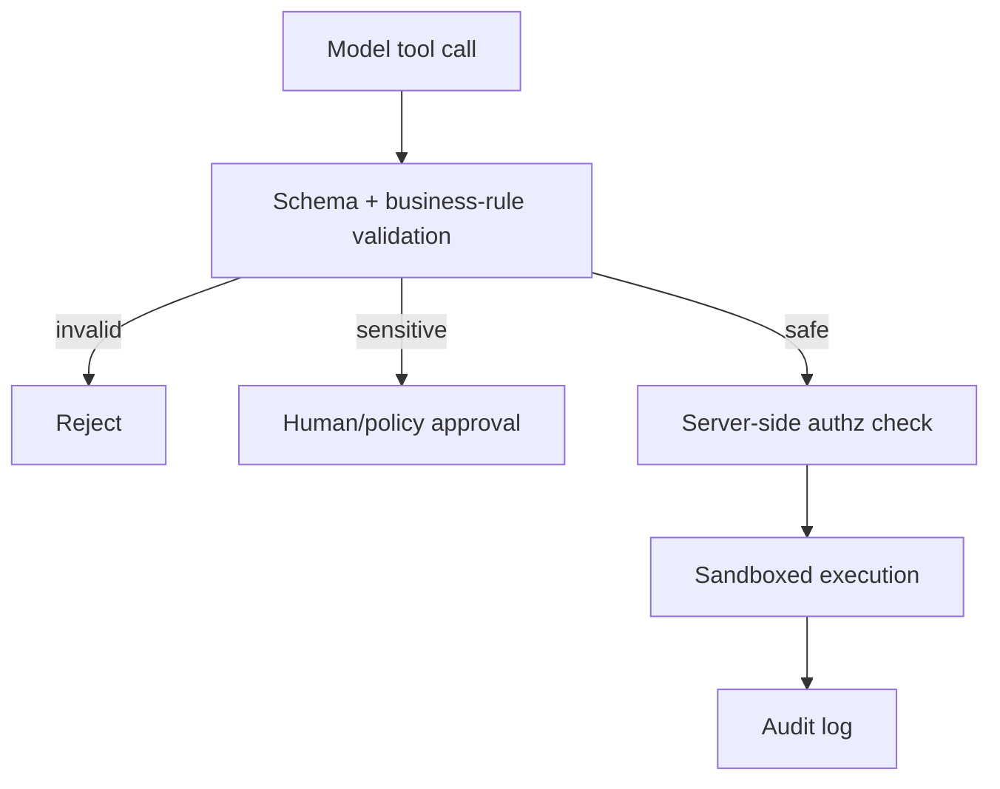

# OpenAI / Claude APIs — Advanced / Expert Interview Questions

> Senior/staff-level Q&A: scaling API usage to millions of calls, cost math, reliability/failover architecture, and security. These are the questions that separate "I called the API" from "I ran it in production at scale."

## Quick Coverage Map
| # | Question | Theme |
|---|---|---|
| 1 | Design a multi-provider LLM gateway | Architecture |
| 2 | Scale to 10k+ RPS within rate limits | Scale / load |
| 3 | Do the cost math for a feature at scale | Cost |
| 4 | Reliability: failover, circuit breakers, degradation | Reliability |
| 5 | Prompt-cache strategy for a 50-step agent | Caching / cost |
| 6 | Secure tool calling against injection | Security |
| 7 | Guarantee correct structured data at scale | Correctness |
| 8 | Latency budget & TTFT optimization | Performance |
| 9 | Multi-tenant isolation & fairness | Architecture |
| 10 | Idempotency + exactly-once with side-effects | Reliability |
| 11 | Observability & cost attribution | Operations |
| 12 | Migrating OpenAI ↔ Claude without a rewrite | Portability |

---

### 1. Design a multi-provider LLM gateway.
A gateway centralizes cross-cutting concerns so app teams call one interface.


Responsibilities: **normalize** request shape (messages/tools/roles) so providers are swappable; enforce **per-tenant quotas**; **cache** (exact + semantic); **route** by cost/task/health; **retry & failover**; **circuit-break** degraded providers; emit **cost/latency telemetry**. Keep it stateless and horizontally scalable; keep provider keys in a secrets manager with rotation.

---

### 2. How do you scale to 10k+ requests/sec while staying under rate limits?
Provider limits are **RPM + TPM per model/org**. You cannot just fire 10k RPS at one key.
- **Client-side shaping:** distributed token-bucket limiters (Redis) for both RPM and TPM; **admission control** rejects/queues when over budget.
- **Queue + workers:** async job queue with bounded concurrency; smooths bursts and gives backpressure instead of a 429 storm.
- **Spread load:** multiple projects/keys/regions, and multiple providers, to raise aggregate throughput. Route across them by health and remaining quota.
- **Reduce demand:** semantic caching (kills 30–50% of calls in FAQ workloads), batch API for async, cheaper models for easy work.
- **Prioritize:** separate lanes for interactive (low latency) vs bulk (can wait), so a batch job never starves user traffic.

---

### 3. Walk through the cost math for a feature at scale.
Make it explicit and defensible. Say prices `$3/1M` input, `$15/1M` output (Sonnet-class, illustrative).

A support-bot turn: **8k input** (system+context+history) + **500 output**:
```
in  = 8000/1e6 * 3   = $0.024
out = 500/1e6  * 15  = $0.0075
per turn ≈ $0.0315
```
At **1M turns/month** → **~$31.5k/month**.

Now optimize:
- Cache the **6k-token static prefix** (Anthropic read ≈ 0.1×): input drops to `2000/1e6*3 + 6000/1e6*0.3 = $0.006 + $0.0018 = $0.0078`; per turn ≈ **$0.0153** → **~$15.3k/mo** (≈50% off).
- Route 60% of easy turns to a Haiku-class model (~$1/$5): those turns drop another ~3×.
- Trim output to 300 tokens: saves ~$0.003/turn.

**Blended result:** often a **2–4× reduction**. The point interviewers want: you can turn architecture choices into dollars and defend them.

---

### 4. How do you make LLM calls reliable (failover, breakers, degradation)?
Layered defense:
1. **Retries** with exponential backoff + full jitter on 429/5xx/timeouts, honoring `Retry-After`.
2. **Failover** to a second provider using a normalized request shape.
3. **Circuit breaker** per provider: after N failures, open the circuit (stop sending) for a cooldown, then half-open to probe recovery — prevents hammering a sick provider and cascading latency.
4. **Graceful degradation:** fall back to a smaller/cheaper model, a cached answer, or a canned "try again" response rather than a hard error.
5. **Timeouts + deadlines:** per-request and total; for streaming, an **inter-token** timeout to catch stalls.
6. **Idempotency keys** so retries/failover don't double-charge.



---

### 5. Design a prompt-cache strategy for a 50-step agent.
An agent resends a big prefix (system + tool defs + working context) on **every** step. Without caching you pay for it ~50×.
- **Structure the prompt:** stable prefix first (system → tool schemas → long reference docs), volatile scratchpad/last action last.
- **Anthropic:** put `cache_control` breakpoints at the end of the stable blocks (system, tools, docs). First step = one cache **write** (~1.25×), next 49 steps = cache **reads** (~0.1×). Use the **1-hour TTL** if steps span >5 min.
- **OpenAI:** automatic — just keep the prefix identical and ≥1024 tokens.
- **Byte-stability discipline:** no timestamps, random IDs, or reordered JSON keys in the prefix — they silently bust the cache for everything after them.
- **Result:** the prefix cost collapses from ~50× to ~1 write + ~49 cheap reads, frequently a **5–10× cost cut** on that workload, plus big TTFT wins.

---

### 6. How do you secure tool calling against prompt injection?
Tool calling + untrusted content (retrieved docs, web pages, user files) is the highest-risk surface — **indirect prompt injection** can make the model call a tool to exfiltrate data.
- **Treat model output as untrusted:** never auto-execute a tool whose effect is irreversible/sensitive without validation or human approval.
- **Least privilege tools:** each tool does one narrow thing; no "run arbitrary SQL/shell." Parameterize and allow-list.
- **Validate arguments** against a strict schema *and* business rules (e.g., a `refund` tool checks amount limits and ownership server-side, not just the model's word).
- **Delimit untrusted context** as data (`<context>…</context>`) and instruct the model it's not commands.
- **Enforce authorization in *your* code**, not the prompt — the model can be tricked; your access checks can't.
- **Output filtering:** scan for secrets/PII exfiltration; log every tool call for audit.
- **Sandbox** side-effecting tools (network egress limits, timeouts).



---

### 7. How do you guarantee correct structured data at scale?
- **Constrained decoding** (OpenAI Structured Outputs `strict:true` / Claude forced tool) guarantees **shape**.
- **Then validate semantics** with Pydantic/JSON Schema *plus* business rules (enum membership, ranges, referential integrity).
- **Retry-with-repair:** on validation failure, send the error back to the model to fix (bounded retries) rather than failing the request.
- **Enumerate** categorical fields as enums so the model can't invent values.
- **Version your schemas** and evals; run a golden set in CI so a model/prompt change can't silently break downstream parsers.
- **Monitor** parse-failure rate as an SLI — a spike signals a model update or prompt drift.

---

### 8. How do you optimize latency and TTFT?
Understand the split: **prefill** (reading the prompt) + **decode** (sequential output). Decode dominates total latency; prefill drives TTFT.
- **Stream** — TTFT is what users feel; get first token out fast.
- **Prompt caching** — skips prefill of the cached prefix → big TTFT win.
- **Shorten prompts & outputs** — fewer decode steps.
- **Right-size the model** — smaller models are faster; route accordingly.
- **Speculative/parallel work** — start tool calls in parallel; prefetch likely context.
- **Regional endpoints** and connection reuse (keep-alive) to cut network RTT.
- **Measure p50/p95/p99 TTFT and total separately**; tail latency is what breaks UX and SLAs.

---

### 9. How do you handle multi-tenant isolation and fairness?
- **Per-tenant quotas** (RPM/TPM/$$) enforced at the gateway so one tenant can't exhaust shared limits (noisy neighbor).
- **Fair scheduling / weighted queues** so large tenants don't starve small ones.
- **Cost attribution** per tenant/feature (tag every call) for billing and abuse detection.
- **Data isolation:** never leak one tenant's context/cache into another's — scope prompt caches and any stored history by tenant.
- **Separate keys/projects** per tenant tier where isolation or limit-raising matters.
- **Abuse controls:** per-tenant anomaly alerts on token spend and error rates.

---

### 10. How do you get exactly-once behavior with side-effecting tools?
LLM calls are at-least-once under retries. For side-effecting tools (payments, emails, writes):
- **Idempotency keys** on both the provider call and *your* downstream actions — dedupe by a stable key (e.g., hash of request + step).
- **Outbox / dedup table:** record "action X for key K done" transactionally; skip if already present.
- **Make tools idempotent by design** (upserts, not blind inserts).
- **Two-phase / confirmation** for high-stakes actions: model proposes, system validates + commits.
- Never rely on the model to "remember" it already acted — enforce it in durable storage.

---

### 11. What does good observability & cost attribution look like?
Log per call: request id, tenant/feature, provider, model, **input/output/cached tokens**, derived **$ cost**, TTFT + total latency, `finish_reason`, retries, fallbacks, tool calls, guardrail flags.
- **Dashboards:** cost & latency by feature/tenant/model; error-rate by provider.
- **Alerts:** 429 spikes, cost anomalies, p95 latency regressions, parse-failure spikes.
- **Traces:** OpenTelemetry spans across the tool loop so you can see where time/tokens go.
- **Eval store:** sample live traffic, score offline, gate deploys on regressions.
- The killer feature: **cost per feature per tenant** — it drives every optimization decision.

---

### 12. How do you migrate between OpenAI and Claude without a rewrite?
Build an **adapter layer** that normalizes the differences:
| Concern | OpenAI | Claude | Adapter does |
|---|---|---|---|
| System prompt | first message | `system` field | move it |
| Tool result | role `tool` + id | `tool_result` block | reshape envelope |
| Structured output | `json_schema` strict | forced tool | pick per provider |
| Caching | automatic | `cache_control` | inject breakpoints |
| `max_tokens` | optional | required | always set |
| Stop reasons | `finish_reason` | `stop_reason` | map to a common enum |

Expose **one internal request/response type**; keep provider-specific quirks behind the adapter. Then failover and cost-routing become config, not code changes. Validate parity with a shared eval suite so behavior doesn't silently drift between providers.

---

## Further Reading
- [OpenAI Responses API](https://openai.com/index/new-tools-and-features-in-the-responses-api/)
- [Anthropic Prompt caching](https://docs.anthropic.com/en/docs/build-with-claude/prompt-caching)
- [OpenAI rate limits](https://platform.openai.com/docs/guides/rate-limits)
- [Anthropic tool use / security](https://docs.anthropic.com/en/docs/build-with-claude/tool-use)
- [OWASP Top 10 for LLM Applications](https://owasp.org/www-project-top-10-for-large-language-model-applications/)

*Content synthesized from general domain knowledge and current (2025-2026) interview trends; rephrased for compliance with licensing restrictions.*
