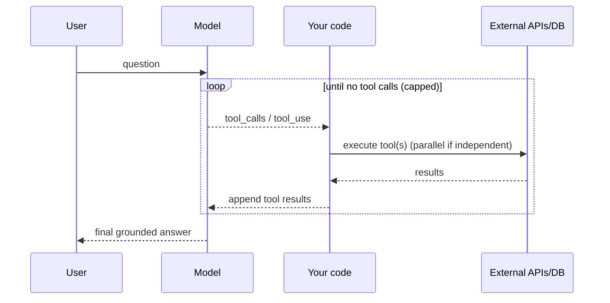
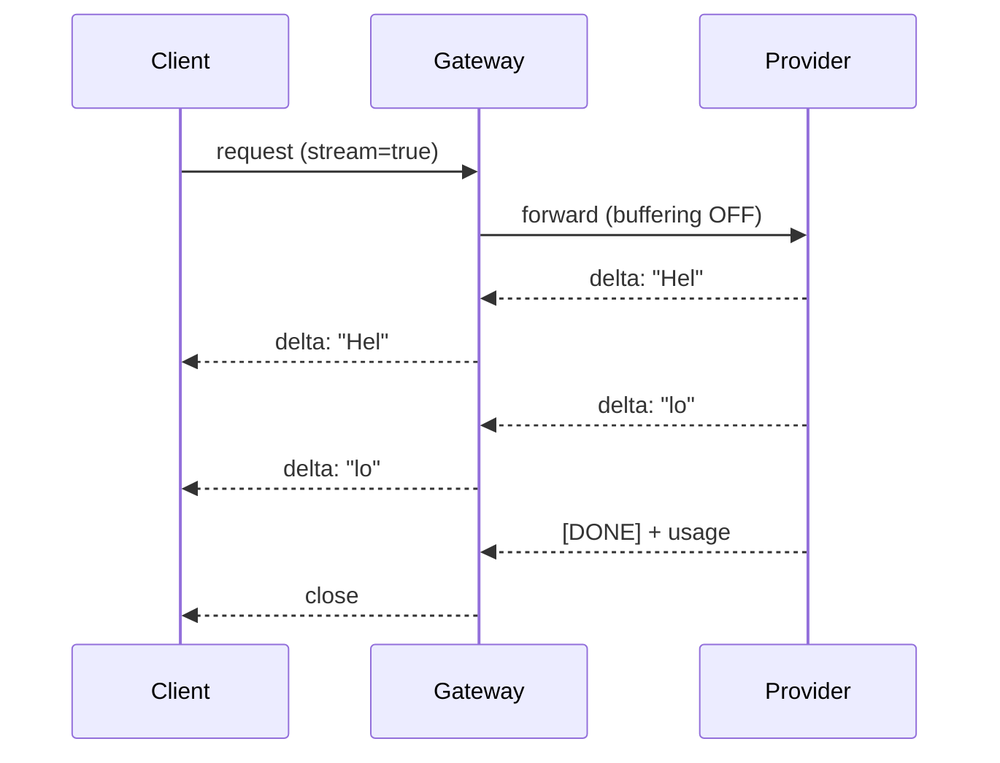
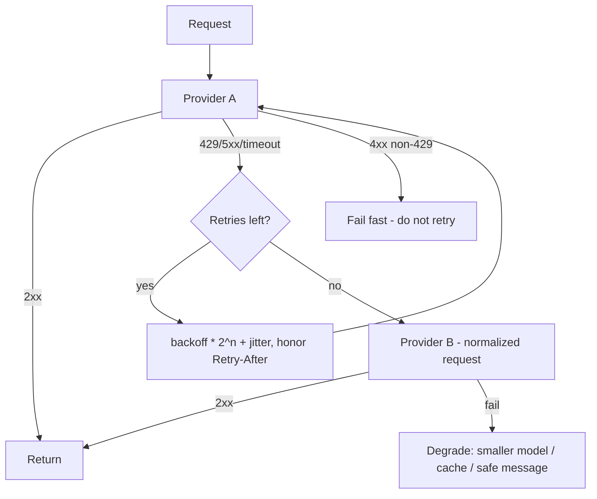
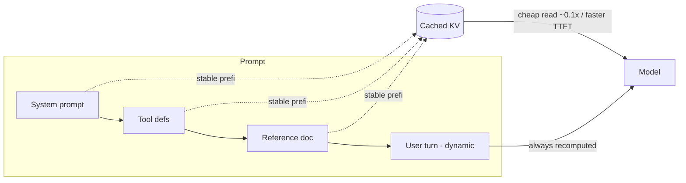
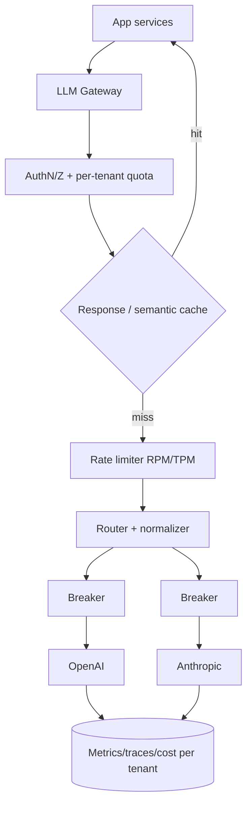
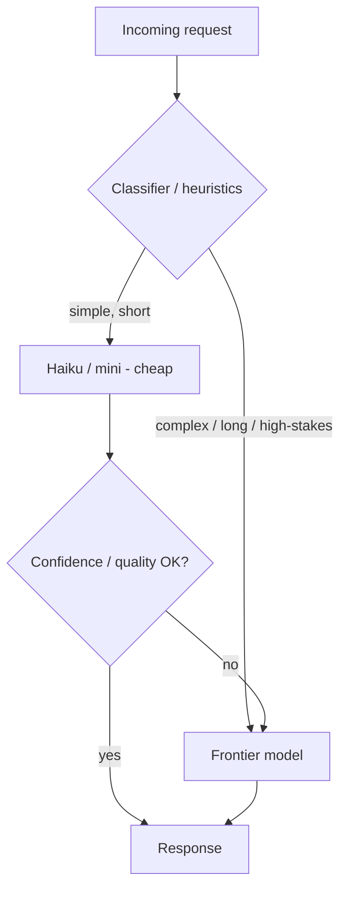
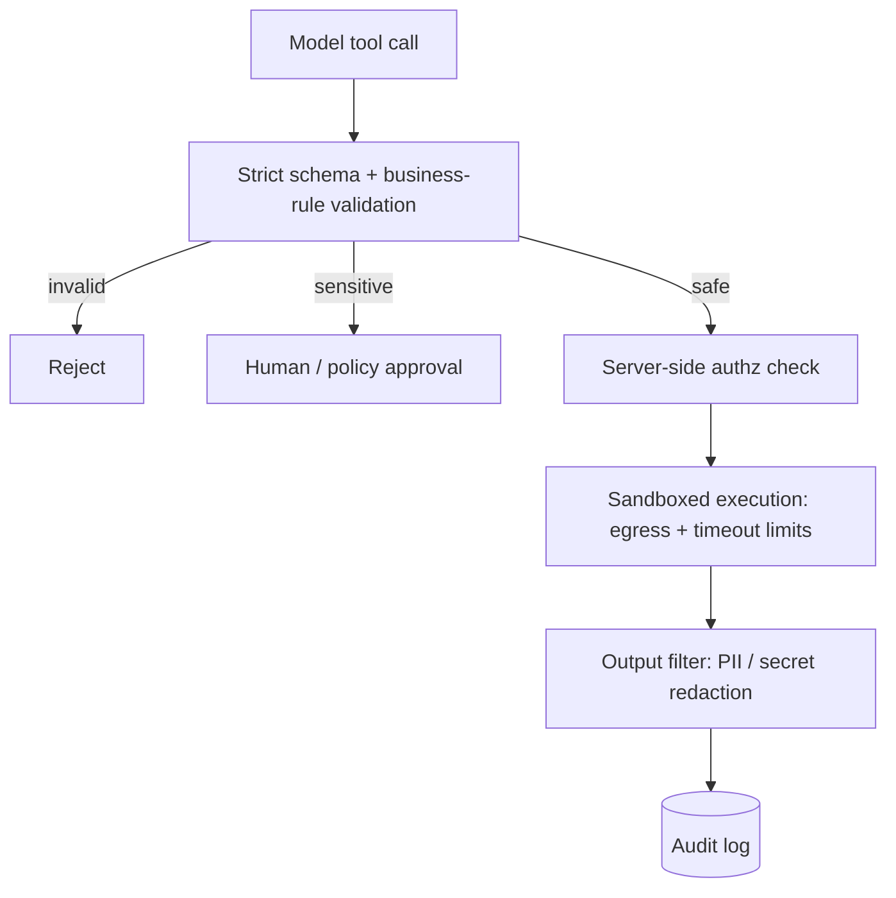
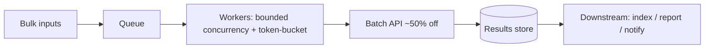
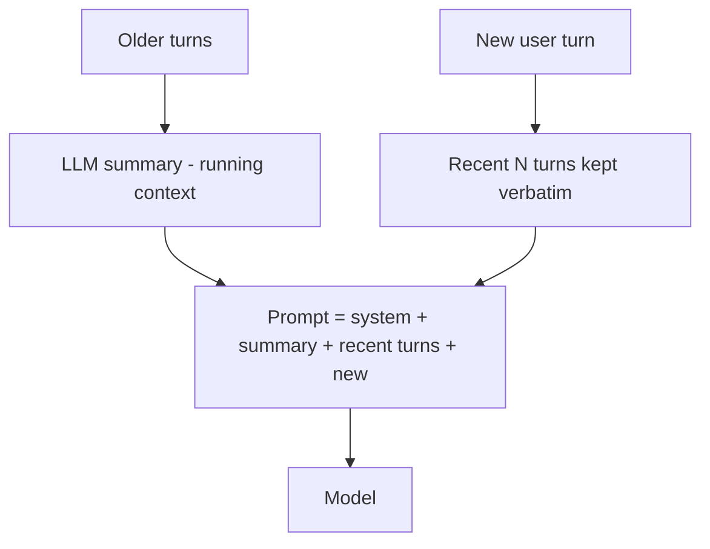

# OpenAI / Claude API — Use-Case Diagrams

> Mermaid diagrams for the patterns interviewers love to whiteboard. Each includes the *why* and key trade-offs.

---

## 1. Tool / function calling loop
The model plans, your code acts, repeat until done.

**Why:** connect the model to live data/actions. **Trade-off:** each round is a full model call — cap iterations and cache the prefix.

---

## 2. Streaming response (SSE)
Tokens flow to the client as they're produced.

**Why:** low time-to-first-token, better UX. **Trade-off:** must accumulate tool-arg fragments; handle mid-stream disconnects; disable proxy buffering.

---

## 3. Retry with backoff + failover
Absorb transient errors, then fall back across providers.

**Why:** resilience to throttling and outages. **Trade-off:** idempotency keys required so retries/failover don't double-charge.

---

## 4. Prompt caching
Reuse computed KV state for a stable prefix.

**Why:** up to ~90% cheaper reads, big TTFT wins on repeated context. **Trade-off:** one changed byte early busts everything after it — keep prefix byte-stable, dynamic content last.

---

## 5. Multi-provider LLM gateway
One interface; providers become swappable config.

**Why:** centralize auth, quotas, caching, routing, failover, telemetry. **Trade-off:** must normalize provider envelope differences (system prompt, tool results, structured output).

---

## 6. Cost-aware model routing
Cheap model for easy work; escalate only when needed.

**Why:** often 2–4× cost reduction with minimal quality loss. **Trade-off:** classifier adds latency/complexity; needs eval to tune the routing threshold.

---

## 7. Secure tool execution pipeline
Guard the highest-risk surface (tools + untrusted content).

**Why:** defend against indirect prompt injection and data exfiltration. **Trade-off:** approval/validation add latency for high-stakes actions — apply selectively.

---

## 8. Batch / async processing
High-throughput, latency-tolerant workloads at ~50% cost.

**Why:** cheaper and rate-limit-friendly for embeddings, evals, bulk extraction. **Trade-off:** not for interactive use — results are async.

---

## 9. Sliding-window chat memory + summarization
Keep long chats affordable and within context limits.

**Why:** bounds token growth as conversations get long. **Trade-off:** summaries lose detail — keep IDs/facts that matter verbatim.

*Content synthesized from general domain knowledge and current (2025-2026) provider docs; rephrased for compliance with licensing restrictions.*
