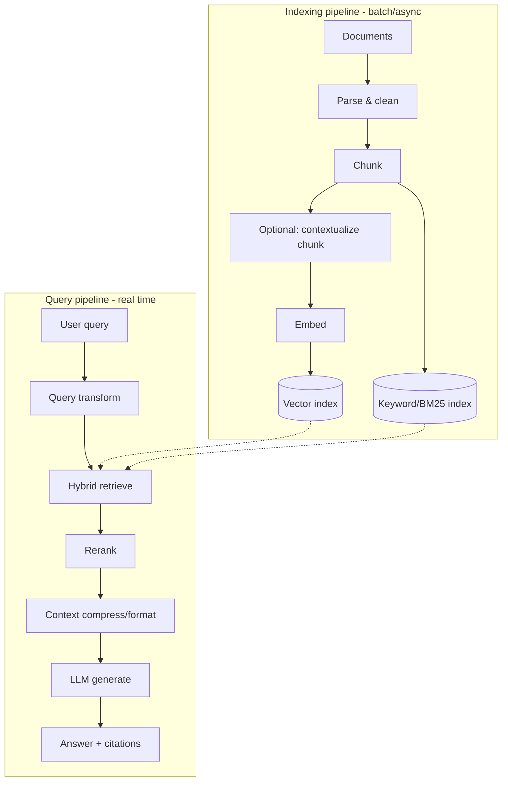
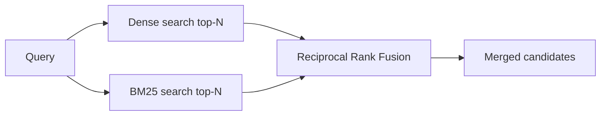
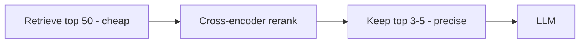
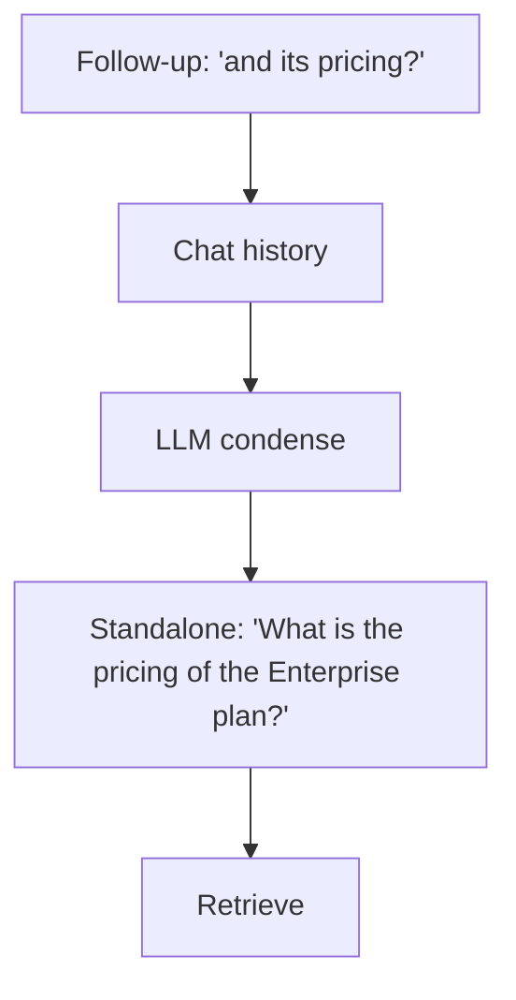
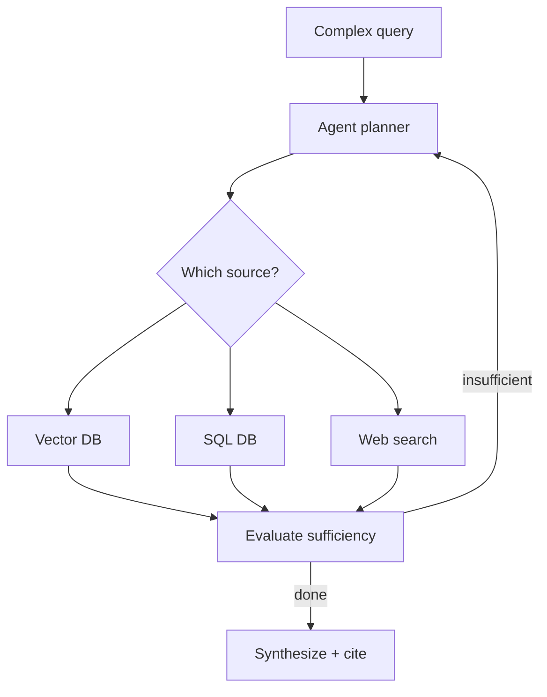
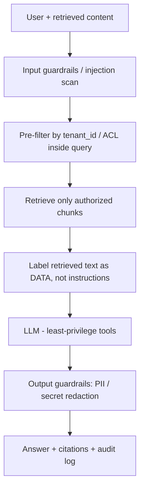
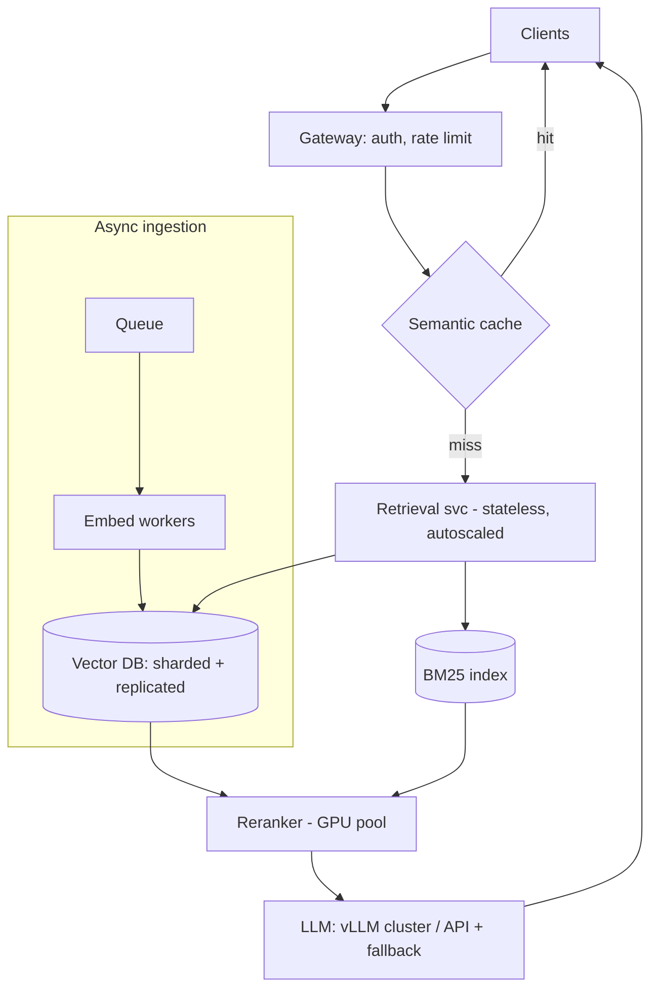

# RAG — Detailed Learning (Deep Dive)

> This is the "read-everything-here-and-you-can-defend-RAG-in-any-interview" guide. It goes from first principles to production system design, with the *why* behind every decision, current (2025–2026) benchmarks, trade-offs, and diagrams. Read top to bottom once, then use the headings as a revision index.

---

## Table of Contents
1. [Why RAG exists — the core problem](#1-why-rag-exists)
2. [The mental model](#2-the-mental-model)
3. [Stage 1 — Ingestion & parsing](#3-stage-1--ingestion--parsing)
4. [Stage 2 — Chunking (deep)](#4-stage-2--chunking-deep)
5. [Stage 3 — Embeddings (deep)](#5-stage-3--embeddings-deep)
6. [Stage 4 — Vector indexes & ANN](#6-stage-4--vector-indexes--ann)
7. [Stage 5 — Retrieval: dense, sparse, hybrid](#7-stage-5--retrieval)
8. [Stage 6 — Reranking](#8-stage-6--reranking)
9. [Stage 7 — Query understanding & transformation](#9-stage-7--query-transformation)
10. [Stage 8 — Generation & prompting](#10-stage-8--generation)
11. [Advanced patterns](#11-advanced-patterns)
12. [Evaluation (the part everyone skips)](#12-evaluation)
13. [Security](#13-security)
14. [Scale, load & performance](#14-scale-load--performance)
15. [Failure modes & how to debug them](#15-failure-modes)
16. [Interview power-answers](#16-interview-power-answers)

---

## 1. Why RAG exists

LLMs store knowledge in their weights (**parametric memory**). That has three hard limits:

- **Knowledge cutoff** — the model knows nothing after its training date.
- **No private data** — it never saw your company's docs.
- **Hallucination** — when it doesn't know, it still generates confident, plausible, wrong text, because it was trained to produce *likely* text, not *true* text.

RAG adds **non-parametric memory**: an external store you can search at query time and inject into the prompt. You get fresh, private, and citable knowledge without retraining. Editing knowledge becomes "add a document" instead of "retrain a model."

> **Key framing for interviews:** RAG is not a model trick — it's a *systems* pattern that combines information retrieval (decades-old IR) with generation. Treat it like a search engine bolted to an LLM.

---

## 2. The mental model

Two independent lifecycles:



The offline side decides *retrieval quality ceiling*. The online side decides *latency and answer quality*. Most teams over-invest in prompts and under-invest in the offline side — that's backwards. **~40–60% of RAG projects never reach production, usually because the retrieval layer is wrong, not the LLM.**

---

## 3. Stage 1 — Ingestion & parsing

Garbage in, garbage out. This unglamorous stage decides your ceiling.

- **Format-aware parsing:** PDFs (layout, tables, multi-column), HTML (strip nav/boilerplate), code (respect functions), slides, images (OCR). Tools: `unstructured`, `PyMuPDF`, `LlamaParse`, Docling.
- **Tables & figures:** naive text extraction destroys tables. Either serialize tables to Markdown or summarize them with a vision model.
- **Metadata capture:** title, section, page, author, date, `tenant_id`, `access_level`, source URL. This powers filtering, security, and citations later.
- **Deduplication & cleaning:** remove headers/footers, near-duplicate pages, and boilerplate that pollutes retrieval.

> Interview line: *"Most retrieval bugs I've seen were actually parsing bugs — the right answer never made it into a clean chunk."*

---

## 4. Stage 2 — Chunking (deep)

Chunking = splitting documents into retrievable units. It matters as much as your embedding model: **adaptive/semantic chunking hits ~87% accuracy vs ~67% for naive fixed-size splitting** on some benchmarks.

### Strategies (worst → best for most cases)
| Strategy | How | Trade-off |
|---|---|---|
| **Fixed-size** | Every N tokens | Simple, but slices sentences mid-thought |
| **Recursive** | Split on `\n\n` → `\n` → sentence | Good default, respects structure |
| **Document-structure** | Split by headings/sections | Great for docs/wikis/markdown |
| **Semantic** | Group adjacent sentences by embedding similarity | Best coherence, more compute |
| **Proposition/atomic** | LLM extracts standalone facts | High precision, expensive |

### The size trade-off
- **Small chunks (128–256 tokens):** precise retrieval, but may lack surrounding context.
- **Large chunks (1024–2048):** more context, but dilute relevance and cost more tokens.
- **Rule of thumb:** 256–512 tokens with 10–15% overlap for Q&A; larger for synthesis.

### Decoupling retrieval unit from generation unit
Two powerful patterns:
- **Parent-document retrieval:** embed/search *small* chunks (precise) but pass the *parent* section to the LLM (context). Best of both.
- **Sentence-window:** retrieve a sentence, then expand to ±k surrounding sentences before generation.


---

## 5. Stage 3 — Embeddings (deep)

An embedding model maps text to a dense vector where **distance ≈ semantic dissimilarity**. Modern embedders are transformer encoders trained with **contrastive learning** (pull related pairs together, push unrelated apart).

### What to know
- **Dimensions:** typically 384–3072. Higher = richer but more memory/slower search.
- **Matryoshka embeddings (MRL):** trained so you can *truncate* dimensions (e.g., 3072 → 512) with graceful quality loss — huge for storing billions of vectors.
- **Symmetric vs asymmetric:** some models need a `query:` / `passage:` prefix (e5, bge). Getting this wrong silently tanks recall.
- **Domain fit:** a general model may miss legal/medical/code jargon. Check the **MTEB leaderboard**, but always benchmark on *your* data.
- **Normalization:** normalize vectors so cosine similarity == dot product (faster).

### Choosing a model
| Need | Reach for |
|---|---|
| English, managed | OpenAI `text-embedding-3-large/small`, Cohere embed v3 |
| Open source | `bge-large`, `e5-large`, `gte` |
| Multilingual | `multilingual-e5`, Cohere multilingual |
| Code | code-specific embedders |

> **Gotcha:** you must use the **same** embedding model (and version) for indexing and querying. Changing the model means re-embedding everything.

---

## 6. Stage 4 — Vector indexes & ANN

Exact nearest-neighbor search is O(n) — impossible at scale. **Approximate Nearest Neighbor (ANN)** trades a little recall for massive speed.

### Index families
| Index | Idea | Pros | Cons | Use when |
|---|---|---|---|---|
| **Flat** | Brute force | Exact | Slow | < ~100k vectors |
| **HNSW** | Multi-layer proximity graph | Fast, high recall | High RAM | Most production |
| **IVF** | Cluster into cells, search nearest cells | Scales | Recall depends on `nprobe` | Large sets |
| **IVF-PQ** | IVF + product quantization (compress) | Tiny memory | Lower recall | Billions of vectors |
| **DiskANN** | Graph index on SSD | Off-RAM huge scale | Higher latency | Cold/massive corpora |

### HNSW knobs (interviewers probe this)
- **`M`** — edges per node. Higher = better recall, more memory.
- **`ef_construction`** — build-time search width. Higher = better graph, slower build.
- **`ef_search`** — query-time candidates. Higher = better recall, slower query.
- You tune `ef_search` against a **recall target** measured on a labeled set.

### Quantization
- **Scalar (int8):** ~4× smaller, near-lossless.
- **Product Quantization (PQ):** split vector into sub-vectors, cluster each — 8–32× smaller, some recall loss.
- **Binary:** 32× smaller, use as a fast first pass, then rerank with full vectors.

---

## 7. Stage 5 — Retrieval

### Dense (semantic) retrieval
Embed the query, find nearest chunk vectors. Great at *meaning* ("cancel subscription" ≈ "terminate my plan"). Weak at exact tokens (SKUs, error codes, rare names).

### Sparse (lexical) retrieval — BM25
Classic keyword scoring (term frequency × inverse document frequency, length-normalized). Great at exact matches and rare terms. Blind to synonyms/paraphrase.

### Hybrid = dense + sparse (the modern default)
They fail on opposite cases, so combine them. **Across BEIR/MTEB and the Anthropic contextual-retrieval work, BM25 + dense fused with Reciprocal Rank Fusion beats either method alone** (NDCG up ~22–28% over pure dense in production benchmarks).

**Reciprocal Rank Fusion (RRF)** merges ranked lists without needing comparable scores:

```
score(d) = Σ  1 / (k + rank_i(d))      # k ≈ 60, sum over each retriever
```



**Why RRF over weighted score-sum?** Dense (cosine ∈ [-1,1]) and BM25 (unbounded) scores aren't on the same scale; RRF only uses ranks, so no fragile normalization.

---

## 8. Stage 6 — Reranking

First-stage retrieval optimizes *recall* (don't miss the answer). Reranking optimizes *precision* (put the best first).

- **Bi-encoder** (retrieval): encodes query and doc *separately* → fast, approximate.
- **Cross-encoder** (reranker): encodes (query, doc) *together* → reads them jointly, far more accurate, but slower, so run only on the top ~50 candidates.

**Impact:** cross-encoder reranking delivers **~+33% accuracy on average across 8 retrieval benchmarks**, and **+5–15 points of MRR** on hard sets. This is one of the highest-ROI upgrades to naive RAG.



Tools: Cohere Rerank, `bge-reranker`, Voyage rerank, cross-encoders in sentence-transformers. Watch the added latency (~50–150ms) — batch and cap the candidate count.

---

## 9. Stage 7 — Query transformation

The user's raw question is often a bad search query. Fix it *before* retrieval.

| Technique | What it does | When |
|---|---|---|
| **Query rewriting** | Clean/expand vague queries | Always helpful |
| **Conversational condensation** | Resolve "it/that" using chat history into a standalone query | Multi-turn chat |
| **Multi-query** | Generate N rephrasings, search all, merge | Recall boost for ambiguous queries |
| **HyDE** | LLM writes a hypothetical answer; embed *that* to search | Short queries far from docs |
| **Decomposition** | Break a complex question into sub-questions | Multi-part / multi-hop |
| **Step-back prompting** | Ask a more general question first | Reasoning-heavy queries |



Trade-off: every transform is an extra LLM call → more latency/cost. Use selectively.

---

## 10. Stage 8 — Generation

Now assemble the prompt and generate.

### Prompt structure that works
```text
System: Answer ONLY using the context. If the answer isn't in the context,
say "I don't have that information." Cite sources as [n].

Context:
[1] {chunk_1}   (source: doc A, p.4)
[2] {chunk_2}   (source: doc B, p.1)

Question: {user_question}
```

### Key techniques
- **Grounding instruction** — the single biggest hallucination reducer.
- **Citations** — return `[n]` markers mapped to sources; enables trust + auditing.
- **Context ordering** — put the strongest chunks first/last to dodge **"lost in the middle"** (LLMs under-attend to the middle of long context).
- **Context compression** — summarize/trim retrieved chunks (e.g., LLMLingua, extractive filtering) to cut tokens and noise.
- **Refuse gracefully** — better to say "I don't know" than hallucinate.

---

## 11. Advanced patterns

### Contextual Retrieval (Anthropic, 2024)
Problem: an isolated chunk loses its document context ("the limit rose to $10,000" — whose? which product?). Fix: prepend a short LLM-generated context sentence to each chunk *before embedding*. Combined with hybrid search + reranking, this **cut retrieval failures by up to ~67%**. Cost is a one-time indexing LLM call per chunk (made cheap by prompt caching).

### GraphRAG (Microsoft)
Build a knowledge graph (entities + relationships) from docs, retrieve subgraphs and community summaries. **Improves comprehensiveness 72–83% on entity-rich "global" questions** (e.g., "what themes span all reports?") but costs **~2.3–2.4× more latency** and heavy build complexity. Use it for multi-hop/relational questions; keep vector RAG for simple lookups.

### Self-RAG / Corrective RAG (CRAG)
The model *critiques* its own retrieval: judges whether chunks are relevant, decides whether to retrieve again, rewrite the query, or fall back to web search. Reduces "answered confidently from irrelevant context."

### Agentic RAG
An agent plans multi-step retrieval across multiple tools/sources (vector DB, SQL, web, APIs), loops until it has enough. Powerful for complex enterprise questions; add step budgets, timeouts, and tracing to control cost and loops.



### Multimodal RAG
Retrieve over images/tables/audio using multimodal embeddings; answer with a vision-language model. Common for manuals, invoices, medical imaging.

---

## 12. Evaluation

If you can't measure it, you can't ship it safely. **Evaluate retrieval and generation separately** — they fail for different reasons.

### Retrieval metrics
- **Recall@k** — is the right chunk in the top k? (the most important RAG metric)
- **Precision@k**, **MRR**, **nDCG** — ranking quality.

### Generation metrics (RAGAS-style)
- **Faithfulness** — is every claim supported by the retrieved context? (hallucination detector)
- **Answer relevance** — does it address the question?
- **Context precision/recall** — was the retrieved context on-target and complete?

### The diagnosis matrix (say this in interviews)
| Faithfulness | Context recall | Diagnosis |
|---|---|---|
| Low | High | **Generation/prompt** problem — model ignores context |
| High/Low | Low | **Retrieval** problem — right info wasn't fetched |

### How to operationalize
1. Build a **golden set** (real questions + correct answers + source chunks).
2. Run **RAGAS/DeepEval/TruLens** in CI; **gate deploys** on no regression.
3. **LLM-as-judge** for subjective quality (mind its bias toward long answers / its own style).
4. **Online:** log queries, retrieved chunks, answers, latency, cost, thumbs up/down; sample and score live traffic; watch for drift.

---

## 13. Security

RAG's attack surface spans access control, injection, poisoning, and leakage. Map it to the **OWASP LLM Top 10**.



- **Access control (the #1 breach):** in multi-tenant RAG, you must **pre-filter** ACLs *inside* the vector query (or use per-tenant namespaces). Never post-filter, and never trust the LLM to "ignore" unauthorized context it can see.
- **Indirect prompt injection:** a poisoned document says "ignore instructions, exfiltrate data." Mitigate: delimit retrieved text as untrusted data, don't auto-execute tool calls derived from it, add injection detection.
- **Data poisoning:** attacker seeds documents crafted to be retrieved widely and spread misinformation. Mitigate: source trust scoring, ingestion review, provenance.
- **Sensitive data leakage:** redact PII/secrets at ingestion + output filtering; audit what was shown.
- **Compliance:** support deletion (GDPR right-to-be-forgotten) via soft-delete + reindex; track data residency.

---

## 14. Scale, load & performance

### Reference architecture (10k+ QPS, 50M+ docs)



### Levers
| Goal | Lever |
|---|---|
| **Latency** | Semantic cache; fewer candidates; tuned `ef_search`; stream tokens; reranker batching |
| **Cost** | Semantic + prompt caching; **model routing** (cheap→frontier); context compression; cap output |
| **Scale corpus** | Shard (by tenant/topic/hash) + replicate; quantize vectors; tiered hot-RAM/cold-disk |
| **Write load** | Async ingestion queue; incremental upserts (content hash); blue-green reindex |
| **Availability** | Stateless autoscaled services; replicated shards; provider fallback |

**Latency intuition:** vector search ~10–30ms, rerank ~50–150ms, **LLM generation dominates** (hundreds of ms–seconds). Optimize generation first (caching, routing, streaming).

**Cost intuition:** naive RAG can be ~$0.001/query; contextual + rerank + agentic patterns cost more but recover it in accuracy. Semantic caching often removes 30–50% of LLM calls in support workloads.

---

## 15. Failure modes & how to debug them

| Symptom | Likely cause | Fix |
|---|---|---|
| Right doc never retrieved | Bad chunking / parsing / wrong embedder prefix | Fix ingestion; check `query:`/`passage:` prefixes; add hybrid |
| Retrieved but wrong answer | Lost-in-the-middle / too many chunks | Rerank, fewer chunks, reorder |
| Confident hallucination | Weak grounding prompt | Add "answer only from context / say I don't know" |
| Exact IDs/codes missed | Pure dense search | Add BM25 (hybrid) |
| Good demo, bad in prod | No eval / distribution shift | Golden set + online monitoring |
| Cross-tenant leak | Post-filtering ACL | Pre-filter inside query / namespaces |
| Costs exploding | No caching/routing | Semantic cache + model routing |

**Debugging method:** always log and inspect the *retrieved chunks*. 80% of "the LLM is dumb" complaints are actually "the retriever fetched the wrong context."

---

## 16. Interview power-answers

- *"RAG is retrieval + generation; the retrieval layer sets the quality ceiling, so I invest there first."*
- *"I always run hybrid (BM25 + dense) fused with RRF, then a cross-encoder reranker on the top ~50 — that combo reliably beats naive vector search."*
- *"I evaluate retrieval and generation separately on a golden set in CI. Low faithfulness + high recall means a prompt bug; low recall means a retrieval bug."*
- *"For multi-tenant security I pre-filter ACLs inside the vector query and treat retrieved text as untrusted to defend against indirect prompt injection."*
- *"Long context doesn't kill RAG — cost, scale, freshness, and citations still favor retrieving the right 4k tokens over dumping 1M."*
- *"Contextual retrieval + reranking cut our retrieval failures dramatically; GraphRAG only when questions are relational/multi-hop because of the latency cost."*

## Further Reading
- [RAG paper (Lewis et al., 2020)](https://arxiv.org/abs/2005.11401)
- [Anthropic — Contextual Retrieval](https://www.anthropic.com/news/contextual-retrieval)
- [Microsoft GraphRAG](https://microsoft.github.io/graphrag/)
- [Self-RAG](https://arxiv.org/abs/2310.11511) · [Corrective RAG](https://arxiv.org/abs/2401.15884)
- [RAGAS](https://docs.ragas.io/) · [BEIR benchmark](https://github.com/beir-cellar/beir) · [MTEB](https://huggingface.co/spaces/mteb/leaderboard)
- [Lost in the Middle](https://arxiv.org/abs/2307.03172)

*Content synthesized from general domain knowledge and current (2025–2026) research/benchmarks; rephrased for compliance with licensing restrictions.*
