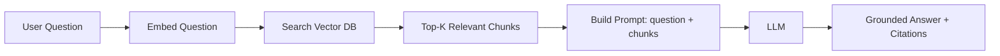
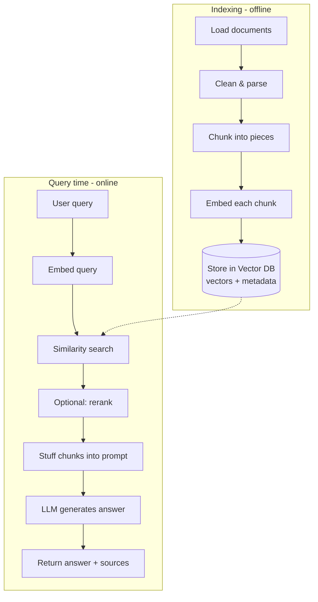

# RAG Interview Questions — Basic Level

> For freshers and early-career AI engineers. These are the warm-up questions. If you can't answer them clearly in under a minute, interviewers assume you haven't built RAG for real. Answers below are written in plain language so the ideas stick.

---

## Q1. What is RAG (Retrieval-Augmented Generation)?

**Simple answer:** RAG is a technique where, before the LLM answers a question, we first *fetch* relevant information from an external knowledge source (like your company documents) and hand it to the model as context. The model then answers using that fetched information instead of relying only on what it memorized during training.

Think of it like an open-book exam. The LLM is a smart student, but instead of forcing it to answer from memory, we let it look up the right page first.

**Why it exists:**
- LLMs have a **knowledge cutoff** — they don't know anything after their training date.
- LLMs don't know your **private/company data**.
- LLMs **hallucinate** (make up confident-sounding but wrong answers) when they don't actually know something.

RAG fixes all three by grounding answers in real, retrievable documents.

**Flow diagram:**



---

## Q2. Why not just fine-tune the model instead of using RAG?

**Simple answer:** They solve different problems, and most real systems use both.

| Use RAG when... | Use Fine-tuning when... |
|---|---|
| Knowledge changes often (news, docs, prices) | You want a specific style/tone/format |
| Data is too large to bake into weights | You need a specialized skill/behavior |
| You need citations and auditability | You want to reduce prompt size/cost |
| You need to add/remove data instantly | Behavior must be consistent every time |

**Rule of thumb:** RAG changes *what the model knows*; fine-tuning changes *how the model behaves*. Updating RAG is as easy as adding a document. Updating a fine-tune means retraining.

---

## Q3. Walk me through the full RAG pipeline.

There are two phases: **Indexing** (done ahead of time) and **Retrieval + Generation** (done at query time).



**The steps in words:**
1. **Ingest** — load PDFs, web pages, database records.
2. **Chunk** — split big documents into smaller pieces.
3. **Embed** — convert each chunk into a vector (list of numbers capturing meaning).
4. **Store** — save vectors + metadata in a vector database.
5. **Retrieve** — embed the user's query, find the most similar chunks.
6. **(Rerank)** — reorder results so the best ones come first.
7. **Generate** — put the chunks + question into a prompt, let the LLM answer.
8. **Cite** — return the sources so the answer is trustworthy.

> **Interview tip:** Never skip "rerank" and "citations" when listing the stages — leaving them out signals you've only done toy demos.

---

## Q4. What is an embedding?

**Simple answer:** An embedding is a list of numbers (a vector) that represents the *meaning* of a piece of text. Texts with similar meaning end up close together in this number-space, even if they use different words.

For example, "How do I reset my password?" and "I forgot my login credentials" use different words but would have embeddings that are close together — because they mean nearly the same thing.

- Typical size: 768 to 3072 dimensions.
- Created by an **embedding model** (e.g., OpenAI `text-embedding-3-small`, `bge`, `e5`).
- This is what makes **semantic search** possible — matching by meaning, not exact keywords.

```python
from openai import OpenAI
client = OpenAI()

def embed(text: str) -> list[float]:
    resp = client.embeddings.create(
        model="text-embedding-3-small",
        input=text,
    )
    return resp.data[0].embedding  # e.g. 1536 numbers

vec = embed("How do I reset my password?")
print(len(vec))  # 1536
```

---

## Q5. What is chunking and why do we do it?

**Simple answer:** Chunking means splitting a large document into smaller pieces before embedding.

**Why we do it:**
- Embedding models and LLMs have **size limits** — you can't embed a 500-page PDF as one vector.
- Smaller chunks give **more precise retrieval** — you get the exact paragraph, not the whole book.
- It controls **cost and latency** — you only send relevant chunks to the LLM, not everything.

**Common chunking strategies:**
| Strategy | How it works | Best for |
|---|---|---|
| Fixed-size | Every N tokens | Simple, uniform text |
| Recursive | Split on paragraphs → sentences | General purpose (most common) |
| Semantic | Group sentences by meaning | High-quality retrieval |
| Sliding window | Overlapping chunks | Preserving cross-chunk context |

**Practical defaults:** 256–512 tokens per chunk with ~50 tokens of overlap for Q&A. Larger (1024–2048) for long-form summarization.

```python
from langchain_text_splitters import RecursiveCharacterTextSplitter

splitter = RecursiveCharacterTextSplitter(
    chunk_size=512,      # tokens/characters per chunk
    chunk_overlap=50,    # overlap keeps context across boundaries
)
chunks = splitter.split_text(long_document)
```

---

## Q6. What is a vector database and why do we need one?

**Simple answer:** A vector database stores embeddings and can very quickly find the vectors most similar to a query vector. Regular databases are great at exact matches ("find user id = 42"), but they're terrible at "find the 5 chunks most similar in *meaning* to this question." Vector DBs are built exactly for that.

**Popular options:** Pinecone (managed), Weaviate, Qdrant, Milvus, Chroma (lightweight), pgvector (Postgres extension).

**When to use which:**
- **Chroma** — quick prototypes on your laptop.
- **pgvector** — you already use Postgres and want one less system.
- **Pinecone / Qdrant / Weaviate** — production scale with millions+ of vectors.

---

## Q7. What is similarity search? What is cosine similarity?

**Simple answer:** Similarity search finds the vectors closest to your query vector. "Closeness" is measured by a distance/similarity metric.

**Cosine similarity** measures the *angle* between two vectors, ignoring their length. A score of 1 = identical direction (very similar), 0 = unrelated, -1 = opposite. It's the most common choice for text embeddings because we care about *direction of meaning*, not magnitude.

| Metric | Measures | When to use |
|---|---|---|
| Cosine | Angle between vectors | Text embeddings (most common) |
| Dot product | Angle + magnitude | When vectors are normalized |
| Euclidean (L2) | Straight-line distance | Some image embeddings |

---

## Q8. What is "top-k" retrieval?

**Simple answer:** Top-k means "return the k most similar chunks." If k=5, you fetch the 5 closest chunks to the query.

- **Small k (3–5):** less noise, lower cost, but might miss context.
- **Large k (10–20):** more coverage, but adds noise and cost, and risks the "lost in the middle" problem (LLMs pay less attention to the middle of a long context).

You usually retrieve a larger k, then **rerank** and keep only the best few.

---

## Q9. How do you keep a RAG system's answers trustworthy?

**Simple answer:** Two habits:
1. **Citations** — always return which document/chunk the answer came from, so users can verify.
2. **Grounding instructions** — tell the model in the system prompt: *"Only answer using the provided context. If the answer isn't there, say you don't know."* This reduces hallucination.

```text
System: You are a support assistant. Answer ONLY using the context below.
If the context does not contain the answer, say "I don't have that information."
Always cite the source document.

Context:
{retrieved_chunks}

Question: {user_question}
```

---

## Q10. Give a real-world use case for RAG. (Use Case)

**Simple answer:** A **customer support chatbot** over a company's help center.

- **Problem:** Support agents answer the same questions repeatedly; a plain LLM doesn't know the company's specific policies.
- **RAG solution:** Index all help articles and policy docs. When a customer asks a question, retrieve the relevant articles and let the LLM answer using them — with links to the source articles.
- **Benefit:** Accurate, up-to-date answers (update a doc → the bot instantly "knows" it), fewer tickets, and every answer is auditable.

**Other common use cases:**
- Internal knowledge assistant ("search all our wikis and Slack").
- Legal/medical document Q&A with citations.
- Product documentation search / developer copilots.
- Financial report analysis.

---

## Quick Coverage Map (what basics touch)
- **Architecture:** pipeline stages (Q3), embeddings (Q4), vector DB (Q6).
- **Security/Trust:** grounding + citations (Q9).
- **Performance:** chunking (Q5), top-k tuning (Q8).
- **Use Case:** support bot and others (Q10).

## Further Reading
- [What is RAG? (AWS)](https://aws.amazon.com/what-is/retrieval-augmented-generation/)
- [Original RAG paper (Lewis et al., 2020)](https://arxiv.org/abs/2005.11401)
- [Pinecone Learning Center](https://www.pinecone.io/learn/)

*Content synthesized from general domain knowledge and current (2025–2026) interview trends; rephrased for compliance with licensing restrictions.*
