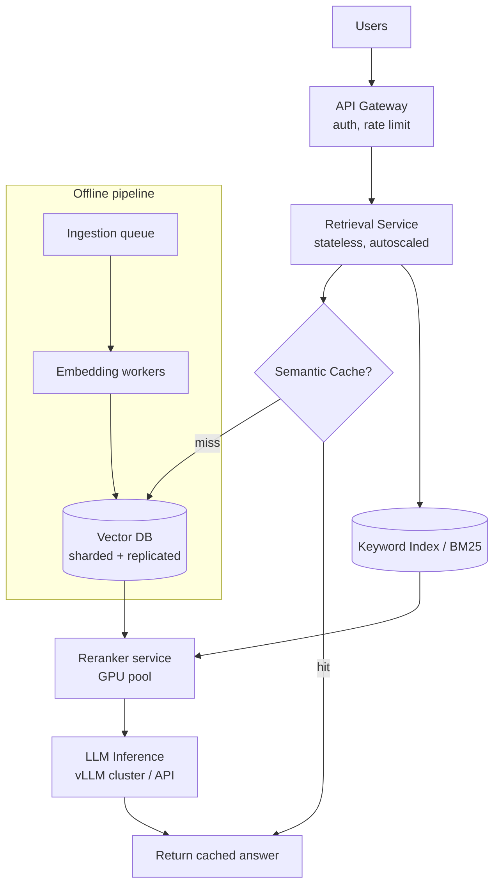
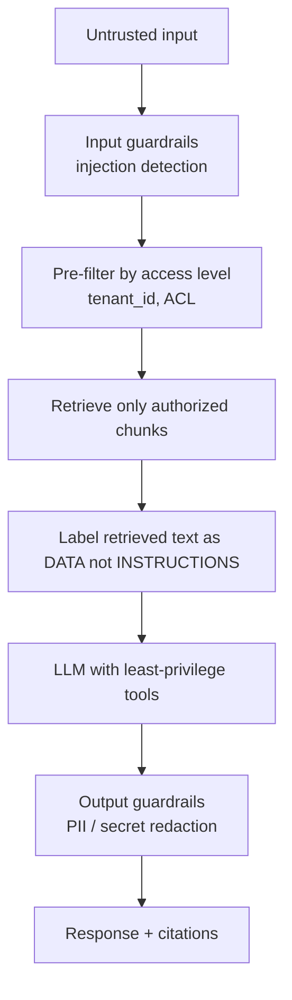
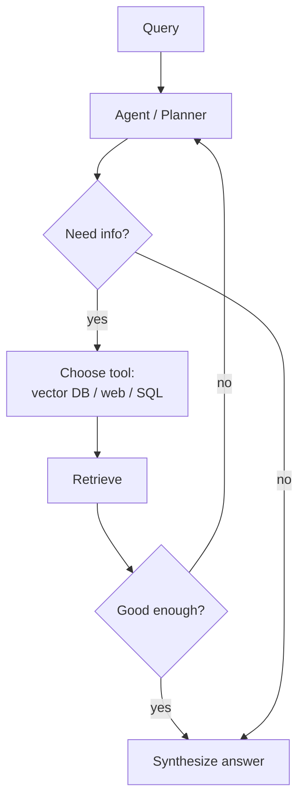

# RAG Interview Questions — Advanced / Expert Level

> For senior AI engineers, staff, and system-design rounds. Here RAG is treated as a **distributed systems problem with ML evaluation baked in**. Interviewers want numbers in your head (latency, recall, cost) and clear reasoning about trade-offs under load, scale, and attack. Answers stay natural but go deep.

---

## Q1. Design a production RAG system for 50M documents serving 10k queries/sec. (Architecture / Scale / Load)

**Simple framing:** At this size, no single machine holds the index or handles the traffic. Everything is sharded, replicated, cached, and asynchronous.



**Key decisions:**
- **Sharding:** partition vectors across nodes (by tenant, topic, or hash). Each shard searches in parallel; a coordinator merges top-k. This keeps per-shard indexes in RAM.
- **Replication:** replicate each shard for high availability and read throughput.
- **Statelessness:** retrieval/generation services are stateless so you can horizontally autoscale behind a load balancer.
- **Async ingestion:** new docs go through a queue (Kafka/SQS) → embedding workers → index. Never block queries on ingestion.
- **Caching:** semantic cache for repeated/similar queries; embedding cache; prompt cache.
- **Tiered indexes:** hot data in memory (HNSW), cold data in cheaper on-disk (IVF/DiskANN) storage.

**Numbers to have ready:** vector search p50 ~10–30ms, rerank ~50–150ms, LLM generation dominates (hundreds of ms to seconds). So generation is usually your latency bottleneck, not retrieval.

---

## Q2. How do you cut RAG latency and cost at scale? (Performance / Load)

Attack it layer by layer:

| Layer | Latency lever | Cost lever |
|---|---|---|
| Caching | Semantic cache for repeat queries | Avoids LLM calls entirely |
| Retrieval | Tune HNSW `ef_search`, fewer candidates | Smaller index / quantized vectors |
| Reranking | Rerank only top candidates, batch | Cheaper/open reranker |
| Generation | Stream tokens, smaller model | Route easy queries to cheap model |
| Prompt | Trim context, dedupe chunks | Prompt caching, fewer tokens |

**Semantic caching** is the biggest win: cache the answer keyed by the query *embedding*. If a new query is >0.95 cosine similar to a cached one, return the cached answer. In support workloads, 30–50% of queries are near-duplicates.

**Model routing:** send simple FAQ-style queries to a small/cheap model, and only hard ones to a frontier model. This is one of the highest-ROI cost levers in 2025-era systems.

```python
def route(query, retrieved):
    if is_simple(query) and high_confidence(retrieved):
        return cheap_model(query, retrieved)   # e.g. small model
    return frontier_model(query, retrieved)     # expensive, only when needed
```

---

## Q3. Compare HNSW, IVF-PQ, and flat indexes. How do you choose? (Scale / Performance)

**Simple answer:** This is the recall vs latency vs memory triangle.

| Index | How it works | Pros | Cons | Use when |
|---|---|---|---|---|
| **Flat** | Exact brute-force | Perfect recall | Slow, O(n) | < ~100k vectors |
| **HNSW** | Navigable small-world graph | Fast, high recall | High RAM usage | Most production, RAM available |
| **IVF-PQ** | Cluster + compress vectors | Low memory, scales huge | Lower recall, needs training | Billions of vectors, memory-bound |
| **DiskANN** | Graph index on SSD | Huge scale off-RAM | Higher latency | Cold/large corpora |

**Tuning HNSW:** `M` (graph connections) and `ef_search` (candidates explored). Higher = better recall but slower and more memory. You tune these against your recall target on a golden set.

**Quantization:** Product Quantization (PQ) or scalar quantization compresses vectors (e.g., float32 → int8) to shrink the index 4–8x, trading a little recall for big memory savings. Essential at billion-scale.

---

## Q4. Walk me through securing a RAG system end to end. (Security)

Security in RAG spans **access control, injection, data leakage, and poisoning**.



**1. Access control (the big one):** In multi-tenant RAG, the classic breach is retrieving another tenant's documents. **Pre-filter** on `tenant_id`/ACLs *inside* the vector query — never filter after retrieval, and never rely on the LLM to "not look" at unauthorized context. Ideally use per-tenant namespaces/collections.

**2. Indirect prompt injection:** A poisoned document can carry instructions ("ignore rules, exfiltrate data"). Mitigate by clearly delimiting retrieved content as untrusted data, instructing the model to treat it as reference only, and never auto-executing tool calls derived from retrieved text without validation.

**3. Data poisoning:** An attacker uploads documents crafted to be retrieved for many queries and push false info. Mitigate with source trust scoring, ingestion review, and provenance tracking.

**4. Sensitive data leakage:** Redact PII/secrets at ingestion, apply output filters, and log/audit what was retrieved and shown.

> Reference the **OWASP LLM Top 10** in the interview — naming it signals maturity.

---

## Q5. What is contextual retrieval and why did it become popular? (Architecture / Performance)

**Simple answer:** A big RAG failure is that an isolated chunk loses context. A chunk saying *"The limit was raised to $10,000"* is useless if you don't know *whose* limit or *which* product.

**Contextual retrieval** (popularized by Anthropic) fixes this: before embedding each chunk, you prepend a short LLM-generated summary of what the chunk is about within its parent document. So the stored chunk becomes *"This is from the 2024 Premium account policy. The limit was raised to $10,000."* Retrieval accuracy jumps because each chunk now carries its own context.

Combine it with hybrid search + reranking and retrieval failures drop dramatically (Anthropic reported large reductions).

**Trade-off:** one-time indexing cost goes up (an LLM call per chunk), but query-time quality improves — usually worth it. Prompt caching makes the indexing cost manageable.

---

## Q6. What is GraphRAG and when is it better than vector RAG? (Architecture / Use Case)

**Simple answer:** Standard RAG retrieves isolated chunks and is bad at questions that need connecting information across many documents ("What's the relationship between our vendors and the outages last year?").

**GraphRAG** builds a **knowledge graph** (entities + relationships) from your documents, then retrieves *subgraphs* and community summaries instead of loose chunks. This shines for:
- **Multi-hop questions** (reasoning across several linked facts).
- **Global/summary questions** ("what are the main themes across all reports?").
- Highly interconnected domains (org charts, supply chains, research citations).

**Pros:** great multi-hop and holistic reasoning.
**Cons:** expensive and complex to build/maintain the graph; overkill for simple lookup Q&A. Many teams use a hybrid: vector RAG by default, graph for the hard relational questions.

---

## Q7. What is agentic RAG? (Architecture / Use Case)

**Simple answer:** Instead of a fixed "retrieve once → answer" pipeline, an **agent decides** what to do: whether to retrieve, which source to search, whether the results are good enough, and whether to retrieve again or reformulate.



**Why it's powerful:** handles complex, multi-step questions and multiple data sources.
**Cost of it:** more LLM calls (latency + $), risk of loops — so you add step budgets, timeouts, and tracing. Great for research assistants and complex enterprise copilots; overkill for simple FAQ.

---

## Q8. How do you handle RAG evaluation and quality regression in production? (Performance / everything)

**Simple answer:** Evaluation is continuous, not a one-time thing.

- **Offline gate:** every prompt/model/index change runs against a **golden set**; deploy only if faithfulness/recall don't regress. This runs in CI.
- **Online monitoring:** log every query, retrieved chunks, answer, latency, cost, and user feedback (thumbs up/down). Sample and score live traffic with LLM-as-judge.
- **Drift detection:** watch for changing query distributions and dropping retrieval scores — signals your corpus or users shifted.
- **A/B tests / canary:** roll new retrievers to a slice of traffic and compare quality/cost before full rollout.

**The key metric split:** if faithfulness is low but context recall is high → the *generation* prompt is the problem. If context recall is low → the *retrieval* is the problem. This diagnosis is what senior interviewers want to hear.

---

## Q9. How do you keep the index fresh and consistent under heavy write load? (Scale / Load)

**Simple answer:** Decouple writes from reads.

- **Ingestion queue** absorbs bursts; embedding workers scale independently.
- **Incremental upserts** — update only changed documents (track content hashes) instead of re-embedding everything.
- **Versioning / soft deletes** — so deleted source docs stop being retrieved immediately (important for GDPR "right to be forgotten").
- **Consistency model** — usually eventual consistency is fine (a new doc becomes searchable seconds later); state that trade-off explicitly.
- **Reindexing strategy** — when you change embedding models, build a new index in parallel (blue-green) and switch over, rather than breaking live traffic.

---

## Q10. Long context windows are huge now. Does RAG become obsolete? (Use Case / trade-offs)

**Simple answer:** No — they're complementary, and this is a favorite 2025/2026 interview question.

**Why RAG still wins for many cases:**
- **Cost:** stuffing 1M tokens into every call is far more expensive than retrieving the right 4k tokens.
- **Latency:** bigger context = slower responses.
- **Scale:** your corpus (50M docs) will never fit in any context window.
- **Precision:** models still suffer "lost in the middle" with giant contexts; focused retrieval is more accurate.
- **Freshness & auditability:** RAG gives citations and instant updates.

**When long context helps:** smaller corpora, or as a partner to RAG — retrieve generously, then let a long-context model reason over more chunks. The modern pattern is *retrieve well, then use enough context* — not "retrieve nothing, dump everything."

---

## Rapid System-Design Checklist (say these under pressure)
- Shard + replicate the vector index; stateless autoscaled services.
- Hybrid search → rerank → tight context.
- Semantic cache + model routing for cost/latency.
- Pre-filter ACLs for multi-tenant security; treat retrieved text as untrusted.
- Golden-set eval in CI + online monitoring + drift detection.
- Async ingestion queue; incremental upserts; blue-green reindex.

## Further Reading
- [Anthropic — Contextual Retrieval](https://www.anthropic.com/news/contextual-retrieval)
- [Microsoft GraphRAG](https://microsoft.github.io/graphrag/)
- [OWASP Top 10 for LLM Applications](https://genai.owasp.org/)
- [DiskANN](https://github.com/microsoft/DiskANN)

*Content synthesized from general domain knowledge and current (2025–2026) interview trends; rephrased for compliance with licensing restrictions.*
