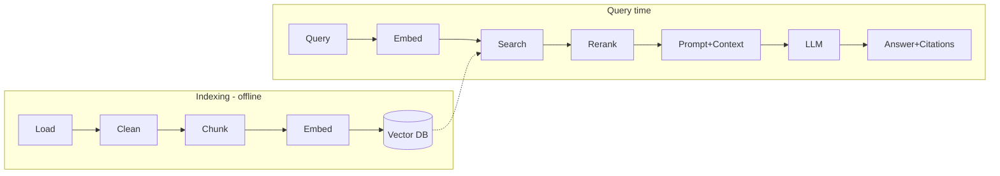

# RAG Cheatsheet

> One-page quick reference for RAG. Skim this the night before an interview or before designing a system.

---

## The Pipeline in One Diagram



**Mnemonic:** *Load → Chunk → Embed → Store → Retrieve → Rerank → Generate → Cite.*

---

## Core Decisions At A Glance

| Decision | Default | Notes |
|---|---|---|
| Chunk size | 256–512 tokens | 1024–2048 for long-form synthesis |
| Chunk overlap | ~50 tokens (10–15%) | Preserves cross-chunk context |
| Chunking method | Recursive | Semantic for higher quality |
| Embedding model | `text-embedding-3-large`, `bge`, `e5` | Benchmark on your data (MTEB) |
| Similarity metric | Cosine | Dot product if normalized |
| Retrieval `k` | Fetch 20–50 → rerank → keep 3–5 | Avoid stuffing everything |
| Index (ANN) | HNSW | IVF-PQ / DiskANN at billion-scale |
| Search | Hybrid (dense + BM25) | Fuses meaning + exact terms |
| Rerank | Cross-encoder / Cohere Rerank | On the shortlist only |

---

## Retrieval Quality Toolbox

| Technique | What it fixes |
|---|---|
| **Hybrid search** | Semantic misses exact IDs/keywords |
| **Reranking** | Bi-encoder recall is approximate |
| **Query rewriting** | Vague / conversational queries |
| **Multi-query** | Single phrasing misses relevant docs |
| **HyDE** | Short query far from real docs |
| **Contextual retrieval** | Chunks lose their document context |
| **Parent-document** | Small chunk retrieves, big chunk answers |
| **Metadata filtering** | Scope by tenant/date/type (+ security) |

---

## Score Fusion (RRF)

```python
def rrf(*ranked_lists, k=60):
    scores = {}
    for lst in ranked_lists:
        for rank, doc in enumerate(lst):
            scores[doc] = scores.get(doc, 0) + 1/(k + rank)
    return sorted(scores, key=scores.get, reverse=True)
```

---

## Evaluation Metrics

| Layer | Metrics | Tools |
|---|---|---|
| **Retrieval** | Recall@k, Precision@k, MRR, nDCG | custom, BEIR |
| **Generation** | Faithfulness, Answer relevance, Context precision/recall | RAGAS, DeepEval, TruLens |
| **Diagnosis** | Low faithfulness + high recall → prompt problem; low recall → retrieval problem | — |

**Rule:** Gate deploys on a **golden set** in CI. A demo "looking good" is not evaluation.

---

## RAG vs Fine-tuning vs Long Context

| | RAG | Fine-tuning | Long context |
|---|---|---|---|
| Adds | Knowledge | Behavior/style | Everything in one call |
| Updates | Instant (edit docs) | Slow (retrain) | Instant |
| Cost | Medium | High upfront | High per call |
| Best for | Changing/private facts | Tone/format/skill | Small corpora |

Modern pattern: **retrieve well, then use enough context** (+ fine-tune for style if needed).

---

## Security Checklist

- [ ] **Pre-filter** ACL/`tenant_id` *inside* the vector query (never post-filter for security).
- [ ] Treat retrieved text as **untrusted data**, not instructions (indirect prompt injection).
- [ ] Don't auto-execute tools from retrieved content without validation.
- [ ] Redact PII/secrets at ingestion + output guardrails.
- [ ] Track provenance / source trust (data poisoning).
- [ ] Audit-log what was retrieved and shown.

---

## Production Scaling Levers

| Goal | Lever |
|---|---|
| Lower latency | Semantic cache, fewer candidates, stream tokens, smaller model |
| Lower cost | Semantic + prompt cache, model routing, trim context |
| Scale corpus | Shard + replicate index, quantize vectors, tiered (hot RAM / cold disk) |
| Handle writes | Async ingestion queue, incremental upserts, blue-green reindex |
| High availability | Stateless autoscaled services, replicated shards |

**Latency intuition:** vector search ~10–30ms, rerank ~50–150ms, **LLM generation dominates**.

---

## Minimal RAG (code skeleton)

```python
# Index
chunks = splitter.split_text(doc)
db.add(embeddings=[embed(c) for c in chunks], metadatas=metas, ids=ids)

# Query
hits = db.query(embed(query), k=20, where={"tenant_id": tid})
top = rerank(query, hits)[:5]
prompt = f"Answer ONLY from context. Cite sources.\nContext:\n{top}\nQ: {query}"
answer = llm(prompt)
```

---

## Red Flags To Avoid
- Stuffing 20+ chunks → "lost in the middle."
- No reranking, no citations.
- Post-filtering for access control.
- No evaluation / no golden set.
- Fine-tuning to "teach facts" (facts change — use RAG).

*Rephrased for compliance with licensing restrictions. See interview-prep files for full explanations.*
