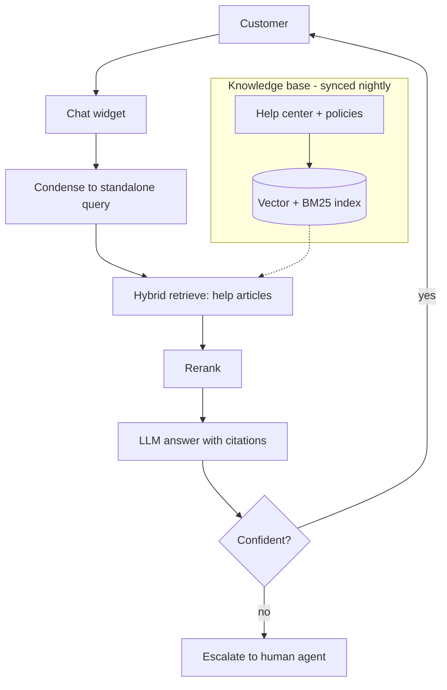
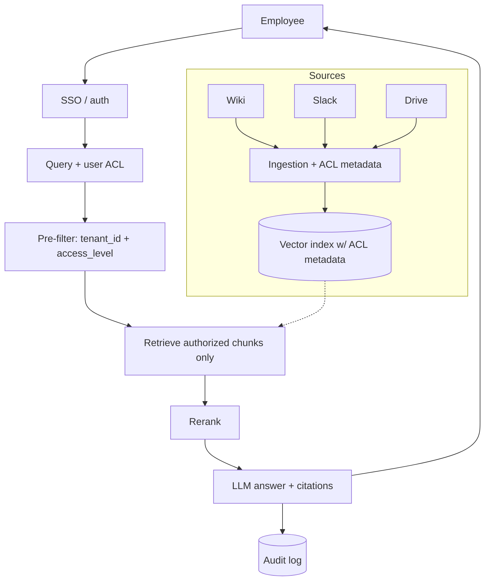
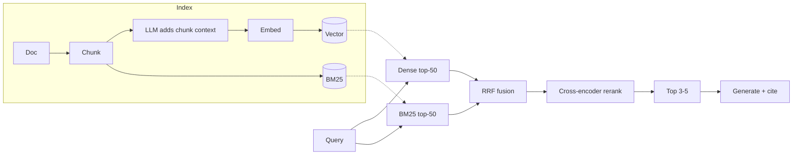
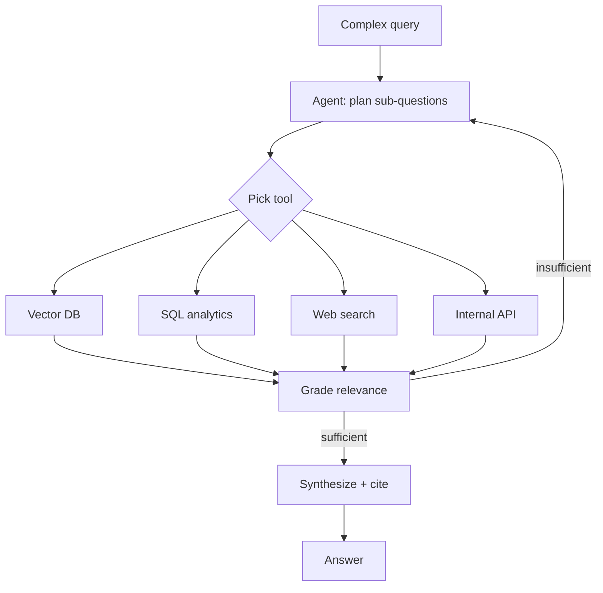
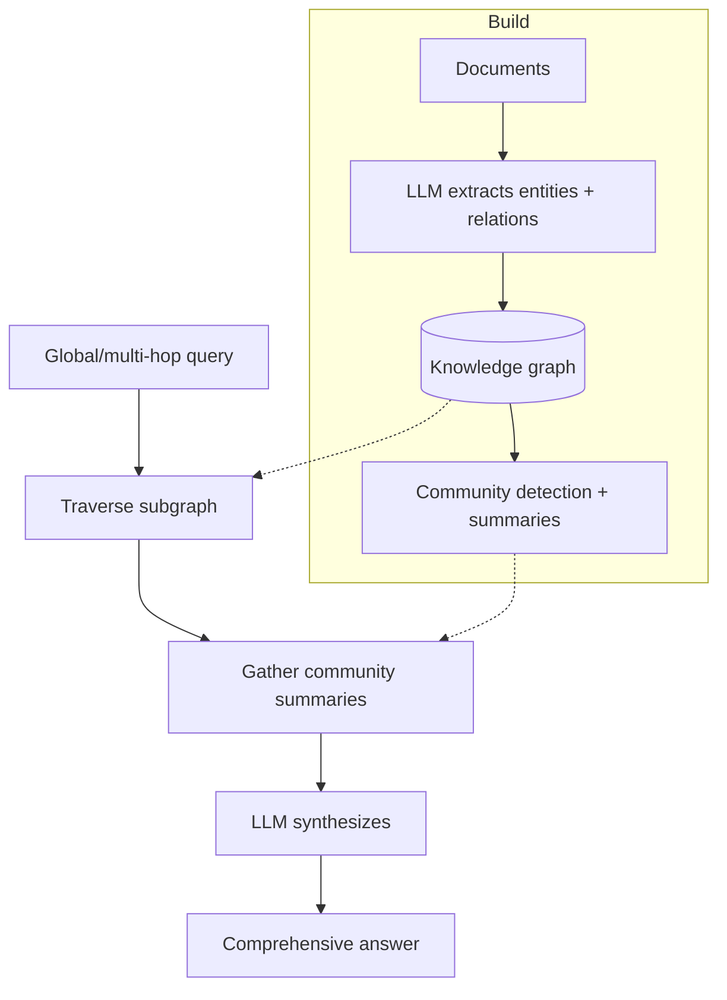
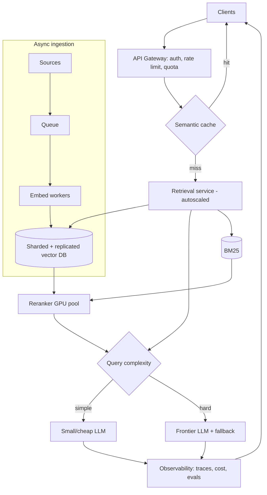
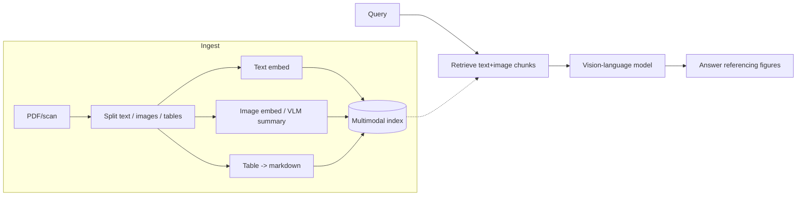
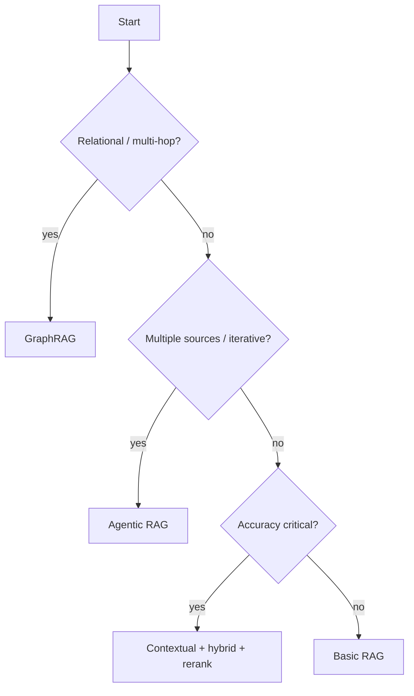

# RAG — Use Case Diagrams

> Visual architectures for common RAG use cases. GitHub renders Mermaid automatically, so these display as diagrams. Each includes the problem, the flow, and the key design notes an interviewer will probe.

---

## 1. Customer Support Assistant (classic RAG)

**Problem:** Customers ask repetitive questions; a plain LLM doesn't know company policies.

**Design notes:** conversation condensation for follow-ups; escalation path on low confidence; nightly re-index; citations link to help articles.

---

## 2. Enterprise Knowledge Assistant (multi-tenant, secured)

**Problem:** Employees want to search across wikis, Slack, Drive — but only what they're allowed to see.

**Design notes:** ACL pre-filtering inside the query (never post-filter); per-source connectors capture permissions; full audit trail for compliance.

---

## 3. Contextual RAG with Reranking (high-accuracy pipeline)

**Problem:** Naive top-5 vector search misses or misranks the right chunk.

**Design notes:** contextual chunks + hybrid + RRF + cross-encoder reranking is the current high-accuracy default (largest measured accuracy lifts).

---

## 4. Agentic RAG (multi-source, self-correcting)

**Problem:** Complex questions need multiple sources and iterative retrieval.

**Design notes:** add step budget, timeout, and tracing to prevent loops and runaway cost; grading step = Corrective/Self-RAG idea.

---

## 5. GraphRAG (relational / multi-hop questions)

**Problem:** "How are our vendors connected to last year's outages?" — needs relationships, not isolated chunks.

**Design notes:** best comprehensiveness for entity-rich/global queries; ~2.3–2.4× latency and heavy build cost — reserve for questions vector RAG can't answer.

---

## 6. Production RAG SaaS (full system, at scale)

**Problem:** Serve many tenants, high QPS, with cost/latency control and observability.

**Design notes:** semantic cache first; model routing for cost; sharded/replicated index; async ingestion; end-to-end observability + online evals; provider fallback for reliability.

---

## 7. Multimodal RAG (docs with images/tables)

**Problem:** Answers live in diagrams, scanned invoices, or tables — not plain text.

**Design notes:** use multimodal embeddings or summarize images/tables into text; answer with a VLM; cite the specific figure/page.

---

## Choosing a pattern (quick guide)

*Diagrams synthesized from general domain knowledge and current best practices; rephrased for compliance with licensing restrictions.*
