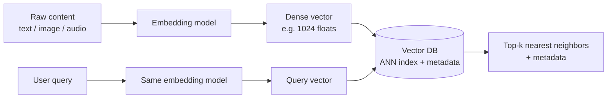
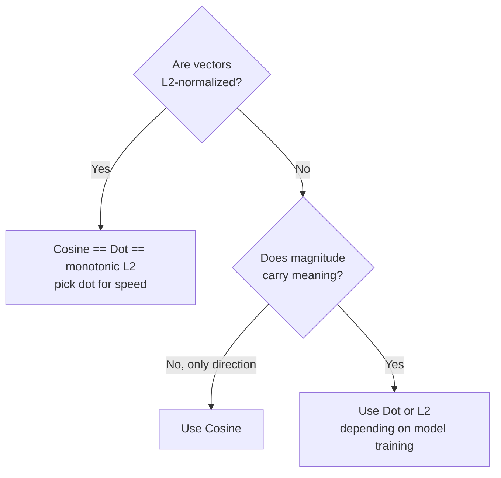
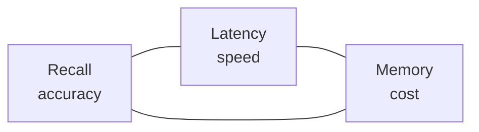
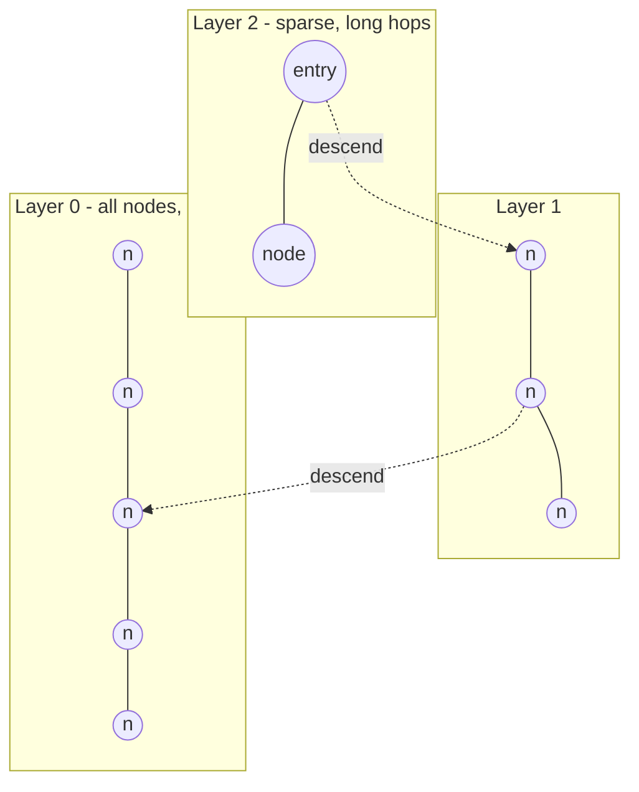
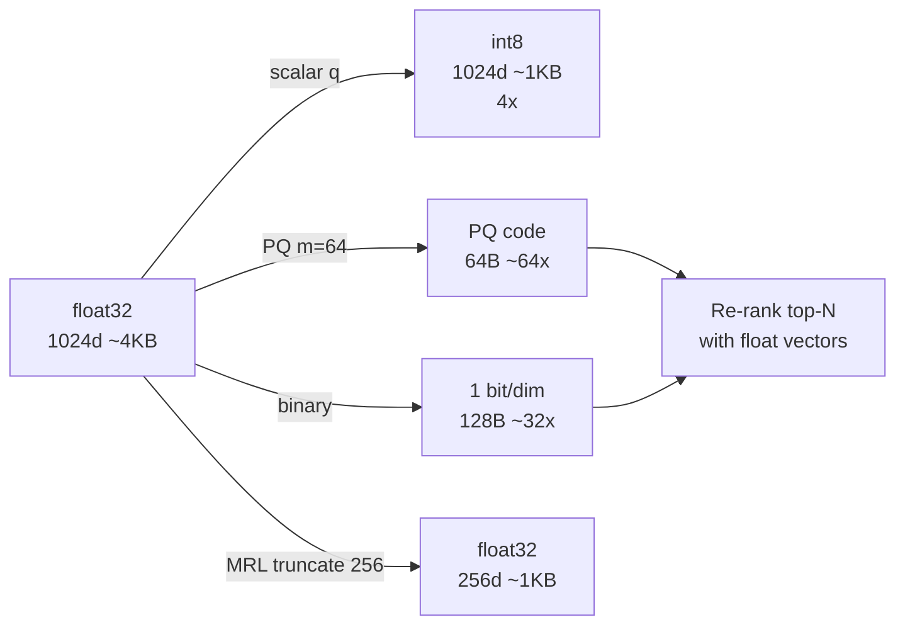
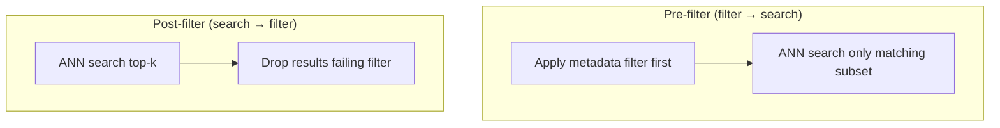
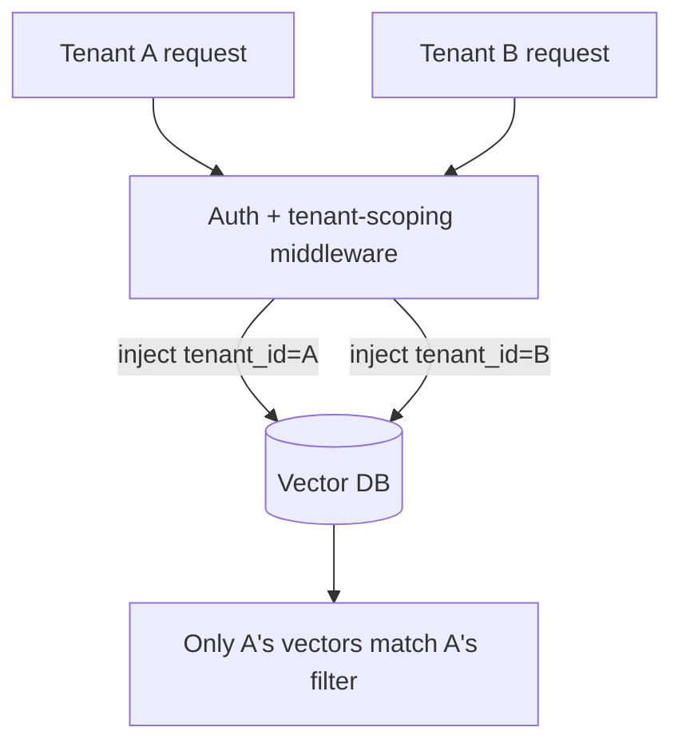
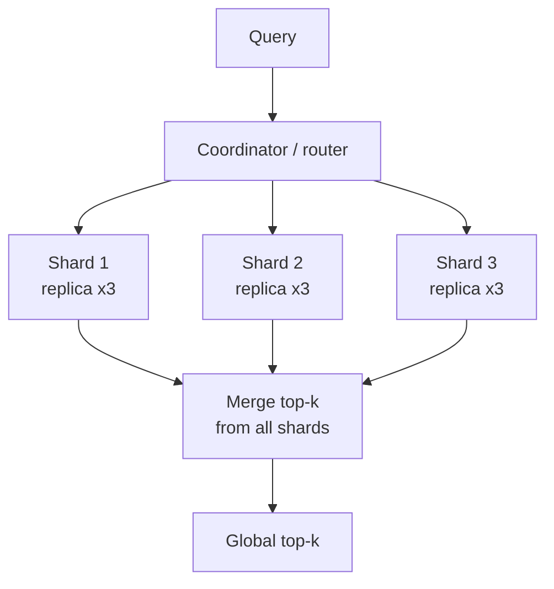
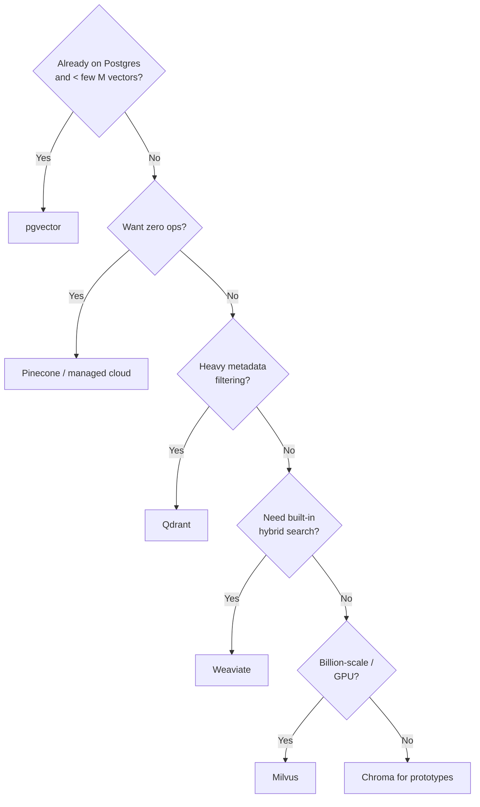

# Vector Databases — Detailed Learning Guide

> A deep, interview-ready guide to embeddings, similarity, ANN indexes, quantization,
> filtering, hybrid search, and running vector search at scale. Written to clear the
> toughest AI-engineer interviews at big companies and frontier labs.

---

## Table of Contents

1. [Why Vector Databases Exist](#1-why-vector-databases-exist)
2. [Embeddings: The Foundation](#2-embeddings-the-foundation)
3. [Similarity Metrics: Cosine vs Dot vs L2](#3-similarity-metrics-cosine-vs-dot-vs-l2)
4. [Exact vs Approximate Search (the core trade-off)](#4-exact-vs-approximate-search)
5. [ANN Index Families](#5-ann-index-families)
   - [Flat (brute force)](#51-flat-brute-force)
   - [HNSW (graph)](#52-hnsw-graph-based)
   - [IVF (inverted file / clustering)](#53-ivf-inverted-file)
   - [IVF-PQ (clustering + compression)](#54-ivf-pq)
   - [DiskANN (SSD-resident graph)](#55-diskann)
6. [Quantization: Scalar, PQ, Binary, Matryoshka](#6-quantization)
7. [Metadata & Filtering: Pre vs Post](#7-metadata--filtering)
8. [Hybrid Search + Reciprocal Rank Fusion](#8-hybrid-search--rrf)
9. [Multi-Tenancy & Security](#9-multi-tenancy--security)
10. [Sharding, Replication & Scaling](#10-sharding-replication--scaling)
11. [Consistency, Upserts & Freshness](#11-consistency-upserts--freshness)
12. [Choosing a Vector Database](#12-choosing-a-vector-database)
13. [Failure Modes & Debugging](#13-failure-modes--debugging)
14. [Interview Cheat Lines](#14-interview-cheat-lines)
15. [Further Reading](#15-further-reading)

---

## 1. Why Vector Databases Exist

Traditional databases answer *exact* questions: "give me the row where `id = 42`" or
"all orders where `status = 'shipped'`". They index scalar values with B-trees and hash
maps. But a huge class of modern AI problems is about **similarity, not equality**:

- "Find documents that *mean* the same thing as this query" (semantic search / RAG).
- "Find products that *look* like this image."
- "Find users whose behavior *resembles* this one" (recommendations).
- "Detect near-duplicate or anomalous items."

Similarity lives in a *geometric* space. We convert content into high-dimensional
vectors (embeddings) where **semantic closeness becomes geometric closeness**. A vector
database is a system purpose-built to store millions-to-billions of these vectors and
answer *nearest-neighbor* queries fast, while still supporting metadata filters,
updates, persistence, replication, and access control.



**The senior insight:** a vector DB is *not* magic and *not* just "Pinecone." It is an
ANN index (an algorithm) wrapped in a distributed data system (durability, sharding,
filtering, auth). The embedding model choice usually matters *more* than the database
choice — a great index over bad embeddings still returns bad results.

---

## 2. Embeddings: The Foundation

An **embedding** is a fixed-length list of floating-point numbers produced by a model
that has learned to map "similar meaning" to "nearby points." Typical dimensions today
range from 256 to 4096 (e.g., 384 for `all-MiniLM`, 768 for `bge-base`, 1536/3072 for
OpenAI `text-embedding-3`, 1024 for many Cohere/Voyage models).

Key properties to understand:

- **Same model for indexing and querying.** You must embed documents and queries with
  the *same* model; mixing models puts vectors in incompatible spaces.
- **Use the metric the model was trained for.** Most sentence/text models are trained
  with cosine similarity; image models sometimes use L2. Using the wrong metric quietly
  degrades recall.
- **Normalization.** If you L2-normalize vectors (unit length), dot product and cosine
  become equivalent, and Euclidean distance becomes a monotonic function of cosine. Many
  systems normalize on ingest so they can use the fast dot-product path.
- **Dimensionality is a cost knob.** More dimensions ≈ more expressive but more memory,
  slower distance math, and more susceptible to the "curse of dimensionality." Matryoshka
  models (Section 6) let you truncate dimensions to trade quality for cost.

```python
# Producing and normalizing embeddings (sentence-transformers)
from sentence_transformers import SentenceTransformer
import numpy as np

model = SentenceTransformer("BAAI/bge-small-en-v1.5")  # 384-dim, cosine-trained

def embed(texts):
    # normalize_embeddings=True => unit vectors, so dot product == cosine similarity.
    # WHY: lets the index use the cheap dot-product kernel and keeps scores in [-1, 1].
    return model.encode(texts, normalize_embeddings=True)

vecs = embed(["a fluffy dog on a sofa", "a canine resting on a couch"])
print(np.dot(vecs[0], vecs[1]))  # high (~0.8+): paraphrases land close together
```

**Chunking matters.** In RAG you rarely embed whole documents; you split into chunks
(e.g., 256–1024 tokens with overlap). Chunk too big and the embedding averages away the
detail you need; chunk too small and you lose context. Chunking strategy affects recall
as much as the index.

---

## 3. Similarity Metrics: Cosine vs Dot vs L2

Three metrics dominate. Understanding *when* each applies is a classic interview probe.

| Metric | Formula (intuition) | Sensitive to magnitude? | Typical use |
|---|---|---|---|
| **Cosine similarity** | angle between vectors, `a·b / (‖a‖‖b‖)` | No (direction only) | Text semantic search (most common) |
| **Dot product** | `a·b` | Yes | Normalized vectors, or when magnitude encodes importance (some recsys) |
| **Euclidean (L2)** | straight-line distance `‖a−b‖` | Yes | Image embeddings, clustering, when absolute position matters |



**Gotchas:**
- Cosine ignores magnitude. If your embeddings encode "confidence" or "popularity" in
  their length, cosine throws that away — dot product keeps it.
- Dot product on *un*normalized vectors can be dominated by a few long vectors ("hub"
  problem), skewing recall.
- Distance vs similarity sign conventions differ across libraries (some minimize L2, some
  maximize cosine). Always confirm whether "lower is better" or "higher is better."

---

## 4. Exact vs Approximate Search

The naïve approach — compare the query to *every* stored vector — is **exact** (perfect
recall) but **O(N·d)** per query. At 100M vectors × 1024 dims that is tens of billions of
float multiplies per query. It does not scale.

So production systems use **Approximate Nearest Neighbor (ANN)** search: data structures
that examine only a small fraction of candidates, accepting slightly imperfect results in
exchange for orders-of-magnitude speedups.

The governing trade space has three axes; you can optimize any two at the expense of the
third:



- **Recall@k**: fraction of the true top-k neighbors the ANN search actually returns.
  This is the quality metric you track (e.g., recall@10 = 0.98).
- **Latency / QPS**: p50/p95/p99 query time and throughput.
- **Memory / cost**: RAM footprint (HNSW is hungry), or SSD (DiskANN), plus build time.

Everything below is a different point in this trade space.

---

## 5. ANN Index Families

### 5.1 Flat (brute force)

Stores raw vectors and scans all of them. **Exact**, zero recall loss, trivial to build,
supports immediate inserts. But query cost grows linearly with N.

- **Use when:** < ~50k–100k vectors, or as a ground-truth baseline to measure the recall
  of an approximate index, or for a re-ranking stage over a small candidate set.
- **Avoid when:** large corpora with tight latency budgets.

```python
import faiss, numpy as np
d = 384
index = faiss.IndexFlatIP(d)          # inner product (cosine on normalized vecs)
index.add(np.random.rand(10000, d).astype("float32"))
D, I = index.search(query.reshape(1, -1), 10)  # exact top-10
```

### 5.2 HNSW (graph-based)

**Hierarchical Navigable Small World** builds a multi-layer proximity graph. Upper layers
have few nodes with long-range links (express lanes); lower layers are dense with
short-range links. Search starts at the top, greedily hops toward the query, and descends.



Tuning knobs:

| Param | Meaning | Higher value → |
|---|---|---|
| `M` | max neighbors per node (graph degree) | better recall, more memory, slower build |
| `ef_construction` | candidate list size during build | better graph quality, slower build |
| `ef_search` (`ef`) | candidate list size at query time | better recall, higher latency |

- **Pros:** excellent recall at low latency; great for real-time, in-memory workloads;
  supports incremental inserts.
- **Cons:** high RAM (stores full vectors + graph edges); slower to build; deletions are
  awkward (usually tombstoned then rebuilt); memory cost explodes at billion scale.
- **Rule of thumb:** `M` 16–64, `ef_construction` 100–400, tune `ef_search` at query time
  to hit your recall target (e.g., start 64, raise until recall@10 ≥ target).

```python
index = faiss.IndexHNSWFlat(d, 32)      # M = 32
index.hnsw.efConstruction = 200
index.add(vectors)
index.hnsw.efSearch = 128                # raise for recall, lower for latency
D, I = index.search(query, 10)
```

### 5.3 IVF (inverted file)

**IVF** partitions the space into `nlist` clusters (via k-means) each with a centroid. At
query time you only search the `nprobe` clusters whose centroids are closest to the query,
skipping the rest.

- Knobs: `nlist` (number of clusters; ~`sqrt(N)` to `4·sqrt(N)` is a common start) and
  `nprobe` (clusters scanned per query — the recall/latency dial).
- **Pros:** far less memory than HNSW; fast to build; scales well; good with GPUs.
- **Cons:** recall depends on `nprobe`; edge queries near cluster boundaries can miss
  neighbors; needs a *training* step (k-means) so it isn't purely incremental.
- **Failure mode:** `nprobe` too low → recall cliff; too high → you approach brute force.

```python
quantizer = faiss.IndexFlatIP(d)
index = faiss.IndexIVFFlat(quantizer, d, 4096)  # nlist = 4096
index.train(training_vectors)                    # k-means to learn centroids
index.add(vectors)
index.nprobe = 32                                # recall/latency dial
```

### 5.4 IVF-PQ

Combines IVF partitioning with **Product Quantization** (Section 6) to *compress* the
vectors. Instead of storing 1024 floats (4 KB) per vector, PQ stores a short code (e.g.,
32–64 bytes) — a 20–100× memory reduction. This is the workhorse for **billion-scale**
search where HNSW's RAM cost is prohibitive.

- **Pros:** massive memory savings → billions of vectors on a few machines; cheap.
- **Cons:** PQ is lossy → lower raw recall; almost always paired with a **re-rank** step
  that re-scores the top candidates using full-precision vectors.
- **Pattern:** IVF-PQ for the coarse recall pass → fetch exact vectors for top ~200 →
  re-rank exactly → return top-k. Recover most of the lost recall at low cost.

```python
m = 64                                   # PQ subquantizers (code length in bytes)
index = faiss.IndexIVFPQ(quantizer, d, 4096, m, 8)  # 8 bits per subquantizer
index.train(training_vectors)
index.add(vectors)
index.nprobe = 48
```

### 5.5 DiskANN

**DiskANN** is a graph index (like HNSW in spirit) engineered so most of the graph and
vectors live on **SSD** rather than RAM, keeping only a compressed representation and a
navigation cache in memory. It targets the case where the dataset is too big to keep
fully in RAM but you still want graph-quality recall.

- **Pros:** billion-scale on a *single* machine; dramatically cheaper than sharded
  in-RAM HNSW (reports of 40× RAM reduction); good recall.
- **Cons:** relies on fast NVMe SSD; higher and more variable latency than pure in-memory
  HNSW; more complex to operate; build is heavy.
- **Use when:** huge corpus, cost-sensitive, willing to trade some tail latency for a much
  smaller RAM bill.

**Family summary:**

| Index | Recall | Latency | Memory | Build | Best for |
|---|---|---|---|---|---|
| Flat | perfect | high (O(N)) | high (raw) | none | small sets, ground truth, re-rank |
| HNSW | very high | very low | **high** | medium | real-time, in-memory, < ~100M |
| IVF-Flat | tunable | low–med | medium | fast | mid scale, GPU, memory-aware |
| IVF-PQ | med (↑ w/ rerank) | low | **very low** | medium | billion-scale, cost-bound |
| DiskANN | high | med (SSD) | low RAM | heavy | billion-scale on one box |

---

## 6. Quantization

Quantization shrinks each vector so more fit in RAM/SSD and distance math runs faster. It
is the single biggest lever for cost at scale (reports of ~80% cost cuts).

### Scalar Quantization (SQ)
Map each `float32` dimension to an `int8` (or `float16`). ~4× smaller, tiny recall loss,
simple. Great default first step.

### Product Quantization (PQ)
Split the vector into `m` sub-vectors; run k-means on each sub-space to build a codebook
of 256 centroids; store each sub-vector as a 1-byte centroid id. A 1024-dim float vector
(4096 bytes) becomes `m` bytes (e.g., 64). Distances are approximated via precomputed
lookup tables. Very high compression, lossy → pair with re-ranking. **OPQ** adds a
learned rotation first to reduce error.

### Binary Quantization (BQ)
Reduce each dimension to a single bit (sign). ~32× smaller; distance = Hamming (XOR +
popcount) which is blazing fast. Big recall hit on its own, so use it as a **coarse
filter**: binary search to get candidates, then re-rank with int8/float. Works best on
high-dimensional models trained/robust to it.

### Matryoshka Representation Learning (MRL)
Some models (Voyage-3.x, OpenAI `text-embedding-3`, `nomic`) are trained so the *first*
K dimensions of the vector are themselves a valid embedding. You can **truncate** a
1024-dim vector to 512/256/128 and still get meaningful similarity — a free dimensionality
dial. Combine with quantization for compounding savings (e.g., truncate to 512 dims +
int8 = ~8× smaller with modest quality loss).



**Interview line:** "Quantize aggressively for the *candidate* stage, then re-rank the
top ~100–200 with full-precision vectors. You keep most of the recall while paying only a
fraction of the memory."

---

## 7. Metadata & Filtering

Real queries are rarely "just similarity." They are "similar docs **where** `tenant_id =
X` **and** `lang = 'en'` **and** `date > 2024`." How the DB combines the filter with ANN
search hugely affects both correctness and latency.



- **Pre-filter:** restrict the candidate set, *then* run ANN. Correct results, but naive
  implementations break the ANN graph/cluster assumptions (you may have to scan more of
  the graph, hurting latency). Best when the filter is very selective. Qdrant's payload
  indexes and "filterable HNSW" are designed to make this efficient.
- **Post-filter:** run ANN for top-k, *then* drop non-matching results. Fast, but if the
  filter is selective you may return far fewer than k (or zero) results — you searched the
  wrong neighborhood. Mitigate by over-fetching (ask for `k * overfetch`).
- **Best practice:** index the metadata fields you filter on; use pre-filter for selective
  predicates, post-filter (with over-fetch) for loose ones. Some engines dynamically pick.

```python
# Qdrant example: filter is pushed into the ANN traversal (efficient pre-filter)
from qdrant_client import QdrantClient
from qdrant_client.models import Filter, FieldCondition, MatchValue

client.search(
    collection_name="docs",
    query_vector=qv,
    query_filter=Filter(must=[FieldCondition(key="tenant_id", match=MatchValue(value="acme"))]),
    limit=10,
)
```

---

## 8. Hybrid Search + RRF

Dense vector search captures *meaning* but can miss exact terms (product codes, names,
rare acronyms). Sparse keyword search (**BM25**) nails exact terms but misses paraphrases.
**Hybrid search** runs both and fuses the results — consistently beating either alone
(e.g., ~7% NDCG lift on e-commerce benchmarks, and 25–40% recall gains reported in some
RAG setups).

The robust fusion method is **Reciprocal Rank Fusion (RRF)** because it uses only *ranks*,
sidestepping the fact that BM25 scores and cosine scores live on incompatible scales:

```
RRF_score(d) = Σ over each result list  1 / (k + rank_of_d_in_list)
```

`k` is a smoothing constant (60 is the common default). Higher rank (rank 1) contributes
more.

```mermaid
flowchart LR
    Q[Query] --> D[Dense / vector search] --> DR[Ranked list A]
    Q --> S[Sparse / BM25 search] --> SR[Ranked list B]
    DR --> F[RRF fusion<br/>1/(k+rank)]
    SR --> F
    F --> RerRank[Optional cross-encoder rerank]
    RerRank --> Out[Final top-k]
```

```python
def rrf(result_lists, k=60, top_n=10):
    # WHY rank-based: BM25 scores (~0..30) and cosine (~-1..1) are not comparable;
    # fusing by RANK avoids brittle score normalization.
    scores = {}
    for results in result_lists:            # each is an ordered list of doc ids
        for rank, doc_id in enumerate(results, start=1):
            scores[doc_id] = scores.get(doc_id, 0.0) + 1.0 / (k + rank)
    return sorted(scores, key=scores.get, reverse=True)[:top_n]
```

**Two-stage retrieval** is the production norm: cheap hybrid retrieval gets ~50–100
candidates, then a **cross-encoder reranker** (or an LLM) re-scores the small set for
final ordering. Cheap where the corpus is huge, accurate where it counts.

---

## 9. Multi-Tenancy & Security

Serving many customers/users from one deployment without leaking data across them.

Isolation strategies (weakest→strongest isolation, but also higher overhead):

1. **Metadata filter per tenant** — one shared collection, every query forced to include
   `tenant_id = X`. Cheap, but a bug or missing filter leaks data. Enforce the filter in a
   trusted middleware layer, never trust the client.
2. **Namespaces / partitions** — logical separation inside one index (Pinecone namespaces,
   Weaviate/Qdrant multi-tenancy). Good balance; per-tenant indexes can be loaded/offloaded.
3. **Collection / index per tenant** — strong isolation, easy per-tenant delete (GDPR),
   but hundreds of thousands of tiny indexes are hard to operate.
4. **Cluster per tenant** — maximum isolation for regulated/enterprise; most expensive.



Security checklist:
- **AuthN/AuthZ:** API keys/JWT per tenant; scope queries server-side; RBAC on
  collections. Never let the client set its own `tenant_id`.
- **Encryption:** TLS in transit; encryption at rest for vectors + metadata.
- **PII:** embeddings can leak information about source text (embedding inversion is a real
  research result) — treat vectors as sensitive data, not anonymized.
- **Deletion / right-to-be-forgotten:** ensure hard deletes purge from the index, not just
  tombstone. Per-tenant collections make this trivial.
- **Noisy neighbor:** rate-limit and quota per tenant so one tenant's load can't starve
  others; large tenants may warrant dedicated shards.

---

## 10. Sharding, Replication & Scaling

At scale, one machine can't hold the index or serve the QPS. Two orthogonal axes:

- **Sharding (partitioning):** split vectors across nodes to scale *data size* and *write*
  throughput. A query must **scatter** to all shards, gather each shard's top-k, then
  **merge** to global top-k.
- **Replication:** copy each shard to multiple nodes to scale *read* QPS and provide
  high availability. A load balancer spreads reads across replicas.



Design considerations:
- **Scatter-gather latency** is bounded by the *slowest* shard (tail amplification). More
  shards = more parallel work but worse p99 unless you hedge/speculate requests.
- **Sharding scheme:** random/hash sharding balances load; semantic sharding (by cluster)
  can let you skip shards but risks hotspots. Tenant-based sharding aids isolation.
- **Global top-k correctness:** each shard returns local top-k, coordinator merges; k must
  be large enough per shard that the true global top-k isn't cut off.
- **Rebalancing:** adding a shard forces data movement / re-index; plan capacity headroom.
- **Separation of compute and storage** (Milvus, Turbopuffer, Pinecone serverless): store
  vectors in object storage, spin stateless query nodes up/down — elastic and cheaper for
  spiky traffic.

Capacity math (quick estimate for HNSW in RAM):
```
RAM ≈ N * (d * bytes_per_dim + graph_overhead)
     ≈ 100M * (1024 * 4  +  ~ M*8 )   # float32 + edges
     ≈ 100M * ~4.4 KB ≈ ~440 GB       # → shard it, or quantize, or use DiskANN
```

---

## 11. Consistency, Upserts & Freshness

Vector DBs are typically **eventually consistent** and optimized for read-heavy search,
not OLTP transactions.

- **Upsert semantics:** insert-or-replace by id. New/updated vectors are usually written
  to a mutable segment and become searchable after a short delay (index build / refresh).
  Interview point: there is often a **visibility lag** between write and searchability.
- **Deletes:** frequently **soft-deleted (tombstoned)** and filtered out of results, with
  physical removal during background compaction/merge. Heavy churn bloats the index and
  degrades recall until compaction runs.
- **Segments / LSM-style:** many engines keep small in-memory segments for fresh writes +
  large immutable on-disk segments, merged in the background (like an LSM tree). This
  balances write throughput and query performance.
- **Rebuild vs incremental:** HNSW handles incremental inserts but not clean deletes; IVF
  needs retraining if the data distribution drifts a lot. Periodic full rebuilds keep
  recall healthy.
- **Consistency knobs:** some engines let you choose strong vs eventual read consistency
  per query (wait for latest writes vs read a possibly-stale replica for speed).

---

## 12. Choosing a Vector Database

The honest 2025-2026 default: **start with pgvector** if you already run Postgres and are
under ~a few million vectors — one less system to operate, transactional metadata, joins,
and hybrid search all in one place. Reach for a dedicated store when scale, filtering
performance, or elastic serverless economics demand it.

| DB | Model | Strengths | Watch-outs | Sweet spot |
|---|---|---|---|---|
| **pgvector** | Postgres extension | Reuse your DB, SQL joins, ACID metadata, HNSW+IVFFlat | RAM-bound at large scale; 2000-dim cap; fewer ANN knobs | Existing Postgres, < few M vectors |
| **Pinecone** | Managed / serverless | Zero ops, serverless scale, good DX | Cost at scale, less control, vendor lock-in | Teams wanting fully managed |
| **Qdrant** | OSS (Rust) + cloud | Fast, excellent filtering, quantization, multi-tenancy | Self-host = DevOps for HA | Metadata-heavy RAG, filtered search |
| **Weaviate** | OSS + cloud | Built-in hybrid search, modules, multi-tenancy | Resource usage; opinionated schema | Hybrid search out of the box |
| **Milvus** | OSS + Zilliz cloud | Massive scale, GPU indexing, many index types | Operationally complex (many components) | Very large deployments |
| **Chroma** | Embedded / OSS | Dead-simple, great local prototyping | Not for large-scale prod alone | Prototypes, small apps, notebooks |
| **Vespa / Elasticsearch** | Search engines | Hybrid + ranking + filters at scale | Heavier to run | Search teams needing rich ranking |



Decision drivers to say out loud in an interview: scale (N), QPS + latency SLO, recall
target, filtering complexity, hybrid needs, ops budget, cost model (per-GB vs per-node),
existing stack, compliance/isolation.

---

## 13. Failure Modes & Debugging

| Symptom | Likely cause | Fix |
|---|---|---|
| Low recall everywhere | wrong metric, unnormalized vectors, mismatched embed models | align metric+normalization; same model for docs & queries |
| Recall fine offline, bad in prod | filter interacting badly with ANN (post-filter starving k) | over-fetch, use pre-filter, index the field |
| p99 latency spikes | HNSW `ef_search` too high, cold cache, slow shard | tune `ef`, warm cache, hedge requests |
| OOM / cost explosion | HNSW full-precision at scale | quantize (SQ/PQ), MRL truncate, or DiskANN |
| Results stale after write | index refresh / visibility lag | wait for refresh or use strong-consistency read |
| Recall degrades over time | tombstone bloat from churn | trigger compaction / periodic rebuild |
| A few "hub" vectors dominate | dot product on unnormalized vecs | normalize, or switch to cosine |
| Great vectors, irrelevant answers | bad chunking, not the index | fix chunk size/overlap; add reranker |

**Always measure recall against a Flat (exact) baseline** on a sample before trusting an
ANN config. Track recall@k, p50/p95/p99 latency, QPS, index size, and build time as a
dashboard — tuning blind is the most common mistake.

---

## 14. Interview Cheat Lines

- "Vector search is *approximate by design*; the whole game is recall vs latency vs memory."
- "The embedding model + chunking usually matter more than which DB you pick."
- "Normalize vectors and use the metric the model was trained for."
- "HNSW for in-memory recall/latency; IVF-PQ or DiskANN when memory/cost dominate at
  billion scale."
- "Quantize the candidate stage, then re-rank the top-N with full-precision vectors."
- "Pre-filter for selective predicates, post-filter with over-fetch for loose ones —
  and always index the metadata you filter on."
- "Hybrid search fused with RRF beats dense-only; add a cross-encoder reranker for the
  final top-k."
- "Shard for data size and write throughput, replicate for QPS and HA; watch tail latency
  from scatter-gather."
- "Start with pgvector; graduate to a dedicated store when scale/filtering/economics demand."

---

## 15. Further Reading

- Pinecone Learn — ANN, HNSW, IVF, PQ explainers: https://www.pinecone.io/learn/
- Qdrant documentation — filtering, quantization, multi-tenancy: https://qdrant.tech/documentation/
- FAISS wiki (Meta) — index types and guidelines: https://github.com/facebookresearch/faiss/wiki
- Weaviate docs — hybrid search & RRF: https://weaviate.io/developers/weaviate
- Milvus docs — scaling & index selection: https://milvus.io/docs
- pgvector — https://github.com/pgvector/pgvector
- HNSW paper (Malkov & Yashunin, 2016): https://arxiv.org/abs/1603.09320
- DiskANN paper (Microsoft, NeurIPS 2019): https://github.com/microsoft/DiskANN
- Product Quantization (Jégou et al., 2011): https://ieeexplore.ieee.org/document/5432202
- Matryoshka Representation Learning: https://arxiv.org/abs/2205.13147

> Content synthesized from general domain knowledge and current (2025-2026) documentation and interview trends; rephrased for compliance with licensing restrictions.
