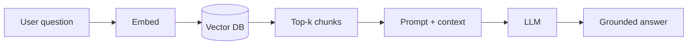

# Vector Databases — Basic Interview Questions

Foundational questions you should answer smoothly and quickly. Natural tone, real
explanations, and the "why" behind each answer.

## Quick Coverage Map
| # | Question | Theme |
|---|---|---|
| 1 | What is an embedding? | Foundations |
| 2 | What is a vector database? | Foundations |
| 3 | Cosine vs dot vs L2? | Metrics |
| 4 | Why is vector search "approximate"? | ANN basics |
| 5 | What is recall@k? | Evaluation |
| 6 | Flat vs HNSW at a glance? | Indexes |
| 7 | Why normalize embeddings? | Metrics |
| 8 | What is metadata filtering? | Filtering |
| 9 | What is RAG and where does the vector DB fit? | Use case |
| 10 | pgvector vs dedicated vector DB? | Landscape |
| 11 | How do you pick embedding dimensions? | Foundations |
| 12 | What is chunking and why does it matter? | RAG |

---

### 1. What is an embedding?

An embedding is a fixed-length list of numbers (a vector) produced by a model that has
learned to place semantically similar content close together in a high-dimensional space.
Text like "dog" and "puppy" end up near each other; "dog" and "spreadsheet" end up far
apart.

**Why it matters:** it turns "does this *mean* the same thing?" into "are these points
*close* in space?" — which we can answer with geometry and index efficiently. The one
rule beginners forget: use the **same model** to embed both your documents and your
queries, or the vectors live in incompatible spaces.

---

### 2. What is a vector database?

A system built to store many embeddings and answer nearest-neighbor queries ("find the
k most similar vectors to this one") quickly, while also handling metadata filters,
updates, persistence, replication, and access control.

**Why not a normal database?** B-tree/hash indexes are built for exact matches and ranges
on scalar values. They can't efficiently answer "closest in 1024-dimensional space." Vector
DBs use specialized ANN indexes (HNSW, IVF, etc.) instead.

---

### 3. Cosine vs dot product vs Euclidean (L2) — when do you use each?

- **Cosine similarity** measures the *angle* between vectors, ignoring magnitude. It's the
  default for text semantic search.
- **Dot product** multiplies and sums; it *is* affected by magnitude. Use it when vectors
  are normalized (then it equals cosine and is faster) or when magnitude carries meaning.
- **Euclidean (L2)** is straight-line distance; sensitive to magnitude and absolute
  position. Common for image embeddings and clustering.

**Why it matters:** always use the metric the embedding model was trained for. Using L2 on
a cosine-trained model quietly hurts recall.

```python
import numpy as np
def cosine(a, b):
    return np.dot(a, b) / (np.linalg.norm(a) * np.linalg.norm(b))
```

---

### 4. Why is vector search called "approximate"?

Exact nearest-neighbor search compares the query to every stored vector — perfectly
accurate but O(N) per query, which is too slow at millions/billions of vectors. So we use
**Approximate Nearest Neighbor (ANN)** indexes that only examine a small fraction of
candidates and accept a tiny loss in accuracy for a massive speedup.

**Why it matters:** the whole discipline is a three-way trade-off — **recall vs latency vs
memory**. You can't max all three; you tune for your SLO.

---

### 5. What is recall@k?

Recall@k is the fraction of the *true* top-k nearest neighbors that your approximate search
actually returned. If the exact top-10 are known and your ANN returns 9 of them,
recall@10 = 0.9.

**Why it matters:** it's the quality metric for ANN. You measure it by comparing against a
Flat (exact) baseline on a sample, then tune index parameters until you hit your target
(often 0.95–0.99).

---

### 6. Flat vs HNSW — quick comparison?

- **Flat** stores raw vectors and scans all of them: exact results, no tuning, but slow at
  scale. Great for small datasets, ground-truth baselines, or a final re-rank step.
- **HNSW** builds a layered proximity graph you traverse greedily: very high recall at very
  low latency, but memory-hungry and slower to build.

**Why it matters:** Flat is your correctness reference; HNSW is a common production default
when the data fits in RAM.

---

### 7. Why normalize embeddings?

Normalizing makes every vector unit length. Then **dot product equals cosine similarity**,
so you can use the fast dot-product kernel while keeping the angle-based semantics you want.
It also avoids the "hub" problem where a few long vectors dominate dot-product rankings.

**Why it matters:** it's a cheap ingest-time step that speeds up search and keeps scores in
a clean, comparable range.

---

### 8. What is metadata filtering?

Attaching structured attributes (tenant, language, date, category) to each vector so
queries can say "similar items **where** `lang = 'en'` and `date > 2024`." The DB combines
the filter with the ANN search either **before** (pre-filter) or **after** (post-filter)
the similarity step.

**Why it matters:** almost every real query has constraints. Whether you pre- or post-filter
affects both correctness (post-filter can starve your top-k) and latency.

---

### 9. What is RAG and where does the vector DB fit?

**Retrieval-Augmented Generation**: before asking an LLM to answer, you retrieve relevant
context from a knowledge base and put it in the prompt. The vector DB is the retrieval
layer — you embed the user's question, find the most similar chunks, and feed them to the
model.



**Why it matters:** RAG is the canonical use case; it grounds LLM answers in your data and
reduces hallucination.

---

### 10. When would you use pgvector instead of a dedicated vector DB?

Use **pgvector** when you already run Postgres and your scale is modest (up to a few million
vectors). You get vector search, transactional metadata, SQL joins, and hybrid search in
one system you already operate — no new infrastructure.

Move to a dedicated DB (Qdrant, Pinecone, Milvus, Weaviate) when you outgrow RAM, need
faster filtered search, elastic serverless scaling, or advanced ANN/quantization knobs.

**Why it matters:** the 2025-2026 default advice is "start with pgvector, graduate when
scale or performance demands." Fewer moving parts wins early.

---

### 11. How do you pick embedding dimensions?

Higher dimensions are more expressive but cost more memory, slower distance math, and are
more sensitive to the curse of dimensionality. Pick the dimension your chosen model
produces, and consider **Matryoshka** models that let you truncate (e.g., 1024 → 256) to
trade a little quality for big cost savings.

**Why it matters:** dimensions are a direct cost/quality knob; don't use 3072-dim vectors
if 512 hits your recall target.

---

### 12. What is chunking and why does it matter?

In RAG you split documents into smaller pieces ("chunks", e.g., 256–1024 tokens with some
overlap) before embedding, because embedding a whole document averages away detail.

**Why it matters:** chunking quality often affects answer quality more than the index. Too
big → diluted meaning; too small → lost context. Many "the vector DB is bad" problems are
actually chunking problems.

---

## Further Reading
- Pinecone Learn: https://www.pinecone.io/learn/
- pgvector: https://github.com/pgvector/pgvector
- Sentence-Transformers: https://www.sbert.net/
- FAISS wiki: https://github.com/facebookresearch/faiss/wiki

> Content synthesized from general domain knowledge and current (2025-2026) interview trends; rephrased for compliance with licensing restrictions.
