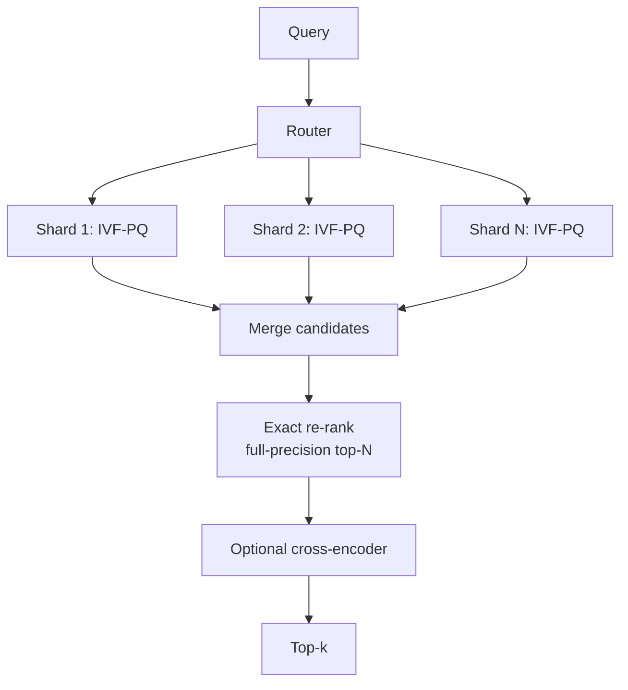

# Vector Databases — Advanced / Expert Interview Questions

Senior/staff-level questions. These are open-ended design and trade-off discussions — the
interviewer wants to see judgment, quantitative reasoning, and awareness of failure modes.
Answers below are structured the way you'd actually talk through them on a whiteboard.

## Quick Coverage Map
| # | Question | Theme |
|---|---|---|
| 1 | Design billion-scale vector search | System design |
| 2 | HNSW vs IVF-PQ vs DiskANN at scale | Index selection |
| 3 | Quantization trade-offs & re-rank pipeline | Compression |
| 4 | Efficient filtered search at scale | Filtering internals |
| 5 | Multi-tenant isolation + security | Security |
| 6 | Cost/latency optimization | Economics |
| 7 | Consistency, freshness, and streaming updates | Distributed systems |
| 8 | Scatter-gather tail latency | Distributed systems |
| 9 | Detecting & fixing recall regressions | Reliability |
| 10 | Embedding model migration / re-embedding | Ops |
| 11 | GPU vs CPU indexing; separation of compute/storage | Architecture |
| 12 | Adversarial / privacy risks of embeddings | Security |

---

### 1. Design a vector search system for 1 billion vectors, 1024-dim, p95 < 50 ms.

Walk the numbers first: 1B × 1024 × 4 bytes = **~4 TB** of raw float32 vectors — far beyond
a single machine's RAM, and full-precision HNSW would be ~4.5+ TB with graph overhead.

Approach:
1. **Compress.** Scalar quant → 1 TB (int8). PQ (m=64) → ~64 GB of codes. This is the
   only way to make it economical.
2. **Index.** IVF-PQ (or DiskANN if you want graph recall with SSD) as the coarse stage.
3. **Shard** across N nodes by hash so data + QPS spread evenly; **replicate** each shard
   ~3× for QPS/HA.
4. **Two-stage retrieval.** IVF-PQ returns ~200 candidates per shard → coordinator merges →
   fetch full-precision (or int8) vectors for the merged top few hundred → exact re-rank →
   top-k. Optionally a cross-encoder rerank for the final 10.
5. **Meet p95:** tune `nprobe` for recall, keep candidate counts modest, warm caches,
   co-locate re-rank vectors, hedge slow shards.



**Signal:** you led with capacity math, chose compression + two-stage retrieval, and
addressed tail latency — not just "use Pinecone."

---

### 2. HNSW vs IVF-PQ vs DiskANN — how do you choose at scale?

- **HNSW:** best recall at lowest latency *when the index fits in RAM*. Memory cost is the
  killer — it stores full vectors + graph. Great up to ~tens–low-hundreds of millions.
- **IVF-PQ:** memory-frugal via compression; ideal when the corpus is billion-scale and RAM
  is the binding constraint. Lower raw recall → needs re-ranking. Trains well, GPU-friendly.
- **DiskANN:** graph-quality recall with most data on **NVMe SSD**, so billions fit on a
  single box at a fraction of the RAM cost (reports of ~40× RAM reduction). Trade: higher,
  more variable latency; depends on fast SSD.

**One-liner:** "HNSW when recall matters and memory is plentiful; IVF-PQ when memory/cost
is the constraint at billion scale; DiskANN when I want graph recall but can't afford the
RAM and can tolerate SSD-bound tail latency."

---

### 3. Talk through quantization trade-offs and a production re-rank pipeline.

Compression tiers and their cost/quality:
- **Scalar (int8):** ~4× smaller, ~1–2% recall loss — almost free, do it by default.
- **PQ (m=32–64):** 20–100× smaller, meaningful recall loss — great for candidate stage.
- **Binary:** ~32× smaller, Hamming distance is extremely fast, big recall loss alone — use
  as an ultra-coarse pre-filter.
- **Matryoshka truncation:** orthogonal to the above — drop dimensions (1024→256) for a
  free additional 4× before quantizing.

Production pattern (the key answer):
```
binary/PQ coarse search  →  top few hundred candidates
        ↓
int8 or float32 re-rank  →  top ~50
        ↓
cross-encoder rerank     →  final top-10
```
Each stage is cheaper-per-item but processes more items; each subsequent stage is more
accurate but processes fewer. You buy back the recall lost to compression cheaply.

**Trade-off to name:** compression saves memory/cost but adds a re-rank stage (latency +
complexity) and requires keeping full-precision vectors somewhere for re-ranking.

---

### 4. How is filtered search implemented efficiently at scale, and where does it break?

Post-filter is easy but **starves** selective queries (you find k neighbors, then discard
most, returning too few). Pre-filter is correct but breaks HNSW's graph connectivity — if
you only allow visiting matching nodes, the greedy walk can get stuck and recall collapses.

Real engines solve this with:
- **Payload/attribute indexes** (inverted indexes on metadata) to quickly identify the
  matching set.
- **Filterable HNSW**: traverse the full graph but only *collect* results that pass the
  filter, with dynamic list sizing so recall holds.
- **Cardinality-aware planning:** if the filter is very selective, just brute-force the
  small matching subset; if loose, post-filter with over-fetch.

**Where it breaks:** medium-selectivity filters (say 1% match) are the hard case — too big
to brute force, too small for post-filter. That's where good engines (Qdrant) shine and
naive ones fall over.

---

### 5. Design multi-tenant isolation for a SaaS RAG product with strict data-separation.

Layered answer:
- **Isolation model:** for most tenants, namespaces + a **server-enforced** `tenant_id`
  filter injected in a trusted gateway (never client-supplied). For high-value/regulated
  tenants, a **collection or cluster per tenant** for hard isolation and clean per-tenant
  deletion (right-to-be-forgotten).
- **AuthN/Z:** per-tenant API keys/JWT; RBAC on collections; every query scoped server-side.
- **Encryption:** TLS in transit, encryption at rest for vectors *and* metadata. Treat
  embeddings as sensitive (they can leak source content).
- **Noisy neighbor:** per-tenant rate limits/quotas; dedicated shards for whales.
- **Blast radius:** a filtering bug in the shared model leaks across tenants — so defense in
  depth (filter + row-level checks + tests that assert cross-tenant queries return nothing).

**Signal:** you distinguished logical vs physical isolation by tenant tier and made the
`tenant_id` enforcement server-side.

---

### 6. A stakeholder says vector search is too expensive. How do you cut cost without
tanking quality?

Options, roughly in order of ROI:
1. **Quantize** (int8 → PQ) and truncate dimensions (Matryoshka). Biggest lever — reported
   ~80% cost cuts with careful re-ranking.
2. **Move from in-RAM HNSW to DiskANN** or a serverless/compute-storage-separated engine so
   you pay for storage cheaply and burst compute.
3. **Right-size replicas** to actual QPS; autoscale for spiky traffic.
4. **Smaller/cheaper embedding model** if recall allows; fewer dimensions.
5. **Cache** frequent queries and their results.
6. **Tighter `ef_search`/`nprobe`** to the minimum that meets recall SLO — over-tuned recall
   wastes compute.

**Always** re-measure recall@k after each change so you cut cost, not quality.

---

### 7. How do you handle consistency and freshness with high-rate streaming updates?

Vector DBs are typically eventually consistent with an LSM-style layout: fresh writes land
in small mutable/in-memory segments (searchable after a refresh), large immutable segments
are merged/compacted in the background.

Design points:
- **Visibility lag:** communicate SLA for "write → searchable" (often sub-second to seconds).
  Offer strong-consistency reads where required (wait for latest segment).
- **Delete/churn:** tombstones bloat the index; schedule compaction; for HNSW plan periodic
  rebuilds since it handles deletes poorly.
- **Backpressure:** batch upserts; separate write path from read path so ingestion spikes
  don't hurt query p99.
- **Distribution drift:** if incoming data drifts from the trained IVF centroids, recall
  degrades — retrain/rebuild periodically.

---

### 8. Why does scatter-gather hurt tail latency, and how do you fix it?

A sharded query is only as fast as its **slowest** shard. With more shards, the probability
that *at least one* is slow (GC pause, cold cache, hot node) rises — so p99 gets worse even
if the median improves. This is tail amplification.

Mitigations:
- **Hedged / speculative requests:** send a duplicate to another replica if the first is
  slow, take whichever returns first.
- **Replica load balancing** and warm caches to reduce cold shards.
- **Fewer, bigger shards** where data size allows, to cut fan-out.
- **Tight per-shard timeouts** with partial-result fallbacks.
- **Request hedging budgets** so hedging doesn't double total load.

---

### 9. Recall silently dropped in production. How do you detect and fix it?

Detection: a **continuous recall canary** — periodically run a sample of queries against a
Flat/exact index (or a stored ground-truth set) and alert if recall@k drops below
threshold. Also monitor index size, tombstone ratio, segment count, and score
distributions.

Common causes → fixes:
- Tombstone/segment bloat from churn → **compaction / rebuild**.
- Data drift from IVF centroids → **retrain**.
- Someone lowered `ef_search`/`nprobe` → **revert / re-tune**.
- Embedding model or preprocessing changed on one path (query vs doc mismatch) → **align
  versions**.
- Filter behavior changed (post-filter starving) → **over-fetch / pre-filter**.

**Signal:** you treat recall as a monitored SLO with a canary, not a one-time benchmark.

---

### 10. You need to switch embedding models (better model released). How do you migrate
1B vectors with zero downtime?

Re-embedding is unavoidable — new model = new vector space, so old and new vectors are
incompatible.

Plan:
1. **Dual-write / backfill:** stand up a new index; batch re-embed the corpus (this is the
   expensive part — schedule, use spot/GPU capacity, checkpoint progress).
2. **Shadow / canary:** serve a fraction of traffic from the new index; compare recall and
   downstream answer quality (offline eval set + online metrics).
3. **Cutover** behind a flag once quality is validated; keep the old index for rollback.
4. **Version everything:** tag vectors with `embed_model_version` so queries always hit a
   consistent space and you never mix.

**Cost callout:** re-embedding 1B docs is the dominant cost — estimate tokens × price, and
consider whether the quality gain justifies it.

---

### 11. GPU vs CPU indexing, and why does "separation of compute and storage" matter?

- **GPU (e.g., Milvus/FAISS-GPU):** dramatically faster index *builds* and high-throughput
  batch search; great when you rebuild often or have huge ingest. Costlier per hour; not
  always needed for steady serving.
- **CPU:** fine for serving HNSW/IVF at moderate QPS; cheaper and simpler.
- **Compute/storage separation** (Milvus, Pinecone serverless, Turbopuffer): vectors live in
  cheap object storage; stateless query nodes scale up/down independently. This gives
  elastic economics for spiky/multi-tenant workloads and decouples storage cost from query
  capacity — you stop paying for idle RAM.

**Signal:** you tie the choice to workload shape (build frequency, QPS spikiness, cost).

---

### 12. What are the privacy/adversarial risks specific to embeddings?

- **Embedding inversion:** research shows text can be partially *reconstructed* from its
  embedding — so vectors are not anonymized; treat them as sensitive PII and encrypt them.
- **Membership inference:** an attacker with query access might infer whether a document is
  in your index.
- **Poisoning:** in open ingestion pipelines, adversarial documents can be crafted to
  always rank high (retrieval poisoning) and steer a RAG system's answers.
- **Cross-tenant leakage:** the multi-tenancy filter bug discussed earlier.

Mitigations: encrypt vectors at rest, access controls + rate limiting, validate/curate
ingested content, monitor for anomalous ingestion, and don't expose raw vectors via APIs.

**Signal:** you know embeddings aren't "just numbers" — they carry recoverable information
and a real attack surface.

---

## Further Reading
- DiskANN (Microsoft): https://github.com/microsoft/DiskANN
- FAISS large-scale guidelines: https://github.com/facebookresearch/faiss/wiki/Guidelines-to-choose-an-index
- Product Quantization (Jégou et al.): https://ieeexplore.ieee.org/document/5432202
- Matryoshka Representation Learning: https://arxiv.org/abs/2205.13147
- Qdrant scaling & quantization: https://qdrant.tech/documentation/guides/
- Text embedding inversion research: https://arxiv.org/abs/2310.06816

> Content synthesized from general domain knowledge and current (2025-2026) interview trends; rephrased for compliance with licensing restrictions.
