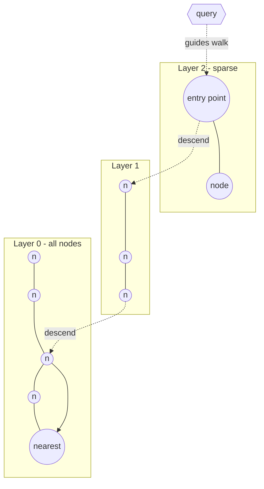
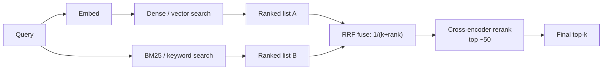
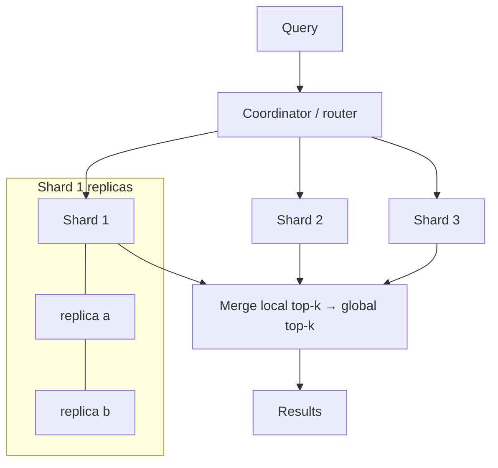
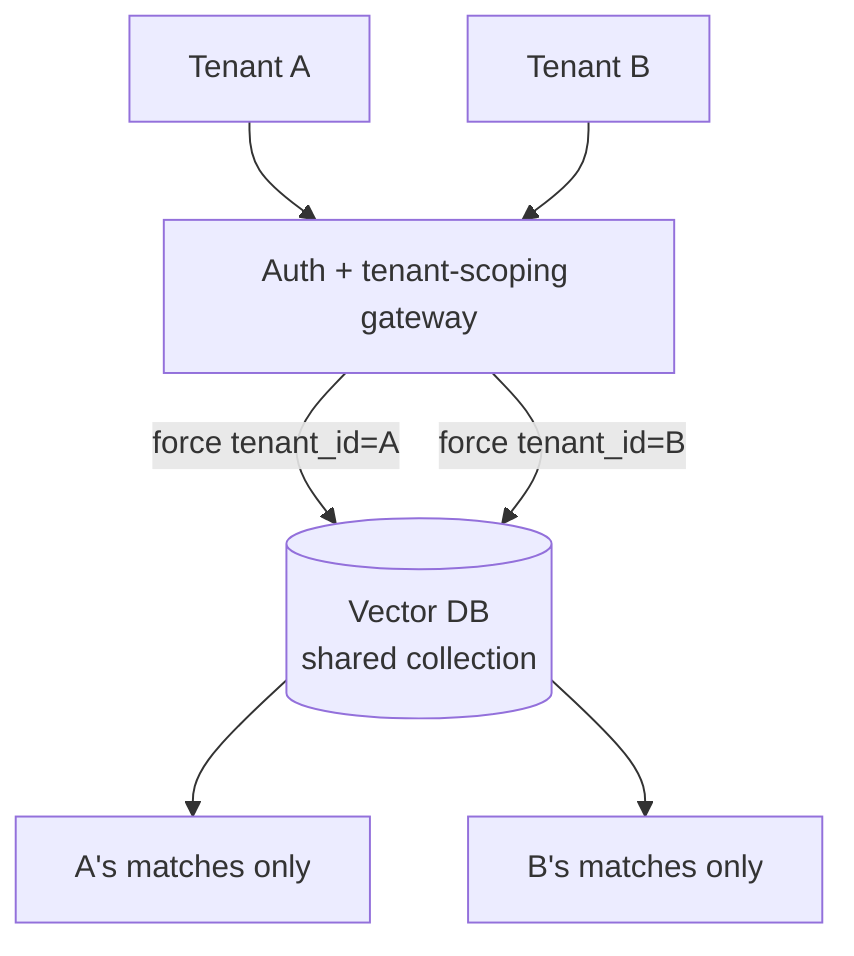
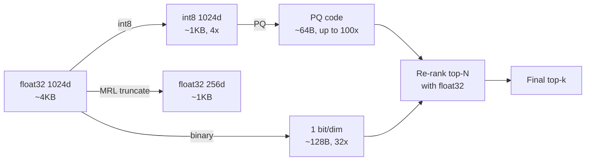
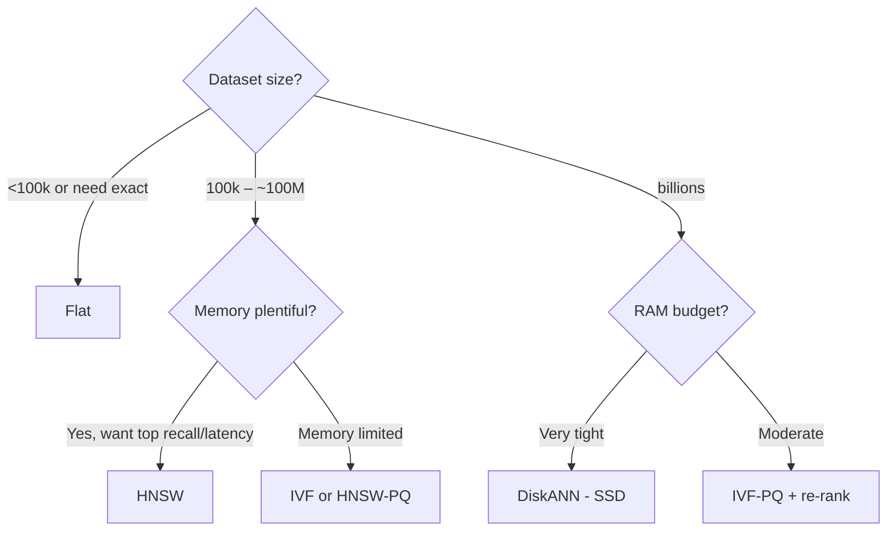
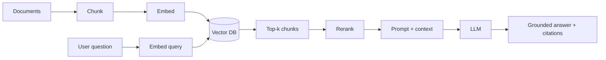
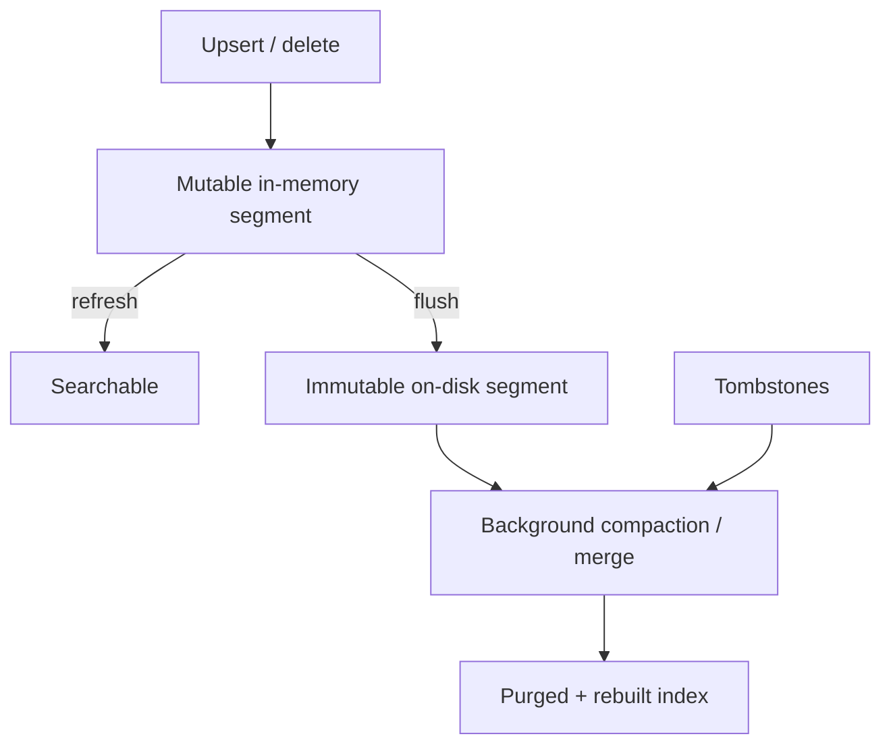
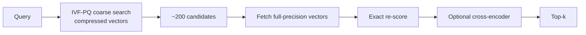

# Vector Databases — Use Case Diagrams

Visual mental models for the concepts that come up most in interviews. Each diagram has a
short "how to read it" note.

---

## 1. HNSW Graph Search (layered traversal)

Start at a sparse top layer with long hops, greedily move toward the query, then descend to
denser layers for precision.

*Read it:* higher layers are express lanes; each descent narrows the search near the query.
`ef_search` controls how many candidates you keep while walking (recall vs latency).

---

## 2. Hybrid Search + Reciprocal Rank Fusion

Run dense and sparse retrieval in parallel, fuse by rank, then optionally rerank.

*Read it:* RRF merges by rank so incompatible score scales don't matter; the reranker adds
precision on a small candidate set.

---

## 3. Sharded + Replicated Cluster (scatter-gather)

Data split across shards for size; each shard replicated for QPS/HA; coordinator merges.

*Read it:* latency is bounded by the slowest shard; replicas absorb read QPS and survive
node failure.

---

## 4. Multi-Tenant Filtering (server-side isolation)

A trusted gateway injects `tenant_id`; each tenant only ever sees its own vectors.

*Read it:* the client never sets its own tenant id; the filter is enforced in a trusted
layer to prevent cross-tenant leakage.

---

## 5. Quantization Tiers (memory vs fidelity)

One vector, many representations; compress for the candidate stage, keep full precision for
re-ranking.

*Read it:* each arrow trades fidelity for size; the re-rank step buys back most of the lost
recall cheaply.

---

## 6. Index Selection Flowchart

A pragmatic decision path from workload to index.

*Read it:* size sets the branch; memory budget picks between graph, cluster+compress, or
SSD-resident.

---

## 7. RAG Retrieval Pipeline (end to end)

Where the vector DB sits in a Retrieval-Augmented Generation flow.

*Read it:* retrieval quality (chunking + embedding + index) upstream determines answer
quality downstream.

---

## 8. Write Path & Freshness (LSM-style segments)

How upserts become searchable and how compaction keeps recall healthy.

*Read it:* fresh writes are visible after a refresh (visibility lag); deletes are tombstoned
and physically removed during compaction.

---

## 9. Two-Stage Retrieval at Billion Scale

Cheap coarse recall over compressed vectors, then exact re-rank.

*Read it:* the first stage is cheap and slightly lossy; the small second stage restores
precision without paying full-precision cost across the whole corpus.

> Content synthesized from general domain knowledge and current (2025-2026) interview trends; rephrased for compliance with licensing restrictions.
