# AI Agents — Detailed Learning

A deep, practical guide to building **AI agents** that reason, plan, use tools, remember,
reflect, and coordinate — the way you'd need to explain and design them in a tough
AI‑engineering interview at a big company.

> Tone: plain English, real code, diagrams, and "why/when" trade‑offs. Everything here
> reflects current (2025–2026) practice: MCP as the tool/context standard, LangGraph/
> CrewAI/OpenAI Agents SDK as mainstream runtimes, and hard lessons about reliability,
> cost, and security.

---

## Table of Contents

1. [What is an agent (and what is *not*)](#1-what-is-an-agent-and-what-is-not)
2. [The agent loop & ReAct](#2-the-agent-loop--react)
3. [Planning: decomposition, plan‑and‑execute, tree‑of‑thought](#3-planning)
4. [Tools & function calling](#4-tools--function-calling)
5. [Memory: short‑term, long‑term, episodic, vector](#5-memory)
6. [Reflection & self‑critique](#6-reflection--self-critique)
7. [Multi‑agent patterns & pitfalls](#7-multi-agent-patterns--pitfalls)
8. [Frameworks: LangGraph, CrewAI, AutoGen, OpenAI Agents SDK](#8-frameworks)
9. [Standards: MCP & A2A](#9-standards-mcp--a2a)
10. [Reliability: budgets, loops, timeouts, HITL](#10-reliability)
11. [Observability & tracing](#11-observability--tracing)
12. [Security: prompt injection, excessive agency, sandboxing](#12-security)
13. [Evaluating trajectories](#13-evaluating-trajectories)
14. [Scale, load & performance](#14-scale-load--performance)
15. [Interview soundbites](#15-interview-soundbites)
16. [Further reading](#16-further-reading)

---

## 1. What is an agent (and what is *not*)

A plain LLM call is a **function**: text in, text out, no memory of the world, no ability to
*do* anything. An **agent** is an LLM placed inside a **control loop** that lets it decide
actions, execute them against the outside world, observe the results, and decide again —
until a goal is met or a budget runs out.

A model becomes an agent when you add three powers it does not have on its own: **tools**
to reach the outside world, **memory** to carry state across steps and sessions, and
**planning** to turn a goal into an ordered set of actions. (This framing is common across
2025–2026 write‑ups; content rephrased for compliance.)

Four components make an agent work:

| Component | Role | Concrete example |
|---|---|---|
| **Reasoning engine** | The LLM that decides the next move | GPT‑class / Claude‑class model |
| **Tools** | Ways to act & observe | search, SQL, code exec, HTTP, RAG |
| **Control loop** | Governs execution & termination | ReAct loop, state graph |
| **Memory** | Persists context across steps | scratchpad, vector store, DB |

**Chain vs Agent** — a classic interview distinction:

| | Chain / Workflow | Agent |
|---|---|---|
| Control flow | Fixed, author‑defined | Dynamic, model decides |
| Predictability | High | Lower (needs guardrails) |
| Cost/latency | Bounded | Variable, can blow up |
| When to use | Steps known in advance | Steps depend on runtime data |

> **Rule of thumb:** if you can draw the flowchart ahead of time, write a *workflow*.
> Reach for an *agent* only when the path genuinely depends on what you discover at runtime.
> Agents trade predictability for flexibility — you pay that back with guardrails.

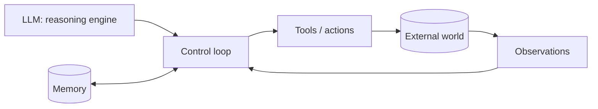

---

## 2. The agent loop & ReAct

**ReAct** = *Reason + Act*. Instead of answering in one shot, the model interleaves
**Thought** (private reasoning), **Action** (a tool call with arguments), and
**Observation** (the tool's result), looping until it emits a **Final Answer**.

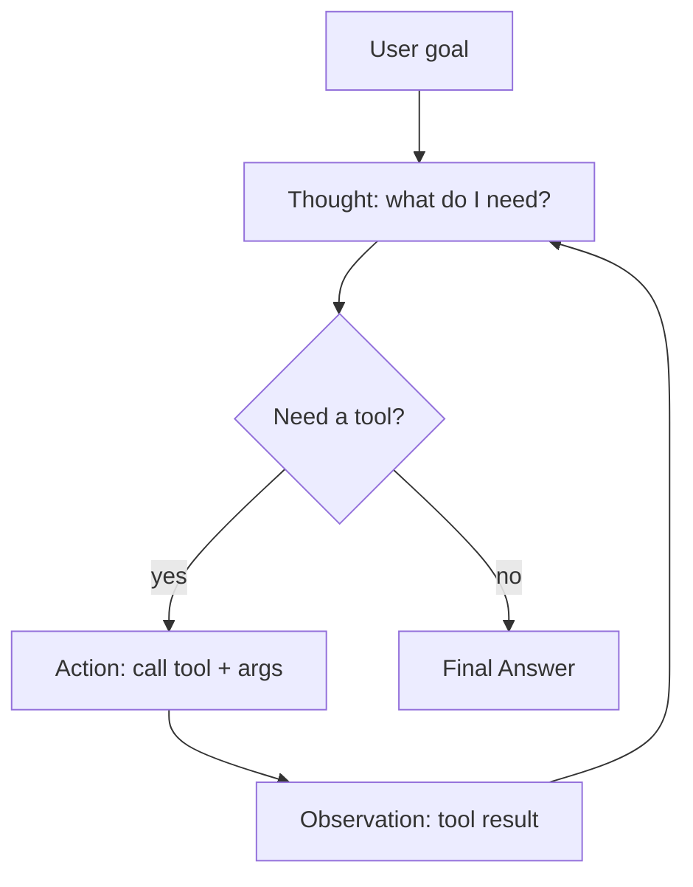

Why ReAct works: forcing an explicit *Thought* before each *Action* makes the model reason
about tool choice and arguments, which measurably reduces wrong/failed tool calls versus
"just call something." The *Observation* grounds the next step in reality rather than
hallucinated state.

A minimal loop (framework‑free, to show the mechanics):

```python
def react_agent(goal, tools, llm, max_steps=8):
    scratchpad = []  # the running Thought/Action/Observation transcript
    for step in range(max_steps):                 # step budget = reliability guardrail
        prompt = build_prompt(goal, tools, scratchpad)
        out = llm(prompt)                          # model emits Thought + Action (JSON)
        if out.get("final_answer"):
            return out["final_answer"]
        name, args = out["action"], out["action_input"]
        try:
            observation = tools[name](**args)      # ACT against the world
        except Exception as e:
            observation = f"ERROR: {e}"            # feed errors back; let it recover
        scratchpad.append((out["thought"], name, args, observation))  # OBSERVE
    return "Stopped: step budget exhausted."       # never loop forever
```

**Reasoning‑loop spectrum** (increasing autonomy, each fails differently):

| Pattern | Idea | Fails by… | Best for |
|---|---|---|---|
| **ReAct** | Think→act→observe each step | Looping on a failing action | Tool‑heavy, short/medium tasks |
| **Plan‑and‑Execute** | Plan all steps, then run | Stale plan when world changes | Long‑horizon, known structure |
| **Reflexion** | Retry using self‑critique | Over‑confident critiques | Ambiguous / hard problems |
| **Autonomous loop** | Open‑ended self‑direction | Drift, runaway cost | Research/exploration (risky) |

Production systems usually **combine** patterns — e.g. ReAct + Reflexion for adaptive
reasoning, or Plan‑and‑Execute + Tree‑of‑Thought for long creative tasks.

---

## 3. Planning

Planning turns a fuzzy goal into ordered, executable steps. Three patterns you must know:

### 3.1 Task decomposition
Break a big goal into sub‑tasks (possibly recursively). Keeps each LLM call focused and
keeps the context window small. Often the *first* thing a supervisor agent does.

### 3.2 Plan‑and‑Execute
A **planner** produces the full plan up front; an **executor** runs steps (often cheaper
model) and can **replan** when reality diverges.

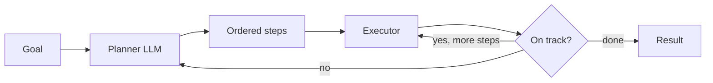

**Pros:** fewer expensive planner calls; auditable plan; cheaper executor.
**Cons:** plan goes stale if the environment shifts → you *must* allow replanning.

### 3.3 Tree‑of‑Thought (ToT)
Explore *multiple* reasoning branches, score them, and keep the promising ones (BFS/DFS +
a value/heuristic). Great for problems with search structure (puzzles, code, math);
expensive because it multiplies LLM calls — gate it behind a difficulty check.

| Planner | Cost | Latency | When |
|---|---|---|---|
| Decomposition | low | low | almost always a good first move |
| Plan‑and‑Execute | medium | medium | long‑horizon, mostly‑known steps |
| Tree‑of‑Thought | high | high | hard search problems only |

---

## 4. Tools & function calling

Tools are how an agent *acts*. Modern models support **function/tool calling**: you supply
a JSON schema of available tools; the model returns a structured call `{name, arguments}`
you execute, then feed the result back.

```python
# A tool = a function + a schema the model can read.
tools_schema = [{
    "type": "function",
    "function": {
        "name": "get_weather",
        "description": "Current weather for a city. Use for weather questions only.",
        "parameters": {
            "type": "object",
            "properties": {"city": {"type": "string"}},
            "required": ["city"],
        },
    },
}]
```

**Tool design principles (interview gold):**
- **Descriptions are prompts.** The model picks tools from their names/descriptions —
  write them like docs for a junior engineer. Say *when to use* and *when not to*.
- **Few, sharp tools > many overlapping ones.** Overlap causes wrong selection. Long‑horizon
  planning accuracy collapses as the tool ecosystem grows and tools get "blocked" —
  so keep the active set small and relevant.
- **Validate arguments** (Pydantic/JSON‑Schema) *before* executing. Never trust raw args.
- **Return compact, structured observations.** A 40 KB JSON blob re‑read every turn fills
  the context window and triggers loops — summarize or paginate tool output.
- **Make tools idempotent / safe to retry** where possible; mark destructive tools.

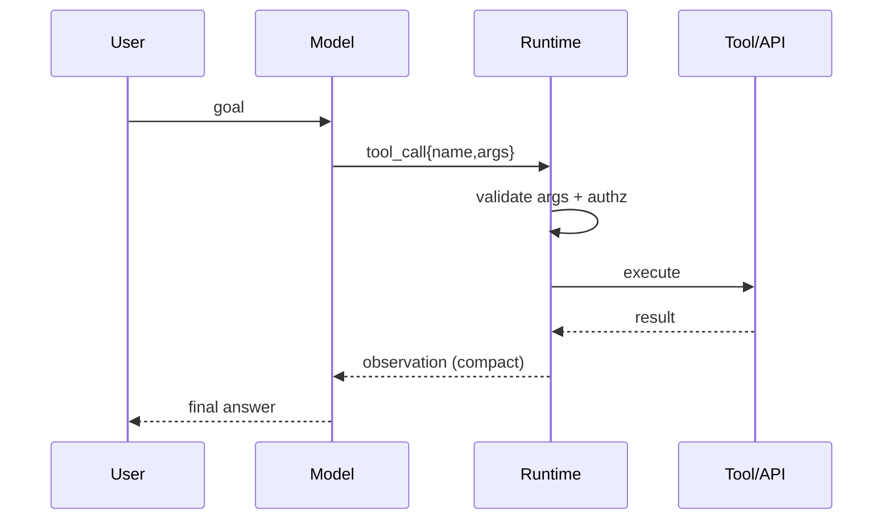

---

## 5. Memory

Context windows are finite and stateless between calls. Memory is how agents carry
knowledge across steps and sessions.

| Type | Lifetime | Backing store | Use |
|---|---|---|---|
| **Short‑term / working** | current run | the prompt / scratchpad | ReAct transcript, recent turns |
| **Long‑term semantic** | forever | vector DB (embeddings) | facts, docs, user knowledge |
| **Episodic** | forever | log/DB (+ embeddings) | "what happened last session" |
| **Procedural** | forever | prompt/config/skills | learned how‑to, few‑shot exemplars |

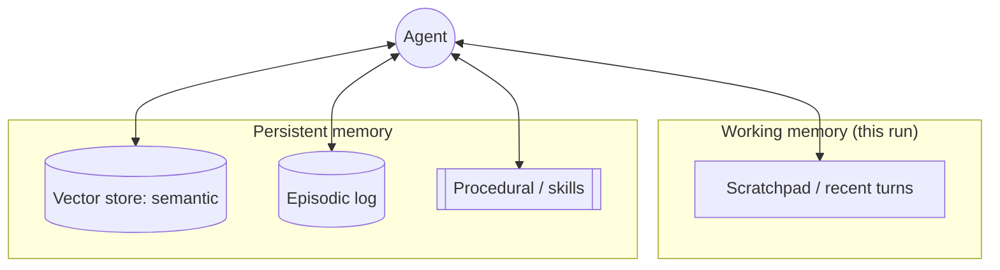

**Vector memory pattern:** on each turn, embed the query, retrieve top‑k relevant memories,
inject them into context. On completion, write salient facts back. Key concerns:
- **Write policy** — don't store everything (noise + cost). Summarize before writing.
- **Retrieval quality** — hybrid (semantic + keyword) + recency + a relevance filter.
- **Context budget** — retrieved memory competes with the task for tokens; cap it.
- **Forgetting/decay** — TTLs and de‑duplication keep memory useful and cheap.

> **Interview trap:** "add memory" often just means *better context management*, not a
> fancy DB. The hard part is deciding *what* to keep and *what* to inject, not storage.

---

## 6. Reflection & self‑critique

**Reflection** = the agent evaluates its own output/trajectory and revises. Variants:
- **Self‑refine:** produce → critique → improve in the same loop.
- **Reflexion:** after a failed attempt, write a short lesson to memory and retry.
- **LLM‑as‑critic / actor‑critic:** a separate "critic" role reviews the "actor."

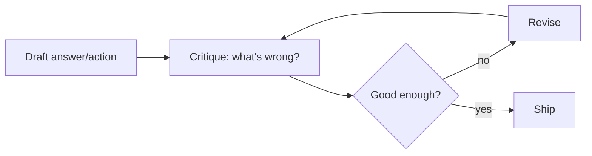

Iterative verify/reflect loops improve recall and satisfaction on ambiguous queries
(roughly +20 points recall reported in recent multi‑agent work) — but each iteration costs
tokens and latency. **When to use:** high‑stakes or ambiguous tasks. **When not to:** simple
lookups (reflection just burns money). Always cap reflection iterations.

---

## 7. Multi‑agent patterns & pitfalls

Split work across specialized agents when a single prompt/agent gets overloaded ("flat
prompting" on a 10‑step problem causes context drift and reasoning collapse). Common
topologies:

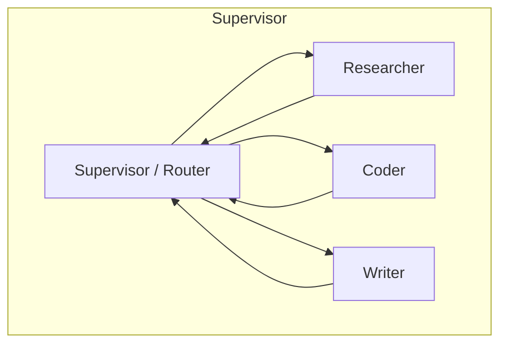

| Pattern | Shape | Pros | Cons / when to avoid |
|---|---|---|---|
| **Supervisor (orchestrator‑worker)** | Star; router delegates | Clear control, easy to trace | Router is a bottleneck/SPOF |
| **Hierarchical** | Tree of supervisors | Scales to big tasks | Latency & cost compound per layer |
| **Network / peer‑to‑peer** | Any‑to‑any | Flexible, emergent | Hard to debug, can loop, chatty |
| **Sequential pipeline** | A→B→C | Simple, predictable | No adaptivity |

**Pitfalls (say these in interviews):**
- **Cost/latency multiplication** — every agent hop is more tokens + round trips.
- **Error propagation** — one bad hand‑off poisons downstream agents.
- **Context loss across hand‑offs** — agents must pass *enough* state, not everything.
- **Chatty loops** — two agents ping‑pong forever; add turn budgets + termination checks.
- **Over‑engineering** — most tasks need *one* good agent, not a swarm. Start single.

> **Rule of thumb:** add an agent only when it owns a distinct responsibility, tool set, or
> context that would otherwise pollute another agent. Coordination is not free.

---

## 8. Frameworks

The 2025→2026 landscape shifted fast: **AutoGen moved to maintenance mode** (Microsoft
Agent Framework is the successor), **OpenAI archived Swarm** and shipped the production
**Agents SDK**, and **LangGraph 1.0 / CrewAI 1.0** reached GA. Pick by *mental model*, not
star count. (Details rephrased from 2026 framework round‑ups for compliance.)

| Framework | Mental model | Strengths | Watch‑outs | Best for |
|---|---|---|---|---|
| **LangGraph** | Stateful **graph** of nodes/edges; cycles + checkpointing | Durable, resumable, fine control, HITL built‑in | Steeper learning curve | Production, long‑running, complex control |
| **CrewAI** | **Roles/crews** with tasks | Fast to scaffold, intuitive | Less low‑level control | Role‑based teams, quick prototypes |
| **AutoGen** (maint.) | **Conversation** between agents | Research patterns, flexible chat | Maintenance mode → prefer MAF | Existing deployments, experiments |
| **OpenAI Agents SDK** | Minimal **agents + handoffs + guardrails** | Lightweight, provider‑native, tracing | Provider‑leaning | OpenAI‑centric production apps |
| **Temporal (+ SDK)** | **Durable workflow** engine | Rock‑solid durability/retries at scale | Not LLM‑specific | Mission‑critical orchestration |

```python
# LangGraph flavor: a graph with typed state and a tool loop.
from langgraph.graph import StateGraph, START, END
g = StateGraph(AgentState)
g.add_node("agent", call_model)       # LLM decides: answer or call tools
g.add_node("tools", run_tools)        # execute tool calls
g.add_conditional_edges("agent", needs_tool, {"yes": "tools", "no": END})
g.add_edge("tools", "agent")          # cycle back — this is the loop
app = g.compile(checkpointer=saver)   # checkpointer = durability / resume
```

**How to choose (interview answer):** config‑first & role‑based → CrewAI; code‑first with
maximum control and durability → LangGraph; minimal, provider‑native → OpenAI Agents SDK;
need bulletproof ret/durable execution across days → put agents *inside* a durable workflow
engine (Temporal).

---

## 9. Standards: MCP & A2A

### 9.1 MCP (Model Context Protocol)
An **open standard** (introduced by Anthropic, then adopted broadly by OpenAI, Google,
Microsoft; donated to the Linux Foundation's Agentic AI foundation in late 2025) that gives
agents a *uniform* way to connect to tools, data, and context — the "USB‑C for AI tools."
It replaces N×M bespoke integrations with one protocol.

**Architecture:** a **host** (the AI app) spins up an MCP **client** per **server**; each
server exposes capabilities. Transport is JSON‑RPC over stdio (local) or **Streamable HTTP**
(remote; replaced SSE as the recommended remote transport in spec 2025‑03‑26).

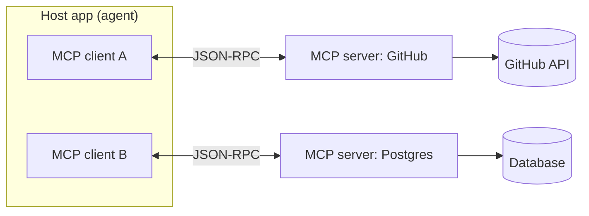

**Six core MCP features:**

| Feature | Who controls | Purpose |
|---|---|---|
| **Tools** | model‑controlled | actions the model can invoke (query DB, call API) |
| **Resources** | app‑controlled | contextual data (files, schemas) exposed to the model |
| **Prompts** | user‑controlled | reusable prompt templates / slash‑commands |
| **Sampling** | server→client | server asks the client's LLM to complete text |
| **Roots** | client→server | scopes which files/dirs a server may touch |
| **Elicitation** | server→user | server requests extra input mid‑operation |

> **Security note (MCP docs):** MCP enables arbitrary data access and code‑execution paths,
> so hosts must gate tool calls behind user consent, validate inputs, and scope roots.
> Rephrased for compliance.

### 9.2 A2A (Agent‑to‑Agent)
Where MCP connects an agent to **tools/data**, **A2A** standardizes how *independent agents*
(possibly from different vendors) **discover and talk to each other** — via "agent cards"
advertising capabilities and a message protocol for delegation. Think: **MCP = agent↔tools**,
**A2A = agent↔agent**. In 2026 both are treated as production requirements, not future ideas.

---

## 10. Reliability

Autonomy without limits = runaway cost and infinite loops. Non‑negotiable guardrails:

- **Step budget** — hard cap on loop iterations (`max_steps`).
- **Cost/token budget** — track spend; abort when exceeded.
- **Wall‑clock timeouts** — per tool call and per run.
- **Loop detection** — if the same action/args repeat, break or escalate.
- **Retries with backoff** — for transient tool failures; cap attempts.
- **Human‑in‑the‑loop (HITL)** — pause for approval before risky/irreversible actions.
- **Fallbacks** — degrade to a simpler path or a canned answer on repeated failure.

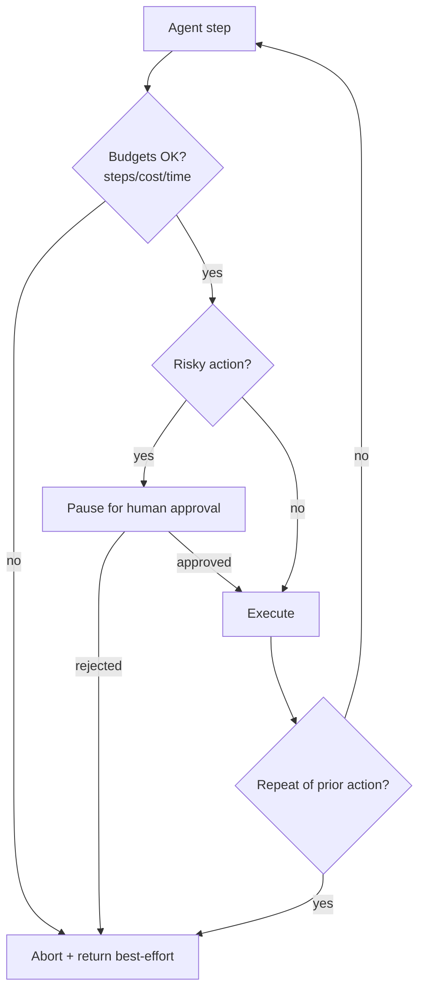

```python
class Budget:
    def __init__(self, max_steps=10, max_usd=0.50, max_seconds=60):
        self.max_steps, self.max_usd, self.max_seconds = max_steps, max_usd, max_seconds
        self.steps = self.usd = 0; self.start = time.time()
    def check(self):
        if self.steps >= self.max_steps: raise Budget.Exceeded("steps")
        if self.usd   >= self.max_usd:   raise Budget.Exceeded("cost")
        if time.time() - self.start >= self.max_seconds: raise Budget.Exceeded("time")
    class Exceeded(Exception): ...
```

---

## 11. Observability & tracing

You cannot debug or improve what you cannot see. Agents are non‑deterministic and
multi‑step, so **trace every step**: prompt, model output, tool call + args, observation,
tokens, latency, cost, and decision. Use OpenTelemetry‑style spans (LangSmith, Langfuse,
Arize Phoenix, etc.).

**What to log per step:** run_id, step index, thought, tool name/args (redacted), raw
observation size, latency, tokens in/out, cost, error. Aggregate to dashboards: success
rate, avg steps/run, p95 latency, cost/run, tool error rates, loop incidents.

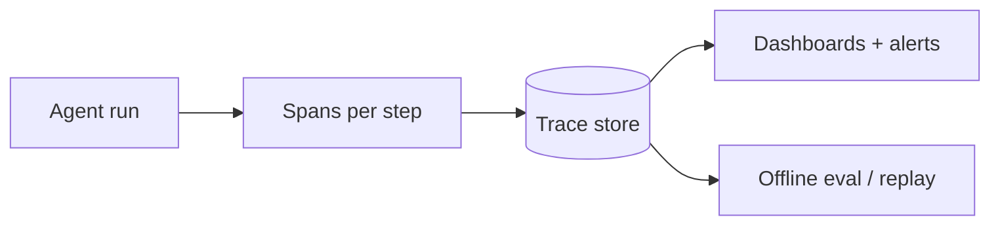

---

## 12. Security

Agents can *act*, so their blast radius is larger than a chatbot's. Map to **OWASP LLM Top
10 (2025)** and the **Agentic Top 10 (2026)**.

| Threat | What happens | Defense |
|---|---|---|
| **Prompt injection** (LLM01) | Malicious text in a page/doc/tool output hijacks the agent | Treat all tool/retrieved content as untrusted; separate instructions from data; content filters; don't auto‑execute instructions found in data |
| **Excessive agency** (LLM06) | Agent has more permissions/tools/autonomy than needed → damaging actions | Least privilege; minimal tools; scoped creds; require approval for high‑impact actions |
| **Tool misuse** (ASI02) | Attacker steers tools to exfiltrate/destroy | Allowlist tools; validate args; rate‑limit; audit |
| **Sensitive data leak** | PII flows into prompts/logs/memory | Redaction, PII filters, scoped memory |
| **Insecure output** | Agent output executed downstream (SQL/shell) | Sandboxing, output validation, parameterized queries |

**Defense‑in‑depth (the "guardrail stack"):** input guardrails (injection/PII detection) →
least‑privilege tool authz → **sandboxed execution** (containers/microVMs for code & shell,
no ambient credentials) → output guardrails → HITL for irreversible ops → full audit trail.
Guardrails are *runtime* controls independent of the model — model alignment alone is not
enough.

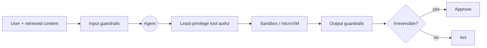

> **Key mindset:** *anything the agent reads can try to reprogram it.* A web page, a PDF, a
> tool's JSON — all untrusted. Never let data become instructions with real authority.

---

## 13. Evaluating trajectories

Evaluating agents is harder than evaluating a single call: you must judge the **trajectory**
(the sequence of steps), not just the final answer. Two answers can be identical while one
took 3 correct tool calls and the other flailed for 12.

**What to measure:**

| Dimension | Question | Metric |
|---|---|---|
| **Outcome** | Did it achieve the goal? | task success rate |
| **Tool trajectory** | Right tools, right args, right order? | tool‑selection / arg / ordering accuracy |
| **Efficiency** | How many steps / tokens / $ ? | avg steps, cost/run |
| **Side effects** | Any unintended actions? | side‑effect / safety violations |
| **Repetitiveness** | Did it loop? | loop / redundancy rate |

**Methods:**
- **Reference trajectories** — compare tool calls against a golden path (exact/fuzzy match).
- **LLM‑as‑judge / Agent‑as‑judge** — a model scores success, side effects, repetitiveness
  against a rubric. Cheap and scalable, but *no single judge excels everywhere* — calibrate
  against human labels and watch judge bias.
- **Benchmarks** — trajectory‑aware suites (e.g., TRAJECT‑Bench, AgentRewardBench, MCPEval,
  PlanBench‑style long‑horizon tests) stress tool selection, ordering, and long‑horizon
  planning (which degrades sharply as tool count grows).

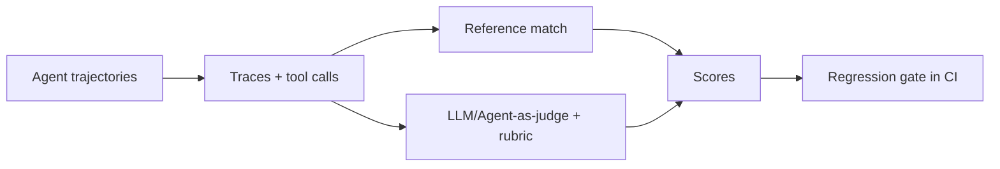

> **Build an eval set early.** Curate real failing cases into a regression suite and gate
> releases on it — the single highest‑leverage thing for agent quality.

---

## 14. Scale, load & performance

Designing an **agent platform** for a big company adds systems concerns on top of the
agent logic:

- **Durable execution.** Agent runs are long (seconds→hours) and can fail mid‑way. Persist
  state (LangGraph checkpointer / Temporal workflows) so runs **resume**, not restart.
- **Async & concurrency.** Tool calls are I/O‑bound — run independent calls in parallel;
  use async workers and queues to handle many concurrent runs.
- **Caching.** Cache tool results, embeddings, and (where safe) LLM responses / prompt
  prefixes to cut latency and cost.
- **Model routing.** Cheap/fast model for routing & simple steps; strong model for hard
  reasoning. This is often the biggest cost lever.
- **Backpressure & rate limits.** Provider quotas are a hard ceiling — queue, throttle, and
  degrade gracefully.
- **Statelessness at the edge.** Keep workers stateless; push state to the store so you can
  scale horizontally.
- **Cost governance.** Per‑tenant budgets, quotas, and alerts; dashboards for $/run.

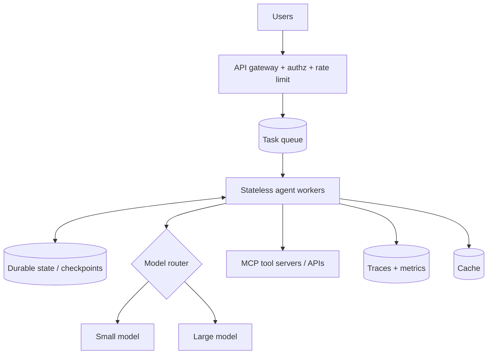

**Latency budget tip:** most agent latency is *round trips* (LLM + tools), not compute.
Reduce steps (better prompts/plans), parallelize tools, stream partial output, and cache.

---

## 15. Interview soundbites

- "An agent is an LLM in a loop with tools, memory, and a termination condition."
- "If I can draw the flowchart in advance, it's a workflow, not an agent."
- "ReAct's *Thought* before *Action* is what cuts wrong tool calls."
- "Tool descriptions are prompts — few sharp tools beat many overlapping ones."
- "Memory is mostly *context management*: the hard part is what to keep and inject."
- "Reflection helps on ambiguous tasks but costs tokens — always cap iterations."
- "Add an agent only when it owns a distinct responsibility; coordination isn't free."
- "MCP standardizes agent↔tools; A2A standardizes agent↔agent."
- "Every step needs a budget: steps, cost, time — plus loop detection and HITL."
- "Treat everything the agent reads as untrusted — data must never become instructions."
- "Evaluate the trajectory, not just the answer; gate releases on a regression suite."
- "For scale: durable execution, async tools, model routing, caching, per‑tenant budgets."

---

## 16. Further reading

- MCP spec & docs — https://modelcontextprotocol.io/
- LangGraph — https://langchain-ai.github.io/langgraph/
- CrewAI — https://docs.crewai.com/
- OpenAI Agents SDK — https://openai.github.io/openai-agents-python/
- OWASP Top 10 for LLM Applications — https://owasp.org/www-project-top-10-for-large-language-model-applications/
- ReAct paper — https://arxiv.org/abs/2210.03629
- Reflexion paper — https://arxiv.org/abs/2303.11366
- Tree of Thoughts — https://arxiv.org/abs/2305.10601
- A2A protocol — https://a2a-protocol.org/

> Content synthesized from general domain knowledge and current (2025-2026) interview trends; rephrased for compliance with licensing restrictions.
