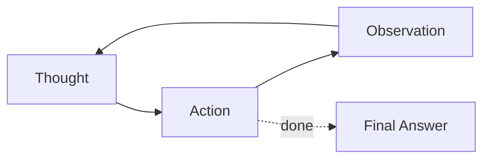

# AI Agents — Basic Interview Questions

Foundational questions to check you actually understand what an agent *is* and how the
core pieces fit together. Answers are written the way you'd say them out loud — natural,
concrete, with the "why" behind each point.

**Quick Coverage Map**

| # | Question | Theme |
|---|---|---|
| 1 | What is an AI agent? | Definition |
| 2 | Chain/workflow vs agent | Design choice |
| 3 | Explain ReAct | Agent loop |
| 4 | What is a tool / function calling? | Tools |
| 5 | Why give agents memory? | Memory |
| 6 | Short‑term vs long‑term memory | Memory |
| 7 | What is planning / decomposition? | Planning |
| 8 | Stop infinite loops & runaway cost | Reliability |
| 9 | Single vs multi‑agent | Architecture |
| 10 | What is MCP? | Standards |
| 11 | What is reflection? | Reflection |
| 12 | Basic agent security risks | Security |

---

### 1. What is an AI agent?

An AI agent is a large language model placed inside a **control loop** so it can *do* things,
not just talk. A plain model call is text‑in/text‑out. An agent adds three powers: **tools**
to act on the world, **memory** to carry state across steps, and **planning** to turn a goal
into ordered actions. It repeats *reason → act → observe* until the goal is met or a budget
runs out.

> One‑liner: **"An LLM in a loop with tools, memory, and a stopping condition."**

---

### 2. What's the difference between a chain/workflow and an agent?

A **chain/workflow** has a fixed path you define in advance — step A, then B, then C. An
**agent** decides the path at runtime based on what it observes.

| | Workflow | Agent |
|---|---|---|
| Control flow | Author‑defined, fixed | Model‑decided, dynamic |
| Predictability | High | Lower |
| Cost/latency | Bounded | Variable |

**Why it matters:** if you can draw the flowchart ahead of time, build a workflow — it's
cheaper and more predictable. Use an agent only when the next step genuinely depends on
runtime data. Agents trade predictability for flexibility, and you pay that back with
guardrails.

---

### 3. Explain the ReAct pattern.

ReAct = **Reason + Act**. The model interleaves:
- **Thought** — private reasoning about what to do next,
- **Action** — a structured tool call with arguments,
- **Observation** — the tool's result,

and loops until it emits a **Final Answer**.



**Why it works:** forcing an explicit *Thought* before each *Action* makes the model reason
about which tool to use and how to fill its arguments, which reduces wrong/failed calls. The
*Observation* grounds the next decision in reality instead of made‑up state.

---

### 4. What is a tool, and what is function calling?

A **tool** is a function the agent can invoke to act or fetch information — search, SQL,
code execution, an HTTP API. **Function calling** is the model feature that makes this
reliable: you pass a JSON schema of available tools; the model replies with a structured
`{name, arguments}` object; your runtime executes it and feeds the result back.

**Why schemas matter:** they let you *validate arguments* before executing and keep the
model's output machine‑parseable. Good tool **descriptions** are critical — the model picks
tools from their names/descriptions, so write them like docs for a junior dev, including
when *not* to use them.

---

### 5. Why do agents need memory?

Because LLM calls are stateless and the context window is finite. Without memory, an agent
forgets what it did two steps ago and everything from previous sessions. Memory lets it:
carry the running task state (working memory), recall facts and documents (long‑term), and
remember past interactions (episodic). In practice "adding memory" is mostly **smart context
management** — deciding what to keep and what to inject — not just a database.

---

### 6. Short‑term vs long‑term memory — what's the difference?

- **Short‑term (working) memory** lives for the current run: the ReAct scratchpad and recent
  turns held in the prompt. It disappears when the run ends.
- **Long‑term memory** persists across runs, usually in a **vector store** (embeddings) for
  semantic recall, plus logs/DBs for episodic history.

On each turn you retrieve the top‑k relevant long‑term memories and inject them into the
short‑term context. **Why separate them:** working memory is fast but token‑limited;
long‑term memory is durable but must be *retrieved* selectively so it doesn't crowd out the
task.

---

### 7. What is planning / task decomposition?

Planning turns a fuzzy goal into ordered, doable steps. **Decomposition** is the simplest
form: break a big goal into smaller sub‑tasks, possibly recursively. This keeps each LLM
call focused and the context small. More advanced forms are **plan‑and‑execute** (plan
everything first, then run, replanning when needed) and **tree‑of‑thought** (explore and
score multiple branches). Start with decomposition; reach for the fancier ones only when the
task needs it.

---

### 8. How do you stop an agent from looping forever or overspending?

Add **budgets and guardrails** — this is non‑negotiable:
- **Step budget** (`max_steps`) — hard cap on iterations.
- **Cost/token budget** — track spend and abort past a threshold.
- **Timeouts** — per tool call and per run.
- **Loop detection** — if the same action+args repeats, break or escalate.

```python
for step in range(MAX_STEPS):      # step budget
    if cost > MAX_USD: break       # cost budget
    ...
```

**Why:** autonomy without limits turns a small bug into a large bill or an endless loop.

---

### 9. When would you use a single agent vs multiple agents?

Default to **one** well‑designed agent — it's simpler, cheaper, and easier to debug. Go
**multi‑agent** only when the task has distinct responsibilities that would otherwise
pollute one agent's context or tool set (e.g., a researcher + a coder + a writer under a
supervisor). **Why be cautious:** every agent hop multiplies tokens, latency, and failure
modes (error propagation, context loss, chatty loops). Coordination isn't free.

---

### 10. What is MCP (Model Context Protocol)?

MCP is an **open standard** for connecting agents to tools, data, and context — think
"USB‑C for AI tools." Instead of writing a custom integration for every tool, you expose
tools/data through an MCP **server**, and any MCP‑compatible **host** (agent app) can use
them. It was introduced by Anthropic and adopted broadly (OpenAI, Google, Microsoft).

**Why it matters:** it turns N×M bespoke integrations into one protocol, so tools become
reusable across apps and models.

---

### 11. What is reflection in an agent?

Reflection is when the agent **critiques its own output or trajectory and revises**. The
loop is: draft → critique → improve, repeated until it's good enough or hits an iteration
cap. A variant, **Reflexion**, writes a short lesson to memory after a failure and retries.

**Why/when:** reflection meaningfully improves quality on ambiguous or high‑stakes tasks,
but it costs extra tokens and latency — so cap the iterations and skip it for simple
lookups.

---

### 12. What are the basic security risks with agents?

Because agents can *act*, their blast radius is bigger than a chatbot's. The big three:
- **Prompt injection** — malicious text in a web page/doc/tool output hijacks the agent.
  Treat everything the agent reads as untrusted.
- **Excessive agency** — the agent has more tools/permissions than it needs, so a bad
  decision does real damage. Apply least privilege.
- **Insecure tool use** — unvalidated arguments or executing model output directly (SQL,
  shell). Validate args and sandbox execution.

**Golden rule:** *anything the agent reads can try to reprogram it* — data must never become
trusted instructions.

---

## Further Reading
- ReAct paper — https://arxiv.org/abs/2210.03629
- MCP docs — https://modelcontextprotocol.io/
- LangGraph — https://langchain-ai.github.io/langgraph/
- OWASP LLM Top 10 — https://owasp.org/www-project-top-10-for-large-language-model-applications/

> Content synthesized from general domain knowledge and current (2025-2026) interview trends; rephrased for compliance with licensing restrictions.
