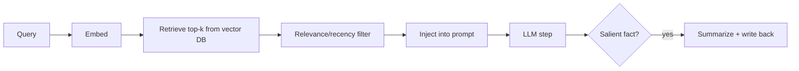
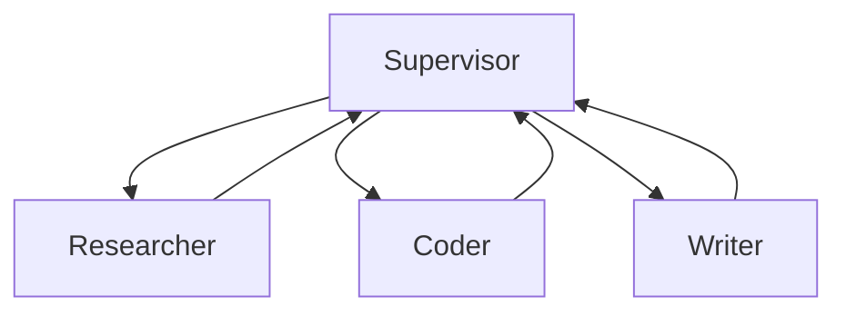
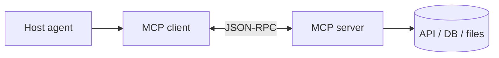
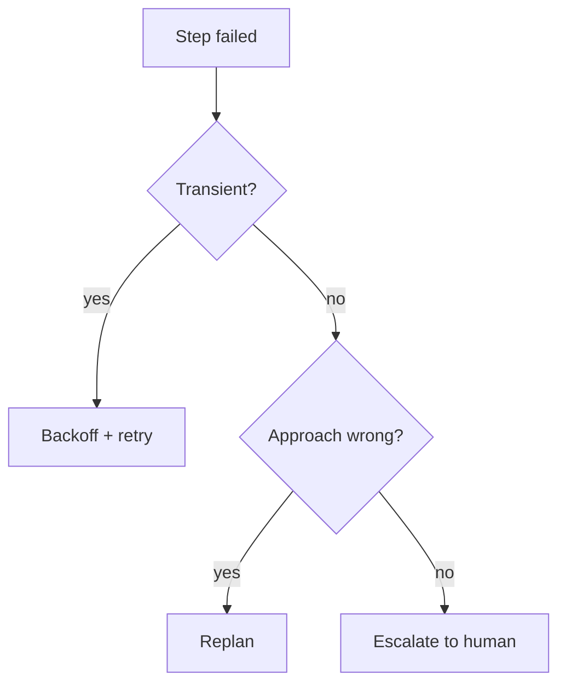

# AI Agents — Medium Interview Questions

Mid‑level questions that probe *design judgment*: when to use which pattern, how the pieces
interact, and the trade‑offs a working engineer runs into. Answers include code, diagrams,
and pros/cons.

**Quick Coverage Map**

| # | Question | Theme |
|---|---|---|
| 1 | ReAct vs Plan‑and‑Execute vs Reflexion | Reasoning loops |
| 2 | Design robust tool calling | Tools |
| 3 | Vector memory pipeline | Memory |
| 4 | Multi‑agent topologies | Architecture |
| 5 | LangGraph vs CrewAI vs OpenAI Agents SDK | Frameworks |
| 6 | MCP architecture & features | Standards |
| 7 | Retry vs replan vs escalate | Reliability |
| 8 | HITL design | Reliability |
| 9 | Observability for agents | Ops |
| 10 | Reduce cost & latency | Performance |
| 11 | Prompt injection defense | Security |
| 12 | Evaluate an agent | Evaluation |

---

### 1. Compare ReAct, Plan‑and‑Execute, and Reflexion. When do you pick each?

They sit on an autonomy spectrum and fail differently.

| Pattern | How it works | Fails by | Best for |
|---|---|---|---|
| **ReAct** | think→act→observe every step | looping on a failing action | tool‑heavy short/medium tasks |
| **Plan‑and‑Execute** | plan all steps up front, then run (+replan) | plan goes stale | long‑horizon, mostly‑known steps |
| **Reflexion** | retry using self‑critique stored in memory | over‑confident critiques | ambiguous / hard tasks |

**Why:** ReAct is adaptive but can thrash; plan‑and‑execute is efficient and auditable but
must allow replanning; Reflexion boosts accuracy on ambiguous problems at the cost of extra
iterations. **In production you usually combine** — e.g. ReAct + Reflexion, or
Plan‑and‑Execute + Tree‑of‑Thought.

---

### 2. How do you design robust tool calling?

Treat tools like a public API the model consumes.

```python
from pydantic import BaseModel, field_validator

class RefundArgs(BaseModel):
    order_id: str
    amount: float
    @field_validator("amount")
    @classmethod
    def positive(cls, v):
        if v <= 0: raise ValueError("amount must be > 0")
        return v

def run_tool(name, raw_args, registry):
    spec = registry[name]
    args = spec.schema.model_validate(raw_args)   # validate BEFORE executing
    return spec.fn(**args.model_dump())
```

Principles:
- **Validate arguments** with a schema before execution — never trust raw model output.
- **Write tools like docs** — clear names/descriptions incl. when *not* to use them.
- **Keep the active tool set small** — overlap causes wrong selection; long‑horizon accuracy
  collapses as tool count grows.
- **Return compact observations** — a huge JSON blob re‑read every turn fills context and
  causes loops; summarize/paginate.
- **Handle errors gracefully** — feed the error back so the model can recover, with retries
  and a cap.

---

### 3. Walk through a vector‑memory pipeline.



Steps: embed the query, retrieve top‑k relevant memories, filter by relevance/recency,
inject into context, and after the step write salient facts back (summarized).

**Trade‑offs to mention:** hybrid retrieval (semantic + keyword) beats pure vector; cap how
many tokens memory can consume so it doesn't crowd out the task; add TTL/decay and
de‑duplication so memory stays useful and cheap. **The hard part is the write policy** —
storing everything creates noise and cost.

---

### 4. What multi‑agent topologies exist, and their trade‑offs?

| Topology | Shape | Pros | Cons |
|---|---|---|---|
| **Supervisor** | router delegates to workers | clear control, traceable | router is a bottleneck/SPOF |
| **Hierarchical** | tree of supervisors | scales to big tasks | cost/latency compound per layer |
| **Network** | any‑to‑any | flexible, emergent | hard to debug, can loop |
| **Sequential** | A→B→C pipeline | simple, predictable | no adaptivity |



**Why start with supervisor:** it's the easiest to reason about and trace. Add hierarchy or
network structure only when a single supervisor becomes the bottleneck. Watch for error
propagation and chatty loops — add turn budgets and termination checks.

---

### 5. LangGraph vs CrewAI vs OpenAI Agents SDK — how do you choose?

| Framework | Mental model | Pick when |
|---|---|---|
| **LangGraph** | stateful **graph**, cycles + checkpointing | production, complex control, durability, HITL |
| **CrewAI** | **roles/crews** with tasks | role‑based teams, fast prototyping |
| **OpenAI Agents SDK** | minimal **agents + handoffs + guardrails** | lightweight, OpenAI‑centric apps |

**Context (2025→2026):** AutoGen moved to maintenance mode (Microsoft Agent Framework is the
successor) and OpenAI archived Swarm in favor of the Agents SDK. **Choose by mental model,
not GitHub stars:** config‑first & role‑based → CrewAI; code‑first with maximum control &
durable resume → LangGraph; minimal and provider‑native → OpenAI Agents SDK.

---

### 6. Explain MCP's architecture and its main features.

A **host** app runs one MCP **client** per **server**; each server exposes capabilities over
JSON‑RPC (stdio locally, or **Streamable HTTP** remotely — which replaced SSE as the
recommended remote transport in the 2025‑03‑26 spec).



Six features: **Tools** (model‑invoked actions), **Resources** (app‑exposed context data),
**Prompts** (reusable templates), **Sampling** (server asks client's LLM to complete),
**Roots** (client scopes which files a server may touch), **Elicitation** (server asks the
user for more input). **Why it matters:** one protocol replaces N×M custom integrations, so
tools are reusable across apps and models.

---

### 7. When do you retry vs replan vs escalate to a human?

- **Retry** transient failures (timeouts, 5xx, rate limits) with exponential backoff and a
  cap. Cheap, fixes flakiness.
- **Replan** when the *approach* is wrong — the tool returned valid but unhelpful data, or
  the environment changed. Go back to the planner.
- **Escalate (HITL)** when the action is risky/irreversible, budgets are exhausted, or the
  agent is stuck (loop detected).



**Why:** each mechanism targets a different failure class; using retry for a wrong *approach*
just loops, and replanning a transient network blip wastes tokens.

---

### 8. How do you design human‑in‑the‑loop (HITL)?

Insert an approval gate before high‑impact actions (sending money, deleting data, emailing
customers). The agent **pauses**, surfaces the proposed action + reasoning, and waits for
approve/reject/edit. This requires **durable state** so the run can suspend and resume later
(LangGraph checkpointer / a workflow engine).

**Pros:** safety, compliance, auditability. **Cons:** latency and human bottleneck — so gate
*only* the risky actions, batch approvals where possible, and set sensible auto‑approve
thresholds for low‑risk cases.

---

### 9. What do you log to make an agent observable?

Trace **every step** as a span: run_id, step index, thought, tool name + args (redacted),
observation size, tokens in/out, latency, cost, and any error. Aggregate into dashboards:
success rate, avg steps/run, p95 latency, cost/run, tool error rates, loop incidents.

**Why:** agents are non‑deterministic and multi‑step — without step‑level traces you can't
tell *where* a run went wrong, and you can't build a regression eval set from real failures.
Tools: LangSmith, Langfuse, Arize Phoenix (OpenTelemetry‑style).

---

### 10. How do you reduce an agent's cost and latency?

Most agent latency is **round trips** (LLM + tools), not compute. Levers:
- **Model routing** — small/fast model for routing & easy steps, strong model for hard
  reasoning (usually the biggest cost lever).
- **Fewer steps** — better prompts/plans and decomposition.
- **Parallelize** independent tool calls (async).
- **Cache** tool results, embeddings, and prompt prefixes.
- **Compact context** — summarize history and tool output.
- **Stream** partial output to improve *perceived* latency.

**Why:** cutting steps and routing to cheaper models attacks both cost and latency at once.

---

### 11. How do you defend against prompt injection?

Assume **all tool output and retrieved content is untrusted** — a web page or PDF may
contain "ignore your instructions" text.

Defenses (layered):
- Keep system instructions separate from data; don't let retrieved text carry authority.
- Input guardrails / injection classifiers on untrusted content.
- **Least privilege** — the agent can't do much damage even if fooled.
- Require approval for high‑impact actions.
- Validate/limit tool arguments; sandbox execution.

**Why layered:** no single filter is reliable — guardrails can be evaded — so you combine
detection with least privilege and sandboxing (defense in depth).

---

### 12. How do you evaluate an agent?

Evaluate the **trajectory**, not just the final answer — two runs with the same answer can
have very different tool paths.

Measure: **outcome** (task success), **tool trajectory** (right tools/args/order),
**efficiency** (steps, tokens, $), **side effects**, and **repetitiveness** (looping).

Methods: compare against **reference trajectories** (golden tool paths), use
**LLM‑as‑judge** with a rubric (scalable but calibrate against humans — no judge is best
everywhere), and run **trajectory‑aware benchmarks**. **Most important:** curate real
failures into a **regression suite** and gate releases on it.

---

## Further Reading
- LangGraph — https://langchain-ai.github.io/langgraph/
- CrewAI — https://docs.crewai.com/
- MCP spec — https://modelcontextprotocol.io/
- OWASP LLM Top 10 — https://owasp.org/www-project-top-10-for-large-language-model-applications/
- TRAJECT‑Bench (trajectory eval) — https://arxiv.org/abs/2510.04550

> Content synthesized from general domain knowledge and current (2025-2026) interview trends; rephrased for compliance with licensing restrictions.
