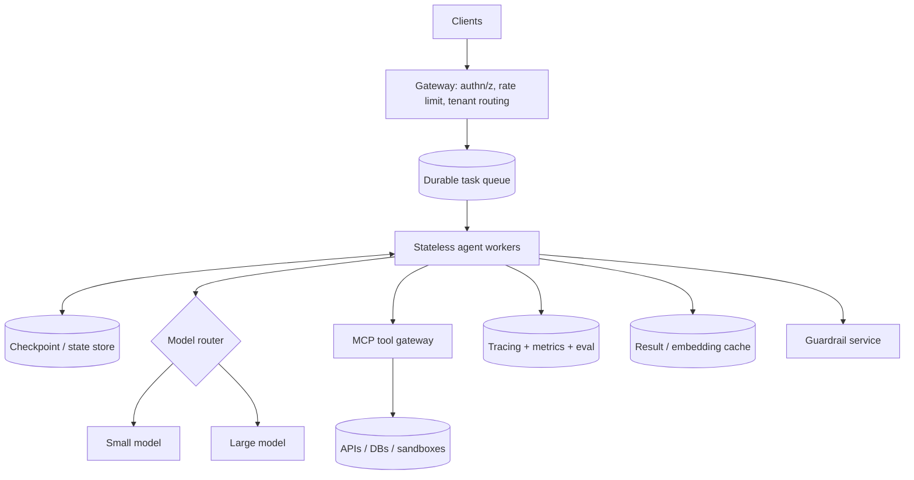
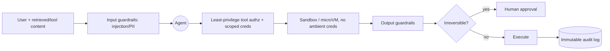

# AI Agents — Advanced / Expert Interview Questions

Senior/staff‑level questions. These are about **systems design, trade‑offs at scale, and
failure modes** — the kind where the interviewer keeps asking "and what happens when…?"
Answers focus on architecture, durability, coordination, security, cost, and evaluation.

**Quick Coverage Map**

| # | Question | Theme |
|---|---|---|
| 1 | Design an agent platform for a big company | Platform architecture |
| 2 | Durable execution & resume | Reliability at scale |
| 3 | Multi‑agent coordination & consistency | Coordination |
| 4 | Cost control across tenants | FinOps |
| 5 | Context/memory at scale | Memory systems |
| 6 | Security architecture (injection, agency, sandbox) | Security |
| 7 | MCP at enterprise scale | Standards/ops |
| 8 | Trajectory evaluation & release gating | Eval |
| 9 | Latency optimization for long‑horizon agents | Performance |
| 10 | Guaranteeing tool safety / least privilege | Security |
| 11 | Testing non‑determinism & regressions | Quality |
| 12 | When agents are the wrong answer | Judgment |

---

### 1. Design an AI agent platform for a large company. What are the core components?

Think of it as a **distributed workflow system** where the "compute" is an LLM+tools loop.

Core components: **gateway** (auth, per‑tenant rate limits), **durable queue + stateless
workers** (scale horizontally, resume on failure), **checkpointed state store**, **model
router** (cost/latency), **MCP tool gateway** (uniform, authz'd tool access), **guardrail
service** (input/output filters), **sandbox** for code/shell, and **observability + eval**
throughout.

**Key design principles:** keep workers stateless (state in the store), make every long
action durable/resumable, enforce budgets per run *and* per tenant, and treat tools as
authorized, audited resources — not free functions.

---

### 2. How do you get durable execution so runs survive crashes?

Agent runs are long (seconds→hours) and *will* be interrupted (deploys, crashes, timeouts).
You need to **persist state after each step** so a run **resumes** instead of restarting
(and re‑paying for and re‑doing side effects).

Options:
- **LangGraph checkpointer** — persists graph state to a DB after each node; resume by
  run_id.
- **Durable workflow engine (Temporal)** — models the agent as a workflow with automatic
  retries, timers, and exactly‑once activity semantics.

**Hard problems to raise:** side‑effecting tools must be **idempotent** or guarded by
idempotency keys (you don't want to send a payment twice on resume); and you must snapshot
enough state (memory + scratchpad + budget counters) to continue faithfully. This is why
"durable execution" is the headline feature teams pick frameworks for in 2026.

---

### 3. How do you coordinate multiple agents and keep state consistent?

Coordination is the hard part; the LLM reasoning is almost the easy part.

- **Topology:** prefer a **supervisor** for clear control and tracing; go hierarchical only
  when one supervisor bottlenecks. Avoid free‑for‑all networks unless you truly need
  emergent behavior — they're hard to debug and loop.
- **Shared state:** use a single **source of truth** (shared state object / blackboard) that
  agents read/write, rather than passing giant messages. Pass *enough* context on handoff,
  not everything.
- **Consistency:** treat handoffs like distributed transactions — validate outputs at
  boundaries, and make steps idempotent so retries are safe.
- **Termination:** every conversation needs turn budgets + a termination check, or two
  agents ping‑pong forever.

**Failure modes to name:** error propagation (one bad handoff poisons downstream), context
loss, cost/latency multiplication, and deadlocks/loops.

---

### 4. How do you control cost across many tenants and runs?

Cost is a first‑class reliability concern; a runaway agent is a runaway bill.

- **Budgets at every level:** per‑step (max_steps), per‑run (max tokens/$), per‑tenant/day
  quotas. Abort and degrade when exceeded.
- **Model routing:** cheap model for routing/simple steps, expensive for hard reasoning —
  usually the biggest lever.
- **Caching:** tool results, embeddings, prompt prefixes; semantic caching for repeated
  queries.
- **Context discipline:** summarize history and tool output — token bloat is silent cost.
- **Fewer agents/steps:** don't add agents that don't earn their round trips.
- **Governance:** dashboards for $/run and $/tenant, alerts on anomalies, and hard kill
  switches.

**Why:** without per‑tenant budgets and routing, a single abusive/looping tenant can dominate
spend and starve others.

---

### 5. How do you manage context and memory for agents at scale?

The context window is the scarcest resource; at scale you engineer around it.

- **Tiered memory:** working (in‑prompt) → semantic (vector DB) → episodic (log) →
  procedural (skills). Retrieve selectively into the prompt.
- **Compaction:** rolling summaries of long histories; store the summary, drop the raw.
- **Retrieval quality:** hybrid search + recency + a relevance gate; cap tokens spent on
  memory so it can't crowd out the task.
- **Write policy:** summarize before writing; TTL/decay + dedupe to control growth and cost.
- **Isolation:** scope memory per user/tenant for privacy and to avoid cross‑contamination
  (also a security control against memory poisoning).

**The subtle failure:** poorly bounded memory *degrades* quality — irrelevant retrieved text
distracts the model and inflates cost. More memory is not better; *relevant* memory is.

---

### 6. Describe a security architecture for an agent that can act.

Because agents act, assume compromise and limit blast radius (map to OWASP LLM Top 10 2025
and Agentic Top 10 2026).

Layers: **input guardrails** (prompt‑injection & PII detection on all untrusted content) →
**least‑privilege tool authz** with scoped, short‑lived credentials → **sandboxed execution**
for code/shell → **output guardrails** → **HITL** for irreversible actions → **audit trail**.

**Core threats to name:** prompt injection (LLM01), excessive agency (LLM06), tool misuse
(ASI02), sensitive‑data leakage, memory poisoning. **Mindset:** *anything the agent reads can
try to reprogram it* — data must never gain instruction authority; guardrails are runtime
controls independent of model alignment.

---

### 7. How does MCP change enterprise tool integration, and what do you watch for?

MCP standardizes agent↔tool connectivity: expose a capability once as an MCP **server**, and
any MCP host can use it — killing N×M bespoke integrations. At enterprise scale you run an
**MCP gateway** that centralizes authn/z, rate limiting, logging, and a **tool allowlist**.

Watch‑outs:
- **Security surface:** MCP explicitly enables data access and code execution — gate tool
  calls behind consent/authz, validate inputs, and scope **roots** so a server only touches
  permitted files.
- **Transport:** use **Streamable HTTP** for remote servers (SSE is superseded); secure with
  auth + TLS.
- **Tool sprawl:** too many exposed tools hurts model selection accuracy — curate per‑agent
  tool sets, don't dump the whole catalog.
- **Supply chain:** third‑party MCP servers are untrusted code — vet, pin, and sandbox them.

**Also:** MCP is agent↔tools; **A2A** is agent↔agent (capability discovery via agent cards).
In 2026 both are production concerns, not future ideas.

---

### 8. How do you evaluate agents and gate releases on quality?

Single‑call metrics (BLEU/exact match) don't work — you must evaluate **trajectories**.

- **Metrics:** task success, tool‑selection/arg/ordering accuracy, steps/tokens/cost,
  side‑effects, loop rate.
- **Methods:** reference‑trajectory matching (golden tool paths); **LLM/Agent‑as‑judge** with
  rubrics (scalable, but calibrate — no judge is best across all domains, and judges have
  bias); trajectory‑aware benchmarks (TRAJECT‑Bench, AgentRewardBench, MCPEval; long‑horizon
  planning collapses as tool count/blocking grows).
- **Process:** curate real production failures into a **regression suite**, run it in CI, and
  **gate releases** on success rate + cost + safety thresholds. Add online monitoring +
  canary + shadow evals for drift.

**Why hard:** non‑determinism means you evaluate *distributions* of behavior, not a single
output — so you need many seeds/runs and statistical thresholds, not one pass/fail.

---

### 9. A long‑horizon agent is too slow. How do you optimize latency?

First, **measure where time goes** — it's almost always round trips (LLM + tools), not local
compute.

- **Cut steps:** better planning/decomposition; plan‑and‑execute to avoid per‑step planner
  calls.
- **Parallelize** independent tool calls and sub‑agents (async fan‑out).
- **Speculative / cheaper models** for easy steps; reserve the big model for hard reasoning.
- **Cache** aggressively (tool results, embeddings, prompt prefixes).
- **Stream** intermediate output so *perceived* latency drops even if total time is similar.
- **Prefetch** likely‑needed data during reasoning.
- **Compact context** to shrink prompt tokens (latency scales with tokens).

**Trade‑off to state:** parallelism and speculation add complexity and can waste tokens on
discarded work — worth it for user‑facing latency, not for cheap batch jobs.

---

### 10. How do you guarantee a tool can't be misused (least privilege)?

Defense in depth around each tool:
- **Scoped credentials:** the tool's identity can only do exactly its job (e.g., read‑only DB
  role), short‑lived tokens, per‑tenant scoping — no ambient/global creds.
- **Argument validation & policy:** schema‑validate args; enforce policy (e.g., refund ≤ $X;
  can only touch this tenant's rows).
- **Allowlist + rate limits** per agent/tenant.
- **Classify tools by risk:** read‑only auto‑runs; destructive/irreversible require HITL.
- **Sandbox** anything that executes code/shell; deny network by default.
- **Audit** every call immutably.

**Why:** even a perfectly aligned model can be prompt‑injected — the *authorization layer*,
not the model, must be what actually prevents damage (excessive agency is an architecture
bug, not a prompt bug).

---

### 11. How do you test agents given their non‑determinism?

You can't rely on exact‑match assertions. Strategies:
- **Property/invariant tests:** assert things that must always hold (never called the delete
  tool without approval; stayed within budget; output schema valid) rather than exact text.
- **Multiple seeds/runs** and **statistical thresholds** (e.g., ≥95% success over N runs).
- **Mock/record tools** (VCR‑style) for deterministic, cheap CI; run live evals nightly.
- **Regression suite** built from real failures; **canary + shadow** evals in prod.
- **LLM‑as‑judge** for fuzzy quality, calibrated against a human‑labeled golden set.

**Why:** the unit of correctness is a *distribution of trajectories*, so tests assert
behavioral properties and pass rates, not single outputs.

---

### 12. When are agents the *wrong* answer?

A staff‑level answer shows restraint. Agents are the wrong tool when:
- The flow is **known in advance** — a deterministic workflow/pipeline is cheaper, faster,
  and more predictable.
- The task is **latency‑sensitive** and simple — a single well‑prompted call beats a loop.
- Errors are **unacceptable / irreversible** and you can't afford HITL overhead.
- You can't afford the **variance** in cost/latency, or can't invest in guardrails,
  observability, and evals.

**Rule of thumb:** *use the least‑agentic solution that solves the problem.* Start with a
prompt, then a workflow, and only reach for an autonomous agent when the path genuinely
depends on runtime discovery — and you're ready to pay for the guardrails.

---

## Further Reading
- LangGraph durable execution — https://langchain-ai.github.io/langgraph/
- Temporal — https://temporal.io/
- MCP spec — https://modelcontextprotocol.io/
- OWASP LLM Top 10 — https://owasp.org/www-project-top-10-for-large-language-model-applications/
- A2A protocol — https://a2a-protocol.org/
- TRAJECT‑Bench — https://arxiv.org/abs/2510.04550
- AgentRewardBench — https://arxiv.org/abs/2504.08942

> Content synthesized from general domain knowledge and current (2025-2026) interview trends; rephrased for compliance with licensing restrictions.
