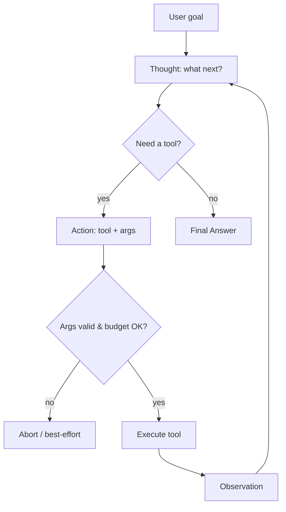
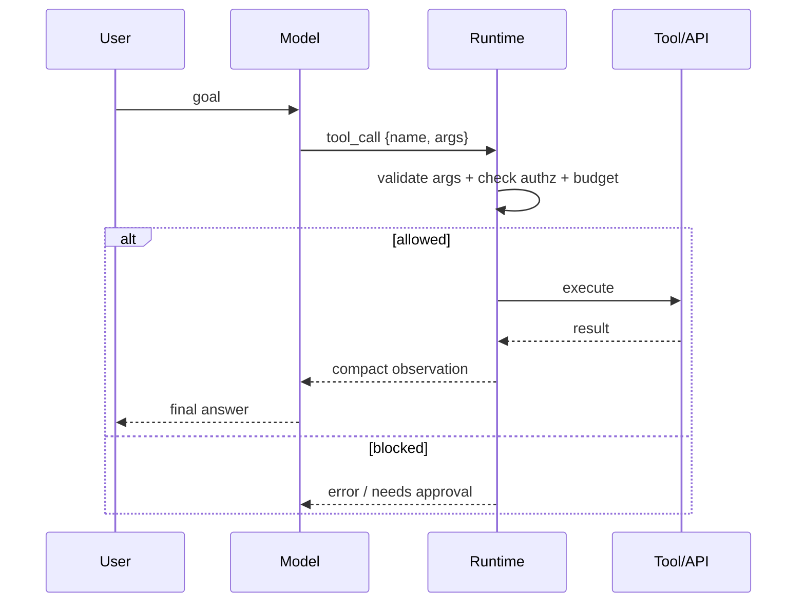
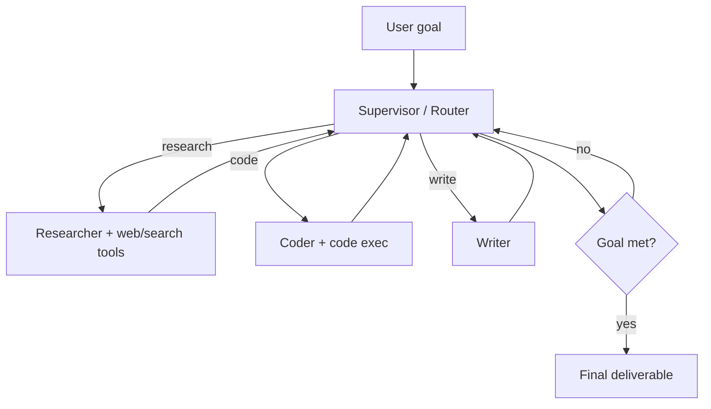
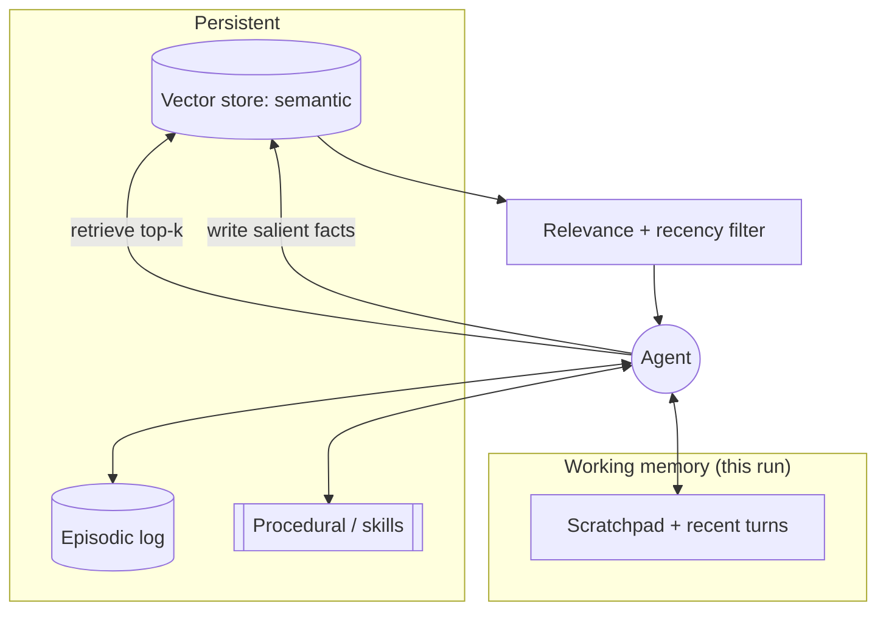
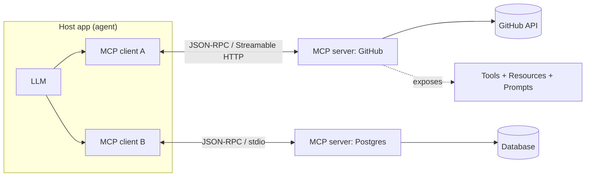
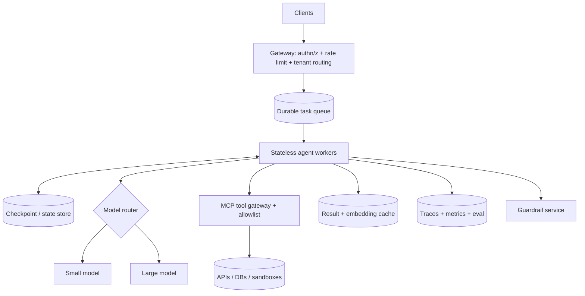
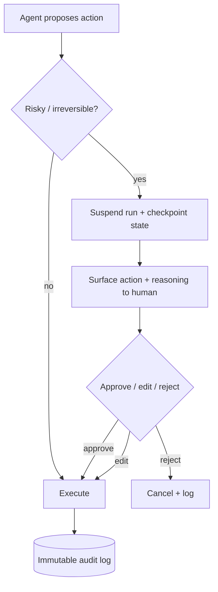
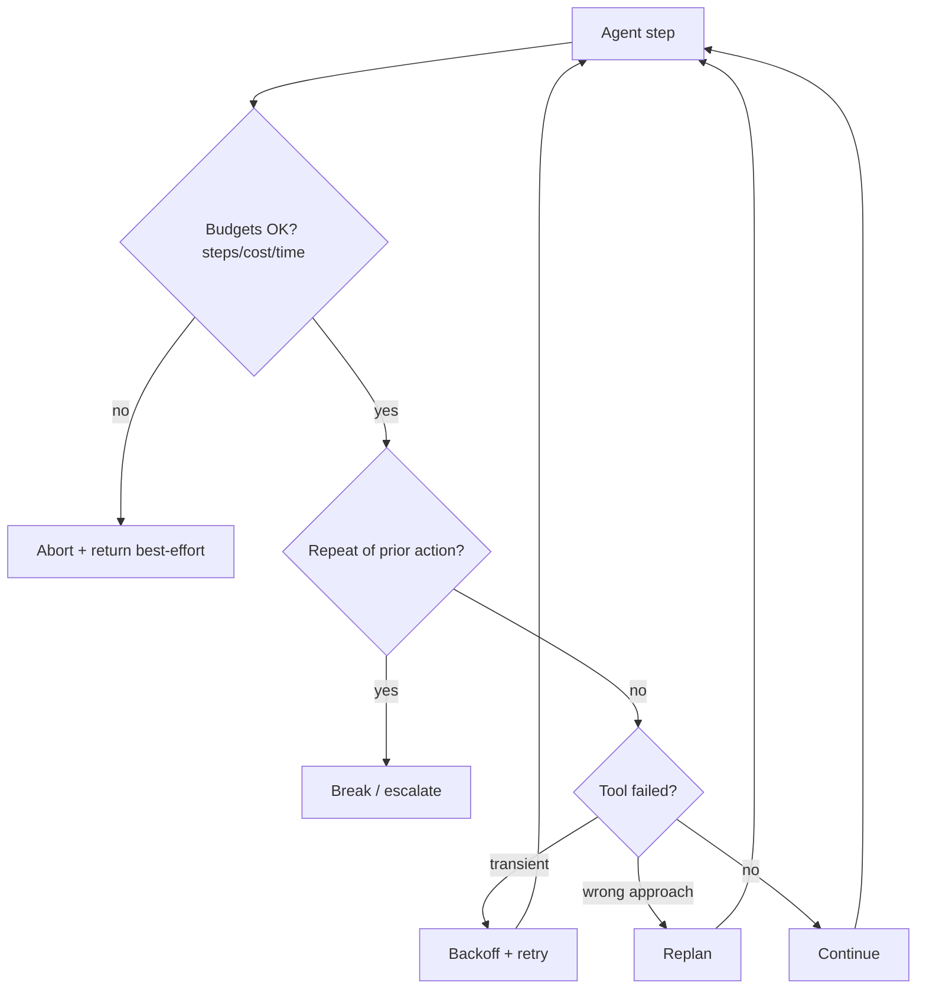
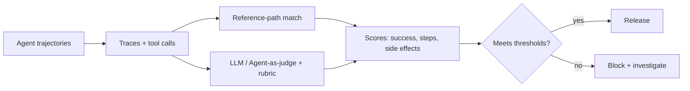

# AI Agents — Use‑Case Diagrams

Mermaid diagrams for the patterns you'll draw on a whiteboard. Each has a one‑line "why."

---

## 1. ReAct loop
*Why: the fundamental think→act→observe cycle with a hard stop.*

---

## 2. Tool / function calling sequence
*Why: shows validation + authz between the model and the real API.*

---

## 3. Supervisor multi‑agent
*Why: clearest multi‑agent topology — router delegates, workers report back.*

---

## 4. Memory architecture
*Why: how working, semantic, episodic, and procedural memory feed one agent.*

---

## 5. MCP integration
*Why: host runs a client per server; one protocol replaces N×M integrations.*

---

## 6. Agent platform at scale
*Why: agent runs are distributed durable workflows, not single calls.*

---

## 7. Human‑in‑the‑loop (HITL) approval
*Why: pause on risky/irreversible actions; requires durable suspend/resume.*

---

## 8. Reliability control flow
*Why: budgets + loop detection + escalation wrap every step.*

---

## 9. Trajectory evaluation pipeline
*Why: judge the whole path, then gate releases in CI.*

---

> Content synthesized from general domain knowledge and current (2025-2026) interview trends; rephrased for compliance with licensing restrictions.
