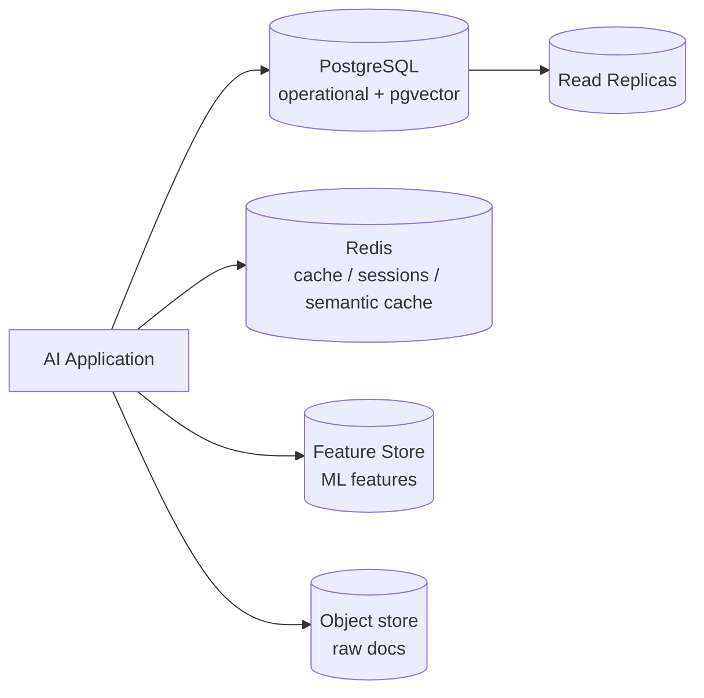
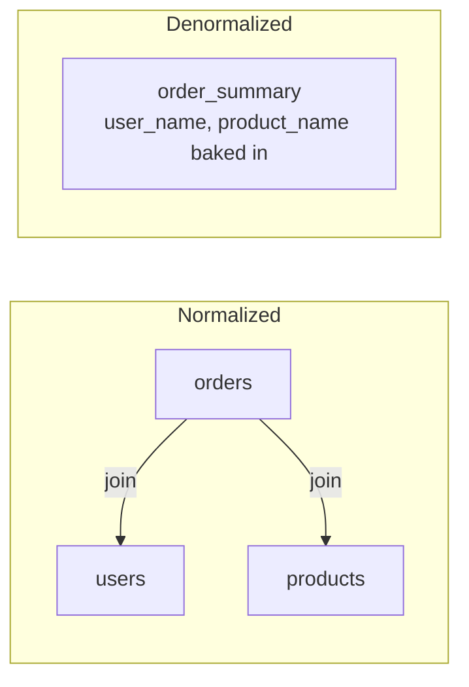
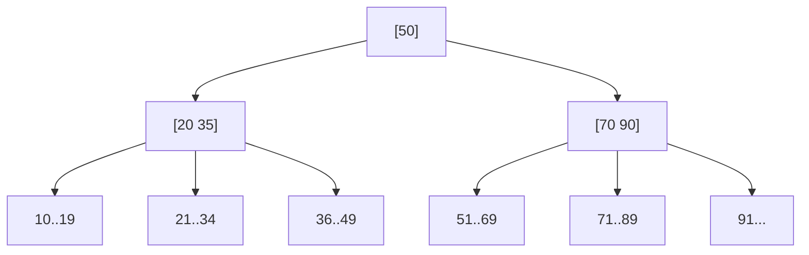
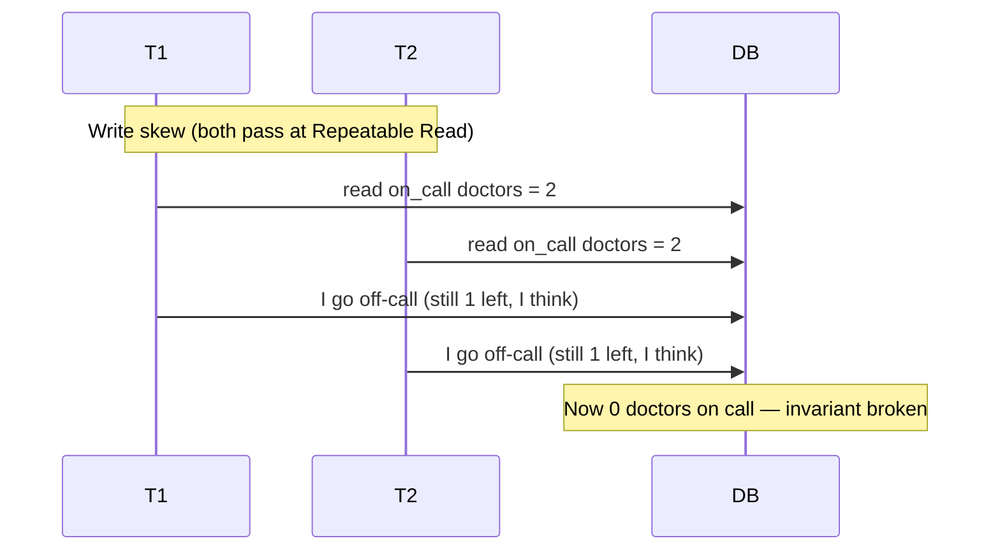
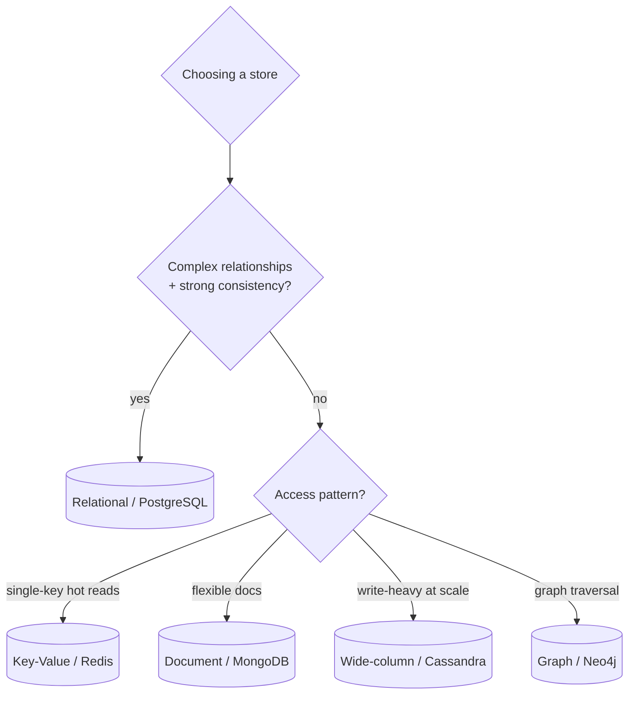
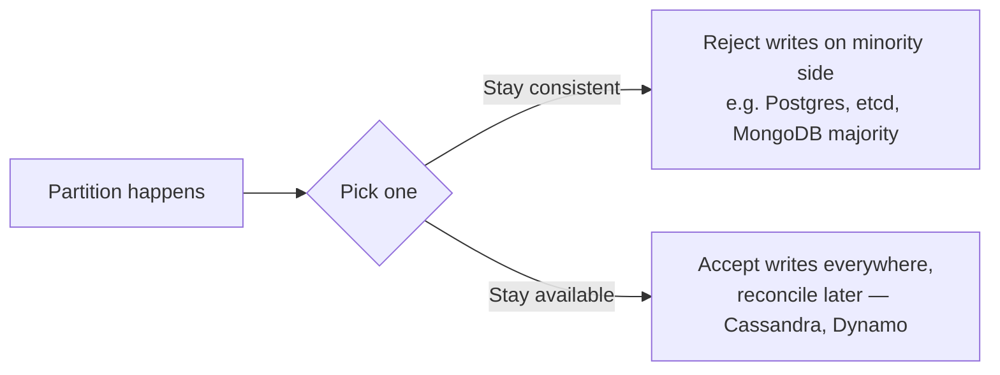
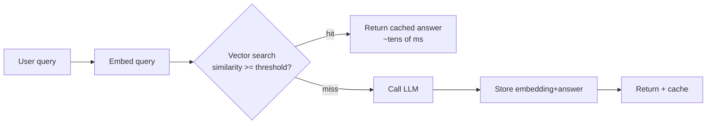
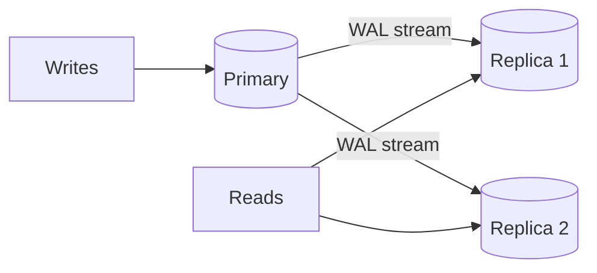
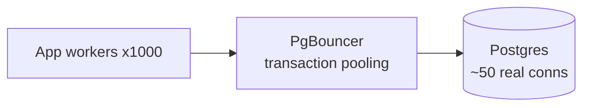
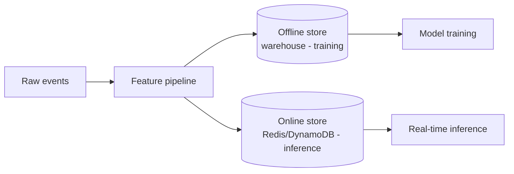

# Databases for AI Engineering — Detailed Learning (Deep Dive)

> This is the "read-everything-here-and-you-can-defend-any-database-decision-in-an-interview" guide. It goes from first principles (why do we even normalize? what *is* an index?) all the way to production system design for AI workloads — with the *why* behind every decision, current (2025–2026) reality, trade-offs, Mermaid diagrams, and real SQL/code. Read top to bottom once, then use the headings as a revision index.

---

## Table of Contents
1. [The big picture — a database is a contract](#1-the-big-picture)
2. [Relational modeling: normalization & denormalization](#2-relational-modeling)
3. [Indexes: the single biggest performance lever](#3-indexes)
4. [Query planning with EXPLAIN](#4-explain)
5. [Transactions & ACID](#5-transactions-acid)
6. [Isolation levels & anomalies](#6-isolation-levels)
7. [SQL vs NoSQL and the four NoSQL families](#7-sql-vs-nosql)
8. [CAP theorem & consistency models](#8-cap)
9. [Caching with Redis (patterns, invalidation, semantic caching)](#9-caching)
10. [Scaling: replication, sharding, partitioning, pooling](#10-scaling)
11. [AI-specific data patterns (pgvector, feature stores, chat history)](#11-ai-patterns)
12. [Security (SQLi, least privilege, encryption)](#12-security)
13. [Interview power-answers](#13-power-answers)
14. [Further reading](#14-further-reading)

---

## 1. The big picture

A database is a **contract about your data**: what shape it takes, what stays true no matter what (invariants), how many people can touch it at once, and what happens when the power goes out mid-write. Everything in this guide is really about picking and defending a set of contracts for a given workload.

For AI engineering specifically, four data jobs show up over and over:

1. **Operational data** — users, sessions, billing, permissions. Wants correctness → relational (PostgreSQL).
2. **Retrieval data** — document chunks + embeddings for RAG. Wants fast similarity search → pgvector / vector DB.
3. **Hot ephemeral data** — sessions, rate limits, semantic cache, queues. Wants speed → Redis.
4. **Analytical/feature data** — features for models, event logs. Wants scans → columnar / feature store.



> **Interview framing:** "I start from the workload — read/write ratio, consistency needs, query shapes, and scale — and choose the *lightest* store that satisfies the invariants. PostgreSQL is my default because I can add JSONB, full-text, and pgvector without adding a new system."

A recurring 2025–2026 theme: teams are **consolidating** rather than sprawling across five specialized stores. Keeping embeddings next to relational data means a JOIN stays a JOIN instead of becoming a network hop between two eventually-consistent services ([markaicode, 2026](https://markaicode.com/architecture/pgvector-rag-production/)). *Content was rephrased for compliance with licensing restrictions.*

---

## 2. Relational modeling

### Normalization
Normalization is the discipline of storing each fact **once**, so an update touches exactly one row. You progress through "normal forms":

| Form | Rule (plain English) | Kills |
|------|----------------------|-------|
| 1NF  | Atomic columns, no repeating groups | Arrays-in-a-cell |
| 2NF  | Non-key columns depend on the *whole* key | Partial dependencies |
| 3NF  | Non-key columns depend on *nothing but* the key | Transitive dependencies |
| BCNF | Every determinant is a candidate key | Edge-case anomalies |

**Why bother?** Redundant data drifts. If a customer's email lives in 3 tables, an update that misses one leaves you lying to somebody.

```sql
-- Normalized: one fact, one place
CREATE TABLE users (
    id          BIGSERIAL PRIMARY KEY,
    email       CITEXT UNIQUE NOT NULL,
    created_at  TIMESTAMPTZ NOT NULL DEFAULT now()
);

CREATE TABLE orders (
    id       BIGSERIAL PRIMARY KEY,
    user_id  BIGINT NOT NULL REFERENCES users(id),
    total    NUMERIC(12,2) NOT NULL CHECK (total >= 0),
    placed_at TIMESTAMPTZ NOT NULL DEFAULT now()
);
```

### Denormalization
Denormalization deliberately **duplicates** data to avoid expensive joins on the read path. You pay with write complexity (keep copies in sync) and buy read speed.



**Why/when:** normalize by default (correctness), denormalize when profiling proves a hot read path is join-bound and the data is read far more than written (dashboards, feeds, analytics rollups). In practice: keep the normalized source of truth, and materialize denormalized views (`MATERIALIZED VIEW`, summary tables, or a cache).

---

## 3. Indexes

An index is a **secondary data structure** that lets the database find rows without scanning the whole table — the book-index analogy is exact: instead of reading every page, you jump to the right one.

### B-tree (the default)
A balanced tree kept sorted on the indexed column(s). Lookups, range scans, and `ORDER BY` on the key are all `O(log n)`.



Because the tree is sorted, `WHERE created_at BETWEEN ... AND ...` walks a contiguous slice instead of testing every row.

```sql
CREATE INDEX idx_orders_user ON orders (user_id);
-- Composite: leftmost-prefix rule — this serves WHERE user_id=? [AND placed_at ...]
CREATE INDEX idx_orders_user_time ON orders (user_id, placed_at DESC);
-- Partial: index only the rows you actually query
CREATE INDEX idx_orders_open ON orders (user_id) WHERE status = 'open';
-- Covering: include extra columns so the query never touches the heap
CREATE INDEX idx_orders_cover ON orders (user_id) INCLUDE (total);
```

### Other index types (Postgres)
| Type | Best for |
|------|----------|
| **B-tree** | equality + range, sorting (default) |
| **Hash** | equality only |
| **GIN** | multi-value: JSONB, arrays, full-text |
| **GiST / SP-GiST** | geometric, ranges, nearest-neighbor |
| **BRIN** | huge, naturally-ordered tables (time-series) — tiny footprint |
| **HNSW / IVFFlat** (pgvector) | approximate nearest-neighbor on embeddings |

### The cost of indexes
Indexes are **not free**: every `INSERT`/`UPDATE`/`DELETE` must maintain them, and they consume disk + RAM. Rule of thumb: index to serve real query predicates and foreign keys; don't index columns you never filter/join/sort on.

---

## 4. EXPLAIN

`EXPLAIN` shows the planner's chosen strategy; `EXPLAIN (ANALYZE, BUFFERS)` actually runs it and reports real time + I/O.

```sql
EXPLAIN (ANALYZE, BUFFERS)
SELECT * FROM orders WHERE user_id = 42 ORDER BY placed_at DESC LIMIT 20;
```

What to look for:
- **Seq Scan** on a big table with a selective filter → missing index.
- **Index Scan / Index Only Scan** → good; "Index Only" means the covering index answered it without heap access.
- **Rows estimated vs actual** wildly off → stale statistics; run `ANALYZE`.
- **Nested Loop** with huge row counts → maybe wants a Hash Join; check work_mem.
- **Sort** spilling to disk → increase `work_mem` or add an ordered index.

> **Interview line:** "I never guess about performance. I reproduce the query, run `EXPLAIN (ANALYZE, BUFFERS)`, and let the plan tell me whether it's a missing index, a bad estimate, or a genuinely expensive query."

---

## 5. Transactions & ACID

A transaction groups statements so they succeed or fail **as one unit**. ACID is the four-part promise:

- **Atomicity** — all-or-nothing. A crash mid-transaction rolls back.
- **Consistency** — the DB moves from one valid state to another (constraints, FKs, checks hold).
- **Isolation** — concurrent transactions don't corrupt each other's view.
- **Durability** — once committed, it survives a crash (WAL / fsync).

```sql
BEGIN;
UPDATE accounts SET balance = balance - 100 WHERE id = 1;
UPDATE accounts SET balance = balance + 100 WHERE id = 2;
-- either both happen or neither
COMMIT;
```

Under the hood, PostgreSQL uses **MVCC (Multi-Version Concurrency Control)**: writers create new row versions instead of overwriting, so **readers never block writers and writers never block readers** ([codemia](https://codemia.io/courses/system_design_fundamentals/transaction_isolation_level)). The cost is dead tuples that `VACUUM` must reclaim. *Content was rephrased for compliance with licensing restrictions.*

---

## 6. Isolation levels & anomalies

The SQL standard defines four levels; each rules out one more class of anomaly than the one below it.

| Anomaly | What happens |
|---------|--------------|
| **Dirty read** | You read another txn's *uncommitted* change |
| **Non-repeatable read** | You re-read a row and its value changed |
| **Phantom read** | You re-run a range query and new rows appeared |
| **Write skew** | Two txns each read, then write, breaking a cross-row invariant |

| Level | Dirty | Non-repeatable | Phantom | Write skew |
|-------|:---:|:---:|:---:|:---:|
| Read Uncommitted | maybe* | yes | yes | yes |
| Read Committed | no | yes | yes | yes |
| Repeatable Read | no | no | no** | yes |
| Serializable | no | no | no | no |

\* PostgreSQL treats Read Uncommitted as Read Committed — it never shows dirty reads.
\** PostgreSQL's Repeatable Read is actually **Snapshot Isolation**, which already prevents phantoms but still allows write skew ([Jepsen](https://jepsen.io/analyses/postgresql-12.3)).



**Serializable** in PostgreSQL is implemented as **SSI (Serializable Snapshot Isolation)**: it detects dangerous read/write dependency cycles and aborts one transaction with a serialization error — so your app **must retry** on SQLSTATE `40001`.

```sql
BEGIN ISOLATION LEVEL SERIALIZABLE;
-- ... reads + writes ...
COMMIT;  -- may raise 40001 -> catch and retry the whole txn
```

> **Interview trade-off:** higher isolation = fewer anomalies but more aborts/retries and lower concurrency. Default to Read Committed; escalate specific transactions to Serializable when a cross-row invariant matters (booking seats, inventory, financial balances). Note: even managed Postgres can have surprising edge cases — a 2025 Jepsen analysis found multi-AZ RDS clusters occasionally violating Snapshot Isolation ([Jepsen 17.4](https://jepsen.io/analyses/amazon-rds-for-postgresql-17.4)).

---

## 7. SQL vs NoSQL

**SQL (relational):** fixed schema, strong consistency, joins, ACID, mature. Best when relationships and correctness matter. Scales up (and out with more effort).

**NoSQL:** umbrella for four families that trade joins/schema for scale, flexibility, or a specialized access pattern.

| Family | Example | Data model | Sweet spot |
|--------|---------|-----------|-----------|
| **Document** | MongoDB | JSON-ish documents | flexible/evolving schemas, per-object reads |
| **Key-Value** | Redis, DynamoDB | key → blob | caching, sessions, ultra-low-latency lookups |
| **Wide-column** | Cassandra, ScyllaDB | rows w/ dynamic columns, partitioned | write-heavy, massive scale, time-series |
| **Graph** | Neo4j | nodes + edges | relationship traversal, recommendations, GraphRAG |



> **Interview honesty:** "NoSQL isn't 'faster', it's *different guarantees*. You usually give up joins and multi-key transactions to get horizontal scale or schema flexibility. Most apps are fine on PostgreSQL until a specific access pattern demands otherwise."

---

## 8. CAP theorem & consistency models

**CAP:** during a **network Partition (P)**, a distributed system can guarantee **Consistency (C)** *or* **Availability (A)**, not both. Since partitions are a fact of life, you're really choosing CP vs AP *when a partition happens*.

- **CP** (e.g., a strongly-consistent RDBMS, etcd): refuse/fail writes to stay correct.
- **AP** (e.g., Cassandra, DynamoDB in eventual mode): keep serving, reconcile later.



**PACELC** extends it: *else* (when there's no partition) you trade **Latency vs Consistency**. Consistency models form a spectrum: **strong / linearizable → sequential → causal → eventual**. Weaker models are faster and more available but push conflict-resolution onto you.

> **Interview line:** "CAP is a *partition-time* decision, not a permanent label. I ask: when the network splits, would I rather return a stale answer or an error? For a bank balance, error (CP). For a 'likes' counter, stale is fine (AP)."

---

## 9. Caching with Redis

Redis is an in-memory key-value store: microsecond reads, rich data types (strings, hashes, sorted sets, streams), TTLs, pub/sub, and Lua scripting.

### Core caching patterns
| Pattern | Reads | Writes | Main risk |
|---------|-------|--------|-----------|
| **Cache-aside** (default) | app checks cache, loads DB on miss, fills cache | app writes DB, then *deletes* the key | first read after a write misses |
| **Write-through** | read from cache | write DB + cache together | two writes per update |
| **Write-behind** | read from cache | write cache, worker flushes DB later | data loss if cache dies pre-flush |
| **Read-through** | ask cache; cache loads DB on miss | paired w/ write-through/behind | cache layer must own DB access |

Table adapted from [Upstash, 2026](https://upstash.com/blog/redis-caching-patterns-2026). *Content was rephrased for compliance with licensing restrictions.*

```python
# Cache-aside (the safe default)
def get_user(uid):
    key = f"user:{uid}"
    if (cached := r.get(key)):
        return json.loads(cached)
    user = db.fetch_user(uid)
    r.set(key, json.dumps(user), ex=300)   # TTL guards against staleness
    return user

def update_user(uid, data):
    db.update_user(uid, data)
    r.delete(f"user:{uid}")   # invalidate, don't update — avoids race-y stale writes
```

### Invalidation (the hard part)
"There are only two hard things in CS…" Strategies: **TTL expiry** (simplest, bounded staleness), **explicit delete on write**, **versioned keys** (`user:42:v7`), and **event-driven** invalidation via change-data-capture. Guard against the classics:
- **Thundering herd / stampede** — many misses hit the DB at once → use a lock/single-flight or "early recompute."
- **Cache penetration** — queries for non-existent keys → cache negative results briefly.
- **Cache avalanche** — many keys expire together → jitter the TTLs.

### Semantic caching of LLM responses (AI-specific)
Traditional caches need a **byte-identical** key. LLM prompts are paraphrased endlessly, so exact-match hit rates are terrible. **Semantic caching** keys on **meaning**: embed the query, do a vector similarity search over past queries, and if the nearest neighbor is within a similarity threshold, return its stored answer — skipping the model call ([Redis](https://redis.io/blog/how-to-cache-semantic-search/)).



Design gotchas (2025–2026):
- **Threshold tuning** is everything: too loose returns wrong answers; too tight kills hit rate. Treat a vector match as a *candidate* only until policy/threshold approves reuse ([Oracle, 2026](https://blogs.oracle.com/developers/measuring-semantic-cache-quality-latency-and-provider-call-avoidance-with-oracle-ai-database-26ai)).
- **Context matters:** the same question ("what's my balance?") has different answers per user — scope keys by user/tenant/context.
- **Freshness:** TTL or event-invalidate when the underlying knowledge changes.
- **Measure real savings:** count an avoided model call only after an *approved* reuse, not merely a nearby vector.

*Content was rephrased for compliance with licensing restrictions.*

---

## 10. Scaling

### Replication (scale reads + HA)
A primary streams its WAL to replicas. Reads fan out to replicas; writes go to the primary.



- **Async replication:** fast, but replicas lag → possible stale reads (read-your-writes issues).
- **Sync replication:** no data loss on failover, higher write latency.
- **Failover:** promote a replica; use a proxy (e.g., Patroni + HAProxy) to move the write endpoint.

### Partitioning (split one table)
Break a big table into chunks by **range** (time), **list** (region), or **hash** (id). Queries touch only relevant partitions ("partition pruning"), and you can drop old partitions instantly.

```sql
CREATE TABLE events (id BIGINT, ts TIMESTAMPTZ NOT NULL, payload JSONB)
    PARTITION BY RANGE (ts);
CREATE TABLE events_2026_01 PARTITION OF events
    FOR VALUES FROM ('2026-01-01') TO ('2026-02-01');
```

### Sharding (split across machines — scale writes)
When one primary can't hold the write volume/data, split rows across independent database nodes by a **shard key**.

```mermaid
flowchart TD
    App --> Router{Shard router\nhash(user_id)}
    Router -->|shard 0| S0[(DB 0)]
    Router -->|shard 1| S1[(DB 1)]
    Router -->|shard 2| S2[(DB 2)]
```

- **Choosing the shard key** is the whole game: pick something that spreads load evenly *and* keeps related rows together to avoid cross-shard queries.
- **Costs:** cross-shard joins/transactions are hard; rebalancing is painful. Prefer consistent hashing to limit data movement when adding shards.

### Connection pooling
Postgres connections are heavyweight (a process each). App servers open thousands → the DB melts. Put a pooler (**PgBouncer**) in front so many clients share few real connections.



> **Read vs write scaling, in one breath:** "Reads scale cheaply with replicas + caching. Writes are the hard part — you scale them by partitioning, then sharding, and by keeping transactions short. Before any of that, add a connection pooler; most 'DB is slow' incidents are actually connection exhaustion."

---

## 11. AI-specific data patterns

### pgvector — embeddings inside Postgres
`pgvector` adds a `vector` type + ANN indexes so RAG retrieval lives next to your relational data (real joins, real transactions, one backup story).

```sql
CREATE EXTENSION IF NOT EXISTS vector;

CREATE TABLE documents (
    id         BIGSERIAL PRIMARY KEY,
    tenant_id  BIGINT NOT NULL,
    content    TEXT NOT NULL,
    embedding  VECTOR(1536)            -- match your embedding model dims
);

-- HNSW: high recall, fast queries, more memory (the 2025-2026 default)
CREATE INDEX ON documents USING hnsw (embedding vector_cosine_ops)
    WITH (m = 16, ef_construction = 64);

-- Query: nearest neighbors, WITH a metadata filter (hybrid)
SET hnsw.ef_search = 100;              -- higher = better recall, slower
SELECT id, content
FROM documents
WHERE tenant_id = 7                    -- structured filter + vector search in one query
ORDER BY embedding <=> $1              -- <=> cosine distance
LIMIT 5;
```

**Scaling pgvector (from the 2025–2026 field reports):**
- **HNSW over IVFFlat** for recall/latency; tune `m`, `ef_construction` (build) and `ef_search` (query). Higher `ef_search` trades latency for recall ([markaicode](https://markaicode.com/architecture/pgvector-system-design-architecture-1053/)).
- **pgvector 0.8+ iterative index scans** fix recall collapse when combining ANN with restrictive metadata filters ([ClickHouse](https://clickhouse.com/resources/engineering/scale-vector-search-postgres)).
- Vector indexes are **RAM-hungry and not partition-friendly** — scale reads with **replicas + PgBouncer**, use **quantization** and tenant partitioning to fit memory. pgvector is comfortable under ~10M vectors; beyond that, partition or move to a dedicated vector engine ([markaicode](https://markaicode.com/architecture/llm-architecture-with-pgvector/)).
- **Budget for reindex** whenever you change embedding models — keep spare compute to rebuild HNSW without downtime.

*Content was rephrased for compliance with licensing restrictions.*

### Feature stores
A feature store serves the **same** feature values to training (offline, batch) and inference (online, low-latency) to kill training/serving skew.



Key ideas: **point-in-time correctness** (no leakage from the future during training), a shared **feature registry**, and dual online/offline materialization.

### Chat history & conversation state
LLM apps need durable, session-scoped memory. Model it relationally and index for the "load recent turns" access pattern.

```sql
CREATE TABLE conversations (
    id         UUID PRIMARY KEY DEFAULT gen_random_uuid(),
    user_id    BIGINT NOT NULL REFERENCES users(id),
    title      TEXT,
    created_at TIMESTAMPTZ NOT NULL DEFAULT now()
);

CREATE TABLE messages (
    id              BIGSERIAL PRIMARY KEY,
    conversation_id UUID NOT NULL REFERENCES conversations(id) ON DELETE CASCADE,
    role            TEXT NOT NULL CHECK (role IN ('system','user','assistant','tool')),
    content         TEXT NOT NULL,
    token_count     INT,
    created_at      TIMESTAMPTZ NOT NULL DEFAULT now()
);
-- Hot path: fetch a conversation's turns in order
CREATE INDEX idx_messages_convo ON messages (conversation_id, created_at);
```

Patterns: keep **recent turns** hot in Redis, persist everything in Postgres; **summarize/trim** older turns to fit the context window; for agents, persist **checkpoints** so long-running workflows resume across restarts (a major 2025–2026 theme in LangGraph-style runtimes, per [Oracle](https://blogs.oracle.com/developers/one-database-for-the-whole-langchain-ecosystem-memory-persistence-and-deep-agents-on-oracle-ai-database)). *Content was rephrased for compliance with licensing restrictions.*

---

## 12. Security

- **SQL injection:** never string-concatenate user input into SQL. Use **parameterized queries / prepared statements** always. ORMs help but raw fragments can still be injectable.
  ```python
  # BAD: cur.execute(f"SELECT * FROM users WHERE email='{email}'")
  # GOOD:
  cur.execute("SELECT * FROM users WHERE email = %s", (email,))
  ```
- **Least privilege:** the app role should only have the grants it needs (no superuser, no DDL in prod). Separate read-only roles for replicas/analytics. Use row-level security (RLS) for multi-tenant isolation.
  ```sql
  ALTER TABLE documents ENABLE ROW LEVEL SECURITY;
  CREATE POLICY tenant_isolation ON documents
      USING (tenant_id = current_setting('app.tenant_id')::bigint);
  ```
- **Encryption:** TLS in transit; encryption at rest (disk/tablespace or column-level for PII). Manage keys in a KMS, not in the app.
- **Secrets:** connection strings in a secret manager, rotated; never in code or logs.
- **Auditing & PII:** log access to sensitive tables; apply data-retention/deletion policies (GDPR "right to be forgotten"). For AI apps, be careful that prompts/embeddings don't leak PII into a shared cache.

---

## 13. Interview power-answers

- **"SQL or NoSQL?"** — "Start relational for correctness and joins; reach for a NoSQL family only when a specific access pattern (single-key hot reads, write-heavy scale, graph traversal, flexible docs) demands it."
- **"Scale reads vs writes?"** — "Reads: replicas + caching. Writes: short transactions, partitioning, then sharding on a well-chosen key. Add a pooler first."
- **"Explain isolation trade-offs."** — "Higher isolation removes anomalies but costs concurrency and forces retries. Read Committed by default; Serializable for cross-row invariants, with retry-on-40001."
- **"CAP in practice?"** — "It's a partition-time choice between a stale answer and an error. CP for money, AP for counters."
- **"Design semantic caching."** — "Embed query → vector search → return cached answer above a tuned threshold, scoped per user/context, with TTL/event invalidation, and measure *approved* reuse to prove savings."
- **"pgvector at scale?"** — "HNSW with tuned ef_search, iterative scans for filtered recall, replicas + PgBouncer for read scale, quantization/partitioning for memory; migrate past ~10M vectors."

---

## 14. Further reading
- PostgreSQL docs — Transaction Isolation: https://www.postgresql.org/docs/current/transaction-iso.html
- Use The Index, Luke (indexing): https://use-the-index-luke.com/
- pgvector: https://github.com/pgvector/pgvector
- Redis semantic cache: https://redis.io/docs/latest/develop/use-cases/semantic-cache/
- Jepsen analyses (consistency in the real world): https://jepsen.io/analyses
- Designing Data-Intensive Applications — Martin Kleppmann (the canonical reference)

---

*Content synthesized from general domain knowledge and current (2025–2026) interview trends; rephrased for compliance with licensing restrictions.*
