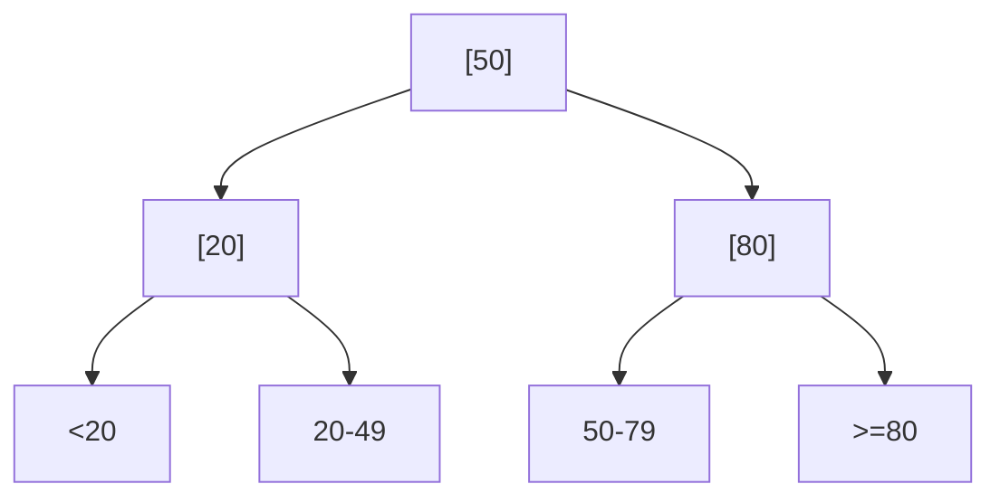
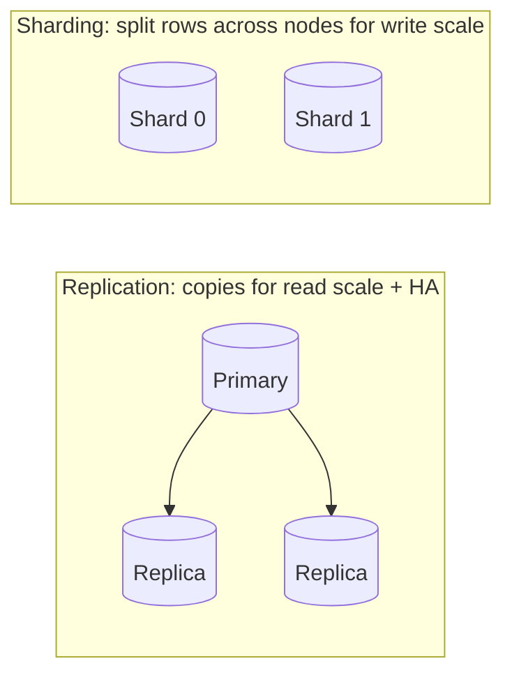

# Databases — Medium Interview Questions

> Mid-level questions that probe *how* things work and *when* you'd choose one option over another. Answers include SQL, diagrams, and trade-offs.

## Quick Coverage Map
| # | Question | Theme |
|---|----------|-------|
| 1 | How does a B-tree index speed up queries? | Indexing |
| 2 | Explain the four isolation levels & their anomalies | Transactions |
| 3 | How do you debug a slow query? | Performance |
| 4 | Composite index & leftmost-prefix rule | Indexing |
| 5 | Normalization vs denormalization trade-offs | Modeling |
| 6 | The four NoSQL types & when to use each | Data models |
| 7 | Cache invalidation strategies | Caching |
| 8 | Replication vs sharding vs partitioning | Scaling |
| 9 | What is connection pooling and why? | Scaling |
| 10 | MVCC — how does it work? | Concurrency |
| 11 | Designing a chat-history schema | AI patterns |
| 12 | Optimistic vs pessimistic locking | Concurrency |

---

### 1. How does a B-tree index actually speed up queries?
A B-tree keeps keys **sorted** in a shallow, balanced tree. Finding a value is `O(log n)` — a few page reads instead of scanning every row. Because it's sorted, it also serves **range scans** (`BETWEEN`, `<`, `>`), `ORDER BY` on the key, and `MIN/MAX` cheaply.


It doesn't help with leading wildcards (`LIKE '%foo'`) or functions on the column unless you build an expression index. A **covering index** (`INCLUDE`) can answer a query entirely from the index ("Index Only Scan"), skipping the table heap.

---

### 2. Explain the four isolation levels and the anomalies each prevents.
| Level | Prevents | Still allows |
|-------|----------|--------------|
| Read Uncommitted | (nothing; dirty reads possible) | dirty, non-repeatable, phantom |
| Read Committed | dirty reads | non-repeatable, phantom |
| Repeatable Read | + non-repeatable reads | phantoms (in standard); write skew |
| Serializable | everything | — (may abort with serialization error) |

Note: in **PostgreSQL**, Repeatable Read = **Snapshot Isolation** (already blocks phantoms but allows *write skew*), and Serializable uses SSI which aborts conflicting transactions (retry on `40001`). Higher isolation = fewer anomalies but more contention and retries.

---

### 3. Walk me through debugging a slow query.
1. **Reproduce** and capture the exact query + params.
2. `EXPLAIN (ANALYZE, BUFFERS)` — read the plan.
3. Look for **Seq Scan** on a big table with a selective filter → add/adjust an index.
4. Check **estimated vs actual rows** — big gaps mean stale stats → `ANALYZE`.
5. Watch for **Sort spilling to disk** or **Hash Batches** → raise `work_mem` or add an ordered index.
6. Confirm the index is **usable** (no function wrapping the column, right column order).
7. Consider caching, denormalization, or a covering index if it's a hot path.

> "I never guess — the plan tells me whether it's a missing index, a bad estimate, or genuinely expensive work."

---

### 4. What is a composite index and the leftmost-prefix rule?
A composite index covers multiple columns in order, e.g. `(user_id, placed_at)`. It can serve queries filtering on a **left prefix** of those columns: `user_id`, or `user_id AND placed_at` — but **not** `placed_at` alone. Column order should match your query predicates and put the most selective/equality column first, ranges last.

```sql
CREATE INDEX idx ON orders (user_id, placed_at DESC);
-- Serves: WHERE user_id=? ORDER BY placed_at DESC
```

---

### 5. Normalization vs denormalization — how do you decide?
| | Normalized | Denormalized |
|---|-----------|--------------|
| Writes | simple, one place | must sync duplicates |
| Reads | joins needed | fewer joins, faster |
| Integrity | strong | risk of drift |
| Best for | OLTP, source of truth | read-heavy dashboards/feeds |

Decision: keep a normalized source of truth; denormalize a specific hot read path (summary table, materialized view, cache) only after profiling proves joins are the bottleneck.

---

### 6. Name the four NoSQL types and when you'd use each.
- **Document (MongoDB):** self-contained JSON docs; evolving schemas, per-object reads.
- **Key-Value (Redis, DynamoDB):** fastest single-key access; caching, sessions.
- **Wide-column (Cassandra):** partitioned, write-optimized; time-series, huge write volume, multi-datacenter.
- **Graph (Neo4j):** nodes + edges; relationship traversal, recommendations, GraphRAG.

The choice is about **access pattern and guarantees**, not raw speed.

---

### 7. What cache invalidation strategies do you know?
- **TTL expiry** — simplest, bounds staleness.
- **Delete-on-write (cache-aside)** — invalidate the key when the DB changes.
- **Versioned keys** — `user:42:v8`; bump version to invalidate atomically.
- **Event-driven** — CDC/message triggers invalidation across services.

Watch for **stampede** (lock/single-flight on miss), **penetration** (cache negative results), and **avalanche** (jitter TTLs so keys don't expire together).

---

### 8. Replication vs sharding vs partitioning?

- **Partitioning:** split one big table into chunks (by range/hash) *within one DB* — pruning + easy archival.
- **Replication:** copy the whole DB to replicas — scales **reads** and gives HA.
- **Sharding:** split data across independent DBs by a shard key — scales **writes**, but cross-shard joins/transactions are hard.

---

### 9. What is connection pooling and why does it matter?
Each PostgreSQL connection is a separate OS process, so thousands of app connections exhaust memory/CPU. A pooler like **PgBouncer** multiplexes many client connections onto a small set of real DB connections (transaction pooling). Most "the database is slow under load" incidents are actually connection exhaustion — the pooler fixes it cheaply.

---

### 10. How does MVCC work?
Multi-Version Concurrency Control: instead of overwriting a row, the DB writes a **new version** and keeps the old one visible to transactions that started earlier. So **readers never block writers and writers never block readers**. Each transaction sees a consistent snapshot. The cost: dead row versions accumulate and must be reclaimed by `VACUUM` (and autovacuum tuning matters at scale).

---

### 11. Design a chat-history schema for an LLM app.
```sql
CREATE TABLE conversations (
  id UUID PRIMARY KEY DEFAULT gen_random_uuid(),
  user_id BIGINT REFERENCES users(id),
  created_at TIMESTAMPTZ DEFAULT now()
);
CREATE TABLE messages (
  id BIGSERIAL PRIMARY KEY,
  conversation_id UUID REFERENCES conversations(id) ON DELETE CASCADE,
  role TEXT CHECK (role IN ('system','user','assistant','tool')),
  content TEXT NOT NULL,
  created_at TIMESTAMPTZ DEFAULT now()
);
CREATE INDEX idx_msg_convo ON messages (conversation_id, created_at);
```
Keep recent turns hot in Redis, persist all in Postgres, summarize/trim old turns to fit the context window.

---

### 12. Optimistic vs pessimistic locking?
- **Pessimistic:** lock the row up front (`SELECT ... FOR UPDATE`); others wait. Good for high-contention writes.
- **Optimistic:** don't lock; check a `version` column at write time and retry if it changed. Good for low-contention, high-read workloads (no lock overhead).

```sql
UPDATE items SET qty = qty - 1, version = version + 1
WHERE id = 5 AND version = 12;   -- 0 rows updated => someone else won => retry
```

---

## Further Reading
- PostgreSQL isolation docs: https://www.postgresql.org/docs/current/transaction-iso.html
- PgBouncer: https://www.pgbouncer.org/
- Redis caching patterns: https://redis.io/docs/latest/develop/

---

*Content synthesized from general domain knowledge and current (2025-2026) interview trends; rephrased for compliance with licensing restrictions.*
