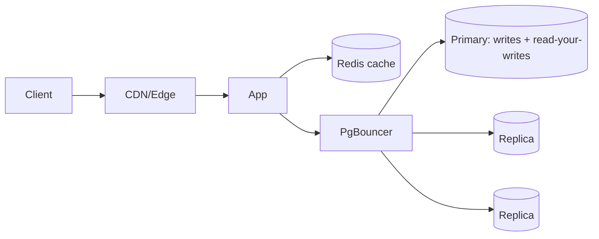
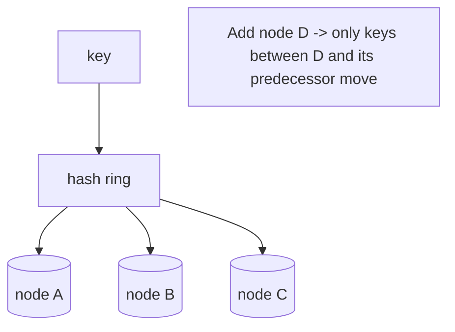
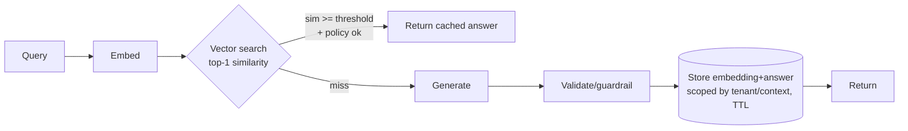
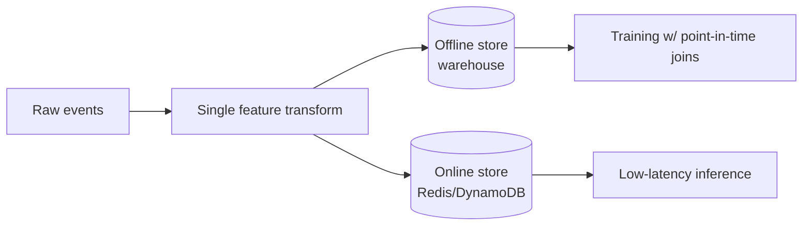

# Databases — Advanced / Expert Interview Questions

> Senior/staff-level questions. These are open-ended system-design and trade-off discussions. There's rarely one right answer — interviewers want to see you reason about scale, consistency, failure, and cost.

## Quick Coverage Map
| # | Question | Theme |
|---|----------|-------|
| 1 | Scaling reads to millions of QPS | Read scaling |
| 2 | Scaling writes past a single primary | Write scaling |
| 3 | Choosing a shard key & rebalancing | Sharding |
| 4 | Isolation trade-offs & handling write skew | Concurrency |
| 5 | CAP/PACELC in a real design | Distributed |
| 6 | Designing a production semantic cache | AI + caching |
| 7 | Running pgvector at scale | AI + vectors |
| 8 | Feature store architecture & training/serving skew | ML data |
| 9 | Multi-region consistency & failover | Distributed |
| 10 | Idempotency & exactly-once in distributed writes | Reliability |
| 11 | Handling hot partitions / celebrity problem | Scaling |
| 12 | Zero-downtime schema migrations at scale | Operations |

---

### 1. How do you scale reads to very high QPS?
Layered approach, cheapest first:
1. **Cache** (Redis) in front of the DB — cache-aside with TTLs; often removes 80–95% of read load.
2. **Read replicas** — fan out reads; use a proxy for routing. Accept replica lag → route read-your-writes to the primary or use logical session stickiness.
3. **Covering/partial indexes** so hot queries are index-only.
4. **Materialized views / denormalized summary tables** for expensive aggregates.
5. **CDN / edge caching** for public, cacheable payloads.


Trade-off to name: replica lag means **stale reads**. Decide per-query whether staleness is acceptable.

---

### 2. How do you scale writes beyond one primary?
Writes are the hard part (a single primary is the ceiling). Options, escalating:
1. **Reduce write amplification** — batch, shorten transactions, drop unnecessary indexes, offload async work to a queue.
2. **Vertical scale** the primary (buys time, not infinite).
3. **Partition** large tables (range/hash) to reduce per-write index/lock overhead and enable pruning.
4. **Shard** across independent primaries by a shard key — true horizontal write scale.
5. **CQRS / event sourcing** — append-only write log, derive read models asynchronously.

Cost: you lose global transactions and cross-shard joins; you take on rebalancing and routing complexity.

---

### 3. How do you choose a shard key, and what breaks when you get it wrong?
A good shard key:
- **Spreads load evenly** (avoid monotonic keys like timestamps → all writes hit one shard).
- **Co-locates related data** so common queries stay single-shard (e.g., shard by `tenant_id` so a tenant's data lives together).
- Has **high cardinality**.

Failure modes: **hot shards** (skewed key), **scatter-gather** queries (need data from every shard → slow, fragile), and painful **rebalancing**. Use **consistent hashing** (or range with a directory) so adding a shard moves only a fraction of keys, not everything.



---

### 4. When does higher isolation bite you, and how do you handle write skew?
Serializable gives correctness but **aborts** conflicting transactions, so under contention you get retry storms and latency spikes. Repeatable Read (Snapshot Isolation in Postgres) is cheaper but permits **write skew** — two transactions each read a consistent snapshot, then write, jointly violating an invariant (e.g., both doctors go off-call because each saw two on duty).

Fixes:
- Use **Serializable** for the specific transactions guarding a cross-row invariant, with app-level retry on `40001`.
- Or take an explicit lock (`SELECT ... FOR UPDATE`) on the rows that define the invariant.
- Or enforce the invariant with a **constraint/exclusion constraint** so the DB rejects the bad state regardless of isolation.

Real-world caveat: even managed Postgres has edge cases — a 2025 analysis found multi-AZ RDS occasionally violating Snapshot Isolation, so don't assume the label is airtight ([Jepsen](https://jepsen.io/analyses/amazon-rds-for-postgresql-17.4)).

---

### 5. Apply CAP/PACELC to a real design decision.
CAP is a **partition-time** choice; PACELC adds the *normal-time* trade-off of **latency vs consistency**.

Example — multi-region user sessions:
- If a region is partitioned from the primary, do you **reject logins** (CP, correct) or **serve possibly-stale sessions** (AP, available)? For auth, lean CP for writes but allow AP reads of cached tokens.
- Even without a partition, synchronous cross-region replication adds latency (the "ELC" part). Many systems choose **local reads + async replication** and accept bounded staleness.

Name the model explicitly: strong/linearizable for money and uniqueness; causal for chat ordering; eventual for counters/feeds.

---

### 6. Design a production semantic cache for an LLM service.

Design decisions:
- **Keying by meaning, not bytes** — embed the query, ANN search over prior queries.
- **Threshold tuning is the core risk**: too loose → wrong answers served; too tight → low hit rate. Treat a vector match as a *candidate* until threshold + policy approve reuse.
- **Scope keys** by user/tenant/context — "what's my balance?" isn't shareable.
- **Freshness**: TTL + event invalidation when source knowledge changes.
- **Guardrails**: validate before caching; never cache a hallucinated/unsafe answer.
- **Measure real ROI**: count an avoided model call only after *approved* reuse, not merely a nearby vector ([Oracle, 2026](https://blogs.oracle.com/developers/measuring-semantic-cache-quality-latency-and-provider-call-avoidance-with-oracle-ai-database-26ai)).
- **Two-tier**: exact-match hash cache in front of the semantic cache for repeated identical prompts.

*Content was rephrased for compliance with licensing restrictions.*

---

### 7. How do you run pgvector at scale (millions of vectors, thousands of QPS)?
- **Index:** HNSW (not IVFFlat) for recall/latency; tune build (`m`, `ef_construction`) and query (`hnsw.ef_search` — higher = better recall, more latency).
- **Filtered recall:** enable pgvector **0.8+ iterative index scans** so restrictive metadata filters don't collapse recall ([ClickHouse, 2025](https://clickhouse.com/resources/engineering/scale-vector-search-postgres)).
- **Memory:** HNSW is RAM-hungry and **not partition-friendly**. Use **quantization** (halfvec/scalar) and **tenant partitioning** to fit RAM; keep hot index blocks in the buffer cache.
- **Read scale:** replicas + PgBouncer; separate the vector cluster from OLTP if it competes for resources.
- **Ingestion:** async worker pool, batch embeddings, pre-compute — keep the write path off the query path.
- **Reindex budget:** every embedding-model change means a full HNSW rebuild — keep ~2x compute headroom to rebuild without downtime.
- **Know the ceiling:** comfortable under ~10M vectors; beyond that, partition hard or move to a dedicated ANN engine ([markaicode, 2026](https://markaicode.com/architecture/llm-architecture-with-pgvector/)).

*Content was rephrased for compliance with licensing restrictions.*

---

### 8. Design a feature store; how do you avoid training/serving skew?
The core problem: features computed one way in a training notebook and another way in the serving path → the model sees different distributions in prod.


Principles:
- **One transformation definition** materialized to both offline (training) and online (serving) stores.
- **Point-in-time correctness**: when building training data, join feature values *as they were at event time*, never future values (prevents leakage).
- **Feature registry** with versioning + freshness SLAs.
- **Online store** optimized for single-key millisecond reads (Redis/DynamoDB).

---

### 9. How do you handle multi-region consistency and failover?
- **Single-writer, multi-reader:** one region owns writes, others replicate (async). Simple, but failover must promote a new writer and redirect the endpoint (Patroni/consensus). Async replication risks small data loss on failover; synchronous avoids loss at latency cost.
- **Multi-writer:** needs conflict resolution (CRDTs, last-write-wins with caveats, or consensus like Raft/Paxos as in Spanner/CockroachDB). Strong global consistency costs cross-region round-trips.
- **Practical stance:** most teams pick single-writer + async replicas + fast automated failover, and design the app to tolerate a few seconds of read staleness.

---

### 10. How do you get idempotent / exactly-once writes in a distributed system?
True exactly-once delivery is impossible across networks; you achieve **effectively-once** via idempotency:
- **Idempotency keys**: client sends a unique key; the server dedupes (`INSERT ... ON CONFLICT DO NOTHING` on the key).
- **Outbox pattern**: write the business row and an outbox event in the *same transaction*, then a relay publishes it — no dual-write inconsistency.
- **Dedup on the consumer** using a processed-message table.
- Make operations **naturally idempotent** where possible (set state, don't increment blindly).

```sql
INSERT INTO payments (idempotency_key, amount)
VALUES ($1, $2)
ON CONFLICT (idempotency_key) DO NOTHING;
```

---

### 11. How do you handle a hot partition / the "celebrity problem"?
When one key (a celebrity user, a viral item) concentrates load on a single shard/partition:
- **Read side:** cache aggressively, add replicas for that key, or fan out reads.
- **Write side:** split the hot key into sub-keys (`user:42:shard:0..N`) and aggregate; or buffer writes and batch.
- **Design:** choose a shard key that doesn't create natural hotspots; add a per-key salt for extreme cases.
- **Isolation:** rate-limit or give hot tenants dedicated capacity so they don't starve others (noisy-neighbor).

---

### 12. How do you run zero-downtime schema migrations at scale?
- **Expand/contract (parallel change):** add new column/table (nullable, no rewrite), backfill in batches, dual-write, switch reads, then drop the old — never a big-bang breaking change.
- Avoid locking DDL on hot tables: adding a `NOT NULL DEFAULT` can rewrite the whole table on older engines — add nullable then backfill.
- Create indexes **`CONCURRENTLY`** to avoid blocking writes.
- Backfill in **small batches** to avoid long transactions and replication lag.
- Keep migrations **backward-compatible** with the currently-deployed app version (rolling deploys).

```sql
CREATE INDEX CONCURRENTLY idx_new ON big_table (col);  -- no write lock
```

---

## Further Reading
- Designing Data-Intensive Applications — Martin Kleppmann
- Jepsen analyses: https://jepsen.io/analyses
- PostgreSQL SSI (Serializable): https://wiki.postgresql.org/wiki/SSI
- Scaling pgvector: https://clickhouse.com/resources/engineering/scale-vector-search-postgres
- Redis semantic caching: https://redis.io/docs/latest/develop/use-cases/semantic-cache/

---

*Content synthesized from general domain knowledge and current (2025-2026) interview trends; rephrased for compliance with licensing restrictions.*
