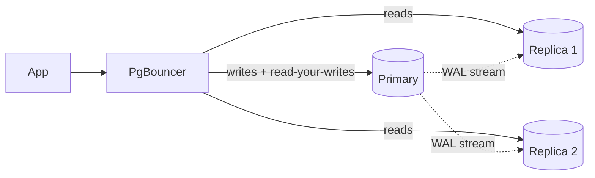
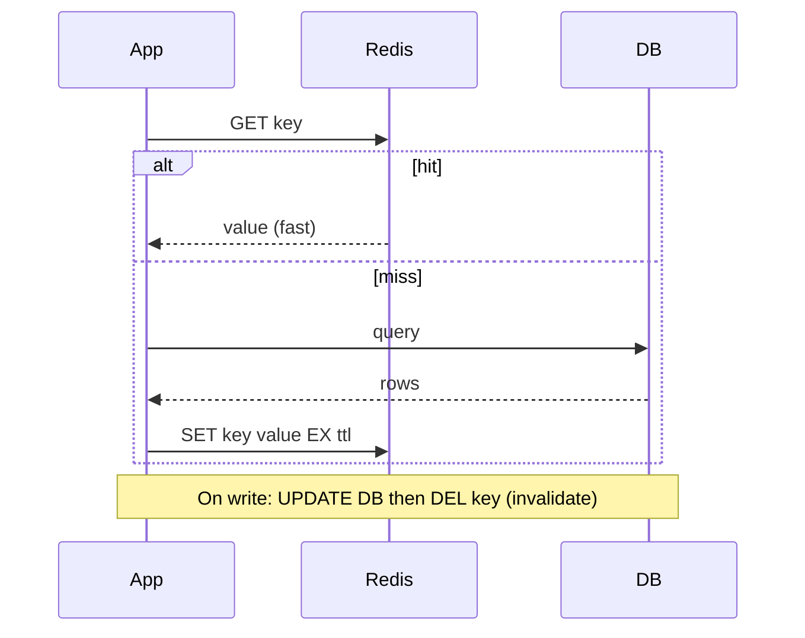
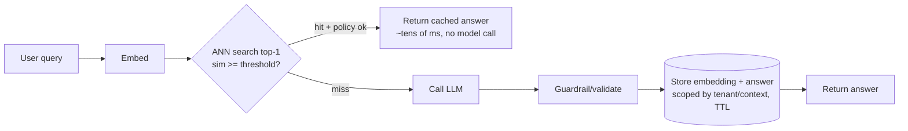
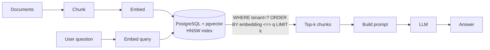
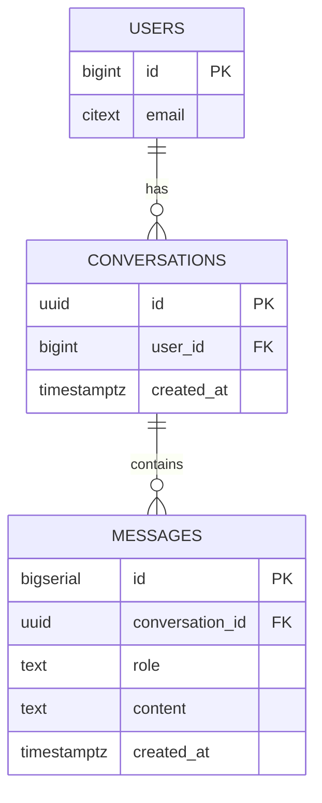
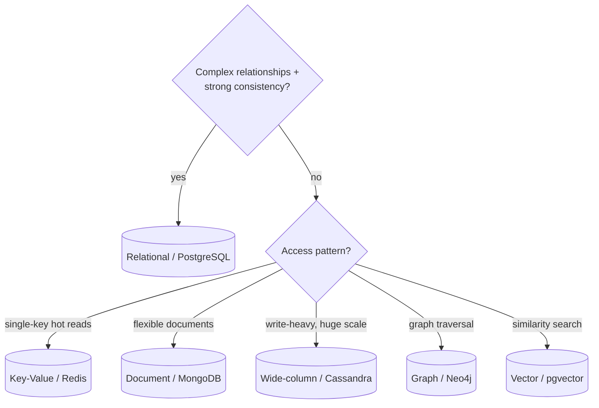
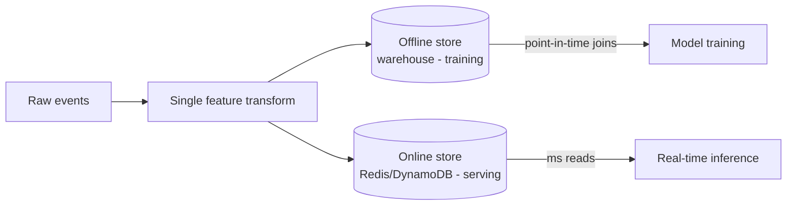
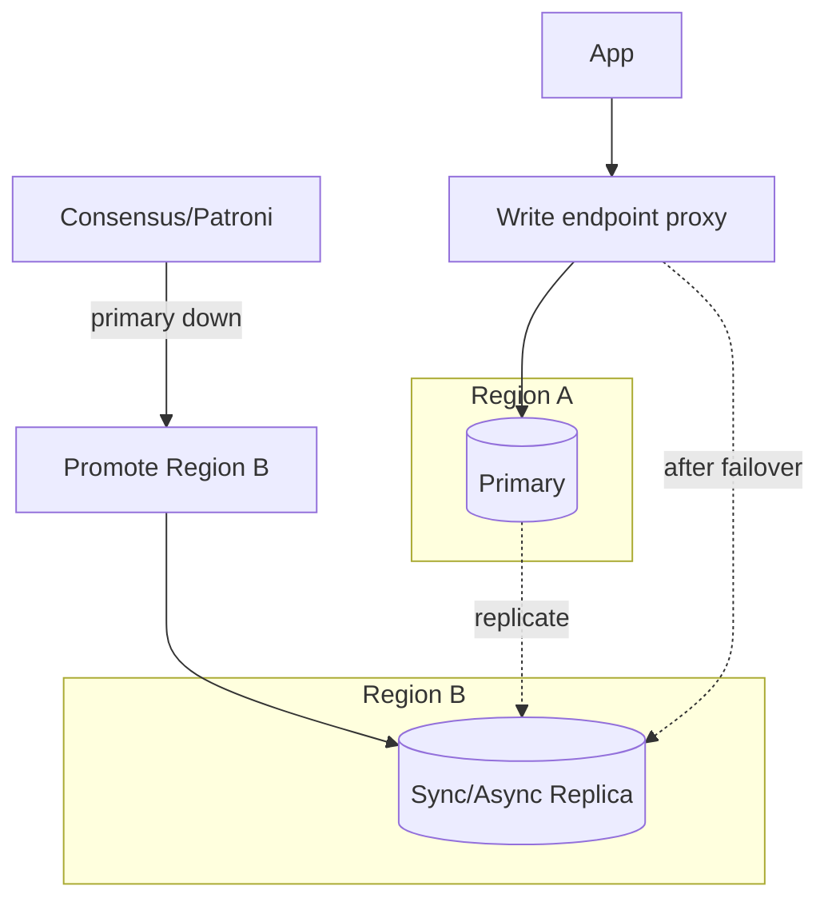

# Databases — Use-Case Diagrams

> Mermaid diagrams for the database patterns that come up most in AI/backend system design. Each has a one-line "why" and "when."

---

## 1. Read replicas (scale reads + HA)
**Why:** most workloads are read-heavy; replicas absorb reads and provide failover.
**When:** read/write ratio is high and some replica lag (stale reads) is acceptable.



---

## 2. Sharding (scale writes)
**Why:** one primary can't hold the write volume/data set.
**When:** writes exceed a single node; you can pick a shard key that spreads load and co-locates related rows.

```mermaid
flowchart TD
    App --> Router{Shard router\nhash(tenant_id)}
    Router -->|shard 0| S0[(DB 0 primary+replica)]
    Router -->|shard 1| S1[(DB 1 primary+replica)]
    Router -->|shard 2| S2[(DB 2 primary+replica)]
    S0 & S1 & S2 --> Agg[Scatter-gather only when unavoidable]
```

---

## 3. Caching layer (cache-aside)
**Why:** cut latency and DB load for repeated reads.
**When:** hot, read-heavy keys where bounded staleness is fine.



---

## 4. Semantic cache for an LLM
**Why:** paraphrased prompts never match a byte-exact cache; match on *meaning* to skip model calls.
**When:** high volume of similar questions; correctness policy + threshold in place.



---

## 5. pgvector RAG store
**Why:** keep embeddings next to relational data — real joins, real transactions, one backup story.
**When:** under ~10M vectors; want hybrid (filter + similarity) queries without a separate service.



---

## 6. Chat-history schema (conversation state)
**Why:** LLM apps need durable, session-scoped memory.
**When:** any assistant/agent that must recall prior turns across requests.



---

## 7. SQL-vs-NoSQL selection
**Why:** pick the store by access pattern and guarantees, not hype.
**When:** every new service — start here.



---

## 8. Feature store (offline + online)
**Why:** serve identical features to training and inference to kill training/serving skew.
**When:** production ML with both batch training and low-latency inference.



---

## 9. Multi-region failover (CP-leaning)
**Why:** survive a regional outage without data loss.
**When:** availability-critical services that can tolerate a promotion + short redirect.



---

*Content synthesized from general domain knowledge and current (2025-2026) interview trends; rephrased for compliance with licensing restrictions.*
