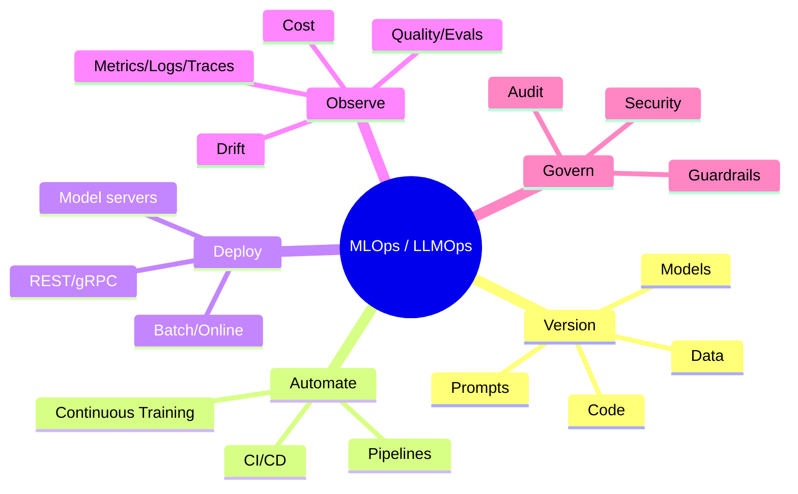
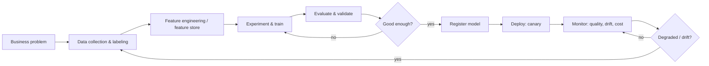
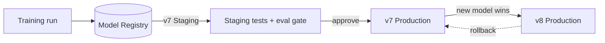
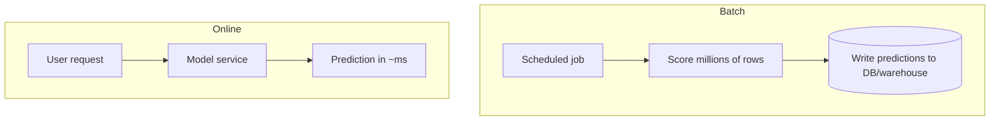
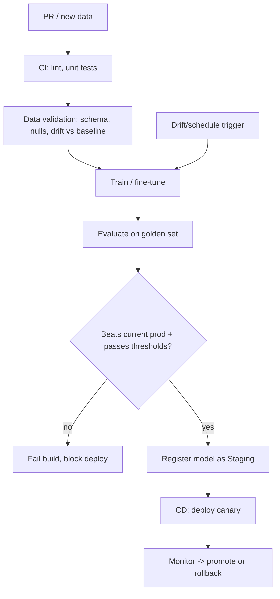
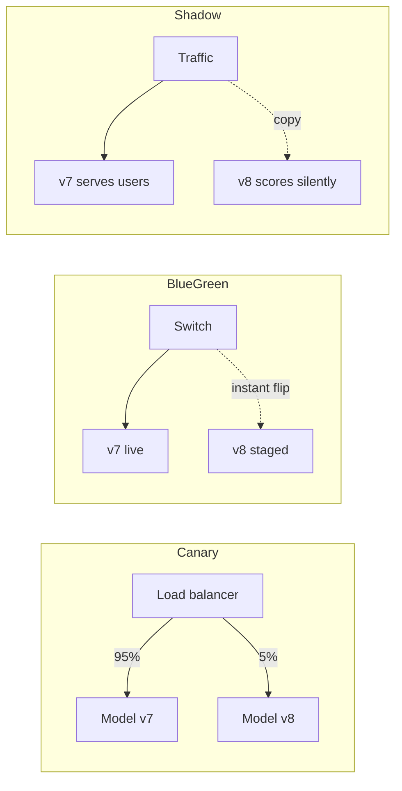
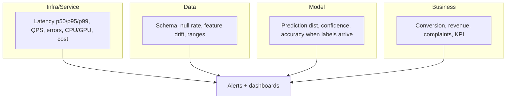
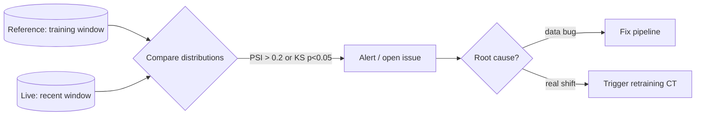
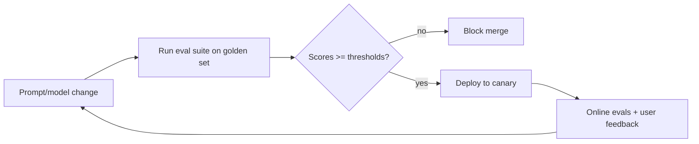
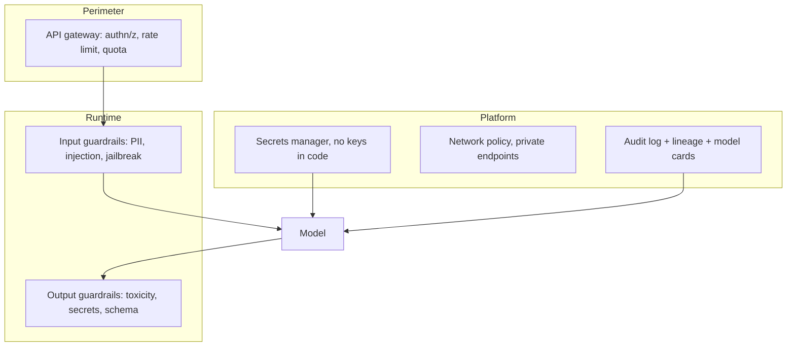

# MLOps & LLMOps — Detailed Learning Guide

> The complete, plain-language guide to taking ML and LLM systems from a notebook to reliable, observable, cost-controlled production. Written so the concepts stick, with diagrams, real code/YAML, tables, and "why/when" reasoning. If you can explain everything here, you can clear the toughest AI-engineer interview at a big company.

---

## Table of Contents
1. [What is MLOps (and why LLMOps is different)](#1-what-is-mlops-and-why-llmops-is-different)
2. [The ML Lifecycle](#2-the-ml-lifecycle)
3. [Experiment Tracking (MLflow / W&B)](#3-experiment-tracking-mlflow--wb)
4. [Model & Data Versioning (DVC, Model Registry)](#4-model--data-versioning-dvc-model-registry)
5. [Reproducible Pipelines](#5-reproducible-pipelines)
6. [Deployment: REST/gRPC, Batch vs Online, Serverless](#6-deployment-restgrpc-batch-vs-online-serverless)
7. [Containerization (Docker) & Orchestration (Kubernetes)](#7-containerization-docker--orchestration-kubernetes)
8. [Model Servers: vLLM / TGI / Triton / Ollama](#8-model-servers-vllm--tgi--triton--ollama)
9. [CI/CD for ML (and Continuous Training)](#9-cicd-for-ml-and-continuous-training)
10. [Release Strategies: Canary / Blue-Green / Shadow / Rollback](#10-release-strategies-canary--blue-green--shadow--rollback)
11. [Monitoring & Observability](#11-monitoring--observability)
12. [Drift: Data Drift, Concept Drift, Model Decay](#12-drift-data-drift-concept-drift-model-decay)
13. [LLMOps Specifics](#13-llmops-specifics)
14. [Security & Governance](#14-security--governance)
15. [Scale, Load & Performance](#15-scale-load--performance)
16. [Interview Cheat Answers (fast recall)](#16-interview-cheat-answers-fast-recall)

---

## 1. What is MLOps (and why LLMOps is different)

**MLOps** is DevOps applied to machine learning. It is the set of practices that make an ML system reproducible, automated, monitored, and reliable — not just accurate once in a notebook. The core insight is that in ML, **code is only one of three things that change**: you also version **data** and **models**. That third dimension is what breaks classical DevOps assumptions.

**LLMOps** is MLOps adapted for large language models. Most of the pipes are the same (registry, deployment, monitoring), but LLMs add unique challenges:

| Dimension | Classical ML | LLMs (LLMOps) |
|---|---|---|
| Output | Deterministic-ish (a number/label) | Non-deterministic free text |
| Correctness | Compare to ground-truth label | Subjective; needs eval models + humans |
| Main artifact you tune | Weights/features | **Prompts**, retrieval, tools, sometimes weights |
| Cost driver | Compute per training run | **Tokens per request** (ongoing) |
| Failure mode | Wrong prediction | Hallucination, prompt injection, jailbreak |
| Testing | Unit + metric threshold | Eval suites, LLM-as-judge, guardrails |

> **One-liner for interviews:** *"MLOps versions code + data + models and automates the loop; LLMOps adds prompt versioning, continuous evaluation of subjective output, token-cost control, and safety guardrails on top."* This framing reflects current (2025-2026) industry consensus that the same registry/deploy/monitor pipes now also carry fine-tuned LLMs, RAG apps, and agents.



---

## 2. The ML Lifecycle

The lifecycle is a **loop**, not a line. Production feedback flows back into data and training.



**Maturity levels** (a classic interview question):
- **Level 0 — Manual:** notebooks, manual deploys, no monitoring. Fine for a POC, dangerous in production.
- **Level 1 — ML pipeline automation:** automated training pipeline + **Continuous Training (CT)** triggered by drift/schedule.
- **Level 2 — Full CI/CD automation:** code, data, and pipeline changes flow through automated build/test/deploy with gates.

**Why it matters:** interviewers use maturity levels to check whether you understand that "shipping a model" is the *start*, not the end.

---

## 3. Experiment Tracking (MLflow / W&B)

**Problem it solves:** "Which run produced this model? What hyperparameters, data, and code created it? Can I reproduce it?" Without tracking, ML becomes un-auditable guesswork.

An experiment tracker logs, per run: **params**, **metrics**, **artifacts** (model files, plots), **code version (git SHA)**, **data version**, and **environment**.

```python
import mlflow
from sklearn.ensemble import RandomForestClassifier
from sklearn.metrics import f1_score

mlflow.set_experiment("churn-model")

with mlflow.start_run(run_name="rf-v3"):
    params = {"n_estimators": 300, "max_depth": 12}
    mlflow.log_params(params)                 # WHY: reproducibility of config

    model = RandomForestClassifier(**params).fit(X_train, y_train)

    f1 = f1_score(y_val, model.predict(X_val))
    mlflow.log_metric("val_f1", f1)           # WHY: compare runs objectively

    mlflow.set_tag("git_sha", GIT_SHA)        # WHY: tie run to exact code
    mlflow.log_param("data_version", DVC_HASH) # WHY: tie run to exact data

    # Log the model as a versioned artifact usable by the registry
    mlflow.sklearn.log_model(model, "model", registered_model_name="churn")
```

| Tool | Sweet spot | Notes |
|---|---|---|
| **MLflow** | Open-source, self-hosted, framework-agnostic; tracking + registry + serving | The de-facto OSS standard; now also has LLM eval/tracing features |
| **Weights & Biases (W&B)** | Rich UI, hyperparameter sweeps, team collaboration, LLM observability | Managed SaaS (self-host option); great for research + reports |
| **Comet / Neptune** | Similar tracking + governance | Enterprise governance features |

**Why/When:** use MLflow when you want one open tool for tracking + registry and to avoid vendor lock-in; use W&B when collaboration, sweeps, and polished dashboards matter most.

---

## 4. Model & Data Versioning (DVC, Model Registry)

You cannot reproduce a model if you can't reproduce its **data**. Git handles code but chokes on multi-GB datasets.

**DVC (Data Version Control)** stores large files in remote storage (S3/GCS) while keeping tiny pointer files in git. `git checkout` + `dvc checkout` reproduces the exact code *and* data of any commit.

```bash
dvc init
dvc add data/train.parquet          # WHY: creates train.parquet.dvc pointer (a hash)
git add data/train.parquet.dvc .gitignore
dvc remote add -d storage s3://my-bucket/dvc
dvc push                             # WHY: upload the real data to remote
# Later, on any machine / commit:
git checkout <sha> && dvc checkout   # reproduce exact data for that code
```

**Model Registry** is the source of truth for trained models and their **stage** (Staging → Production → Archived), lineage, and approvals.



```python
from mlflow.tracking import MlflowClient
client = MlflowClient()
# Promote only after eval gate passes — WHY: registry stage = deployment contract
client.transition_model_version_stage(
    name="churn", version=8, stage="Production",
    archive_existing_versions=True,   # WHY: keep exactly one Production version
)
```

**Interview point:** "version everything — code, data, models, prompts, and config" is table stakes in 2026, not a differentiator.

---

## 5. Reproducible Pipelines

A **pipeline** turns "run these notebook cells in order and pray" into a declarative, cacheable DAG. Each stage declares its inputs/outputs so only changed stages re-run.

```yaml
# dvc.yaml — a reproducible pipeline
stages:
  prepare:
    cmd: python src/prepare.py data/raw.csv data/clean.parquet
    deps: [src/prepare.py, data/raw.csv]
    outs: [data/clean.parquet]
  train:
    cmd: python src/train.py data/clean.parquet model.pkl
    deps: [src/train.py, data/clean.parquet]
    params: [train.n_estimators, train.max_depth]  # WHY: param change re-triggers stage
    outs: [model.pkl]
    metrics: [metrics.json]
```

**Orchestrators** run these DAGs on a schedule/trigger with retries, backfills, and observability:

| Orchestrator | Best for |
|---|---|
| **Airflow** | Mature, ubiquitous, batch scheduling |
| **Dagster** | Data-asset-centric, strong typing/testing |
| **Prefect** | Pythonic, dynamic flows |
| **Kubeflow Pipelines** | K8s-native ML pipelines |
| **Metaflow** | Data-science ergonomics (Netflix) |

**Why reproducibility matters:** regulated industries (finance, healthcare) require that every model decision be documented, reproducible, and auditable — sometimes pre-approved before it can influence real decisions.

---

## 6. Deployment: REST/gRPC, Batch vs Online, Serverless

### Batch vs Online (real-time)



| | Batch | Online | Streaming |
|---|---|---|---|
| Latency | Minutes–hours | Milliseconds | Seconds |
| Trigger | Schedule | Per request | Per event |
| Example | Nightly churn scores | Fraud check at checkout | Live recommendation |
| Cost | Cheap, efficient | Always-on infra | Medium |
| Complexity | Low | High (SLOs, autoscale) | High |

**Why/When:** default to **batch** if predictions can be precomputed (cheaper, simpler). Use **online** only when freshness per-request is required.

### REST vs gRPC

| | REST/JSON | gRPC/protobuf |
|---|---|---|
| Payload | Human-readable JSON | Compact binary |
| Speed | Slower (text parse) | Faster, HTTP/2, streaming |
| Ecosystem | Universal, easy debugging | Great for internal service-to-service |
| Use when | Public APIs, browser clients | High-throughput microservices, model servers |

### Serverless

- **Pros:** scale-to-zero (pay per request), no infra ops, great for spiky/low traffic.
- **Cons:** **cold starts** (deadly for big models), memory/time limits, GPU support limited. Rarely a fit for large-model GPU inference; fine for lightweight pre/post-processing or low-QPS classic models.

---

## 7. Containerization (Docker) & Orchestration (Kubernetes)

**Docker** packages the model + code + exact dependencies into an image so "it runs the same everywhere." This kills the "works on my machine" class of bugs.

```dockerfile
FROM python:3.11-slim
WORKDIR /app
# WHY: copy requirements first so the pip layer is cached across code changes
COPY requirements.txt .
RUN pip install --no-cache-dir -r requirements.txt
COPY . .
EXPOSE 8000
# WHY: one process per container; let K8s handle replicas
CMD ["uvicorn", "app:app", "--host", "0.0.0.0", "--port", "8000"]
```

**Kubernetes** runs many containers reliably: self-healing, autoscaling, rolling updates, service discovery.

```yaml
apiVersion: apps/v1
kind: Deployment
metadata: { name: model-api }
spec:
  replicas: 3
  selector: { matchLabels: { app: model-api } }
  template:
    metadata: { labels: { app: model-api } }
    spec:
      containers:
        - name: model-api
          image: registry/model-api:v8
          resources:
            requests: { cpu: "500m", memory: "1Gi", nvidia.com/gpu: 1 }
            limits:   { cpu: "1",    memory: "2Gi", nvidia.com/gpu: 1 }
          readinessProbe:      # WHY: don't send traffic until model is loaded
            httpGet: { path: /health, port: 8000 }
            initialDelaySeconds: 20
          livenessProbe:       # WHY: restart a hung/OOM pod automatically
            httpGet: { path: /health, port: 8000 }
```

```yaml
# Horizontal Pod Autoscaler — scale on load
apiVersion: autoscaling/v2
kind: HorizontalPodAutoscaler
metadata: { name: model-api-hpa }
spec:
  scaleTargetRef: { apiVersion: apps/v1, kind: Deployment, name: model-api }
  minReplicas: 3
  maxReplicas: 30
  metrics:
    - type: Resource
      resource: { name: cpu, target: { type: Utilization, averageUtilization: 65 } }
```

**GPU note:** GPUs aren't fractional by default; use time-slicing/MIG or serve multiple models per GPU carefully. Scale GPU pods on a custom metric (queue depth / tokens-per-second) rather than CPU. **KEDA** enables event/queue-driven and scale-to-zero autoscaling.

---

## 8. Model Servers: vLLM / TGI / Triton / Ollama

Generic web frameworks are inefficient for LLM inference. Dedicated **model servers** implement batching, KV-cache management, and GPU tricks.

**Key ideas:**
- **Continuous (in-flight) batching:** merge/evict requests every step instead of waiting for a fixed batch. Reported gains are large — an Anyscale study cites up to ~23× throughput over naive static batching.
- **PagedAttention (vLLM):** treats the KV cache like OS virtual memory in fixed blocks, cutting fragmentation from ~60-80% to under ~4%, which translates to ~2-4× more concurrency on the same GPU.

| Server | Best for | Notes |
|---|---|---|
| **vLLM** | High-throughput OSS LLM serving | PagedAttention + continuous batching; strong default; OpenAI-compatible API |
| **TGI (Text Generation Inference)** | Hugging Face ecosystem | Tight HF integration; good tail latency for interactive single-user |
| **Triton Inference Server** | Multi-framework (TensorRT/ONNX/PyTorch), mixed workloads | Dynamic batching, model ensembles; heavier setup |
| **TensorRT-LLM** | Peak NVIDIA performance | Best raw perf, more tuning effort |
| **Ollama** | Local prototyping, low concurrency | Zero-config, great DX; not for high-QPS prod |

> **Interview nuance:** benchmarks vary by model/hardware/workload. The honest answer: **vLLM** is the safe high-throughput default; **TGI** shines in the HF workflow and interactive latency; **Triton** wins when you serve many model types with dynamic batching; **Ollama** is for laptops and demos, not fleets. Always benchmark on *your* model and traffic shape.

```bash
# vLLM exposes an OpenAI-compatible server — WHY: drop-in for existing clients
python -m vllm.entrypoints.openai.api_server \
  --model meta-llama/Llama-3.1-8B-Instruct \
  --max-num-seqs 256 \          # continuous batching width
  --gpu-memory-utilization 0.90 # WHY: leave headroom to avoid OOM
```

---

## 9. CI/CD for ML (and Continuous Training)

CI/CD for ML extends normal software CI/CD with **data validation**, **model evaluation gates**, and **Continuous Training (CT)**.



**Continuous Training (CT):** an automated loop where production monitoring detects degradation/drift and triggers retraining + redeployment — the key differentiator of mature MLOps.

```yaml
# GitHub Actions: gate deployment on an eval threshold
name: ml-ci
on: [pull_request]
jobs:
  evaluate:
    runs-on: ubuntu-latest
    steps:
      - uses: actions/checkout@v4
      - run: pip install -r requirements.txt
      - run: python evaluate.py --out metrics.json
      - name: Gate on quality           # WHY: never ship a regression
        run: |
          score=$(jq '.f1' metrics.json)
          threshold=0.82
          awk "BEGIN{exit !($score >= $threshold)}" \
            || { echo "F1 $score < $threshold"; exit 1; }
```

---

## 10. Release Strategies: Canary / Blue-Green / Shadow / Rollback



| Strategy | How | Pros | Cons / When |
|---|---|---|---|
| **Canary** | Send small % to new model, ramp up | Limits blast radius; real feedback | Slower rollout; needs good metrics |
| **Blue-Green** | Two full envs; flip traffic | Instant switch + instant rollback | 2× infra cost |
| **Shadow/Mirror** | New model scores copies of traffic, results discarded | Zero user risk; compare live | No user-facing signal (no clicks/labels); double compute |
| **Rolling** | Replace pods gradually | Native to K8s, no extra infra | Harder to isolate a bad version |
| **A/B test** | Split users, measure business KPI | Statistical proof of value | Needs traffic + time |

**Rollback** is the safety net: keep the previous image/model version pinned and one command away. In 2026 LLMOps guidance, the recurring theme is *"make rollback one click"* — version everything and test every change so reverting is boring and instant.

---

## 11. Monitoring & Observability

Monitoring answers "is it up?"; observability answers "*why* is it behaving like this?" ML needs **four layers**:



**Golden signals for a model service:** latency (tail!), traffic, errors, saturation — plus **prediction distribution**, **feature drift**, and (when labels arrive) **live accuracy**.

**Stack:** Prometheus (metrics) + Grafana (dashboards) + OpenTelemetry (traces) + a drift tool like **Evidently**; for LLMs, **Langfuse / LangSmith / Arize Phoenix**. Pattern: stream prediction logs to object storage (S3), compare live vs a training **reference** dataset, and open a ticket/issue when drift crosses a threshold.

```python
from prometheus_client import Histogram, Counter
LAT = Histogram("inference_latency_seconds", "latency", buckets=[.05,.1,.25,.5,1,2,5])
ERR = Counter("inference_errors_total", "errors")

@LAT.time()                       # WHY: track tail latency, not just average
def predict(x):
    try:
        return model(x)
    except Exception:
        ERR.inc()                 # WHY: alert on error-rate spikes
        raise
```

---

## 12. Drift: Data Drift, Concept Drift, Model Decay

Models decay because the world changes while the weights stay frozen.

| Type | What changed | Detect with |
|---|---|---|
| **Data drift (covariate shift)** | Input distribution P(X) | PSI, KS test, Chi-square, KL divergence |
| **Prediction drift** | Output distribution P(ŷ) | Compare score histograms |
| **Concept drift** | Relationship P(y\|X) | Accuracy/error when labels arrive; proxies if not |
| **Label/upstream drift** | Schema, pipeline bug | Data validation, null-rate spikes |



**PSI rules of thumb:** < 0.1 stable; 0.1-0.2 moderate (watch); > 0.2 significant (act). **KS caveat:** with huge samples it flags tiny, meaningless changes — pair it with an effect-size/PSI threshold to avoid alert fatigue.

**Concept drift is the hard one** because you often lack fresh labels. Use **proxy signals**: prediction drift, confidence collapse, correlation changes, and business KPIs, until delayed ground truth arrives.

```python
import numpy as np
def psi(expected, actual, bins=10):
    # WHY: PSI quantifies how much a distribution shifted vs a reference
    cuts = np.percentile(expected, np.linspace(0, 100, bins + 1))
    cuts[0], cuts[-1] = -np.inf, np.inf
    e = np.histogram(expected, cuts)[0] / len(expected) + 1e-6
    a = np.histogram(actual,   cuts)[0] / len(actual)   + 1e-6
    return float(np.sum((a - e) * np.log(a / e)))
```

---

## 13. LLMOps Specifics

LLMOps = MLOps + the messy realities of non-deterministic text, token costs, and safety.

### 13.1 Prompt versioning
Prompts are code. Version them, review them in PRs, tag them by environment, and roll back like any deploy. Tools (Langfuse, LangSmith) store prompts with labels/versions so you can change the prompt **without a redeploy** and A/B test variants.

### 13.2 Evaluation in CI
Because output is subjective, gate deploys on an **eval suite** over a golden dataset:
- **Reference-based:** exact/semantic match, ROUGE for summaries.
- **Reference-free / LLM-as-judge:** faithfulness, relevance, helpfulness (watch judge bias toward length/its own style).
- **Task metrics:** tool-call accuracy, JSON-schema validity, retrieval recall for RAG.



### 13.3 Cost tracking
Cost scales with **tokens per request × requests**, forever. Track prompt/completion tokens, cost per feature/user/tenant, and set budget alerts.
- **Levers:** semantic + prompt caching, model routing (cheap model for easy queries), context trimming, smaller/distilled models, batching, streaming to cut perceived latency.

### 13.4 Guardrails
Input and output filters for PII, toxicity, jailbreaks, prompt injection, and schema/grounding checks. Combine with a **gateway** (e.g., LiteLLM) for routing, rate limits, fallbacks, and centralized cost/logging.

### 13.5 Tracing & observability
LLM apps are multi-step (retrieve → prompt → tool → generate). **Tracing** (LangSmith / Langfuse / OpenTelemetry-based) captures the full span tree per request: inputs, outputs, tokens, latency, cost, and scores — essential for debugging non-deterministic chains.

```python
from langfuse.decorators import observe, langfuse_context

@observe()                        # WHY: auto-capture spans, latency, IO for this step
def answer(question: str) -> str:
    ctx = retrieve(question)
    resp = llm(f"Answer from context.\n{ctx}\nQ:{question}")
    langfuse_context.update_current_observation(
        usage={"input": resp.usage.prompt_tokens,
               "output": resp.usage.completion_tokens},  # WHY: per-request cost
    )
    return resp.text
```

---

## 14. Security & Governance



**Checklist:**
- **Supply chain:** scan images (Trivy), pin dependencies, sign artifacts (SBOM). A model file (pickle) can execute code — treat untrusted weights as untrusted code; prefer `safetensors`.
- **Secrets:** never in code/images; use a secrets manager + short-lived creds.
- **Least privilege:** scoped service accounts; network policies; private model endpoints.
- **LLM-specific (OWASP LLM Top 10):** prompt injection (esp. **indirect** via retrieved/tool content), sensitive-info disclosure, insecure output handling, excessive agency of tool-using agents.
- **Governance:** model cards, data lineage, approval workflows, and immutable audit logs — mandatory in regulated domains.

---

## 15. Scale, Load & Performance

| Goal | Lever |
|---|---|
| Lower latency | Smaller/quantized model, continuous batching, KV-cache reuse, streaming, semantic cache |
| Higher throughput | vLLM/Triton batching, tensor/pipeline parallelism, more replicas |
| Lower cost | Model routing, caching, spot/preemptible GPUs, autoscale to low floor, right-size GPUs |
| Handle spikes | HPA/KEDA autoscaling, request queue + backpressure, provider fallback |
| Reliability | Multi-replica stateless services, health probes, circuit breakers, retries with jitter |
| Big models | Quantization (INT8/FP8/AWQ/GPTQ), sharding across GPUs, offloading |

**Latency intuition for LLMs:** first-token latency (TTFT) is dominated by prompt length + queue; inter-token latency by model size + batch. Report **p95/p99**, not averages — tail latency is what users feel.

**Load testing:** replay realistic traffic shapes (bursty, long-context) with tools like Locust/k6; measure TTFT, tokens/sec, and cost per 1K requests at target concurrency before you commit capacity.

---

## 16. Interview Cheat Answers (fast recall)

- **MLOps vs LLMOps?** Same pipes; LLMOps adds prompt versioning, subjective-output evals, token-cost control, guardrails/tracing.
- **Batch vs online?** Precompute if you can (batch = cheap/simple); online only for per-request freshness.
- **Why vLLM fast?** PagedAttention (low KV fragmentation) + continuous batching → 2-4×+ concurrency.
- **Detect drift w/o labels?** PSI/KS on features + prediction drift as proxy for concept drift.
- **Ship safely?** Eval gate in CI → canary → monitor → one-click rollback.
- **Control LLM cost?** Cache, route, trim context, smaller models, budget alerts, per-tenant tracking.
- **Version what?** Code + data + model + prompt + config.
- **CT?** Monitoring auto-triggers retrain+redeploy on drift/schedule.

---

## Further Reading
- [MLOps principles](https://ml-ops.org/)
- [Google: MLOps CI/CD & automation levels](https://cloud.google.com/architecture/mlops-continuous-delivery-and-automation-pipelines-in-machine-learning)
- [MLflow docs](https://mlflow.org/)
- [DVC docs](https://dvc.org/doc)
- [vLLM docs](https://docs.vllm.ai/)
- [Evidently (drift)](https://www.evidentlyai.com/)
- [Langfuse](https://langfuse.com/docs) / [LangSmith](https://docs.smith.langchain.com/)
- [OWASP Top 10 for LLM Apps](https://owasp.org/www-project-top-10-for-large-language-model-applications/)

*Content synthesized from general domain knowledge and current (2025-2026) interview trends; rephrased for compliance with licensing restrictions.*
