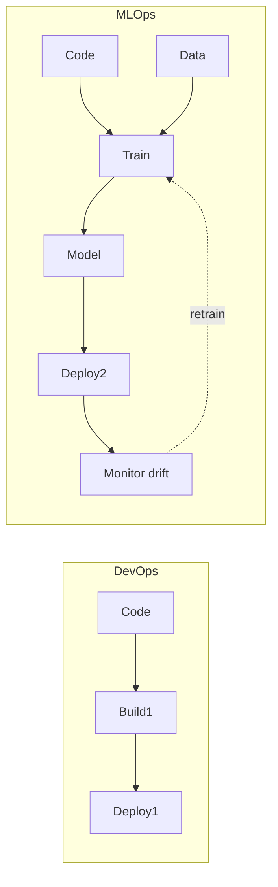
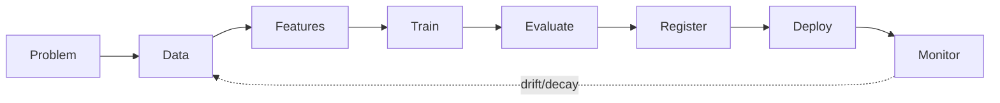
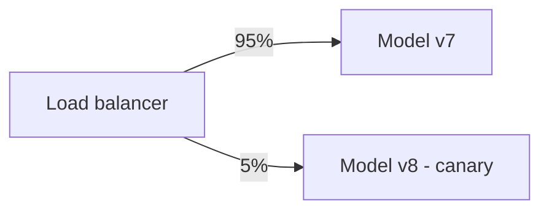

# MLOps & LLMOps Interview Questions — Basic Level

> Warm-up questions for freshers and early-career AI engineers. If you can answer these clearly in under a minute each, you've shown you understand what it takes to run models in production. Answers are in plain language so the ideas stick.

---

## Q1. What is MLOps? How is it different from DevOps?

**Simple answer:** MLOps is DevOps applied to machine learning — the practices that make an ML system reproducible, automated, monitored, and reliable in production.

The key difference: normal software versions **code**. ML versions **three** things that all change independently — **code, data, and models**. A model can break not because the code changed, but because the *data* changed underneath it. That extra "data + model" dimension is why we need MLOps and not just DevOps.



---

## Q2. What is LLMOps and how is it different from MLOps?

**Simple answer:** LLMOps is MLOps for large language models. The infrastructure (registry, deployment, monitoring) is mostly the same, but LLMs add new problems:

- **Output is non-deterministic text**, so you can't just compare to a label — you need eval suites and sometimes human review.
- **The thing you tune most is the prompt**, not the weights — so prompts must be versioned like code.
- **Cost is per-token and never-ending** — every request spends money, so cost tracking is a first-class concern.
- **New failure modes:** hallucination, prompt injection, jailbreaks — so you need guardrails.

**One-liner:** *MLOps versions code + data + models; LLMOps adds prompt versioning, continuous evaluation of subjective output, token-cost control, and safety guardrails.*

---

## Q3. Walk me through the ML lifecycle.

**Simple answer:** It's a loop, not a straight line:



1. **Frame the problem** (what are we predicting, what's success?).
2. **Collect & label data.**
3. **Feature engineering.**
4. **Train & experiment** (track every run).
5. **Evaluate & validate** against a held-out set.
6. **Register** the winning model.
7. **Deploy** (usually via canary).
8. **Monitor** quality, drift, latency, cost — and feed problems back into data/training.

The interview insight: **deploying is the middle of the story, not the end.**

---

## Q4. What is experiment tracking and why does it matter?

**Simple answer:** Experiment tracking logs everything about each training run — hyperparameters, metrics, the model file, the code version (git SHA), and the data version — so you can compare runs and *reproduce* any result later.

Without it, you get "the model from three weeks ago was better but nobody knows what settings produced it." Tools: **MLflow** (open-source standard) and **Weights & Biases** (rich UI + sweeps).

```python
import mlflow
with mlflow.start_run():
    mlflow.log_params({"lr": 0.01, "epochs": 10})  # config
    mlflow.log_metric("val_f1", 0.87)              # result
    mlflow.set_tag("git_sha", "a1b2c3")            # exact code
```

---

## Q5. Why can't we just use Git to version datasets?

**Simple answer:** Git is built for small text files (code). It chokes on multi-gigabyte datasets — repos become huge and slow.

**DVC (Data Version Control)** solves this: it stores the big files in cloud storage (S3/GCS) and keeps only a tiny pointer file (a hash) in Git. So `git checkout` + `dvc checkout` reproduces the exact code *and* the exact data of any commit.

```bash
dvc add data/train.parquet   # creates a small .dvc pointer file
git add data/train.parquet.dvc
dvc push                     # uploads the real data to remote storage
```

---

## Q6. What is a model registry?

**Simple answer:** A model registry is the "source of truth" for trained models. It stores each model version, its **stage** (Staging → Production → Archived), its lineage (which run/data produced it), and approvals.

It's the contract between training and deployment: your serving system asks the registry for "the current Production model," so promoting a new model = transitioning its stage, and rolling back = pointing back to the previous version.

---

## Q7. Batch vs online (real-time) inference — what's the difference and when do you use each?

**Simple answer:**
- **Batch:** score a big pile of data on a schedule (e.g., nightly churn scores), write results to a database. Cheap and simple.
- **Online:** score one request at a time, in milliseconds (e.g., fraud check at checkout). Needs always-on, autoscaling infra.

| | Batch | Online |
|---|---|---|
| Latency | minutes–hours | milliseconds |
| Cost | cheap | always-on |
| Use when | predictions can be precomputed | freshness per request is required |

**Rule of thumb:** default to batch if you can precompute; only pay for online when you truly need per-request freshness.

---

## Q8. Why do we containerize models with Docker?

**Simple answer:** Docker packages the model, code, and *exact* dependencies into one image, so it runs identically on your laptop, in CI, and in production. It kills the "works on my machine" problem.

```dockerfile
FROM python:3.11-slim
COPY requirements.txt .
RUN pip install -r requirements.txt   # exact, pinned deps
COPY . .
CMD ["uvicorn", "app:app", "--host", "0.0.0.0", "--port", "8000"]
```

Kubernetes then runs many of these containers with self-healing, autoscaling, and rolling updates.

---

## Q9. What is model/data drift, in plain terms?

**Simple answer:** Drift is when the world changes but your model stays frozen, so it slowly gets worse.

- **Data drift:** the *inputs* start looking different from training data (e.g., new user demographics).
- **Concept drift:** the *relationship* between inputs and the right answer changes (e.g., what counts as "fraud" evolves).

You detect data drift with statistical tests (like **PSI** or the **KS test**) comparing recent data to a training reference, and you detect concept drift by watching accuracy drop once real labels arrive.

---

## Q10. What is a canary deployment?

**Simple answer:** A canary deployment sends a small slice of traffic (say 5%) to the new model while everyone else stays on the old one. You watch the new model's metrics; if it looks healthy, you ramp up to 100%; if not, you roll back — and only 5% of users were ever affected.



It's about **limiting the blast radius** of a bad release.

---

## Q11. How do you monitor an LLM in production? What's different from a normal model?

**Simple answer:** On top of the usual latency/errors, LLMs need you to track:
- **Tokens & cost** per request (money burns with every call).
- **Quality** via online evals + user feedback (thumbs up/down), because output is subjective.
- **Traces** of the whole chain (retrieve → prompt → tool → answer), since it's multi-step.
- **Safety signals:** blocked prompts, jailbreak attempts, PII leaks.

Tools: **Langfuse** or **LangSmith** for tracing/cost/evals; Prometheus/Grafana for infra metrics.

---

## Q12. What does vLLM do and why is it faster? (Use Case)

**Simple answer:** vLLM is a model server built for high-throughput LLM inference. Two tricks make it fast:
- **PagedAttention:** manages the KV cache like computer memory pages, so it wastes far less GPU memory and can fit many more concurrent requests.
- **Continuous batching:** it merges new requests into the running batch every step instead of waiting for a full batch — dramatically improving throughput under load.

**Use case:** you're self-hosting Llama 3 to serve thousands of chat requests. vLLM lets one GPU handle far more concurrent users than a naive Flask+model setup, lowering your cost per request. For a laptop demo or a single user, **Ollama** is simpler; for a fleet, vLLM (or Triton/TGI) wins.

---

## Quick Coverage Map (what basics touch)
- **Architecture:** lifecycle (Q3), registry (Q6), containers (Q8).
- **Deployment:** batch vs online (Q7), canary (Q10), model servers (Q12).
- **Observability:** drift (Q9), LLM monitoring (Q11), tracking (Q4).
- **Foundations:** MLOps vs DevOps (Q1), LLMOps (Q2), versioning data (Q5).

## Further Reading
- [MLOps principles](https://ml-ops.org/)
- [MLflow docs](https://mlflow.org/)
- [DVC docs](https://dvc.org/doc)
- [vLLM docs](https://docs.vllm.ai/)

*Content synthesized from general domain knowledge and current (2025-2026) interview trends; rephrased for compliance with licensing restrictions.*
