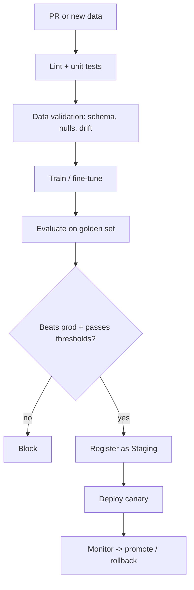
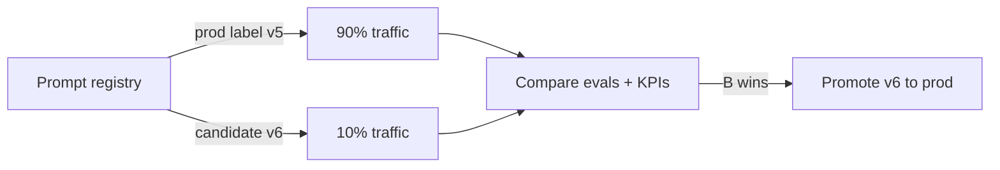
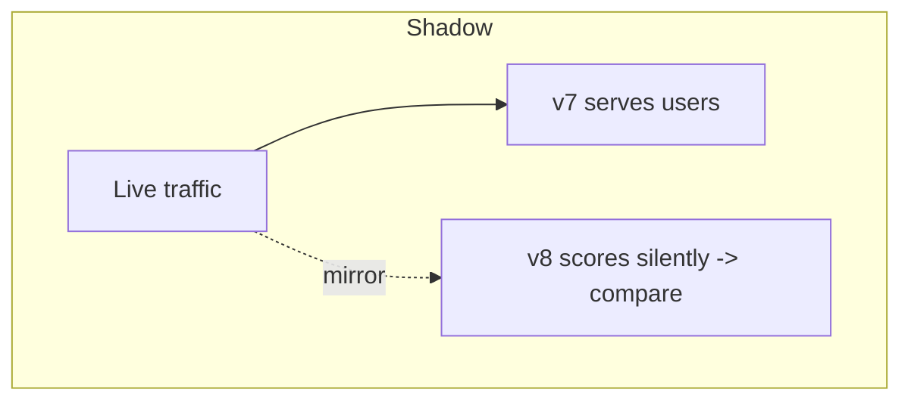
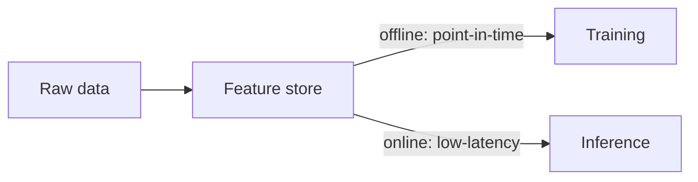
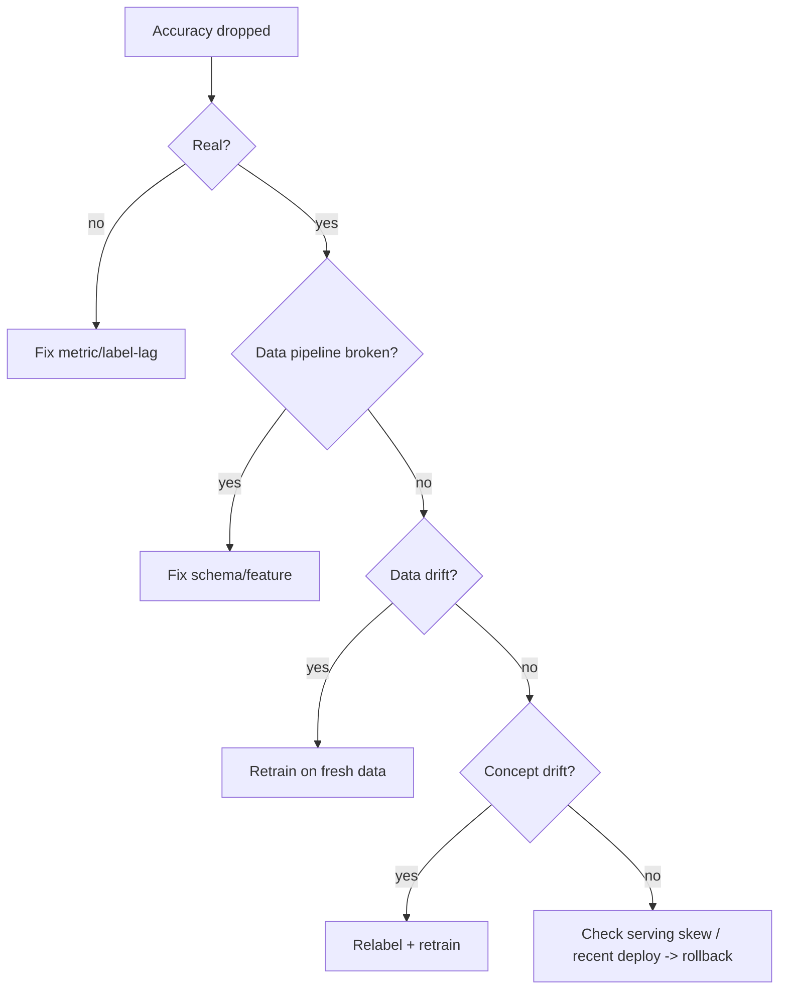

# MLOps & LLMOps Interview Questions — Medium Level

> For engineers who've shipped at least one model to production. These probe *how* you build the pipeline, not just the vocabulary. Answers include trade-offs, code, and "why/when" — the reasoning interviewers actually score.

---

## Q1. How do you make an ML pipeline reproducible?

**Answer:** Reproducibility means someone else (or future-you) can regenerate the exact same model. You need to pin **all four** inputs:

1. **Code** — git commit SHA.
2. **Data** — a data version (DVC hash / snapshot / immutable partition).
3. **Environment** — pinned dependencies + a Docker image digest.
4. **Config/params** — seeds, hyperparameters (in a tracked config, not hardcoded).

Then wire them into a declarative pipeline (DVC, Kubeflow, Dagster) so stages are cached and re-run only when their inputs change.

```yaml
# dvc.yaml — each stage re-runs only if its deps/params change
stages:
  train:
    cmd: python train.py
    deps: [train.py, data/clean.parquet]
    params: [lr, epochs]      # WHY: param change => retrain, tracked automatically
    outs: [model.pkl]
    metrics: [metrics.json]
```

**Why it matters:** regulated industries require every model decision to be reproducible and auditable. "I can't reproduce that result" is a red flag.

---

## Q2. Compare REST vs gRPC for model serving. When do you pick which?

**Answer:**

| | REST/JSON | gRPC/protobuf |
|---|---|---|
| Payload | Human-readable JSON (bigger) | Compact binary (smaller) |
| Transport | HTTP/1.1 usually | HTTP/2, multiplexing, streaming |
| Speed | Slower parse | Faster, lower overhead |
| Clients | Universal (browsers, curl) | Needs generated stubs |
| Debugging | Easy | Harder (binary) |

**When:** REST for public/browser-facing APIs and easy debugging. gRPC for high-throughput internal service-to-service traffic and streaming (e.g., token streaming, feature services). Many model servers expose **both**; a common pattern is REST at the edge, gRPC internally.

---

## Q3. Design a CI/CD pipeline for an ML model. What's different from normal CI/CD?

**Answer:** Normal CI/CD tests code. ML CI/CD adds **data validation** and a **model evaluation gate**, plus **Continuous Training**.



The critical addition is the **eval gate**: never ship a model that regresses on your golden set. And **Continuous Training (CT)** lets monitoring/drift/schedule automatically trigger retraining.

```yaml
# Gate the build on a metric threshold
- name: quality gate
  run: |
    score=$(jq '.f1' metrics.json)
    awk "BEGIN{exit !($score >= 0.82)}" || { echo "regression"; exit 1; }
```

---

## Q4. How do you detect data drift, and how do you avoid alert fatigue?

**Answer:** Compare a **recent window** of production data against a **reference** (training distribution) using statistical tests:

- **PSI (Population Stability Index):** < 0.1 stable, 0.1-0.2 watch, > 0.2 act.
- **KS test:** detects distribution shifts but is **oversensitive on large samples** — it'll flag tiny, meaningless changes.
- **Chi-square** for categoricals, **KL divergence** for divergence.

**Avoiding alert fatigue:** pair a statistical test with an **effect-size/magnitude threshold** (e.g., require KS significance *and* PSI > 0.2), aggregate over a window (not per-request), rank features by importance so a drift in a useless feature doesn't page anyone, and route drift to a ticket/dashboard rather than a pager unless model quality actually drops.

```python
import numpy as np
def psi(expected, actual, bins=10):
    cuts = np.percentile(expected, np.linspace(0, 100, bins+1))
    cuts[0], cuts[-1] = -np.inf, np.inf
    e = np.histogram(expected, cuts)[0]/len(expected) + 1e-6
    a = np.histogram(actual,   cuts)[0]/len(actual)   + 1e-6
    return float(np.sum((a - e) * np.log(a / e)))
```

---

## Q5. Data drift vs concept drift — why is concept drift harder?

**Answer:**
- **Data drift** = inputs P(X) change. You can detect it **immediately** because you have the inputs.
- **Concept drift** = the input→output relationship P(y|X) changes. You can only *confirm* it by measuring accuracy — which needs **ground-truth labels that arrive late (or never)**.

That's the hard part: by the time labels come in, you may have been serving bad predictions for weeks. So you rely on **proxy signals**: prediction drift, confidence collapse, correlation changes, and business KPIs, to raise suspicion before labels confirm it.

---

## Q6. How do you version and A/B test prompts in an LLM app?

**Answer:** Treat prompts as versioned artifacts, not strings buried in code.

- Store them in a **prompt registry** (Langfuse/LangSmith) or in git with semantic versions and environment labels (`dev`/`staging`/`prod`).
- Reference prompts by **version/label** at runtime so you can change a prompt **without redeploying code** and roll back instantly.
- **A/B test** by routing a % of traffic to variant B, then compare online evals + business metrics.



**Why:** prompts are your most-changed component; without versioning you can't reproduce, compare, or safely roll back a bad prompt edit.

---

## Q7. How do you evaluate an LLM feature in CI when output is non-deterministic?

**Answer:** You can't do exact-match asserts on free text. Build an **eval suite over a golden dataset**:

- **Reference-based:** semantic similarity, ROUGE (summaries), exact match (structured tasks).
- **Reference-free / LLM-as-judge:** faithfulness, relevance, helpfulness — scored by a judge model. Watch for judge bias (length, self-preference) and calibrate against human labels.
- **Structural checks:** JSON-schema validity, tool-call correctness, no PII, grounded in context.

Gate merges on aggregate thresholds; add **online evals** on sampled prod traffic to catch what offline sets miss.

```python
# pytest-style eval gate
def test_faithfulness():
    scores = [judge(faithfulness=True, q=x.q, a=model(x.q), ctx=x.ctx)
              for x in golden_set]
    assert sum(scores)/len(scores) >= 0.85   # WHY: block regressions on merge
```

---

## Q8. How do you control and track LLM costs in production?

**Answer:** Cost = tokens/request × requests, and it runs forever, so treat it like a monitored SLO.

**Track:** prompt + completion tokens, cost per request, per feature, per user/tenant → dashboards + budget alerts.

**Reduce (levers, cheapest first):**
1. **Semantic + prompt caching** — biggest single win for repetitive traffic.
2. **Model routing** — cheap/small model for easy queries, frontier model only for hard ones.
3. **Context trimming** — retrieve fewer/better chunks; don't stuff the window.
4. **Smaller/distilled/quantized models** where quality allows.
5. **Batching + streaming** — streaming cuts *perceived* latency, batching cuts cost.

A **gateway** (e.g., LiteLLM) centralizes routing, rate limits, fallbacks, and cost logging.

---

## Q9. How does autoscaling work for a model service, and what's tricky about GPUs?

**Answer:** Kubernetes' **HPA** scales replicas on a metric (CPU, or custom like queue depth / tokens-per-second). **KEDA** adds event/queue-driven scaling and scale-to-zero.

```yaml
apiVersion: autoscaling/v2
kind: HorizontalPodAutoscaler
spec:
  minReplicas: 2
  maxReplicas: 20
  metrics:
    - type: Pods
      pods: { metric: { name: queue_depth }, target: { type: AverageValue, averageValue: "5" } }
```

**GPU gotchas:**
- GPUs aren't natively fractional — use **MIG / time-slicing** or pack multiple models carefully.
- Scaling on **CPU is wrong** for GPU inference; scale on queue depth or GPU utilization.
- **Cold start is brutal** — loading a large model takes tens of seconds to minutes, so keep a warm floor of replicas and pre-pull images.
- GPUs are expensive → use **spot/preemptible** for batch, autoscale aggressively, right-size the GPU to the model.

---

## Q10. Explain canary vs blue-green vs shadow deployment. When do you use each?

**Answer:**

| Strategy | Mechanism | Best when | Cost |
|---|---|---|---|
| **Canary** | Route small % to new, ramp up | You want gradual, metric-driven rollout | Low |
| **Blue-Green** | Two full envs, flip traffic instantly | You need instant switch + instant rollback | 2× infra |
| **Shadow** | New model scores copied traffic, output discarded | You want zero user risk while comparing live | 2× compute |



**Why/When:** shadow is great for a first look at a risky new model (no user impact, but no click/label signal). Canary is the everyday default. Blue-green when downtime is unacceptable and you can afford double infra. Always keep the **previous version pinned for one-click rollback**.

---

## Q11. What is a feature store and why do teams add one?

**Answer:** A feature store is a central system for defining, computing, storing, and serving features consistently for **both training and inference**.

It solves two big problems:
- **Training/serving skew:** the classic bug where a feature is computed one way in the training notebook and differently in the serving code. A feature store computes it **once**, used by both.
- **Reuse & governance:** teams share vetted features instead of re-deriving them; point-in-time correctness prevents **label leakage**.



Tools: Feast (OSS), Tecton, Databricks/SageMaker feature stores.

---

## Q12. Your production model's accuracy dropped. Walk through debugging it. (Use Case)

**Answer:** Work outside-in, cheapest checks first:

1. **Is it real or a metric bug?** Confirm the drop is statistically meaningful, not label lag or a dashboard error.
2. **Data pipeline first (most common cause):** schema change, null spike, a renamed/broken upstream feature, unit change. Check data validation + feature drift dashboards.
3. **Data drift:** did inputs shift (PSI/KS)? New segment of users? Seasonality?
4. **Concept drift:** did the input→output relationship change (compare accuracy across time slices once labels arrive)?
5. **Serving skew:** is the serving feature computation different from training? (feature store prevents this).
6. **Model/deploy issue:** did a recent deploy change the model version, preprocessing, or dependency?



**Mitigation while investigating:** roll back to the last-good model version; the registry makes this one command.

---

## Quick Coverage Map
- **Architecture:** reproducible pipelines (Q1), feature store (Q11), REST/gRPC (Q2).
- **CI/CD:** ML pipeline (Q3), LLM evals in CI (Q7).
- **Deployment/Scale:** autoscaling + GPU (Q9), release strategies (Q10), cost (Q8).
- **Observability:** drift detection (Q4, Q5), incident debugging (Q12).
- **LLMOps:** prompt versioning/A-B (Q6), evals (Q7), cost (Q8).

## Further Reading
- [Google MLOps: CI/CD & automation](https://cloud.google.com/architecture/mlops-continuous-delivery-and-automation-pipelines-in-machine-learning)
- [Evidently: concept drift](https://www.evidentlyai.com/ml-in-production/concept-drift)
- [Feast feature store](https://docs.feast.dev/)
- [Langfuse prompt management](https://langfuse.com/docs)

*Content synthesized from general domain knowledge and current (2025-2026) interview trends; rephrased for compliance with licensing restrictions.*
