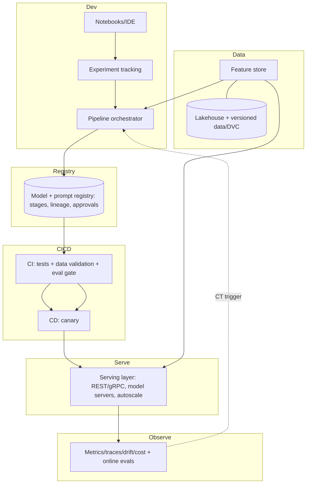
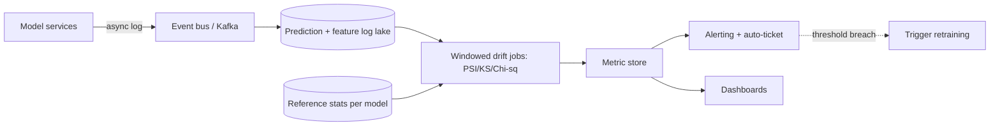
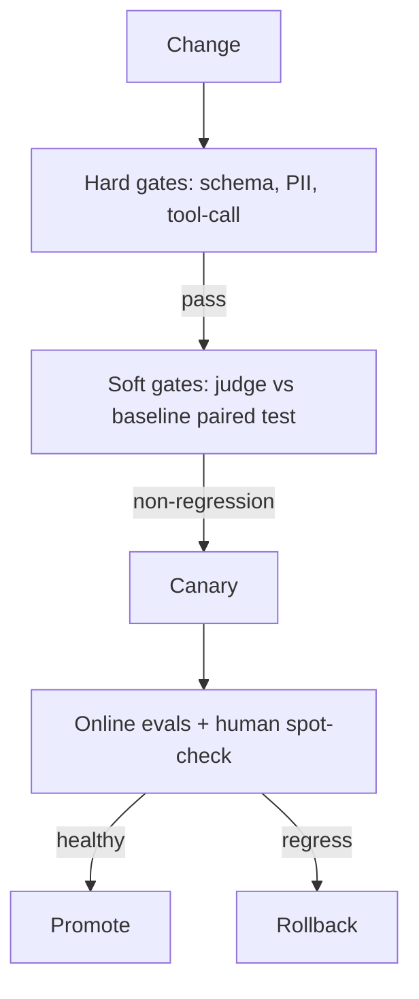
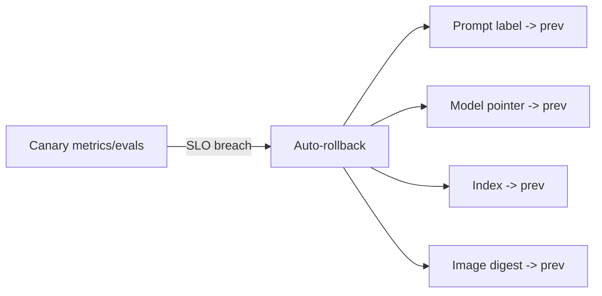
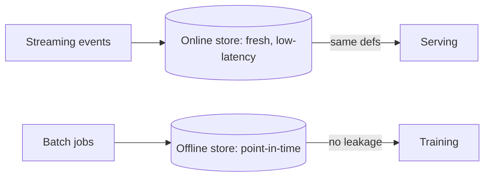
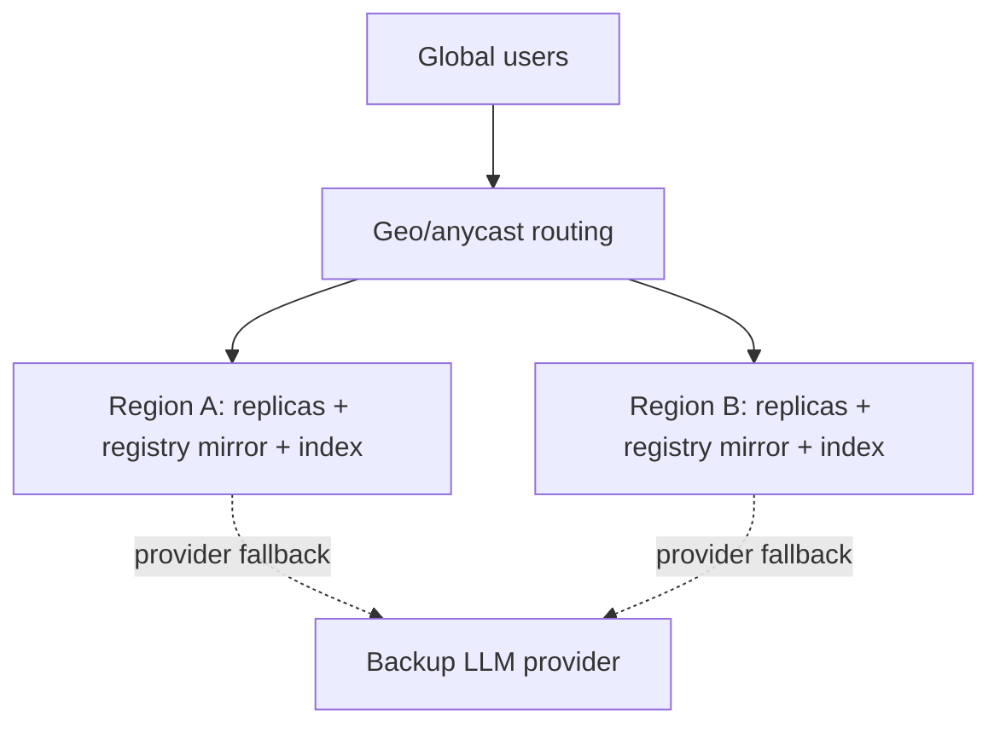
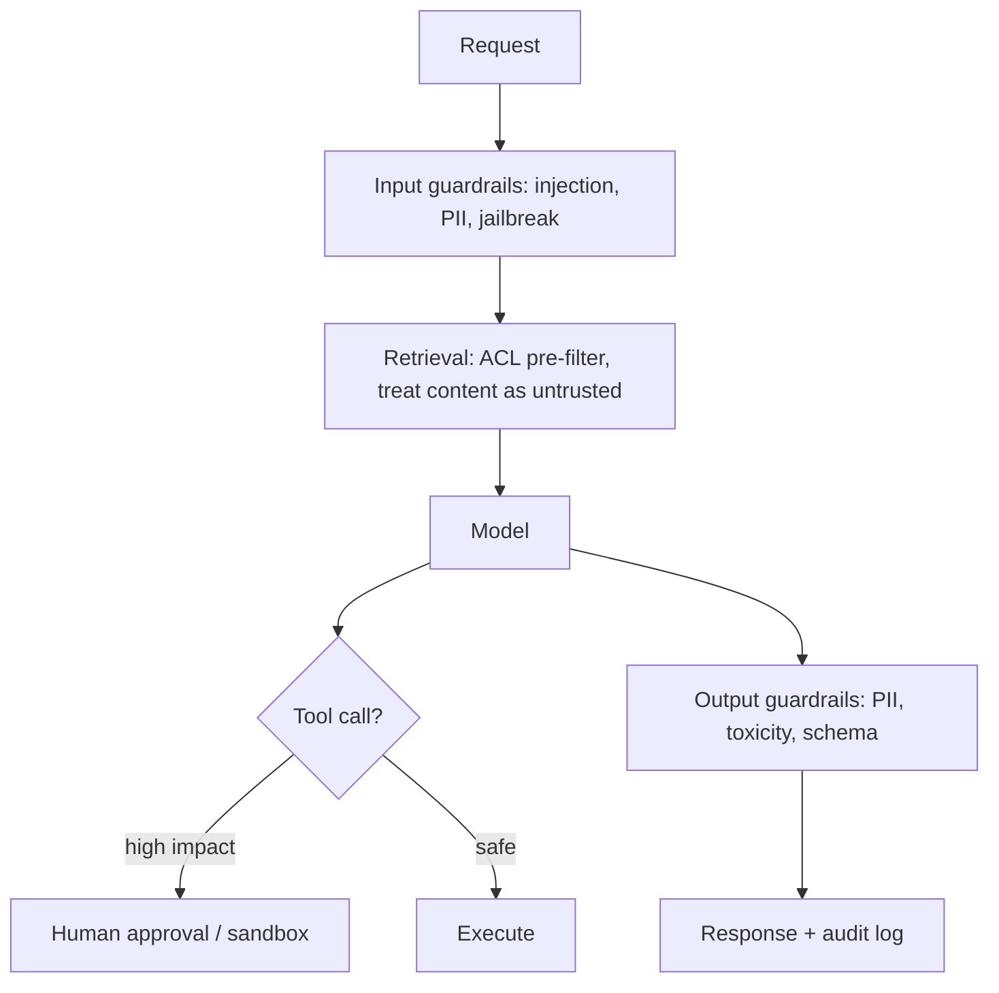
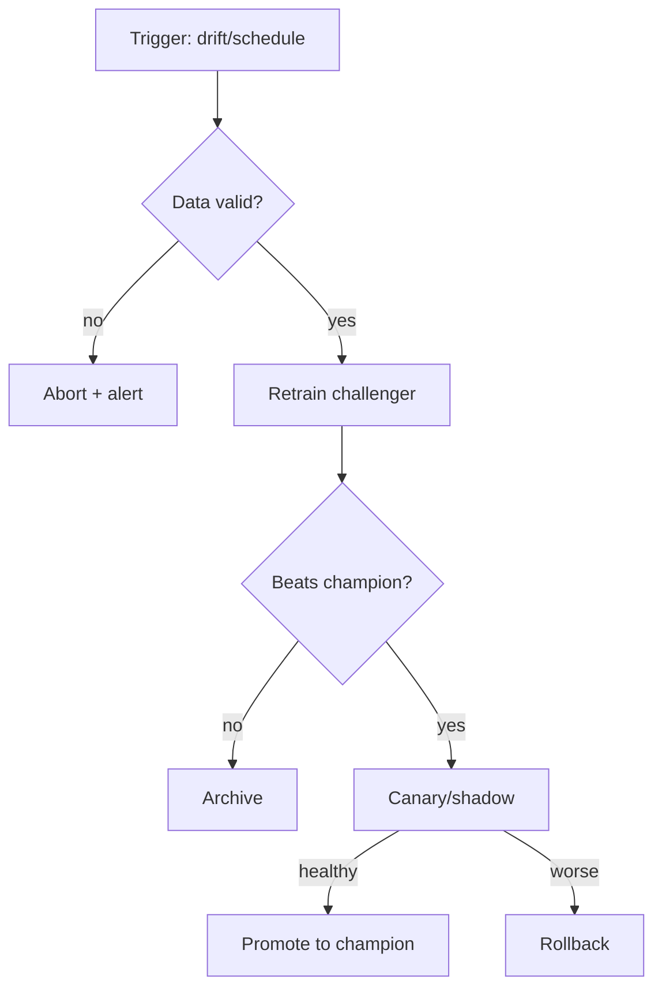
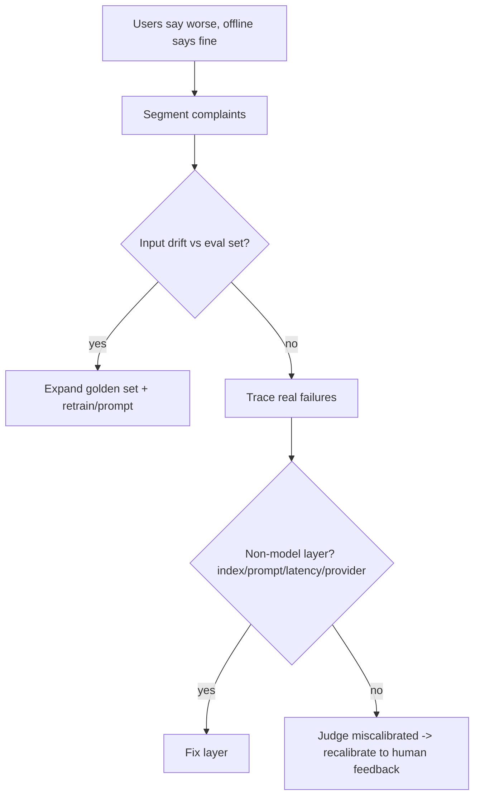

# MLOps & LLMOps Interview Questions — Advanced / Expert (Senior & Staff)

> Design-level and scale-level questions for senior/staff AI-engineer and ML-platform roles. Interviewers here care about trade-offs, failure modes, cost math, and how your design survives contact with real traffic. Answers are opinionated but explain the reasoning.

---

## Q1. Design an end-to-end ML platform for 50+ models across many teams.

**Answer:** The goal is a **paved road**: self-service for data scientists, with governance and reliability baked in. Layered architecture:

**Key design decisions & why:**
- **Standardize interfaces, not implementations.** Every model exposes the same predict/health contract and registers to the same registry — so tooling (deploy, monitor, rollback) is uniform.
- **Feature store** to kill training/serving skew and enable reuse.
- **One registry** as the deploy contract; stage transitions gated by evals + approvals.
- **Multi-tenancy:** isolate by namespace/quota; per-tenant cost + drift dashboards.
- **Golden paths + escape hatches:** most teams use templates; advanced teams can customize.
- **Build vs buy:** buy commodity (tracking, serving), build only your differentiators.

**Scale considerations:** GPU sharing/scheduling (MIG, bin-packing), a shared inference gateway for LLMs (routing/fallback/cost), and a central offline eval service so every team evaluates the same way.

---

## Q2. Design drift detection & monitoring for thousands of models at scale.

**Answer:** Per-model bespoke monitoring doesn't scale; you need a **monitoring platform**.

**Design points:**
- **Log asynchronously** (fire-and-forget to a bus) so monitoring never adds latency to inference.
- **Precompute reference statistics** per model (histograms, quantiles) — don't re-scan training data every check.
- **Windowed batch jobs** compute drift on rolling windows, not per request (cost + statistical validity).
- **Tiered alerting:** feature drift → dashboard/ticket; *model-quality* drop (when labels land) → page. Rank by feature importance to suppress noise.
- **Sampling** for very high-QPS services; full logging is too expensive.
- **KS oversensitivity at scale:** at billions of rows KS flags trivial shifts — require PSI magnitude too.
- **Delayed labels:** run a separate job that joins predictions with ground truth as it arrives to compute true accuracy and confirm concept drift.

**Scale math intuition:** if you log every prediction for 1000 models at 1000 QPS, that's ~1B events/day — hence sampling, columnar storage, and windowed aggregation instead of per-event processing.

---

## Q3. How do you gate CI/CD on LLM evaluations without blocking every deploy on flaky judges?

**Answer:** LLM-as-judge is noisy and non-deterministic, so a naive "block if score < X" flaps. Robust gating:

1. **Golden dataset with versioning** — a curated, representative eval set that itself is reviewed like code. Expand it whenever prod surfaces a new failure.
2. **Multiple eval types:** deterministic checks (schema validity, tool-call correctness, regex/PII) are hard gates; **subjective LLM-judge scores** are soft gates with margins.
3. **Statistical thresholds, not point values:** compare candidate vs baseline with a **paired test** over the set; require improvement or non-regression beyond noise, not an absolute number.
4. **Judge calibration:** periodically validate the judge against human labels; pin the judge model version so scores are comparable across runs.
5. **Tiered gates:** cheap fast checks on every PR; full eval + human spot-check before promotion to prod.
6. **Online continuation:** offline eval → canary → **online evals** on sampled real traffic, since offline sets never cover everything.

**Why:** this separates "definitely broken" (deterministic, hard-fail) from "maybe worse" (subjective, statistical), so you catch real regressions without flaky red builds.

---

## Q4. You serve LLMs on GPUs. How do you optimize for cost and latency at scale?

**Answer:** Attack it on three axes: **engine**, **model**, **infra**.

**Engine (serving):**
- Use a real inference server (**vLLM/TGI/Triton**) with **continuous batching** — the single biggest throughput win (an Anyscale study cites up to ~23× over static batching).
- **PagedAttention** (vLLM) cuts KV-cache fragmentation to a few %, giving ~2-4× more concurrency per GPU.
- **Prefix/KV caching** for shared system prompts; **chunked prefill** to balance TTFT vs throughput.

**Model:**
- **Quantization** (FP8/INT8/AWQ/GPTQ) to fit bigger models / more concurrency with modest quality loss.
- **Distillation / right-sizing** — don't serve a 70B when a tuned 8B meets the bar.
- **Speculative decoding** to reduce latency for the big model.

**Infra & routing:**
- **Model routing:** cheap model for easy prompts, frontier only for hard ones.
- **Autoscale on queue depth / tokens-per-sec**, keep a warm floor to dodge cold starts, use **spot** GPUs for batch/offline.
- **Tensor/pipeline parallelism** for models that don't fit one GPU; **disaggregated prefill/decode** at large scale.
- **Semantic cache** in front for repeated queries.

**Metrics to optimize:** TTFT (time to first token), TPOT/inter-token latency, tokens/sec/GPU, cost per 1K requests — always at **p95/p99**, and load-test with realistic (bursty, long-context) traffic before committing capacity.

> **Honest caveat:** exact benchmark multipliers depend on model, hardware, and workload. State the *mechanism* (batching, paging, quantization) and that you'd benchmark on your own traffic.

---

## Q5. Design a rollback strategy for both classic models and LLM apps.

**Answer:** Rollback must be **fast, boring, and one action**. That requires everything to be versioned and immutable.

**Classic model:**
- Model artifacts are immutable, versioned in the registry; serving reads "current Production" by pointer.
- Rollback = transition the registry pointer back + redeploy the previous **image digest** (not a tag — tags are mutable).
- Blue-green makes it instant (flip traffic); canary makes it automatic (auto-rollback on metric breach).

**LLM app (more moving parts):** you must be able to roll back *each* layer independently:

| Layer | Versioned as | Rollback |
|---|---|---|
| Prompt | Registry version/label | Repoint label to prior version (no redeploy) |
| Model/provider | Config-pinned version | Switch back via gateway |
| Retrieval index | Blue-green index | Point back to prior index |
| App code | Image digest | Redeploy prior digest |

**Principles:** immutable artifacts, pin by digest/version not by mutable tag, decouple prompt/model/index/code so one bad prompt doesn't force a full redeploy, define **automatic rollback triggers** (error rate, latency, eval score, cost spike), and rehearse rollback so it's practiced, not improvised. The 2026 mantra: *make rollback one click.*

---

## Q6. How do you handle stateful concerns — feature freshness, training/serving skew, and label leakage?

**Answer:** These are the silent model-killers.

- **Training/serving skew:** the same feature computed differently in training vs serving. **Fix:** a feature store that computes each feature **once**, serving both offline (training) and online (inference) from the same definition.
- **Label leakage:** using information at training time that wouldn't be available at prediction time (e.g., a feature populated *after* the outcome). **Fix:** **point-in-time correct** joins — for each training row, only use feature values as they existed at that timestamp.
- **Feature freshness:** online features must be fresh enough (e.g., "transactions in last 5 min"). **Fix:** streaming feature computation with monitored freshness SLAs; alert when a feature goes stale.

**Why senior-level:** these bugs pass every unit test and only surface as mysterious production accuracy gaps — recognizing them is a seniority signal.

---

## Q7. Multi-region, high-availability model serving — how do you design it?

**Answer:** Treat model services as **stateless, replicated** web services with ML-specific twists.

- **Stateless replicas** behind a load balancer; state (features, models) in shared stores/registries.
- **Multi-region:** replicate model artifacts + indexes to each region; route by latency (geo/anycast); each region self-sufficient to survive a regional outage.
- **Reliability patterns:** health probes, circuit breakers, **retries with jitter**, timeouts, bulkheads, and **provider fallback** for LLMs (if provider A is down/slow, fail over to B).
- **Model artifact distribution:** pre-pull large images/weights to nodes (or use a model cache/CDN) so scale-up isn't blocked on multi-GB downloads.
- **Consistency:** version pinning per region so a rollout can't leave regions on mismatched model versions mid-deploy.

---

## Q8. Security threat model for an LLM platform (beyond classic MLOps).

**Answer:** Layer classic supply-chain security with LLM-specific (OWASP LLM Top 10) threats.

**Classic:**
- **Supply chain:** scan images (Trivy), pin + verify deps, sign artifacts/SBOM. **Pickled models can execute arbitrary code** — treat untrusted weights as untrusted code; prefer `safetensors`.
- **Secrets:** never in code/images; short-lived creds from a secrets manager.
- **Least privilege + network policy:** scoped service accounts, private endpoints.

**LLM-specific:**
- **Prompt injection** — especially **indirect** injection via retrieved docs / tool outputs / web content. Treat all retrieved/tool content as **untrusted data, not instructions**.
- **Excessive agency:** an agent with tools can take real actions — sandbox tools, require approval for high-impact actions, cap step/spend budgets.
- **Sensitive-info disclosure:** output guardrails for PII/secrets; scope retrieval by ACL (**pre-filter** in the query, never post-filter).
- **Insecure output handling:** never `eval()` model output or run generated SQL/shell without validation.
- **Data poisoning / model theft:** provenance tracking, rate limits, output watermarking where relevant.

---

## Q9. How would you architect continuous training (CT) safely, without runaway retraining?

**Answer:** CT automates retrain→validate→deploy on triggers — but naive CT can chase noise or ship a worse model automatically.

**Safe CT design:**
- **Triggers:** scheduled (weekly), drift-based (PSI/quality breach), or data-volume-based — but **debounce** so transient blips don't retrain constantly.
- **Always validate before promote:** a new model must **beat the incumbent** on the golden set + not regress on slices; otherwise it's archived, not shipped.
- **Champion/challenger:** the retrained model is a *challenger*; it only becomes champion after canary/shadow proves it in production.
- **Guardrails:** cap retrain frequency/cost, require data-validation to pass (bad data in → don't train), and keep human approval for high-stakes models.
- **Full lineage:** every auto-trained model records its trigger, data version, and eval — so an auto-deployed regression is traceable and reversible.

---

## Q10. A staff-level curveball: your LLM feature is accurate offline but users complain it's "worse." How do you investigate?

**Answer:** Offline-vs-online gaps are common because golden sets don't match reality. Systematic dig:

1. **Segment the complaints** — which users, query types, languages, times? A global metric can hide a broken segment (Simpson's paradox).
2. **Compare distributions** — are production prompts drifting from your eval set (new topics/phrasing)? That's **input drift** your golden set never covered.
3. **Trace real failures** — pull traces (Langfuse/LangSmith) for complained-about requests; inspect retrieval, prompt, tokens, tool calls.
4. **Check the non-model layers** — retrieval index staleness, a prompt/template change, truncation from context limits, a silent provider model update, latency making users abandon.
5. **Judge vs human mismatch** — maybe your LLM-judge overrates verbose answers users find unhelpful; recalibrate against human feedback.
6. **Close the loop** — add the new failure cases to the golden set + online evals so the metric now reflects reality.

**Takeaway:** the metric that says "fine" is often the bug. Senior engineers instrument reality, not just the test set.

---

## Quick Coverage Map
- **Platform design:** ML platform (Q1), multi-region HA (Q7).
- **Drift at scale:** monitoring platform (Q2), offline/online gap (Q10).
- **CI/CD gating:** eval gates (Q3), safe continuous training (Q9).
- **GPU serving & cost:** optimization (Q4).
- **Rollback:** multi-layer rollback (Q5).
- **Stateful correctness:** skew/leakage/freshness (Q6).
- **Security:** LLM threat model (Q8).

## Further Reading
- [Google MLOps automation levels](https://cloud.google.com/architecture/mlops-continuous-delivery-and-automation-pipelines-in-machine-learning)
- [vLLM PagedAttention](https://docs.vllm.ai/en/latest/design/kernel/paged_attention.html)
- [Evidently: drift & monitoring](https://www.evidentlyai.com/)
- [OWASP Top 10 for LLM Apps](https://owasp.org/www-project-top-10-for-large-language-model-applications/)
- [Feast: point-in-time correctness](https://docs.feast.dev/)

*Content synthesized from general domain knowledge and current (2025-2026) interview trends; rephrased for compliance with licensing restrictions.*
