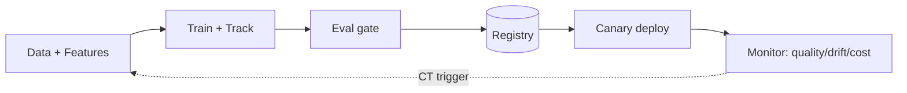

# MLOps & LLMOps Cheatsheet

> Dense one-page reference. Skim the night before an interview or before designing a system.

---

## Lifecycle in One Diagram

**Mnemonic:** *Data → Track → Evaluate → Register → Deploy(canary) → Monitor → (retrain).*
**Version everything:** code + data + model + **prompt** + config.

---

## MLOps vs LLMOps (one line)
Same registry/deploy/monitor pipes; **LLMOps adds** prompt versioning, subjective-output evals, token-cost control, guardrails & tracing.

**Maturity:** L0 manual → L1 automated training + Continuous Training → L2 full CI/CD automation.

---

## Tools Table

| Concern | Tools |
|---|---|
| Experiment tracking | MLflow, Weights & Biases, Comet, Neptune |
| Data versioning | DVC, LakeFS, Git-LFS, Delta/Iceberg |
| Model/prompt registry | MLflow Registry, W&B, SageMaker, Langfuse/LangSmith (prompts) |
| Pipelines/orchestration | Airflow, Dagster, Prefect, Kubeflow, Metaflow |
| Feature store | Feast, Tecton, Databricks/SageMaker FS |
| Containers/orchestration | Docker, Kubernetes, KEDA (event autoscale) |
| Model servers (LLM) | vLLM, TGI, Triton, TensorRT-LLM, Ollama |
| Serving frameworks | BentoML, KServe, Seldon, Ray Serve, FastAPI |
| CI/CD | GitHub Actions, GitLab CI, Argo/Jenkins, Argo Rollouts |
| Monitoring/obs | Prometheus, Grafana, OpenTelemetry, Evidently |
| LLM observability | Langfuse, LangSmith, Arize/Phoenix, Helicone |
| Guardrails/gateway | LiteLLM, Guardrails, NeMo Guardrails |
| Eval | RAGAS, DeepEval, promptfoo, MLflow eval |

---

## Deployment: Batch vs Online vs Streaming

| | Batch | Online | Streaming |
|---|---|---|---|
| Latency | min–hrs | ms | seconds |
| Cost | cheap | always-on | medium |
| Use | precompute | per-request freshness | event-driven |

**REST vs gRPC:** REST = public/browser, easy debug; gRPC = internal, binary, HTTP/2, streaming, faster.
**Serverless:** scale-to-zero + cheap for spiky/low QPS; ❌ cold starts, size/GPU limits (bad for big models).

---

## Release / Deployment Strategies

| Strategy | Mechanism | Pro | Con |
|---|---|---|---|
| Canary | % → new, ramp | small blast radius | slower |
| Blue-Green | flip 2 envs | instant switch/rollback | 2× infra |
| Shadow | mirror traffic, discard | zero user risk | 2× compute, no click signal |
| Rolling | replace pods | K8s-native | harder to isolate |
| A/B | split users | KPI proof | needs traffic/time |

**Rollback rule:** immutable artifacts, pin by **digest not tag**, one-click, auto-trigger on SLO breach.

---

## Model Servers (why fast)

- **Continuous/in-flight batching** → up to ~23× over static batching (Anyscale study).
- **PagedAttention (vLLM)** → KV fragmentation ~60-80% → <4% → ~2-4× concurrency.
- **vLLM** = throughput default · **TGI** = HF + interactive latency · **Triton** = multi-framework + dynamic batching · **TensorRT-LLM** = peak NVIDIA · **Ollama** = local/dev. *Benchmark on your traffic.*

---

## Monitoring — 4 Layers + Golden Signals

| Layer | Watch |
|---|---|
| Infra/Service | latency p50/p95/**p99**, QPS, errors, CPU/GPU, cost |
| Data | schema, null rate, feature drift, ranges |
| Model | prediction dist, confidence, accuracy (when labels arrive) |
| Business | conversion, revenue, complaints, KPI |

**Golden signals:** Latency · Traffic · Errors · Saturation. **Report tail (p95/p99), not averages.**

---

## Drift Quick Reference

| Type | What changed | Detect |
|---|---|---|
| Data drift | inputs P(X) | PSI, KS, Chi-sq, KL |
| Prediction drift | outputs P(ŷ) | histogram compare |
| Concept drift | P(y\|X) | accuracy w/ labels; proxies if none |

**PSI:** <0.1 stable · 0.1-0.2 watch · >0.2 act.
**KS caveat:** oversensitive on big samples → also require PSI magnitude.
**Concept drift is hard** = needs labels (often late) → use proxies (prediction drift, confidence, KPI).

---

## LLMOps Checklist

- [ ] **Prompt versioning** — registry, labels per env, roll back w/o redeploy, A/B.
- [ ] **Eval in CI** — golden set; hard gates (schema/PII/tool-call) + soft gates (judge, paired test vs baseline).
- [ ] **Tracing** — full span tree per request (retrieve→prompt→tool→gen) w/ tokens/latency/cost.
- [ ] **Cost tracking** — tokens & $ per request/feature/tenant; budget alerts.
- [ ] **Cost levers** — semantic+prompt cache → routing → context trim → smaller/quantized → batch/stream.
- [ ] **Guardrails** — input (injection/PII/jailbreak) + output (toxicity/secrets/schema).
- [ ] **Gateway** — routing, rate limit, fallback, central logging (e.g., LiteLLM).
- [ ] **Online evals** — sample prod traffic + user feedback; feed failures back to golden set.

---

## Cost & Performance Levers

| Goal | Lever |
|---|---|
| ↓ latency | quantize, continuous batching, KV/prefix cache, stream, semantic cache |
| ↑ throughput | vLLM/Triton batching, tensor/pipeline parallel, more replicas |
| ↓ cost | model routing, caching, spot GPUs, autoscale floor, right-size GPU |
| spikes | HPA/KEDA, queue + backpressure, provider fallback |
| big models | quantization (FP8/INT8/AWQ/GPTQ), sharding, offload |

**LLM latency metrics:** TTFT (first token), TPOT/inter-token, tokens/sec/GPU, $/1K req.

---

## Security Checklist

- [ ] Scan images (Trivy), pin+verify deps, sign/SBOM.
- [ ] Prefer `safetensors` — **pickle can execute code**; treat untrusted weights as untrusted code.
- [ ] Secrets in a manager, never in code/images; short-lived creds; least privilege + network policy.
- [ ] **Indirect prompt injection**: treat retrieved/tool content as untrusted data, not instructions.
- [ ] ACL **pre-filter** in retrieval (never post-filter); output PII/secret redaction.
- [ ] Excessive agency: sandbox tools, approval for high-impact, step/spend budgets.
- [ ] Audit logs + lineage + model cards (mandatory in regulated domains).

---

## Reproducibility Recipe
Pin **code (git SHA) + data (DVC hash) + env (image digest) + params (config)** → declarative pipeline (`dvc.yaml`/Kubeflow) → cached stages re-run only on change.

---

## Red Flags To Avoid
- No eval gate; "the demo looked good."
- Versioning code but not data/model/prompt.
- Scaling GPU inference on CPU metric.
- Post-filtering ACLs; `eval()`-ing model output.
- Averages instead of p95/p99.
- Rollback by mutable tag; no rehearsed rollback.
- CT that auto-ships without beating the champion.

*Rephrased for compliance with licensing restrictions. See interview-prep files for full explanations.*
