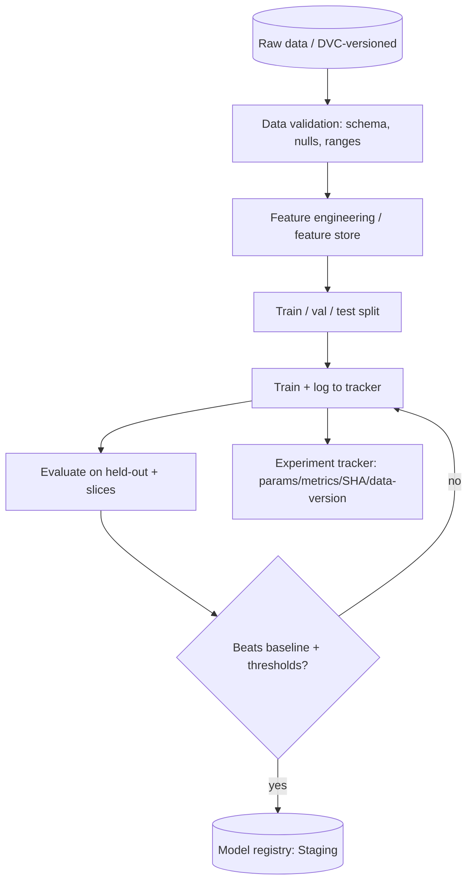
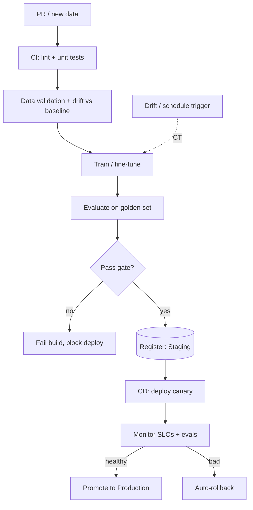
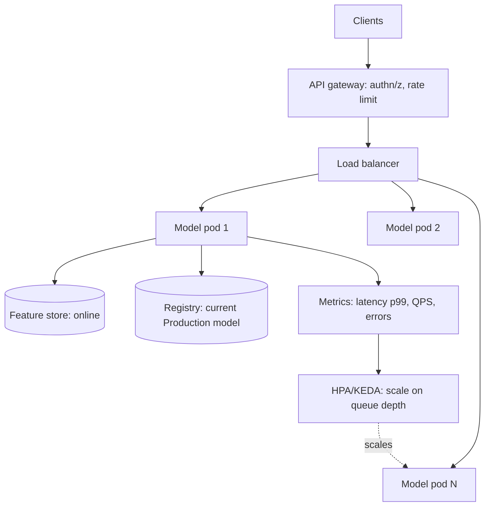
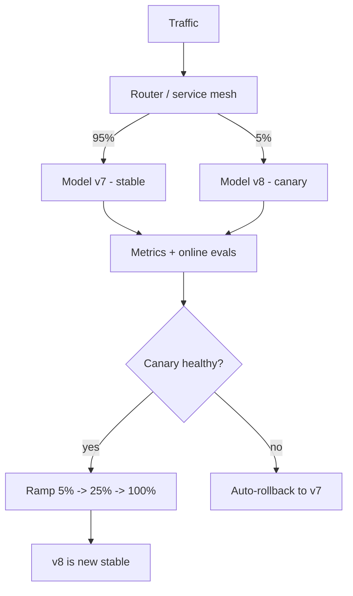
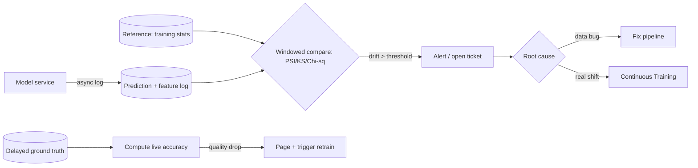
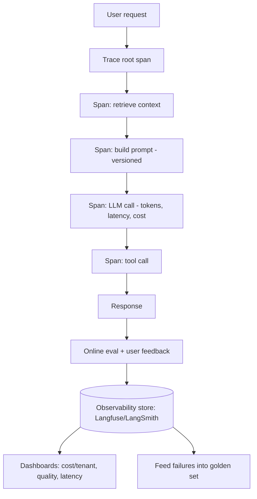
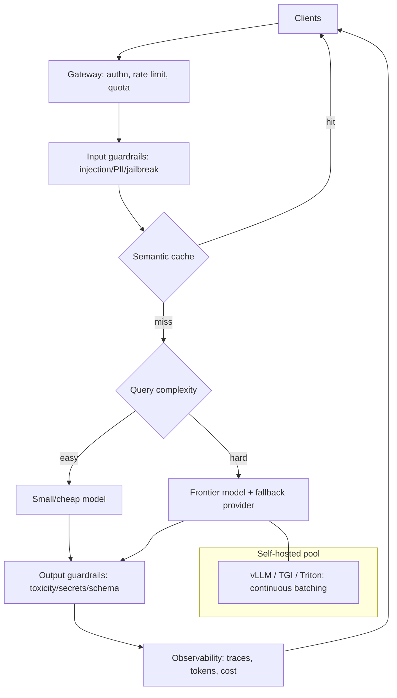
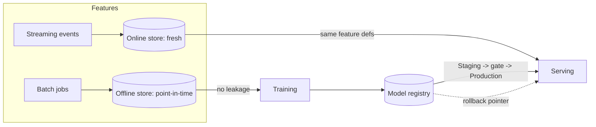
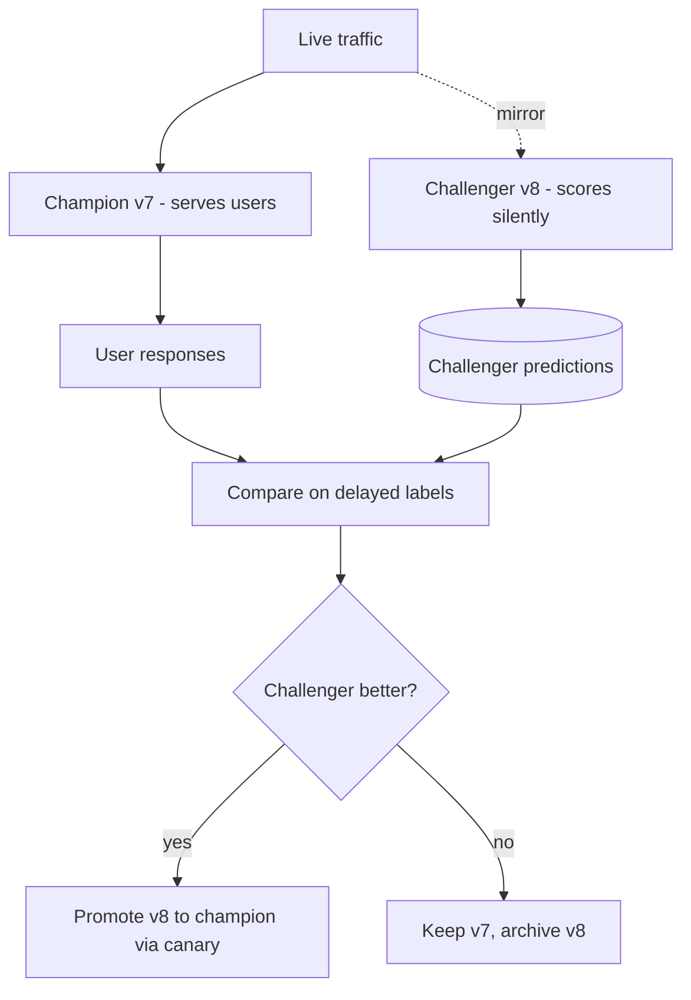
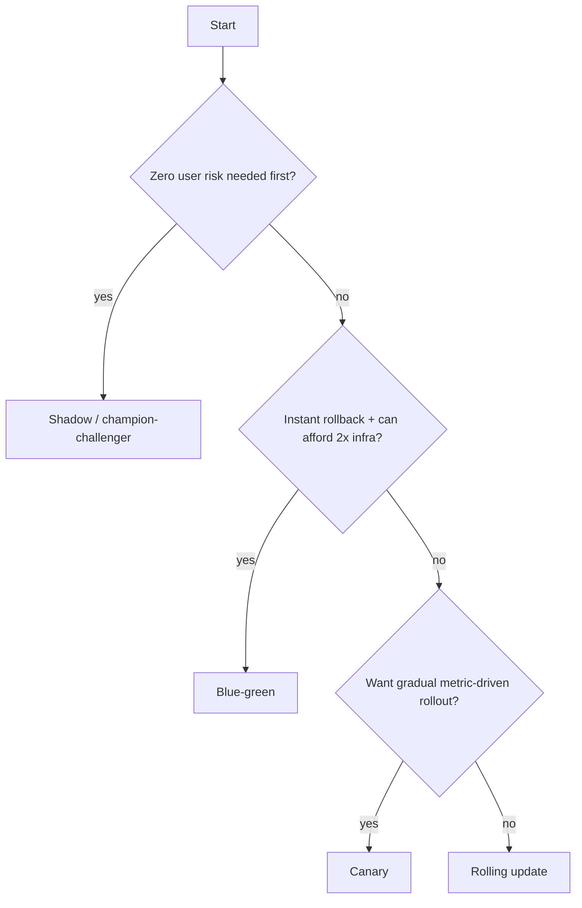

# MLOps & LLMOps — Use Case Diagrams

> Visual architectures for the MLOps/LLMOps patterns interviewers probe. GitHub renders Mermaid automatically, so these display as diagrams. Each includes the problem, the flow, and the design notes to mention out loud.

---

## 1. Training Pipeline (reproducible, tracked)

**Problem:** Turn "run notebook cells and pray" into a reproducible, cached, tracked pipeline.

**Design notes:** validate data *before* training (bad data in → bad model out); track git SHA + data version for reproducibility; cache stages so only changed steps re-run; gate registration on beating the current baseline, not an absolute score.

---

## 2. CI/CD for ML (with eval gate + Continuous Training)

**Problem:** Automatically build, test, evaluate, and deploy models without shipping regressions.

**Design notes:** the **eval gate** is the ML-specific addition; deterministic checks hard-fail, subjective scores use margins; Continuous Training closes the loop from monitoring back to training.

---

## 3. Model Serving with Autoscaling (online inference)

**Problem:** Serve low-latency predictions that scale with bursty traffic and survive pod failures.

**Design notes:** stateless replicas + shared feature/registry stores; scale on **queue depth / GPU util**, not CPU; readiness probes gate traffic until the model loads; keep a warm floor to dodge cold starts.

---

## 4. Canary Deployment (safe rollout)

**Problem:** Ship a new model version while limiting the blast radius of a bad release.

**Design notes:** define automatic rollback triggers (error rate, latency p99, eval score, cost spike); ramp gradually; keep v7 pinned by image digest for instant revert.

---

## 5. Drift Monitoring Loop (production feedback)

**Problem:** Detect when the model's world changes and act before quality silently collapses.

**Design notes:** log asynchronously so monitoring adds no inference latency; precompute reference stats; feature drift → ticket, model-quality drop → page; join delayed labels to confirm concept drift.

---

## 6. LLM Observability & Tracing

**Problem:** Debug a non-deterministic multi-step LLM chain and track cost/quality per request.

**Design notes:** capture the full span tree with tokens/latency/cost per step; reference prompts by version; sample prod traffic for online evals; loop real failures back into the eval set.

---

## 7. LLM Serving Stack with Routing, Cache & Guardrails

**Problem:** Serve LLMs to many users with cost control, safety, and reliability.

**Design notes:** semantic cache first (biggest cost win); model routing for cost; provider fallback for reliability; guardrails on both input and output; self-hosted models on a batching server for throughput.

---

## 8. Feature Store & Model Registry Flow

**Problem:** Prevent training/serving skew and make deploy/rollback a controlled contract.

**Design notes:** one feature definition serves both training (offline, point-in-time) and inference (online, fresh) — killing skew and leakage; registry pointer is the deploy/rollback contract.

---

## 9. Champion / Challenger with Shadow Testing

**Problem:** Validate a retrained model on real traffic before promoting it — with zero user risk.

**Design notes:** shadow gives real-traffic signal without user impact (but no click/label feedback); confirm on delayed labels; still roll out the winner via canary, not a hard switch.

---

## Choosing a Deployment Strategy (quick guide)

*Diagrams synthesized from general domain knowledge and current best practices; rephrased for compliance with licensing restrictions.*
