# Cloud for AI — Detailed Learning Guide

> The cloud is where almost all real AI systems run. This guide teaches you how to
> pick compute, choose managed AI services, store data, scale on Kubernetes, control
> GPU cost, stay highly available across regions, and codify everything with IaC —
> the exact ground a tough AI-engineer interview at a big company will cover.

---

## Table of Contents

1. [How to Think About Cloud for AI](#1-how-to-think-about-cloud-for-ai)
2. [Compute Options: VM, Container, Serverless, GPU](#2-compute-options-vm-container-serverless-gpu)
3. [Managed AI Services — AWS vs Azure vs GCP](#3-managed-ai-services--aws-vs-azure-vs-gcp)
4. [Storage & Data (Object, DB, Vector)](#4-storage--data-object-db-vector)
5. [Kubernetes for AI Workloads](#5-kubernetes-for-ai-workloads)
6. [Serverless & Edge Inference](#6-serverless--edge-inference)
7. [GPU Cost & Availability Strategies](#7-gpu-cost--availability-strategies)
8. [Cost Optimization (Spot, Autoscaling, Caching)](#8-cost-optimization-spot-autoscaling-caching)
9. [High Availability, Multi-Region & Disaster Recovery](#9-high-availability-multi-region--disaster-recovery)
10. [Infrastructure as Code (Terraform / CDK)](#10-infrastructure-as-code-terraform--cdk)
11. [Security (IAM, Secrets, Network, Data Residency)](#11-security-iam-secrets-network-data-residency)
12. [Reference Architecture: Scalable LLM API](#12-reference-architecture-scalable-llm-api)
13. [Interview Checklist](#13-interview-checklist)
14. [Further Reading](#14-further-reading)

---

## 1. How to Think About Cloud for AI

AI workloads are not like normal web apps. Three properties change every decision:

- **They are compute-heavy and GPU-hungry.** A single request can hold a GPU for
  seconds, and GPUs are scarce and expensive. Utilization is the whole game.
- **They are bursty.** Traffic spikes, batch jobs, and experiments come and go.
  You want to scale to zero when idle and scale out fast under load.
- **They are data-heavy and often sensitive.** Training data, embeddings, prompts,
  and outputs can contain PII, so residency and access control matter.

A useful mental model — split every AI system into four planes:

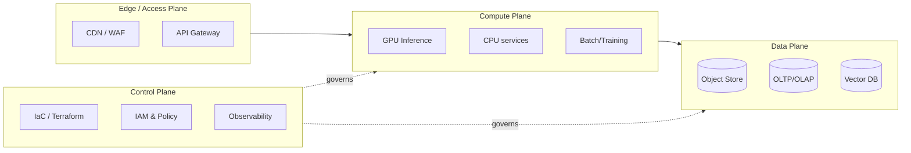

**Interview framing:** whenever you're asked to "design X on the cloud," walk these
four planes. It signals structured thinking and stops you from forgetting security
and cost.

---

## 2. Compute Options: VM, Container, Serverless, GPU

There is a spectrum from "you manage everything" to "the cloud manages everything."
More control means more ops burden; more managed means less control and often more
cost per unit at scale.

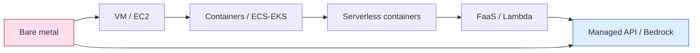

### 2.1 Virtual Machines (EC2 / Azure VM / GCE)

- **What:** raw instances you patch, scale, and monitor yourself.
- **When:** you need full control of GPU drivers, kernel, CUDA versions, or you run a
  custom inference server (vLLM, TGI, Triton) and want maximum throughput per GPU.
- **Pros:** cheapest per GPU-hour at high utilization; full control; spot-eligible.
- **Cons:** you own patching, autoscaling, cold starts, and failure recovery.

### 2.2 Containers (ECS / EKS / GKE / AKS)

- **What:** package the app + CUDA + model server into an image; the orchestrator
  schedules it onto GPU nodes.
- **When:** production inference at scale, reproducible environments, many teams.
- **Pros:** portability, rolling deploys, autoscaling, GPU sharing.
- **Cons:** cluster ops, GPU driver/operator management, image size (models are big).

### 2.3 Serverless Containers (Fargate / Cloud Run / Container Apps)

- **What:** run a container without managing nodes; scale-to-zero.
- **When:** CPU-bound pre/post-processing, RAG orchestration, bursty low-GPU work.
- **Caveat:** GPU support here is still limited/regional; great for the glue, not
  always for the heavy model.

### 2.4 Functions / FaaS (Lambda / Cloud Functions / Azure Functions)

- **When:** event-driven glue — S3 upload triggers embedding, webhook handlers,
  lightweight routing. Not for large GPU models (timeout + no GPU historically).
- **Watch out:** cold starts, 15-min limits, package-size limits.

### 2.5 GPU Instances & Serverless GPU

- **GPU families (2025-2026):** NVIDIA H100/H200 and GB200 (Blackwell) for training
  and big-model inference; L4/L40S and A10G for cost-efficient inference; older A100
  still common. Cloud SKUs: AWS `p5`/`g6`, GCP `a3`/`g2`, Azure `ND`/`NC` series.
- **Serverless GPU** (Modal, RunPod serverless, Bedrock behind the scenes) gives
  scale-to-zero GPUs with fast cold starts — a big 2025-2026 trend for spiky traffic.

**Compute decision table**

| Need | Best choice | Why |
|---|---|---|
| Max throughput per GPU, full control | VM + vLLM/TGI | No abstraction tax; tune batching |
| Scalable prod inference, many teams | Kubernetes (EKS/GKE/AKS) | Autoscaling, rollouts, GPU operator |
| Bursty, scale-to-zero, low ops | Serverless GPU (Modal/Cloud Run GPU) | Pay only when serving |
| Event glue, embeddings on upload | FaaS (Lambda) | Cheap, event-driven |
| Fastest time-to-market, no model ops | Managed API (Bedrock/Vertex) | Someone else runs the GPU |

---

## 3. Managed AI Services — AWS vs Azure vs GCP

Two categories matter: **foundation-model APIs** (call a model, pay per token) and
**ML platforms** (train/deploy your own models with control).

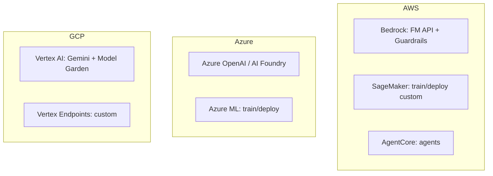

### Comparison

| Capability | AWS | Azure | GCP |
|---|---|---|---|
| FM API (pay-per-token) | **Bedrock** (Claude, Llama, Titan, Nova) | **Azure OpenAI / AI Foundry** (GPT, o-series) | **Vertex AI** (Gemini, Model Garden) |
| Custom train/deploy | **SageMaker** | **Azure ML** | **Vertex AI Training/Endpoints** |
| Managed vector/RAG | Bedrock Knowledge Bases | AI Search (vector) | Vertex AI Search / RAG Engine |
| Guardrails/safety | Bedrock Guardrails | Azure AI Content Safety | Vertex safety filters |
| Agents | Bedrock Agents / AgentCore | AI Foundry Agents | Vertex Agent Builder |
| Best when | Deep AWS shop, Claude access | Microsoft stack, GPT models | Data/BigQuery-heavy, Gemini |

### Managed API vs Self-Host (the classic interview trade-off)

| Dimension | Managed API (Bedrock/Vertex/AOAI) | Self-host (EKS + vLLM) |
|---|---|---|
| Time to market | Minutes | Days–weeks |
| Ops burden | ~None | You own scaling, GPUs, patching |
| Cost at low volume | Cheap (pay per token) | Wasteful (idle GPUs) |
| Cost at high volume | Can get expensive | Cheaper per token if GPUs stay busy |
| Latency control | Limited (shared) | Full (batching, quantization, region) |
| Data control | Provider boundary + guardrails | Fully in your VPC |
| Model choice | Provider's catalog | Any open-weight model |

**Rule of thumb:** start managed, move to self-host once volume is steady, latency/
cost is critical, and utilization is high enough to keep GPUs busy (often the crossover
is around consistently high, predictable token volume).

---

## 4. Storage & Data (Object, DB, Vector)

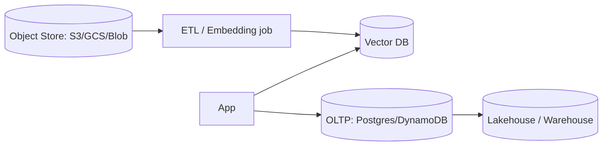

- **Object storage (S3 / GCS / Azure Blob):** the backbone — model weights, datasets,
  checkpoints, documents. Use lifecycle rules to tier cold data to cheaper classes.
  Watch **egress fees** (moving data out/cross-region is where cloud bills explode).
- **OLTP databases:** Postgres/Aurora/Cloud SQL/DynamoDB for app state, users, jobs.
  `pgvector` lets Postgres double as a vector store for modest scale.
- **Vector databases:** store embeddings for RAG. Managed (Pinecone, Vertex Search,
  Bedrock KB) vs self-host (Qdrant, Weaviate, Milvus, pgvector). Choose on scale,
  filtering needs, and whether you want to run infra.
- **Data locality is a cost lever:** keep GPUs, object store, and vector DB in the
  **same region/AZ** to avoid egress and cut latency.

---

## 5. Kubernetes for AI Workloads

Kubernetes is the default control plane for scalable self-hosted inference. The
2025-2026 production pattern separates **ingestion** from **inference** and autoscales
on **GPU/serving metrics**, not just CPU.

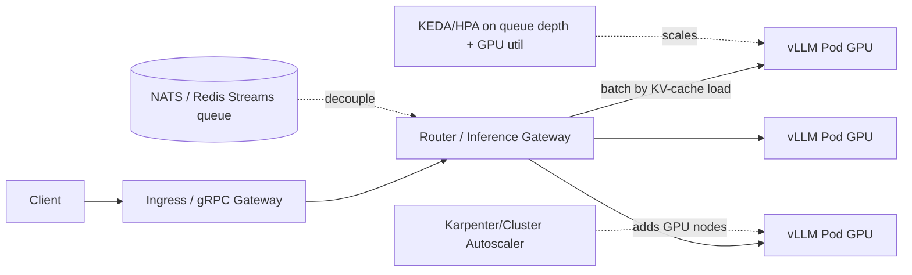

Key building blocks:

- **NVIDIA GPU Operator / device plugin** — installs drivers, exposes `nvidia.com/gpu`
  as a schedulable resource, enables **MIG** (slice one A100/H100 into smaller GPUs)
  and time-slicing for better utilization.
- **Model server:** vLLM (PagedAttention + continuous batching) is the common choice;
  TGI and Triton are alternatives. Continuous batching is the single biggest throughput
  win for LLM serving.
- **Autoscaling two layers:**
  - **Pods:** HPA/KEDA on serving metrics (queue depth, batch size, decode latency,
    GPU utilization) — CPU% is a poor proxy for LLM load.
  - **Nodes:** Cluster Autoscaler or **Karpenter** to add/remove GPU nodes; combine
    with spot for cost.
- **Scheduling:** node selectors/taints/tolerations pin pods to GPU nodes; topology
  spread + PodDisruptionBudgets protect availability during node churn.
- **Warm pools / preloaded images:** model weights are huge — bake them into the image
  or a fast volume, and keep warm replicas to fight cold starts.

Example resource request (see `../6-Implementation-Code-Examples/k8s_llm_deployment.yaml`):

```yaml
resources:
  limits:
    nvidia.com/gpu: 1
```

---

## 6. Serverless & Edge Inference

### Serverless inference

- **Scale-to-zero** is ideal for spiky or low-volume workloads: you pay nothing when
  idle. Options: SageMaker Serverless Inference, Cloud Run (GPU), Modal, RunPod
  serverless, Azure Container Apps.
- **Cold start** is the enemy. Mitigations: keep a min replica warm, snapshot the
  container/model, use provisioned concurrency, or use platforms optimized for fast
  GPU spin-up (a major 2025-2026 differentiator).

### Edge inference

- Run small/quantized models close to users (CDN edge, on-device, regional PoPs) for
  ultra-low latency and data-locality/residency.
- **When:** latency-critical UX, offline, privacy (data never leaves device/region).
- **Trade-off:** small models only; harder to update; observability is harder.

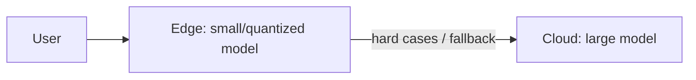

A common pattern is a **cascade / router**: cheap small model at the edge handles easy
requests, escalates hard ones to a big cloud model — great for cost and latency.

---

## 7. GPU Cost & Availability Strategies

GPUs are scarce and pricey, so senior interviews probe how you get capacity **and**
keep the bill sane.

**Availability tactics**

- **Capacity reservations / committed use** (AWS Capacity Blocks, GCP reservations,
  Azure capacity) to guarantee scarce GPUs when you need them.
- **Multi-region / multi-cloud fallback** for capacity: if H100s are unavailable in
  one region, fail over to another region or a GPU-cloud provider.
- **Right-size the GPU:** don't put a 7B model on an H100 — L4/L40S/A10G is far cheaper
  and often enough. Use **MIG** to slice big GPUs for small models.

**Cost tactics (the three billing models)**

| Model | Discount vs on-demand | Best for |
|---|---|---|
| On-demand | baseline | bursty, unpredictable |
| Spot / preemptible | ~60–90% off | fault-tolerant inference & training with checkpointing |
| Reserved / committed / savings plans | ~40–70% off | steady, predictable baseline |

- **Spot for interruptible work:** batch inference, training with frequent checkpoints,
  stateless replicas behind a queue. Handle the 2-minute eviction notice by draining.
- **Serverless GPU** to scale to zero between spikes.
- **Utilization is king:** a busy cheaper GPU beats an idle expensive one. Continuous
  batching, request coalescing, and KV-cache reuse raise tokens/sec/GPU.

---

## 8. Cost Optimization (Spot, Autoscaling, Caching)

Think in layers — each one multiplies savings:

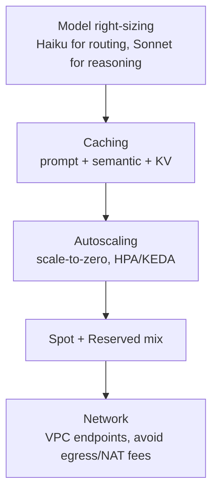

1. **Right-size the model.** Route easy tasks to a small/cheap model; reserve large
   models for hard reasoning. Often 40–70% inference savings.
2. **Cache aggressively.**
   - **Prompt caching** (Bedrock/Anthropic/OpenAI) reuses common prefixes — big savings
     on repeated system prompts/RAG context.
   - **Semantic cache** returns a stored answer for near-duplicate queries.
   - **KV-cache reuse** across requests in the serving layer.
3. **Autoscale + scale-to-zero.** Never pay for idle GPUs.
4. **Spot + reserved mix.** Reserved for the always-on baseline, spot for the bursty
   top, on-demand as a thin safety buffer.
5. **Kill network waste.** Use **VPC/private endpoints** to avoid NAT Gateway and
   cross-AZ/region **egress** charges — a silent, huge line item.
6. **Batch offline work.** Batch APIs / off-peak jobs are cheaper than real-time.
7. **Measure per-request cost.** Track $/1M tokens and $/request; tag resources; set
   budgets and anomaly alerts.

---

## 9. High Availability, Multi-Region & Disaster Recovery

### Availability building blocks

- **Multi-AZ** first: spread replicas across availability zones; use health checks and
  a load balancer to route around failures.
- **Multi-region** for higher tiers: active-active (serve from all) or active-passive
  (warm standby that you fail over to).

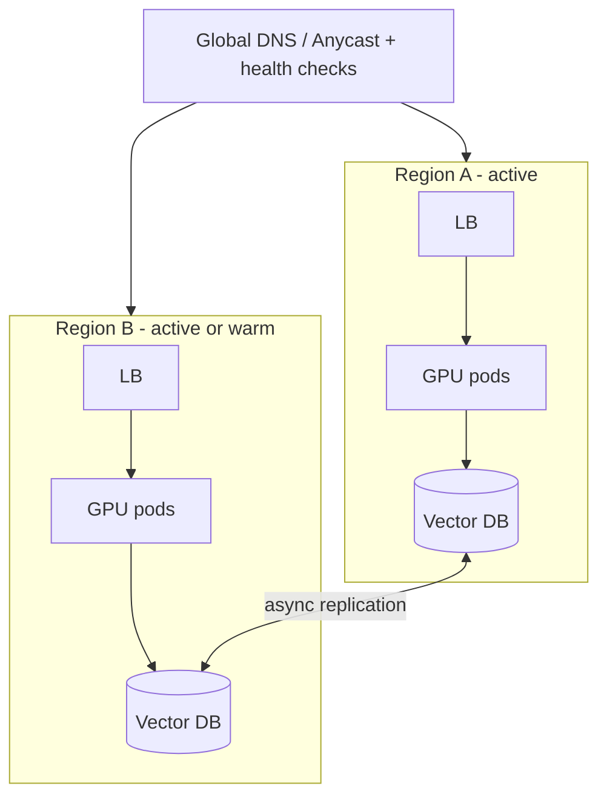

### Patterns & trade-offs

| Pattern | RTO/RPO | Cost | Notes |
|---|---|---|---|
| Single region, multi-AZ | minutes / near-zero | $ | Baseline; survives AZ loss |
| Active-passive multi-region | minutes / seconds | $$ | Warm standby; DNS failover |
| Active-active multi-region | ~zero / near-zero | $$$ | Hardest (data consistency) |

### Disaster Recovery essentials

- **Define RTO (how fast to recover) and RPO (how much data you can lose).** They drive
  cost and design.
- **Back up state:** vector index snapshots, DB backups, model artifacts in object
  storage with cross-region replication and versioning.
- **Test failover** regularly (game days). A DR plan you've never exercised is a guess.
- **Statelessness helps:** keep inference pods stateless so you can spin them up
  anywhere; push state to replicated data stores.

---

## 10. Infrastructure as Code (Terraform / CDK)

Never click in the console for production. Codify everything so it's reviewable,
repeatable, and auditable.

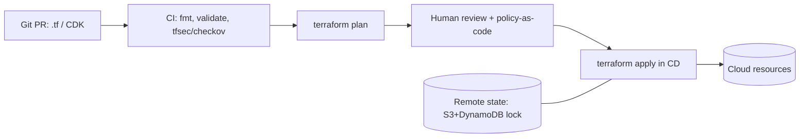

- **Terraform / OpenTofu:** declarative, multi-cloud, huge provider ecosystem. Great
  for portable GPU infra. Use **remote state** (S3 + DynamoDB lock, or Terraform Cloud)
  and **modules** for reuse.
- **CDK / Pulumi / CDKTF:** define infra in a real language (TypeScript/Python). Nice
  for complex logic and when your team prefers code over HCL.
- **Best practices at scale:**
  - Separate state per environment (dev/stage/prod) and per blast-radius domain.
  - **Policy as code** (OPA/Sentinel/checkov/tfsec) in CI to block insecure resources.
  - Bake GPU drivers/CUDA into **golden images** (Packer/AMI) so nodes boot fast.
  - Pin provider/module versions; review `plan` before `apply`; never `apply` from a
    laptop for prod.
  - **Never put secrets in state in plaintext** — reference a secrets manager.

See `../6-Implementation-Code-Examples/terraform_gpu_infra.tf` for a worked example.

---

## 11. Security (IAM, Secrets, Network, Data Residency)

Security is not a bonus section — it's a first-class part of any AI cloud design and a
frequent interview differentiator.

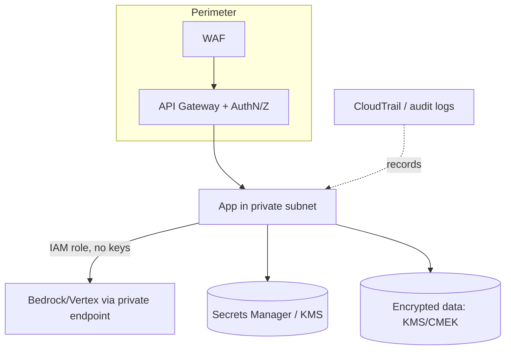

- **IAM — least privilege.** Give each service its own role scoped to exactly what it
  needs. Prefer **workload identity / IAM roles** (IRSA on EKS, Workload Identity on
  GKE) over long-lived access keys.
- **Secrets management.** Store API keys/DB creds in Secrets Manager / Key Vault /
  Secret Manager or Vault; inject at runtime; rotate automatically. **Never** hardcode
  in images, env files in git, or Terraform state.
- **Network isolation.** Private subnets, security groups, **private/VPC endpoints** so
  traffic to Bedrock/S3 never touches the public internet (also cuts egress cost).
- **Encryption.** At rest (KMS/CMEK, customer-managed keys) and in transit (TLS
  everywhere).
- **Data residency & compliance.** Pin data and inference to allowed regions (GDPR,
  data sovereignty). Managed FM providers offer regional endpoints and no-training-on-
  your-data guarantees — verify them.
- **AI-specific guardrails.** Content filtering, PII redaction (Bedrock Guardrails /
  Azure Content Safety), prompt-injection defenses, and output validation.
- **Auditability.** Turn on CloudTrail/Cloud Audit Logs; log who called which model
  with what — essential for compliance and incident response.

---

## 12. Reference Architecture: Scalable LLM API

Putting it all together — a production LLM API that's scalable, secure, and cost-aware:

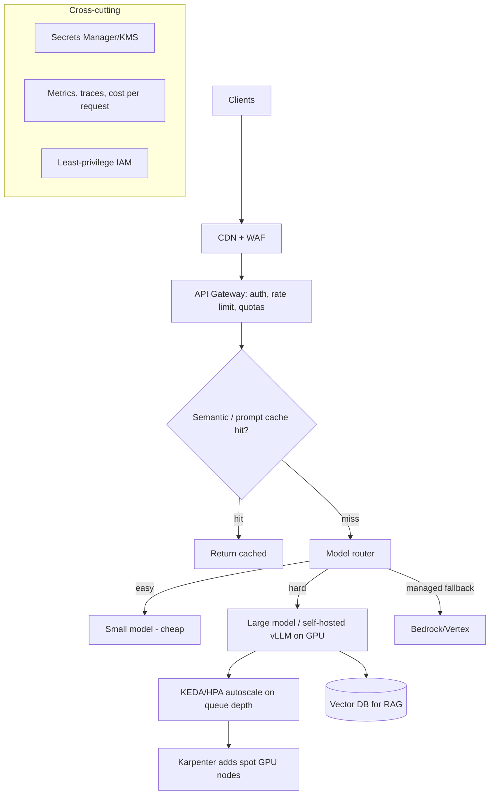

Design notes:
- **Gateway** handles auth, rate limits, and per-tenant quotas (protects GPUs).
- **Cache** first — the cheapest request is the one you never run.
- **Router** right-sizes model per request; managed API as burst/fallback capacity.
- **Autoscaling** on serving metrics + **spot GPUs** via Karpenter for cost.
- **RAG** grounds answers; vector DB co-located in region.
- **Cross-cutting** security + observability + cost tracking everywhere.

---

## 13. Interview Checklist

When designing anything cloud-for-AI, hit these out loud:

- [ ] Compute choice justified (managed vs self-host; which GPU; why).
- [ ] Autoscaling on the *right* metric (queue depth/GPU util, not CPU).
- [ ] Cost levers named (spot/reserved mix, caching, right-sizing, egress).
- [ ] HA plan (multi-AZ minimum; multi-region if the tier needs it) + RTO/RPO.
- [ ] Data: object store + vector DB co-located; egress considered.
- [ ] Security: least-privilege IAM, secrets manager, private endpoints, encryption.
- [ ] Data residency / compliance addressed.
- [ ] Everything in IaC with remote state + policy checks.
- [ ] Observability: latency, throughput, GPU utilization, $/request.

---

## 14. Further Reading

- AWS Bedrock docs: https://docs.aws.amazon.com/bedrock/
- Amazon SageMaker docs: https://docs.aws.amazon.com/sagemaker/
- Azure AI Foundry / Azure OpenAI: https://learn.microsoft.com/azure/ai-foundry/
- Google Vertex AI: https://cloud.google.com/vertex-ai/docs
- GKE LLM inference autoscaling best practices: https://docs.cloud.google.com/kubernetes-engine/docs/best-practices/machine-learning/inference/autoscaling
- vLLM docs: https://docs.vllm.ai/
- NVIDIA GPU Operator: https://docs.nvidia.com/datacenter/cloud-native/gpu-operator/
- Karpenter: https://karpenter.sh/
- Terraform docs: https://developer.hashicorp.com/terraform/docs
- AWS Well-Architected (incl. ML & GenAI lenses): https://aws.amazon.com/architecture/well-architected/

> Content synthesized from general domain knowledge and current (2025-2026) documentation and interview trends; rephrased for compliance with licensing restrictions.
