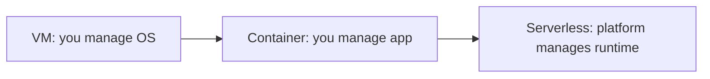

# Cloud for AI — Basic Interview Questions

> Foundational questions you should answer smoothly and confidently. Natural tone,
> real reasoning, and the "why/when" behind each answer.

## Quick Coverage Map

| # | Question | Theme |
|---|---|---|
| 1 | Why run AI in the cloud at all? | Fundamentals |
| 2 | VM vs container vs serverless | Compute |
| 3 | What is a GPU instance and when do you need one? | GPU basics |
| 4 | Object storage vs database vs vector DB | Storage |
| 5 | Managed AI API vs self-hosting | Build vs buy |
| 6 | What is autoscaling? | Scale |
| 7 | Regions vs availability zones | HA basics |
| 8 | What is IAM and least privilege? | Security |
| 9 | Spot vs on-demand vs reserved | Cost |
| 10 | What is Infrastructure as Code? | IaC |
| 11 | What is a cold start? | Serverless |
| 12 | How do you keep secrets safe? | Security |

---

### 1. Why run AI workloads in the cloud instead of on your own servers?

Because AI is bursty and GPU-hungry. The cloud gives you **on-demand access to scarce
GPUs**, the ability to **scale up for a spike and back down (even to zero)**, and
**managed services** (model APIs, vector search, training platforms) that remove a huge
amount of undifferentiated ops work. You trade some cost-per-unit and control for speed
and elasticity.

**When on-prem still wins:** very steady, very high utilization; strict data
sovereignty; or you already own a big GPU fleet. Most teams start in the cloud.

---

### 2. Explain the difference between a VM, a container, and serverless.

- **VM (EC2/GCE/Azure VM):** a whole virtual machine you manage — OS, drivers, scaling.
  Most control, most ops.
- **Container (ECS/EKS/GKE):** your app packaged with its dependencies, scheduled onto
  shared hosts. Portable and reproducible; you still manage the cluster (or use managed
  Kubernetes).
- **Serverless (Lambda/Cloud Run/Fargate):** you hand over a function or container and
  the platform runs it, scaling automatically — often to zero. Least ops, least control.



**When:** VM for full GPU control; container for scalable production; serverless for
bursty, event-driven, or low-volume work.

---

### 3. What is a GPU instance and when do you actually need one?

A GPU instance is a VM with attached accelerators (NVIDIA H100/L4/A10G, etc.) that do
the massively parallel math LLMs and deep learning need. You need one for **training**,
**fine-tuning**, and **low-latency inference of large models**. You do **not** need one
for CPU-bound glue like RAG orchestration, API routing, or calling a managed model API —
that runs fine (and cheaper) on CPU.

**Tip:** right-size the GPU. A 7B model doesn't need an H100; an L4/L40S is often plenty.

---

### 4. Object storage vs a database vs a vector database — what goes where?

- **Object storage (S3/GCS/Blob):** big blobs — datasets, model weights, documents,
  checkpoints. Cheap, durable, infinite-ish. Not for low-latency lookups.
- **Database (Postgres/DynamoDB):** structured app state — users, jobs, metadata.
  Transactions and queries.
- **Vector database (Pinecone/Qdrant/pgvector):** embeddings for similarity search in
  RAG. Answers "what's semantically close to this?"

A RAG app usually uses all three: docs in object storage, embeddings in the vector DB,
app state in Postgres.

---

### 5. When would you use a managed AI API (like Bedrock) vs self-hosting a model?

Use a **managed API** when you want speed to market, zero model ops, pay-per-token
pricing, and built-in guardrails — great at low/medium or unpredictable volume.

**Self-host** (e.g., EKS + vLLM) when you have high, steady volume, need tight latency
control, want a specific open-weight model, or must keep data fully in your VPC. At high
utilization, self-hosting is cheaper per token; at low volume, idle GPUs make it wasteful.

**Rule of thumb:** start managed, self-host once volume and utilization justify it.

---

### 6. What is autoscaling and why is it different for AI workloads?

Autoscaling adds/removes capacity based on load. For normal web apps you scale on CPU%.
For **LLM serving, CPU% is a bad signal** — a GPU can be maxed while CPU looks idle.
Instead you scale on **serving metrics**: queue depth, batch size, GPU utilization, or
request latency. There are two layers: **pod autoscaling** (HPA/KEDA) and **node
autoscaling** (Cluster Autoscaler/Karpenter to add GPU machines).

---

### 7. What's the difference between a region and an availability zone?

A **region** is a geographic location (e.g., us-east-1). An **availability zone (AZ)**
is an isolated datacenter (or cluster) within a region. Spreading across **multiple AZs**
protects you from a single datacenter failure with low latency between them. Spreading
across **multiple regions** protects against a whole-region outage and helps with data
residency, but adds latency and complexity. Start multi-AZ; go multi-region for higher
availability tiers.

---

### 8. What is IAM and what does "least privilege" mean?

**IAM (Identity and Access Management)** controls who/what can do what in your cloud.
**Least privilege** means each user/service gets exactly the permissions it needs and
nothing more. So your inference service's role can call Bedrock and read one S3 bucket —
not delete databases. It limits blast radius if credentials leak. Prefer **roles/workload
identity** (IRSA on EKS, Workload Identity on GKE) over long-lived access keys.

---

### 9. Spot vs on-demand vs reserved instances — when do you use each?

- **On-demand:** pay full price, no commitment. For unpredictable/bursty needs.
- **Spot/preemptible:** up to ~60–90% cheaper, but can be reclaimed with short notice.
  For **fault-tolerant** work — batch inference, training with checkpoints, stateless
  replicas behind a queue.
- **Reserved / committed use / savings plans:** ~40–70% off in exchange for a 1–3 year
  commitment. For your **steady baseline** load.

A common mix: reserved for the baseline, spot for the bursty top, on-demand as a buffer.

---

### 10. What is Infrastructure as Code and why use it?

IaC (Terraform, CDK, Pulumi) defines your cloud resources in versioned files instead of
clicking in a console. Benefits: **repeatable** (spin up an identical environment),
**reviewable** (changes go through PRs), **auditable**, and **less drift**. You can code-
review a `plan` before applying and roll back by reverting code.

```hcl
resource "aws_instance" "gpu" {
  instance_type = "g6.xlarge"   # declared, versioned, reviewable
}
```

---

### 11. What is a cold start and why does it matter for serverless AI?

A **cold start** is the delay when a serverless/scale-to-zero service has to spin up a
fresh instance (load the container, and for AI, **load the model weights** — which can be
gigabytes). For LLMs this can be slow. Mitigations: keep a **minimum warm replica**, use
**provisioned concurrency**, snapshot the container, or bake weights into the image.
Scale-to-zero saves money when idle but trades off first-request latency.

---

### 12. How do you keep secrets (API keys, DB passwords) safe in the cloud?

Never hardcode them in code, images, or commit them to git (or Terraform state). Store
them in a **secrets manager** (AWS Secrets Manager, Azure Key Vault, GCP Secret Manager,
or HashiCorp Vault), inject them at runtime, encrypt with KMS, and **rotate** regularly.
Grant access via least-privilege IAM roles so only the services that need a secret can
read it.

---

## Further Reading

- AWS Bedrock: https://docs.aws.amazon.com/bedrock/
- Cloud compute basics (AWS): https://aws.amazon.com/products/compute/
- Terraform intro: https://developer.hashicorp.com/terraform/intro
- IAM best practices (AWS): https://docs.aws.amazon.com/IAM/latest/UserGuide/best-practices.html

> Content synthesized from general domain knowledge and current (2025-2026) interview trends; rephrased for compliance with licensing restrictions.
