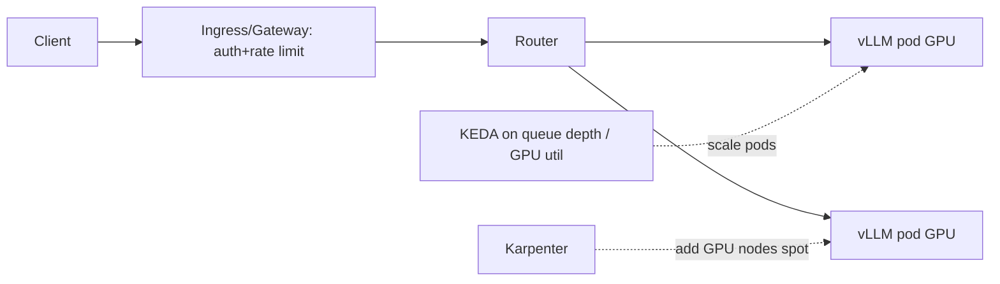
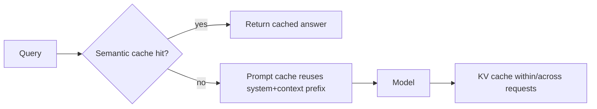
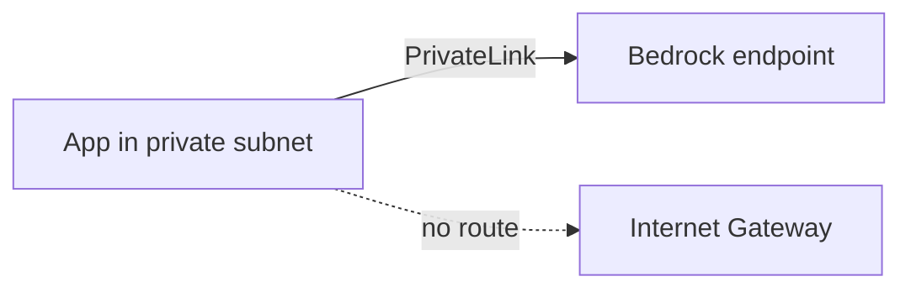

# Cloud for AI — Medium Interview Questions

> Mid-level questions that mix design, trade-offs, and hands-on judgment. Answers show
> the reasoning an interviewer wants to hear.

## Quick Coverage Map

| # | Question | Theme |
|---|---|---|
| 1 | Design an autoscaling LLM inference service | Scale/K8s |
| 2 | Bedrock vs SageMaker — when each? | Managed services |
| 3 | Cut a high GPU inference bill | Cost |
| 4 | Multi-AZ vs multi-region trade-offs | HA |
| 5 | GPU sharing: MIG & time-slicing | GPU efficiency |
| 6 | Caching strategies for LLM apps | Cost/latency |
| 7 | Vector DB: managed vs self-hosted | Storage |
| 8 | Handling spot interruptions | Reliability |
| 9 | Terraform state at team scale | IaC |
| 10 | Private access to model APIs (no public internet) | Security/Network |
| 11 | Serverless GPU vs always-on cluster | Compute |
| 12 | Observability for LLM serving | Ops |

---

### 1. How would you design an autoscaling LLM inference service on Kubernetes?

Separate **ingestion** from **inference**, and autoscale on **serving metrics**.

- **Model server:** vLLM with **continuous batching** and PagedAttention — the biggest
  throughput win.
- **Pod autoscaling:** KEDA/HPA on **queue depth, batch size, or GPU utilization**, not
  CPU%.
- **Node autoscaling:** Karpenter/Cluster Autoscaler adds GPU nodes; use **spot** for
  the bursty top with on-demand fallback.
- **Warm replicas** to fight model-load cold starts; PodDisruptionBudgets to survive
  node churn.
- **Gateway** enforces auth, rate limits, and per-tenant quotas to protect scarce GPUs.

---

### 2. Bedrock vs SageMaker — when do you pick each?

- **Bedrock** = managed **foundation-model API**. Call Claude/Llama/Nova by token, get
  guardrails, knowledge bases, and agents. Pick it when you want GenAI fast with no model
  ops.
- **SageMaker** = full **ML platform** to train, tune, and deploy **your own** models
  with deep control (endpoints, pipelines, monitoring). Pick it when you have custom
  models or classic ML and need control.

**One-liner:** Bedrock for "use a great model now," SageMaker for "build/serve my own
model my way." Many teams use both — Bedrock for GenAI, SageMaker for custom ML.

---

### 3. Your GPU inference bill is huge. How do you cut it without hurting UX?

Attack it in layers:

1. **Right-size the model** — route easy requests to a small/cheap model, reserve the
   big model for hard ones (40–70% savings).
2. **Cache** — prompt caching for repeated prefixes, semantic cache for near-duplicate
   queries, KV-cache reuse.
3. **Raise utilization** — continuous batching so each GPU serves more tokens/sec.
4. **Spot + reserved mix** — reserved baseline, spot for bursts.
5. **Scale to zero** off-peak with serverless GPU or min-replica=0.
6. **Kill network waste** — VPC endpoints to avoid NAT/egress fees; co-locate data.
7. **Batch** offline jobs at off-peak/batch pricing.

Then **measure $/request** and set budget alerts so it doesn't creep back.

---

### 4. Multi-AZ vs multi-region — what are the trade-offs?

- **Multi-AZ:** replicas across zones in one region. Cheap, low-latency, survives a
  datacenter outage. This is the baseline everyone should do.
- **Multi-region:** survives a whole-region outage and helps data residency, but adds
  latency, cost, and **data-consistency headaches** (replicating vector indexes/DBs).

Pick based on your **RTO/RPO** and tier. Most services: multi-AZ. Critical/global
services: multi-region (active-passive is simpler; active-active is powerful but hard).

---

### 5. What are MIG and time-slicing, and why do they matter?

Both let multiple workloads **share one GPU** to raise utilization:

- **MIG (Multi-Instance GPU):** hardware-partitions an A100/H100 into isolated slices
  (each with its own memory) — strong isolation, predictable performance. Great for
  packing several small models onto one big GPU.
- **Time-slicing:** the GPU context-switches between pods over time. No memory isolation,
  but easy and boosts utilization for bursty, low-QPS models.

**Why:** idle GPU capacity is wasted money; sharing turns one expensive GPU into several
useful ones.

---

### 6. What caching strategies exist for LLM apps and when do you use them?

- **Semantic cache:** embed the query, return a stored answer if a near-duplicate exists.
  Best for FAQ-like, repetitive traffic. Watch staleness/correctness.
- **Prompt caching:** provider reuses the compute for a shared prefix (long system prompt,
  RAG context) — big savings when the prefix repeats.
- **KV cache:** the serving engine reuses attention state so decoding is faster.

Use semantic cache for repeated questions, prompt cache for shared long prefixes.

---

### 7. Managed vs self-hosted vector database — how do you choose?

- **Managed (Pinecone, Vertex AI Search, Bedrock KB):** fast to start, no ops, scales for
  you; costs more per query at scale and less control.
- **Self-hosted (Qdrant, Weaviate, Milvus, pgvector):** cheaper at scale, full control of
  filtering/hybrid search/tuning; you run and back up the infra.

Choose on **scale, filtering needs, cost curve, and ops appetite**. Small app? `pgvector`
in your existing Postgres. Big, dedicated workload? A purpose-built vector DB.

---

### 8. How do you use spot GPUs without hurting reliability?

Design for interruption:

- Keep inference pods **stateless** and behind a **queue/load balancer** so losing one
  doesn't drop requests.
- **Checkpoint** training frequently so a preemption only loses minutes.
- Handle the **eviction notice** (e.g., ~2 min): drain, deregister, requeue in-flight
  work.
- Run a **base layer on-demand/reserved** and only the burst on spot, spread across
  instance types/AZs to reduce simultaneous reclaim.

That way spot cuts cost ~60–90% while the service stays up.

---

### 9. How do you manage Terraform state for a team?

- **Remote backend** (S3 + DynamoDB lock, or Terraform Cloud) so state is shared and
  **locked** to prevent concurrent applies from corrupting it.
- **Separate state per environment** (dev/stage/prod) and per blast-radius domain — you
  don't want one apply able to touch everything.
- **Modules** for reuse; pin provider/module versions.
- **CI checks:** `fmt`, `validate`, `tfsec`/`checkov`, and a reviewed `plan` before
  `apply`. Never apply prod from a laptop.
- **Keep secrets out of state** — reference a secrets manager.

---

### 10. How do you call a managed model API without traffic going over the public internet?

Use **private/VPC endpoints** (AWS PrivateLink, GCP Private Service Connect, Azure
Private Endpoint). Your app in a private subnet reaches Bedrock/Vertex/OpenAI over the
cloud's private backbone — traffic never hits the public internet. Benefits: better
security posture, and you **avoid NAT Gateway and egress charges**. Combine with
least-privilege IAM roles and TLS.

---

### 11. Serverless GPU vs an always-on GPU cluster — when each?

- **Serverless GPU (Modal, RunPod serverless, Cloud Run GPU, SageMaker Serverless):**
  scales to zero, pay only when serving. Best for **spiky or low-volume** workloads. The
  catch is **cold starts**, though 2025-2026 platforms have shrunk those dramatically.
- **Always-on cluster (EKS/GKE + vLLM):** best for **steady, high-volume** traffic where
  GPUs stay busy — lowest cost per token and full latency control.

Decide by traffic shape: bursty/unpredictable → serverless; steady/high → cluster.

---

### 12. What should you monitor for an LLM serving system?

Beyond CPU/memory:

- **Latency:** time-to-first-token (TTFT) and end-to-end p50/p95/p99.
- **Throughput:** tokens/sec, requests/sec, batch size.
- **GPU:** utilization, memory, KV-cache pressure, queue depth.
- **Quality/safety:** error rate, guardrail triggers, hallucination/eval scores.
- **Cost:** $/request and $/1M tokens, per tenant.

Wire these into autoscaling and budget alerts. TTFT and queue depth are the signals users
and autoscalers care about most.

---

## Further Reading

- GKE inference autoscaling: https://docs.cloud.google.com/kubernetes-engine/docs/best-practices/machine-learning/inference/autoscaling
- Bedrock vs SageMaker overview: https://docs.aws.amazon.com/bedrock/
- vLLM production docs: https://docs.vllm.ai/
- Karpenter: https://karpenter.sh/
- AWS PrivateLink: https://docs.aws.amazon.com/vpc/latest/privatelink/

> Content synthesized from general domain knowledge and current (2025-2026) interview trends; rephrased for compliance with licensing restrictions.
