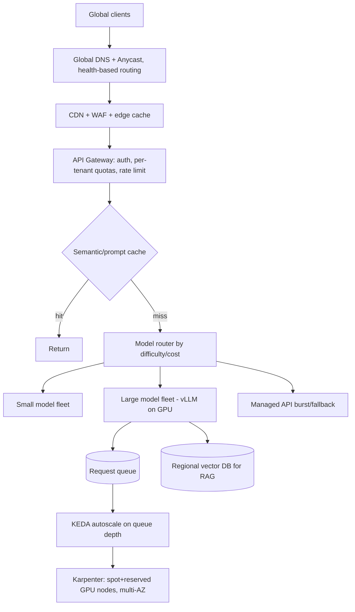
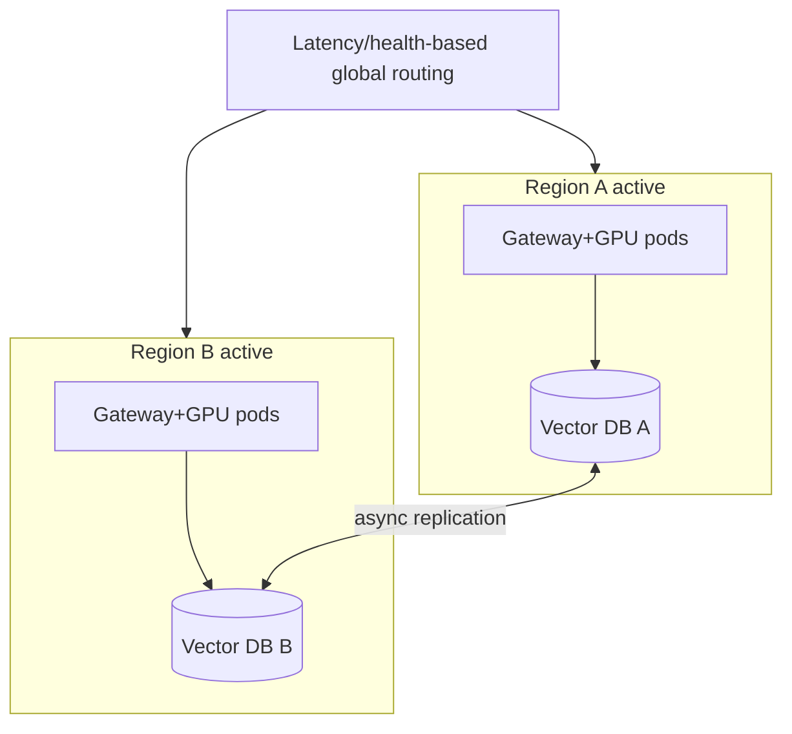
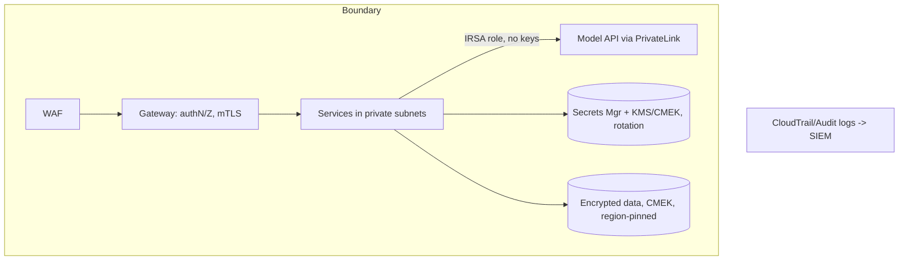

# Cloud for AI — Advanced / Expert Interview Questions

> Senior/staff-level questions. These are open-ended design and judgment problems.
> Strong answers state assumptions, quantify trade-offs, and defend decisions.

## Quick Coverage Map

| # | Question | Theme |
|---|---|---|
| 1 | Design scalable LLM infra for millions of users | System design |
| 2 | Solve GPU cost + availability at scale | GPU economics |
| 3 | Active-active multi-region LLM platform | HA/consistency |
| 4 | Bedrock vs self-host: build the decision framework | Build vs buy |
| 5 | Secrets & security for a regulated AI platform | Security/compliance |
| 6 | IaC at org scale (100s of services, many teams) | IaC/platform |
| 7 | Guarantee p99 latency under load spikes | Performance |
| 8 | Multi-cloud / avoid lock-in — worth it? | Strategy |
| 9 | Cost model & FinOps for inference | FinOps |
| 10 | Zero-downtime model rollout & rollback | Release eng |
| 11 | Training vs inference infra separation | Architecture |
| 12 | Disaster recovery for stateful AI (vector DB, fine-tunes) | DR |

---

### 1. Design LLM infrastructure to serve millions of users with tight latency and cost.

State assumptions (QPS, token sizes, latency SLO, models). Then layer the design:

Key decisions to defend:
- **Tiered models + router:** most traffic to cheap models; escalate hard prompts. Cuts
  cost dramatically without hurting quality on easy queries.
- **Cache-first:** semantic + prompt caching removes a large share of GPU work.
- **Continuous batching (vLLM)** to maximize tokens/sec/GPU; separate **prefill** and
  **decode** if you disaggregate for tail-latency control.
- **Autoscale on queue depth/GPU util**, not CPU; **Karpenter** blends spot + reserved.
- **Multi-AZ** always; **multi-region** for global latency + resilience; managed API as
  overflow capacity when self-hosted GPUs are saturated.
- **Backpressure:** admission control + per-tenant quotas so a spike can't melt the fleet.
- Track **$/request** and p99 TTFT as the north-star metrics.

---

### 2. GPUs are scarce and expensive. How do you guarantee capacity while controlling cost?

Two problems: **availability** and **cost**.

**Availability**
- **Capacity reservations / committed capacity** (AWS Capacity Blocks, GCP reservations)
  for your must-have baseline.
- **Multi-region and multi-provider fallback:** if H100s are unavailable in one region,
  fail over to another region or a GPU cloud. Abstract the provider behind your router.
- **Right-size + MIG:** slice big GPUs for small models so you need fewer large GPUs.

**Cost**
- **Reserved baseline + spot burst + on-demand buffer.** Spot saves ~60–90% for
  interruptible replicas behind a queue.
- **Utilization first:** continuous batching, request coalescing, KV-cache reuse — a busy
  L4 beats an idle H100.
- **Quantization** (INT8/FP8/AWQ) to fit bigger models on cheaper GPUs and raise
  throughput, with an eval gate on quality.
- **Scale-to-zero** off-peak with serverless GPU.

Close the loop with **per-model $/1M-token dashboards** and anomaly alerts.

---

### 3. How do you build an active-active multi-region LLM platform? What breaks?

- **Stateless inference** is easy to run everywhere. The hard part is **state**: vector
  indexes, fine-tuned weights, conversation memory, rate-limit counters.
- **Consistency trade-off:** async replication gives low latency but eventual consistency
  (a fresh doc may not be searchable in region B for a moment). Synchronous replication
  adds latency. Choose per data type.
- **Model & artifact sync:** replicate weights/adapters to object storage in each region;
  version them; ensure deploys are region-consistent.
- **Global counters:** rate limits/quotas need a shared or regionally-partitioned store.
- **Failover:** health-based DNS reroutes on region loss; test with game days.
- **Cost:** roughly double infra + cross-region egress — justify it with the SLO.

---

### 4. Build a decision framework for Bedrock (managed) vs self-hosting on EKS.

Don't answer with a preference — give a framework:

| Factor | Favors Managed API | Favors Self-Host |
|---|---|---|
| Volume | Low / spiky / unpredictable | High / steady |
| GPU utilization | Would be low (idle waste) | Consistently high |
| Latency control | "Good enough" | Must tune (batching, region, quant) |
| Model | Provider catalog is fine | Need specific open-weight / custom fine-tune |
| Data control | Provider boundary acceptable | Must stay in VPC / strict residency |
| Team | Small, no infra bandwidth | Has platform/SRE muscle |
| Time to market | Days matter | Can invest weeks |

**Crossover:** compute self-host cost = GPU-hours / (tokens-per-hour at real batch size)
and compare to per-token API price. Self-host wins once volume keeps GPUs busy enough
that $/token drops below the API. Also weigh the **hidden ops cost**. A pragmatic path is
**hybrid**: managed for burst/long-tail models, self-host the high-volume workhorse.

---

### 5. Design secrets & security for a regulated (e.g., healthcare/finance) AI platform.

- **Identity:** least-privilege IAM per service; **workload identity** (IRSA/Workload
  Identity), no long-lived keys; short-lived tokens.
- **Secrets:** central secrets manager/Vault, injected at runtime, auto-rotated, never in
  images/git/state. Envelope encryption via **customer-managed keys (KMS/CMEK)**.
- **Network:** private subnets, PrivateLink to model APIs, egress locked down, WAF at the
  edge, mTLS between services.
- **Data residency:** pin storage + inference to compliant regions; verify the FM
  provider's regional endpoints and **no-train-on-your-data** guarantees; sign BAAs where
  required.
- **AI guardrails:** PII redaction on prompts/outputs, content filtering, prompt-injection
  defenses, output validation.
- **Auditability:** immutable audit logs (who called which model with what) to a SIEM;
  data retention/deletion policies; regular access reviews.

---

### 6. How do you run IaC across hundreds of services and many teams without chaos?

- **Platform/golden modules:** a platform team publishes vetted, versioned Terraform/CDK
  modules (secure defaults baked in); product teams consume them — they don't write raw
  primitives.
- **State isolation:** separate remote state per env and per service/domain to bound
  blast radius; locking to prevent concurrent corruption.
- **Policy as code:** OPA/Sentinel/checkov/tfsec in CI to enforce "no public buckets,"
  "encryption required," "approved regions/instance types," tagging for cost.
- **Pipelines, not laptops:** all applies go through CI/CD with a reviewed `plan`, drift
  detection, and automated rollback via revert.
- **Golden AMIs (Packer)** with GPU drivers/CUDA prebaked so nodes boot fast and
  consistent.
- **Cost governance:** mandatory tags, budgets, and anomaly alerts per team.

The goal: **paved roads** — the easy path is also the secure, cost-tagged path.

---

### 7. How do you guarantee p99 latency for LLM serving during traffic spikes?

- **Admission control + queue with backpressure:** protect GPUs; shed or queue excess
  rather than degrade everyone.
- **Continuous batching with a cap** so batch size doesn't inflate tail latency;
  optionally **disaggregate prefill/decode** so long prompts don't block short decodes.
- **Headroom + fast scale-out:** keep warm replicas and pre-provisioned/warm-pool GPU
  nodes; scale on **queue depth** (a leading signal) not lagging CPU.
- **Speculative decoding / smaller models** for latency-sensitive paths; **cache** to
  skip work entirely.
- **Fallback capacity:** overflow to managed API when self-hosted GPUs saturate.
- **Measure TTFT and p99 continuously** and load-test to find the knee before prod does.

---

### 8. Is multi-cloud worth it for AI? How would you avoid lock-in?

Be honest about the trade-off. **Pros:** GPU capacity across providers, resilience,
negotiating leverage, best-of-breed services. **Cons:** lowest-common-denominator
architecture, duplicated tooling, cross-cloud egress, and real operational overhead.

Pragmatic stance:
- Standardize on **portable layers** — Kubernetes, containers, vLLM, Terraform — so
  workloads move.
- Abstract the **model layer** behind your own router/gateway so you can switch providers.
- Accept **some managed-service lock-in** where the value is high (it's usually worth it).
- Use a second provider tactically for **GPU capacity/DR**, not as a mandate to run
  everything twice.

Multi-cloud for *capacity/resilience* is reasonable; multi-cloud *for its own sake*
usually costs more than it saves.

---

### 9. How do you build a cost model and FinOps practice for inference?

- **Unit economics:** define $/request and $/1M tokens per model and per feature; tie to
  business value (cost per resolved ticket, per generated doc).
- **Attribution:** tag every resource by team/feature/env; allocate shared GPU cost by
  usage.
- **Levers tracked as KPIs:** cache hit rate, GPU utilization, spot coverage, reserved
  coverage, model-routing mix.
- **Guardrails:** budgets, anomaly detection, and alerts; quotas per tenant.
- **Continuous review:** weekly cost/utilization review; kill idle endpoints; renegotiate
  commitments as volume stabilizes. FinOps is a loop, not a one-time cleanup.

---

### 10. How do you do zero-downtime model rollouts and safe rollbacks?

- **Versioned, immutable artifacts** (weights + config) in object storage; deploys point
  at a version.
- **Progressive delivery:** canary a small % of traffic to the new model, compare quality
  (evals) and latency, then ramp. Blue/green for instant switch-back.
- **Shadow / mirror traffic** to the new version without serving its output — validate on
  real traffic first.
- **Automated rollback** on eval-score/latency/error regressions.
- **Warm the new fleet** (load weights, prime KV) before shifting traffic to avoid cold-
  start latency spikes.
- Keep the API contract stable so clients don't break across versions.

---

### 11. Should training and inference share infrastructure? How do you separate them?

Generally **separate** them:

- **Different profiles:** training is throughput-oriented, long-running, checkpointed, and
  spot-friendly; inference is latency-sensitive and must stay warm/available.
- **Isolation:** separate node pools/clusters (or accounts) so a training job can't starve
  inference of GPUs; separate quotas and priorities.
- **Cost strategy:** training on **spot with checkpointing**; inference on **reserved +
  spot burst**.
- **Shared pieces:** the model registry, feature/data stores, and observability can be
  shared. The **compute** should be isolated with clear scheduling priorities
  (PriorityClasses in K8s) so inference always wins contention.

---

### 12. Design disaster recovery for the stateful parts of an AI platform.

Stateless inference is easy — focus DR on **state**:

- **Inventory state:** vector indexes, fine-tuned weights/adapters, prompt/config stores,
  conversation history, DBs.
- **Define RTO/RPO per data type** — they drive cost.
- **Backups:** vector index snapshots + DB backups to object storage with **versioning +
  cross-region replication**; model artifacts replicated to each region.
- **Rebuild path:** be able to **re-embed from source docs** if the vector store is lost
  (source of truth = documents in object storage).
- **Runbooks + game days:** automate failover and *test it*; an untested DR plan is a
  guess.
- **Statelessness by design:** push state to replicated stores so compute can respawn
  anywhere quickly.

---

## Further Reading

- AWS Well-Architected (ML & GenAI lenses): https://aws.amazon.com/architecture/well-architected/
- GKE inference autoscaling: https://docs.cloud.google.com/kubernetes-engine/docs/best-practices/machine-learning/inference/autoscaling
- vLLM (PagedAttention, continuous batching): https://docs.vllm.ai/
- Karpenter: https://karpenter.sh/
- Terraform at scale (modules, state): https://developer.hashicorp.com/terraform/language/modules
- Bedrock Guardrails: https://docs.aws.amazon.com/bedrock/latest/userguide/guardrails.html

> Content synthesized from general domain knowledge and current (2025-2026) interview trends; rephrased for compliance with licensing restrictions.
