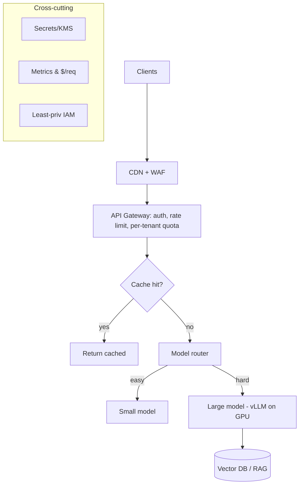
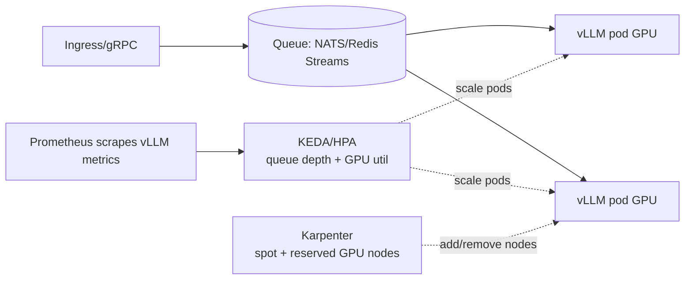
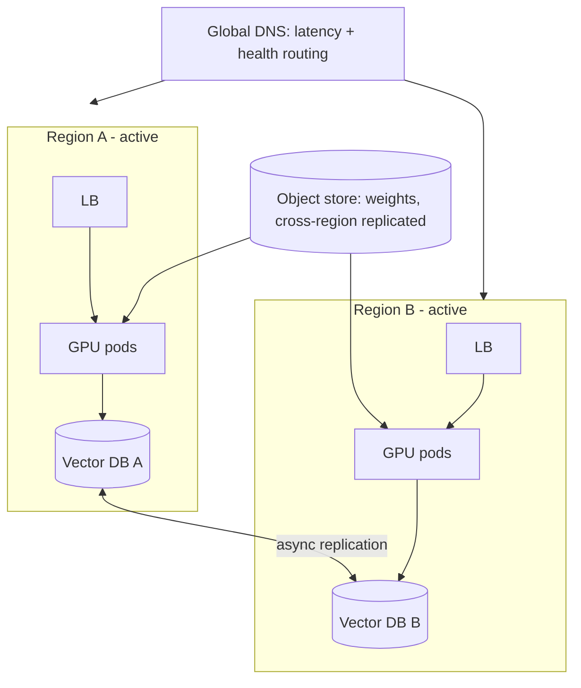
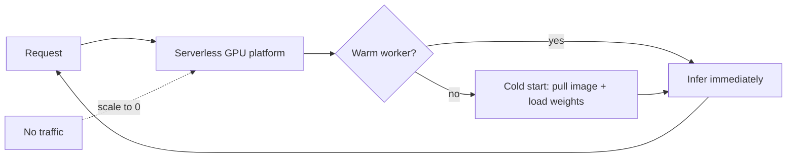
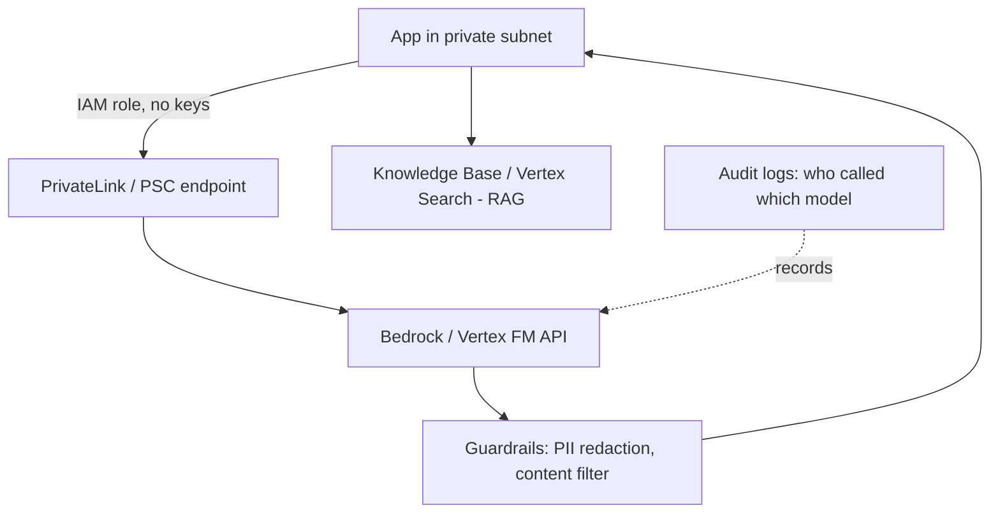
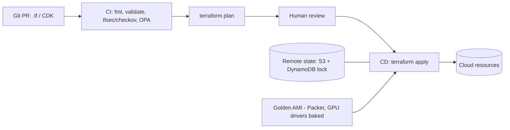
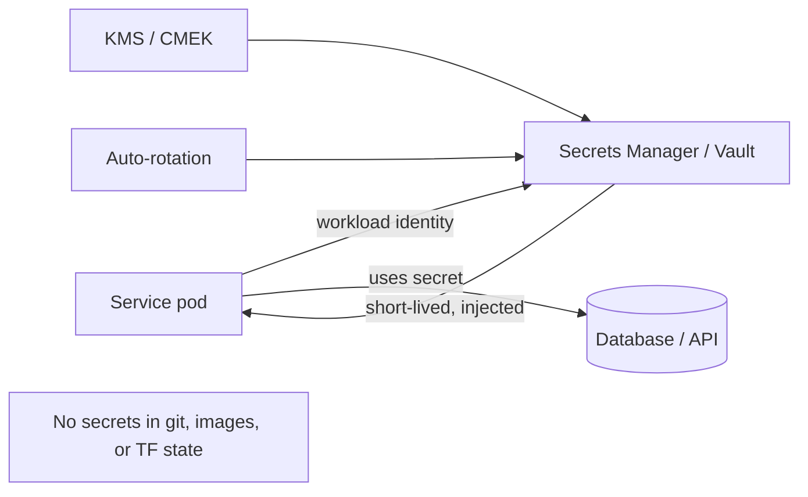
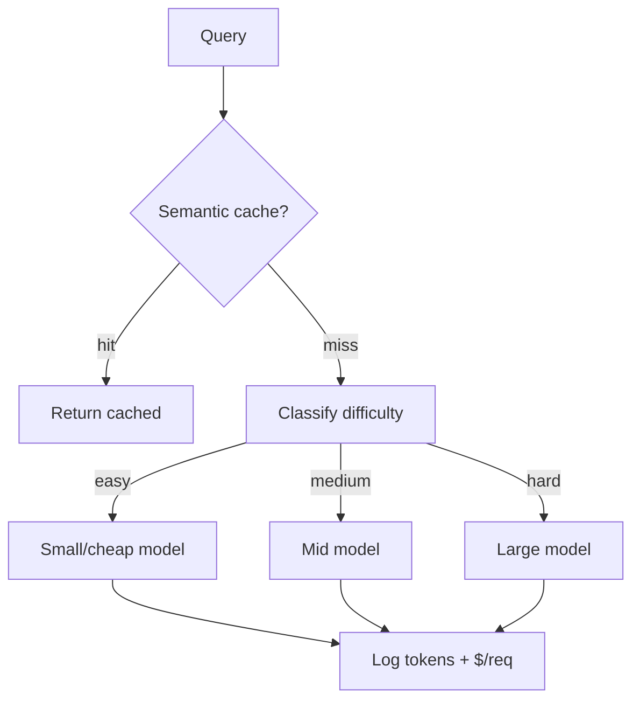
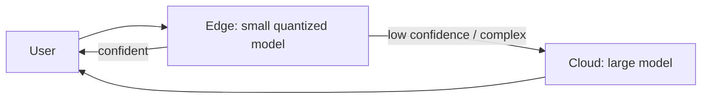

# Cloud for AI — Use-Case Diagrams

> Visual reference for the architectures you'll be asked to whiteboard. Each diagram has
> a short "what & why" so you can narrate it in an interview.

## Contents
1. [Scalable LLM API on the Cloud](#1-scalable-llm-api-on-the-cloud)
2. [GPU Autoscaling on Kubernetes](#2-gpu-autoscaling-on-kubernetes)
3. [Multi-Region High Availability](#3-multi-region-high-availability)
4. [Serverless Inference (scale-to-zero)](#4-serverless-inference-scale-to-zero)
5. [Managed FM Architecture (Bedrock / Vertex)](#5-managed-fm-architecture-bedrock--vertex)
6. [IaC Pipeline (Terraform/CDK)](#6-iac-pipeline-terraformcdk)
7. [Secrets Management Flow](#7-secrets-management-flow)
8. [Cost-Optimized Model Router](#8-cost-optimized-model-router)
9. [Edge + Cloud Cascade](#9-edge--cloud-cascade)

---

## 1. Scalable LLM API on the Cloud

**What:** end-to-end request path with auth, cache, routing, and autoscaled GPU serving.
**Why:** protect scarce GPUs, cut cost with cache + routing, stay elastic under load.

---

## 2. GPU Autoscaling on Kubernetes

**What:** two-layer autoscaling — pods on serving metrics, nodes via Karpenter (spot).
**Why:** CPU% is a bad LLM signal; queue depth/GPU util react to real load.

---

## 3. Multi-Region High Availability

**What:** two active regions behind health-based global routing; async-replicated state.
**Why:** survive a region outage; serve users close to them; the hard part is state.

---

## 4. Serverless Inference (scale-to-zero)

**What:** requests wake a GPU worker on demand; it scales back to zero when idle.
**Why:** pay nothing when idle — ideal for spiky/low-volume; manage cold starts.

---

## 5. Managed FM Architecture (Bedrock / Vertex)

**What:** app calls a managed foundation-model API privately, with guardrails + RAG.
**Why:** zero model ops, built-in safety, fast to ship; data stays on private network.

---

## 6. IaC Pipeline (Terraform / CDK)

**What:** infra changes flow through Git → CI checks → reviewed plan → automated apply.
**Why:** repeatable, reviewable, auditable; policy-as-code blocks insecure resources.

---

## 7. Secrets Management Flow

**What:** apps fetch short-lived secrets at runtime from a manager; nothing hardcoded.
**Why:** no secrets in git/images/state; rotation + least-privilege limit blast radius.

---

## 8. Cost-Optimized Model Router

**What:** a router sends each request to the cheapest capable model, cache-first.
**Why:** most traffic is easy — small models + cache handle it; big model only when needed.

---

## 9. Edge + Cloud Cascade

**What:** a small quantized model at the edge answers easy/latency-critical requests and
escalates hard ones to a large cloud model.
**Why:** low latency + data locality for common cases; full power only when required.

---

> Content synthesized from general domain knowledge and current (2025-2026) interview trends; rephrased for compliance with licensing restrictions.
