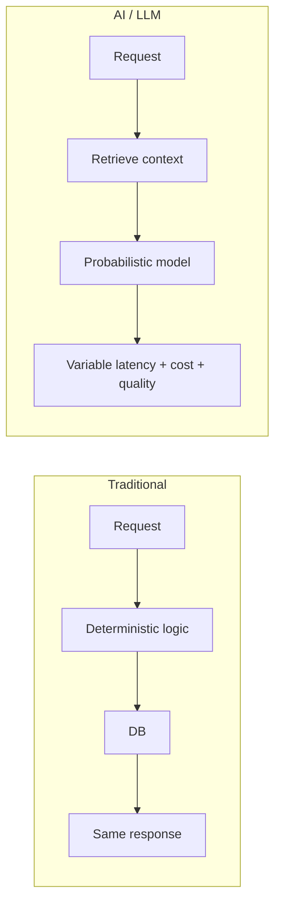
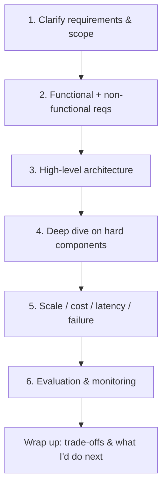
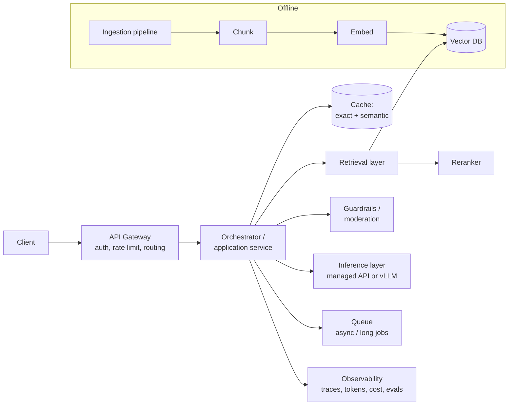
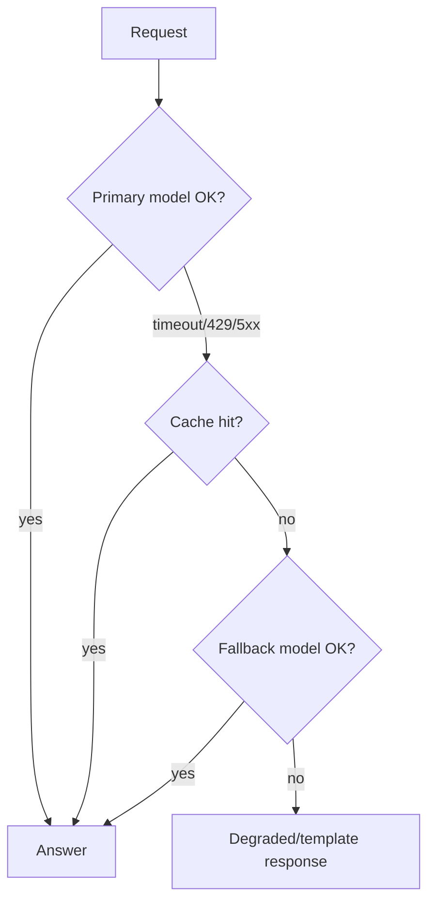
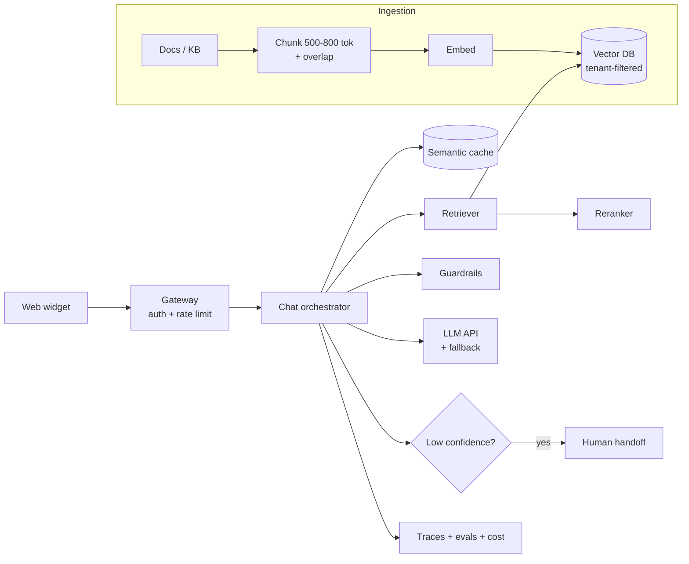
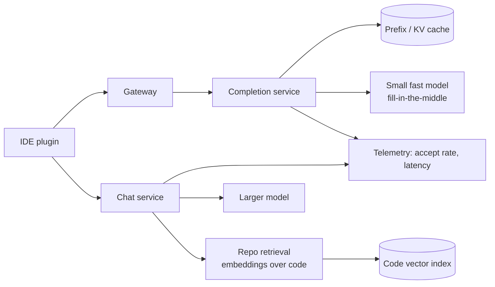
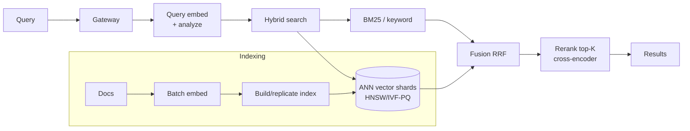
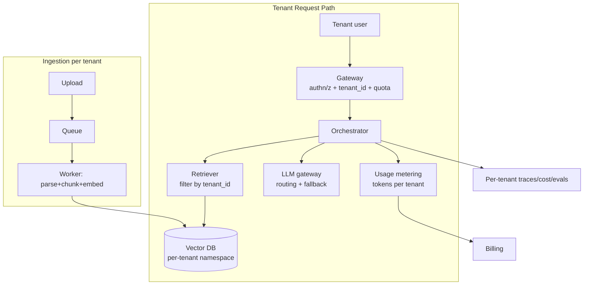
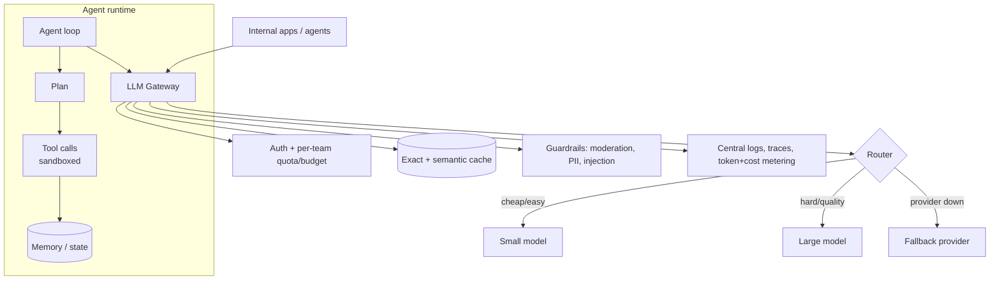

# AI System Design — Detailed Learning (Deep Dive)

> This is the "read-everything-here-and-you-can-walk-into-any-senior/staff AI system-design round and drive the whiteboard" guide. It goes from first principles (why AI systems are *different* from normal backend systems) to a repeatable framework, the core building blocks, the trade-offs you will be grilled on, back-of-the-envelope math for capacity/cost/latency, reliability and security, and finally **five fully worked design walkthroughs** — each with a Mermaid architecture diagram and the decisions behind it.
>
> Tone: plain English, lots of *why* and *when*, real numbers. Read top to bottom once, then use the headings as a revision index.

---

## Table of Contents
1. [Why AI system design is its own thing](#1-why-ai-system-design-is-its-own-thing)
2. [The step-by-step framework (the thing you actually do on the whiteboard)](#2-the-framework)
3. [Functional vs non-functional requirements](#3-functional-vs-non-functional-requirements)
4. [Core building blocks](#4-core-building-blocks)
5. [The key trade-offs (this is where interviews are won)](#5-the-key-trade-offs)
6. [Back-of-the-envelope: capacity, cost, latency](#6-back-of-the-envelope)
7. [Reliability & failure modes](#7-reliability--failure-modes)
8. [Security & multi-tenancy](#8-security--multi-tenancy)
9. [Evaluation & monitoring](#9-evaluation--monitoring)
10. [Worked design 1 — Support chatbot over company docs (RAG)](#10-worked-design-1--support-chatbot)
11. [Worked design 2 — Code assistant (Copilot-like)](#11-worked-design-2--code-assistant)
12. [Worked design 3 — Semantic search at scale](#12-worked-design-3--semantic-search-at-scale)
13. [Worked design 4 — Multi-tenant RAG SaaS](#13-worked-design-4--multi-tenant-rag-saas)
14. [Worked design 5 — LLM gateway & agent platform](#14-worked-design-5--llm-gateway--agent-platform)
15. [Interview power-answers & red flags](#15-interview-power-answers)
16. [Further reading](#16-further-reading)

---

## 1. Why AI system design is its own thing

Traditional backend system design is **deterministic**: the same request produces the same response, latency is dominated by I/O and CPU, and cost scales with requests. LLM system design is **probabilistic** and that one difference ripples through everything — testing, deployment, monitoring, cost, and UX.

Four things change:

1. **Non-determinism.** Ask the same question twice, get two different answers. You cannot assert `output == expected`. You test *distributions* and *properties*, and you evaluate quality with graders (LLM-as-judge + golden sets), not exact-match unit tests.
2. **Cost scales with tokens, not requests.** A single "request" can be 200 tokens or 200,000 tokens. Prompt size directly hits your margin. Prompt engineering is a cost-control lever, not just a quality lever.
3. **Latency is variable and split into two phases.** *Prefill* (reading the prompt) is parallelizable and fast; *decode* (generating tokens) is sequential and memory-bound. Latency depends on output length, model size, batch pressure, and queueing — not just your own code.
4. **The model is the bottleneck resource.** GPUs are scarce and expensive. Whether you self-host or call an API, the inference layer — not the database — is usually your capacity wall and your biggest line item.

The good news: **the fundamentals still apply.** Statelessness, horizontal scaling, caching, queues, load balancing, circuit breakers, and observability are all still your tools. AI just adds new components (embeddings, vector stores, inference servers, guardrails) and new failure modes (hallucination, prompt injection, cost blowups).



> **Interview framing:** "I'll design this like any distributed system — stateless services, caching, queues, observability — but I'll treat the model as a scarce, non-deterministic, token-priced dependency and design guardrails, evals, and cost controls around it."

---

## 2. The framework

Use the same six-step spine every time. It keeps you calm and makes you look senior because you're *driving*, not reacting.



### Step 1 — Clarify requirements (spend 5 minutes here; don't skip)
Ask before you draw. Good questions:
- **Users & scale:** Who uses it? How many DAU? Peak QPS? B2B or B2C?
- **Latency SLO:** Interactive (<1s to first token) or batch (minutes OK)?
- **Quality bar:** Is a wrong answer embarrassing (marketing) or dangerous (medical/legal)?
- **Budget:** Is this a cost-sensitive consumer feature or a high-value enterprise workflow?
- **Data:** How much? How fresh must it be? Where does it live? Any PII/compliance?
- **Build vs buy:** Are we allowed to call OpenAI/Anthropic, or must it be self-hosted (privacy/regulatory)?

### Step 2 — Requirements (see §3).
### Step 3 — High-level architecture: draw the request path end to end (client → gateway → retrieval → model → response) plus the ingestion/offline path.
### Step 4 — Deep dive: the interviewer will pick one component. Be ready to go deep on retrieval, the inference layer, caching, or evals.
### Step 5 — Scale/cost/latency: do the math (see §6). Name the bottleneck (usually GPU/inference).
### Step 6 — Eval & monitoring: how you know it works and stays working.

---

## 3. Functional vs non-functional requirements

| Type | Examples for an LLM system |
|------|----------------------------|
| **Functional** | Answer questions grounded in docs; cite sources; multi-turn memory; tool calling; stream tokens; support file upload/ingestion; admin dashboard |
| **Non-functional** | p95 latency, throughput (QPS), availability (99.9%), cost per query, freshness of data, groundedness/accuracy, privacy/tenancy isolation, safety/guardrails, observability |

**Turn vague asks into numbers.** "Fast" → *first token < 500 ms, full answer < 3 s p95*. "Cheap" → *< $0.01 per query blended*. "Reliable" → *99.9% availability, graceful degradation on provider outage*. Interviewers reward this.

---

## 4. Core building blocks



- **API gateway** — auth (API keys/OAuth), rate limiting & quotas (per tenant/user), request routing, and a natural place for the first line of abuse control. Keep it stateless behind a load balancer.
- **Orchestrator / application layer** — the brain: builds prompts, calls retrieval, applies guardrails, calls the model, assembles the response. Stateless → scale horizontally.
- **Inference layer** — where the model runs. Managed API (OpenAI/Anthropic/Bedrock) *or* self-hosted with a serving engine like **vLLM/TGI/TensorRT-LLM** using **continuous batching**, **paged attention**, and often **speculative decoding** to raise GPU throughput.
- **Retrieval (RAG)** — chunking, embeddings, a **vector database** (pgvector, Qdrant, Milvus, Pinecone), optional **hybrid search** (BM25 + vectors), and a **reranker** (cross-encoder) to boost precision of the top-k that goes into the prompt.
- **Caching** — *exact-match* cache (identical prompt → cached response) and *semantic* cache (embedding-similar query → reuse). Also **prompt/KV caching** at the inference layer for shared prefixes (system prompts).
- **Queues / async** — for long-running jobs (batch summarization, ingestion, agent runs). Decouple ingestion, retrieval, and generation so a spike in one doesn't topple the others.
- **Guardrails** — input moderation, prompt-injection defense, PII redaction, output moderation, schema validation, groundedness checks.
- **Observability** — distributed traces, token & cost accounting per request/tenant, quality metrics, and an eval harness. You cannot operate what you cannot see; with non-deterministic systems this is non-negotiable.

---

## 5. The key trade-offs

This section is where senior interviews are won or lost. For each, know the *why* and *when*.

### 5.1 RAG vs fine-tuning vs long context
| Approach | What it's good at | Cost/latency | When to pick |
|----------|-------------------|--------------|--------------|
| **RAG** | Fresh, changing, private knowledge; citations; large corpora | Extra retrieval hop (~20–100 ms) + more input tokens | Knowledge that changes or is too big for the prompt; you need attribution |
| **Fine-tuning** | Teaching *style/format/behavior*, narrow tasks, smaller models matching big-model quality | High upfront training cost; cheap at inference | Stable task, latency/cost-sensitive, you have labeled data; NOT for injecting fresh facts |
| **Long context** | Dumping everything into the prompt; simplest to build | Token cost grows with context; attention cost scales ~quadratically; "lost in the middle" | Small/medium corpora, prototypes, one-off documents |

**Power answer:** "RAG for knowledge, fine-tuning for behavior, long context for convenience on small inputs. They compose — fine-tune a small model *and* use RAG for facts."

### 5.2 Managed API vs self-hosted
| | Managed API | Self-hosted (vLLM on GPUs) |
|---|-------------|-----------------------------|
| Time to market | Minutes | Weeks |
| Ops burden | Near zero | High (GPUs, scaling, upgrades) |
| Cost at low volume | Cheap | Expensive (idle GPUs) |
| Cost at high volume | Can dominate | Can be far cheaper per token |
| Data control / privacy | Data leaves your VPC | Full control |
| Customization | Limited | Full (quantization, custom models, LoRA) |

**When to self-host:** strict privacy/regulatory constraints, very high steady volume where per-token economics beat API pricing, or need for custom/fine-tuned open models. **Otherwise start managed.**

### 5.3 Latency vs cost vs quality (pick your point on the triangle)
- Bigger model → better quality, higher latency & cost.
- **Model routing / cascade:** try a cheap small model first; escalate to a big model only when a confidence/verifier check fails. Cuts cost 50–80% on easy traffic.
- **Streaming** improves *perceived* latency (first token fast) without changing total cost.
- **Caching** improves all three for repeated traffic.

### 5.4 Sync vs async / streaming vs batch
- **Sync + streaming** for chat (interactive).
- **Async via queue** for long jobs (agent runs, bulk processing) — return a job id, notify on completion.
- **Batch** (offline) for embeddings/backfills — maximize GPU utilization, ignore latency.

### 5.5 Vector DB choices
| Option | Sweet spot |
|--------|-----------|
| **pgvector** | Already on Postgres, <a few M vectors, want SQL + transactions |
| **Qdrant / Milvus / Weaviate** | Dedicated, 10M–1B+ vectors, filtering, self-host or cloud |
| **Pinecone** | Fully managed, don't want to run infra |

ANN index (HNSW / IVF-PQ) trades a little recall for huge speed. Tune `ef`/`nprobe` for the recall-vs-latency point you need.

---

## 6. Back-of-the-envelope

Interviewers love to see you estimate. Memorize these.

### 6.1 Cost
```
cost_per_request = (input_tokens/1000 * price_in) + (output_tokens/1000 * price_out)
monthly_cost     = cost_per_request * requests_per_day * 30
```
Example: a RAG chat with 3k input tokens (system + retrieved chunks + question) and 500 output tokens, at ~$2.50/1M input and $10/1M output:
- input: 3000/1e6 * $2.50 = $0.0075
- output: 500/1e6 * $10 = $0.005
- **≈ $0.0125 per query.** At 1M queries/day → **~$12.5k/day ≈ $375k/month.** This is why caching and routing matter — a 40% cache hit rate saves ~$150k/month.

### 6.2 Latency budget (interactive RAG)
```
total ≈ gateway(5ms) + embed query(15ms) + vector search(20ms)
      + rerank(30ms) + prompt build(5ms) + LLM prefill(150ms)
      + time-to-first-token perceived, then decode(~30–80 tokens/s)
```
Target: **first token < 500 ms**, full answer 500 tokens ≈ **2–4 s**. Decode dominates long answers — keep outputs short and stream.

### 6.3 GPU capacity (self-hosting)
```
throughput (tokens/s) ≈ per_GPU_tokens_per_sec * num_GPUs * batching_efficiency
GPUs_needed ≈ peak_output_tokens_per_sec / per_GPU_throughput
```
Rule of thumb: an H100 serving a ~7–13B model with vLLM continuous batching can push thousands of tokens/s aggregate across concurrent requests. Size for **peak concurrency**, add headroom, and autoscale. KV-cache memory (grows with context length × concurrency) is often the real limit, not FLOPs.

### 6.4 Vector storage
```
bytes ≈ num_vectors * dim * 4 (float32)   (÷4 with int8 quantization)
```
10M docs × 768-dim float32 ≈ **~30 GB** raw vectors (plus HNSW graph overhead ~1.5–2×). Fits in RAM on one big node; shard beyond ~100M.

---

## 7. Reliability & failure modes

Design for the model provider being *down, slow, or rate-limiting you* — because it will be.

| Failure | Mitigation |
|---------|-----------|
| Provider outage | **Fallback** to a secondary provider/model; multi-provider abstraction behind the gateway |
| Rate limits (429) | Exponential backoff + jitter; client-side token-bucket; request queue |
| Latency spikes | Timeouts + **circuit breaker**; shed load; serve cached/degraded answer |
| Bad/empty retrieval | Detect low similarity → say "I don't know" instead of hallucinating |
| Cost blowup | Per-tenant budgets & hard caps; alert on token spikes; cap max output tokens |
| Hallucination | Groundedness check, citations, "answer only from context" prompt, human-in-loop for high stakes |
| Poison/oversized input | Input size limits, moderation, injection filters |

**Graceful degradation ladder:** full RAG answer → cached answer → smaller/cheaper model → template response → "try again later." Never hard-fail if you can degrade.



---

## 8. Security & multi-tenancy

- **Prompt injection** is the #1 LLM-specific threat: untrusted text (retrieved docs, web pages, user input) tricks the model into ignoring instructions or exfiltrating data. Defenses: separate system vs user content, never put secrets in prompts, constrain tool permissions, validate/whitelist tool outputs, and treat the model as an *untrusted* actor when it calls tools.
- **Tenant isolation (RAG SaaS):** every vector and document carries a `tenant_id`; **filter retrieval by tenant** (metadata filter or per-tenant namespace/collection). Enforce at the query layer, not just the app — defense in depth. For strict isolation, use per-tenant collections or even per-tenant encryption keys.
- **PII:** redact before embedding/logging; separate logs by sensitivity; honor data-retention policies.
- **AuthN/Z:** OAuth/JWT at the gateway; per-tenant API keys; scope tools and data access to the caller.
- **Data governance:** know where data goes (does it leave your VPC via a managed API?); use zero-retention endpoints or self-host when required by compliance.
- **Abuse & cost security:** rate limits, quotas, and budget caps are a *security* control too — they stop a compromised key from running up a huge bill.

---

## 9. Evaluation & monitoring

Because outputs are non-deterministic, evaluation is a first-class system component, not an afterthought.

- **Offline evals:** golden datasets + graders (exact-match where possible, LLM-as-judge for open-ended, groundedness/faithfulness, retrieval hit-rate/recall@k). Run on every prompt/model change — this is your regression suite.
- **Online metrics:** thumbs up/down, task success, deflection rate (chatbot), latency (p50/p95/p99), cost per query, cache hit rate, refusal/hallucination rate.
- **Tracing:** capture the full chain (query → retrieved chunks → prompt → model → output) so you can debug *why* a specific answer was bad.
- **Guardrail metrics:** injection attempts blocked, moderation flags, PII redactions.
- **Feedback loop:** mine bad cases → add to golden set → improve prompts/retrieval → re-eval. This flywheel is what separates a demo from a product.

---

## 10. Worked design 1 — Support chatbot over company docs

**Problem:** B2B SaaS wants a chatbot answering customer questions from help-center docs, release notes, and KB articles. 50k companies, ~100k queries/day, must cite sources, must not hallucinate, p95 first-token < 700 ms.

### Requirements
- Functional: grounded answers with citations; multi-turn; escalate to human; ingest docs on update.
- Non-functional: p95 first token < 700 ms; < $0.02/query; 99.9%; no cross-tenant leakage.

### Architecture


### Key decisions
- **RAG, not fine-tuning** — docs change constantly and we need citations.
- **Hybrid retrieval + reranker** — BM25 catches exact product names/error codes; vectors catch paraphrases; cross-encoder reranks top-50 → top-5 for precision.
- **Chunking:** 500–800 tokens with ~15% overlap, keep section headings as metadata for better citations.
- **Semantic cache** — support questions repeat heavily ("how do I reset my password?"); 30–50% hit rates are common → big cost + latency win.
- **Anti-hallucination:** "answer only from the provided context; if not found, say you don't know and offer human handoff." Check retrieval similarity threshold; if below, don't call the model with junk.
- **Freshness:** ingestion pipeline triggered on doc publish (webhook) → re-embed changed chunks only.
- **Cost:** ~3k in / 400 out ≈ $0.01–0.02/query; caching cuts blended cost meaningfully.

---

## 11. Worked design 2 — Code assistant (Copilot-like)

**Problem:** Inline code completions + chat in the IDE. Millions of completion requests/day, **latency is everything** (completions must feel instant), plus a "chat with your repo" feature.

### Architecture


### Key decisions
- **Two tiers of model:** a **small, fast, low-latency model** for inline completions (must respond in ~100–300 ms, use FIM/fill-in-the-middle), and a **larger model** for chat/reasoning where users tolerate 1–3 s.
- **Latency tricks:** speculative decoding, KV/prefix caching (the file prefix is stable), aggressive client-side debouncing/cancellation (cancel completion when the user keeps typing), and **self-hosting** for tight latency + volume economics.
- **Context building:** for completions, use the current file + nearby files + recently edited files; for chat, embed the repo and retrieve relevant files/functions.
- **Cost/scale:** volume is enormous, so per-token cost matters → self-host small model on GPUs with continuous batching; cancellation avoids paying for tokens nobody sees.
- **Quality metric:** **acceptance rate** of suggestions (online), not offline exact match.
- **Security:** never leak one customer's private code into another's context; strong tenant isolation on the code index; optionally on-prem/VPC deployment for enterprises.

---

## 12. Worked design 3 — Semantic search at scale

**Problem:** Search over 500M documents (e.g., product catalog / enterprise knowledge) with semantic + keyword matching, 5k QPS, p95 < 200 ms.

### Architecture


### Key decisions
- **This is mostly a retrieval/IR problem, not a generation problem** — the LLM may only summarize the top results (optional).
- **Hybrid search + RRF fusion:** combine keyword and vector recall; keyword handles exact IDs/SKUs, vectors handle intent.
- **Sharding:** 500M × 768-dim ≈ ~1.5 TB float32 → shard across nodes, replicate for QPS, use **IVF-PQ/quantization** to cut memory (int8 → 4× smaller) at a small recall cost.
- **Latency:** ANN (`ef`/`nprobe` tuned) for candidate generation, rerank only the top ~100 to hit p95 < 200 ms. Cache popular queries.
- **Freshness:** near-real-time updates via a write path that inserts into a small "hot" index merged into the main index periodically; handle deletes with tombstones.
- **Scale write path:** embedding 500M docs is a batch job — maximize GPU utilization offline; incremental re-embed on change.

---

## 13. Worked design 4 — Multi-tenant RAG SaaS

**Problem:** A platform where thousands of businesses each upload their own docs and get a private "chat with your data" assistant. Strict isolation, per-tenant billing, noisy-neighbor protection.

### Architecture


### Key decisions
- **Isolation:** every doc/vector tagged with `tenant_id`; retrieval **always** filters by tenant (namespace/collection per tenant for stronger isolation). Enforce at query layer + row-level security. Big tenants may get dedicated collections/indexes.
- **Noisy neighbor:** per-tenant rate limits, token quotas, and priority queues so one heavy tenant can't starve others. Ingestion runs async on queues + worker pool so a huge upload doesn't block chat.
- **Billing:** meter input/output tokens per tenant at the LLM gateway; expose usage dashboards; enforce hard budget caps.
- **Cost efficiency:** shared model fleet across tenants (multi-tenant inference) with continuous batching; semantic cache is per-tenant to avoid leakage.
- **Scaling model:** pooled by default (cheap), dedicated resources for enterprise tier (isolation + SLA). This is the classic "pool vs silo" SaaS trade-off.
- **Security:** encryption at rest per tenant, PII redaction on ingest, audit logs, zero cross-tenant retrieval — test this explicitly (it's a common interview follow-up).

---

## 14. Worked design 5 — LLM gateway & agent platform

**Problem:** A central internal platform every team calls instead of hitting providers directly. It must route across models/providers, cache, enforce budgets, add guardrails, and support **agents** (tool-calling, multi-step) with safety and observability.

### Architecture


### Key decisions
- **Single choke point** = single place to enforce cost, safety, logging, and provider failover. Every team benefits without re-implementing.
- **Routing/cascade:** classify request difficulty → cheap model first, escalate on low confidence; route by capability (vision, long context) and by cost/latency SLA.
- **Caching:** exact + semantic cache shared across teams (careful with sensitivity/tenancy); prompt/KV caching for shared system prompts.
- **Fallback & resilience:** multi-provider; circuit breakers; retries with backoff; degrade gracefully.
- **Agents:** the loop is *reason → act (tool) → observe → repeat*. Dangers: infinite loops, runaway cost, unsafe tool use. Controls: **step/iteration caps, per-run token budgets, tool allow-lists, sandboxed execution, human approval for risky actions, full trace of every step.**
- **Observability:** central token/cost metering per team, full traces, eval hooks. This is how you show ROI and catch regressions.
- **Why teams love it:** they get routing, caching, guardrails, failover, and cost visibility for free; the platform team gets one place to optimize.

---

## 15. Interview power-answers

**Things that make you sound senior:**
- Start with **clarifying questions** and turn adjectives into numbers.
- Name the **bottleneck** explicitly (usually the GPU/inference layer and its KV-cache memory).
- Always mention **caching, routing/cascade, and fallback** — the three levers for cost + reliability.
- Treat **evaluation and observability as components**, not afterthoughts.
- Call out **prompt injection and tenant isolation** unprompted in any RAG/agent design.
- Discuss **graceful degradation** — never hard-fail.
- Do the **cost math** out loud.

**Red flags (avoid):**
- Jumping to boxes before requirements.
- "Just fine-tune it" for fresh-fact problems.
- Ignoring non-determinism (promising exact-match tests).
- Forgetting the provider can be down or rate-limit you.
- No mention of cost at scale.
- No tenant isolation story in a multi-tenant design.

---

## 16. Further reading
- System Design Primer — https://github.com/donnemartin/system-design-primer
- vLLM (continuous batching, paged attention) — https://docs.vllm.ai
- OpenAI production best practices — https://platform.openai.com/docs/guides/production-best-practices
- Anthropic — building effective agents — https://www.anthropic.com/research/building-effective-agents
- OWASP Top 10 for LLM Applications — https://owasp.org/www-project-top-10-for-large-language-model-applications/
- RAG survey & patterns — https://arxiv.org/abs/2312.10997
- Pinecone / Qdrant / Milvus docs — vector DB and ANN indexing internals

---

*Content synthesized from general domain knowledge and current (2025-2026) interview trends; rephrased for compliance with licensing restrictions.*
