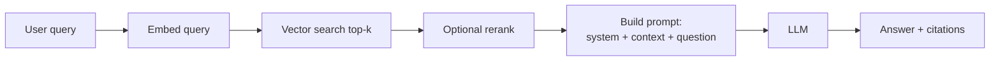

# AI System Design — Basic Interview Questions (Q&A)

> Foundational questions that warm up an AI system-design round. Natural tone, with the *why* behind each answer, plus diagrams and pros/cons where useful. If you can answer these crisply, you've earned the right to the harder rounds.

## Quick Coverage Map
| # | Question | Theme |
|---|----------|-------|
| 1 | How is AI system design different from traditional system design? | Fundamentals |
| 2 | What is RAG and why use it? | Retrieval |
| 3 | Walk through a basic RAG request flow | Architecture |
| 4 | What is an embedding / vector DB? | Retrieval |
| 5 | RAG vs fine-tuning — quick take | Trade-off |
| 6 | Managed API vs self-hosting | Trade-off |
| 7 | Why does caching matter for LLM apps? | Cost/latency |
| 8 | What drives LLM latency? | Latency |
| 9 | What drives LLM cost? | Cost |
| 10 | How do you keep an LLM from hallucinating? | Quality |
| 11 | What are guardrails? | Safety |
| 12 | How do you monitor a non-deterministic system? | Observability |

---

### 1. How is AI system design different from traditional system design?
Traditional systems are **deterministic** — same input, same output, cost scales with requests. LLM systems are **probabilistic**: the same prompt can give different answers, **cost scales with tokens** (not requests), and **latency is variable** (depends on output length and model load). You also get new failure modes like hallucination and prompt injection. But the fundamentals — statelessness, horizontal scaling, caching, queues, observability — still apply. AI just adds new components (embeddings, vector stores, inference servers, guardrails) around a non-deterministic, token-priced model.

> One-liner: "Same distributed-systems toolbox, but the model is a scarce, non-deterministic, token-priced dependency."

---

### 2. What is RAG and why use it?
**Retrieval-Augmented Generation**: instead of relying only on what the model memorized during training, you *retrieve* relevant documents from a knowledge base at query time and put them in the prompt so the model answers from real, current data.

Why:
- **Fresh + private knowledge** the model never saw in training.
- **Citations** — you can show sources.
- **Less hallucination** — the model grounds its answer in provided text.
- **Cheaper than fine-tuning** for changing facts.

---

### 3. Walk through a basic RAG request flow

1. Embed the query into a vector. 2. Search the vector DB for the most similar chunks. 3. (Optional) rerank for precision. 4. Stuff the top chunks into the prompt. 5. The model answers grounded in that context. 6. Return the answer with citations.

---

### 4. What is an embedding and what is a vector database?
An **embedding** is a dense numeric vector (e.g., 768 or 1536 dimensions) that captures the *meaning* of text — similar meanings land close together in vector space. A **vector database** stores these vectors and does fast **approximate nearest-neighbor (ANN)** search to find the most semantically similar items. It's the backbone of RAG and semantic search. Examples: pgvector, Qdrant, Milvus, Weaviate, Pinecone.

---

### 5. RAG vs fine-tuning — quick take
- **RAG** injects *knowledge* (facts that change or are private). Update by re-indexing docs — no retraining.
- **Fine-tuning** teaches *behavior/style/format* or specializes a smaller model on a narrow task. It does **not** reliably inject fresh facts.

**Rule of thumb:** RAG for knowledge, fine-tuning for behavior. They compose. For a "chat with our docs" feature, start with RAG.

---

### 6. Managed API vs self-hosting a model
| | Managed API | Self-hosted |
|---|-------------|-------------|
| Speed to launch | Minutes | Weeks |
| Ops burden | Low | High (GPUs, scaling) |
| Cost, low volume | Cheap | Expensive (idle GPUs) |
| Cost, high volume | Can dominate | Cheaper per token |
| Data privacy | Leaves your VPC | Full control |

**Start managed.** Self-host when you have strict privacy needs, very high steady volume, or need custom/fine-tuned open models.

---

### 7. Why does caching matter so much for LLM apps?
Because every uncached call costs tokens (money) and adds latency. Two levels:
- **Exact-match cache:** identical prompt → return stored answer instantly, $0.
- **Semantic cache:** a query *similar* to a past one reuses the answer.
- **Prompt/KV cache** at the inference layer reuses computation for shared prefixes (like the system prompt).

For repetitive workloads (support bots), 30–50% hit rates are common — that's a direct 30–50% cut in cost and latency.

---

### 8. What drives LLM latency?
- **Output length** — decoding is sequential, one token at a time (~30–80 tokens/s), so long answers are slow.
- **Model size** — bigger models are slower.
- **Prompt length** — prefill cost grows with input; attention scales ~quadratically.
- **Batching/queueing** — load on the serving fleet.

Split it into **prefill** (reading the prompt, parallel, fast) and **decode** (generating, sequential, slow). **Streaming** makes it *feel* fast by showing the first token quickly.

---

### 9. What drives LLM cost?
**Tokens.** `cost = input_tokens × price_in + output_tokens × price_out`. Both prompt size and output length matter, and output tokens are usually priced higher. Levers to cut cost: caching, model routing (cheap model first), shorter prompts/outputs, and smaller/fine-tuned models for easy tasks.

---

### 10. How do you keep an LLM from hallucinating?
- **Ground it with RAG** and instruct it to answer *only* from the provided context.
- If retrieval similarity is below a threshold, **say "I don't know"** instead of guessing.
- **Cite sources** so answers are verifiable.
- **Structured output validation** for machine-readable responses.
- **Human-in-the-loop** for high-stakes domains (medical/legal/financial).

You can't eliminate it, but grounding + refusal + verification dramatically reduce it.

---

### 11. What are guardrails?
Safety and correctness checks around the model:
- **Input side:** moderation, PII redaction, prompt-injection filtering, size limits.
- **Output side:** moderation, schema validation, groundedness checks, blocking secrets/PII leakage.

Think of them as the firewall around a non-deterministic component you don't fully control.

---

### 12. How do you monitor a non-deterministic system?
You can't rely on exact-match tests, so you monitor **distributions and quality**:
- **Operational:** latency p50/p95/p99, throughput, error/timeout rates, cache hit rate, cost per query.
- **Quality:** thumbs up/down, task success, groundedness/hallucination rate, retrieval recall.
- **Tracing:** capture the whole chain (query → retrieved chunks → prompt → output) to debug specific bad answers.
- **Evals:** golden datasets + LLM-as-judge run on every change, like a regression suite.

---

## Further Reading
- System Design Primer — https://github.com/donnemartin/system-design-primer
- RAG survey — https://arxiv.org/abs/2312.10997
- OpenAI production best practices — https://platform.openai.com/docs/guides/production-best-practices
- OWASP Top 10 for LLMs — https://owasp.org/www-project-top-10-for-large-language-model-applications/

---

*Content synthesized from general domain knowledge and current (2025-2026) interview trends; rephrased for compliance with licensing restrictions.*
