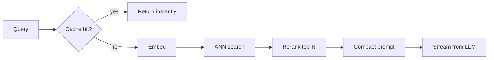
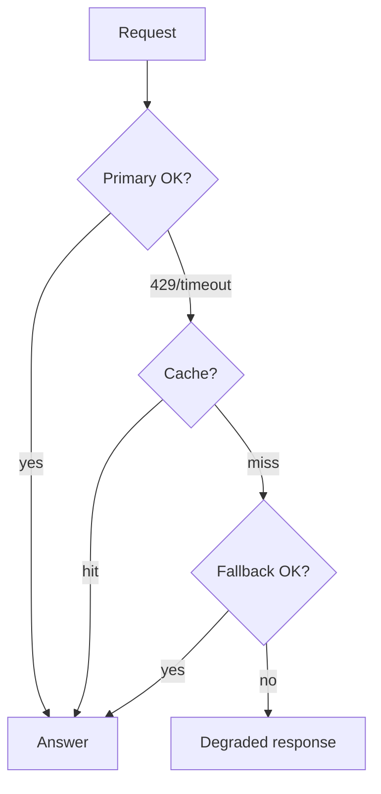

# AI System Design — Medium Interview Questions (Q&A)

> Mid-level questions that probe whether you can reason about trade-offs under constraints and design real components — not just recite definitions. Natural tone, diagrams, pros/cons, and *when/why* throughout.

## Quick Coverage Map
| # | Question | Theme |
|---|----------|-------|
| 1 | How do you reduce latency in a RAG system? | Latency |
| 2 | How do you control cost at scale? | Cost |
| 3 | How would you design chunking for RAG? | Retrieval quality |
| 4 | Hybrid search — what and why? | Retrieval |
| 5 | What is a reranker and when is it worth it? | Retrieval |
| 6 | How do you handle provider outages & rate limits? | Reliability |
| 7 | Model routing / cascades — how and why? | Cost/quality |
| 8 | How do you choose a vector database? | Storage |
| 9 | Sync vs async vs streaming | Request handling |
| 10 | How do you evaluate a RAG system? | Evaluation |
| 11 | How do you make retrieval fresh (updates/deletes)? | Data freshness |
| 12 | Semantic cache — how does it work and what are the risks? | Caching |

---

### 1. How do you reduce latency in a RAG system?
Attack each stage of the budget:
- **First token fast → stream.** Perceived latency is dominated by time-to-first-token; streaming hides decode time.
- **Retrieval:** tuned ANN index (HNSW `ef`), cap top-k, rerank only a small candidate set.
- **Prompt size:** fewer/shorter chunks = less prefill + less cost. "Lost in the middle" means more context isn't always better.
- **Caching:** exact + semantic cache; prompt/KV cache for the shared system prompt.
- **Model choice:** smaller/faster model when quality allows; speculative decoding when self-hosting.
- **Parallelize:** embed the query and warm connections concurrently.

---

### 2. How do you control cost at scale?
Cost = tokens × price. Levers:
1. **Caching** (exact + semantic) — the biggest win for repetitive traffic.
2. **Model routing/cascade** — cheap small model first, escalate only on low confidence.
3. **Prompt hygiene** — trim system prompts, retrieve fewer chunks, cap `max_tokens`.
4. **Fine-tune a small model** for high-volume narrow tasks.
5. **Batch** offline work (embeddings) for high GPU utilization.
6. **Budgets & alerts** — per-tenant caps, alert on token spikes.

Always do the math: e.g. $0.0125/query × 1M/day ≈ $375k/month; a 40% cache hit rate saves ~$150k/month.

---

### 3. How would you design chunking for RAG?
Chunking decides retrieval quality. Guidelines:
- **Size:** ~300–800 tokens. Too small loses context; too big dilutes relevance and wastes prompt tokens.
- **Overlap:** ~10–20% so answers spanning a boundary aren't cut off.
- **Respect structure:** split on headings/paragraphs/sentences, not mid-sentence. Keep code blocks/tables intact.
- **Metadata:** attach source, section title, doc id, `tenant_id`, timestamp — used for citations and filtering.
- **Consider:** semantic/recursive chunking, and storing a summary per parent doc for "small-to-big" retrieval.

There's no universal number — tune against an eval set measuring retrieval recall and answer quality.

---

### 4. Hybrid search — what and why?
Combine **keyword search (BM25)** with **vector (semantic) search**, then fuse results (e.g., Reciprocal Rank Fusion). Why: keyword search nails exact tokens (product names, error codes, SKUs, acronyms) that embeddings sometimes miss; vector search catches paraphrases and intent. Together they beat either alone on recall. Cost: a bit more complexity and a second index. Worth it for domains with lots of jargon/identifiers.

---

### 5. What is a reranker and when is it worth it?
A **reranker** (usually a cross-encoder) re-scores the top candidates from retrieval by jointly reading the query *and* each document, giving much higher precision than the initial vector similarity. Flow: retrieve top-50 cheaply → rerank → keep top-5 for the prompt. **Worth it** when precision matters and stuffing junk into the prompt hurts (cost + hallucination). Cost: extra ~20–50 ms and a model call. Skip it when latency is razor-thin or retrieval is already precise.

---

### 6. How do you handle provider outages and rate limits?
- **Rate limits (429):** exponential backoff + jitter, client-side token bucket, and a request queue to smooth bursts.
- **Outages/timeouts:** **circuit breaker** + **fallback** to a secondary provider/model behind a gateway abstraction.
- **Degrade gracefully:** serve a cached answer, a smaller model, or a template response rather than hard-failing.
- **Multi-provider** from day one so you're never single-homed on one vendor.

---

### 7. Model routing / cascades — how and why?
Not every request needs your most expensive model. **Route** by difficulty/capability: a classifier (or heuristics) sends easy queries to a cheap small model and hard ones to a large model. **Cascade:** try cheap first, run a verifier/confidence check, escalate only on failure. This can cut cost 50–80% on easy traffic with minimal quality loss. Also route by capability (vision, long context) and by SLA (latency-sensitive → fastest model). Trade-off: added complexity and the risk of a bad routing decision — measure quality by tier.

---

### 8. How do you choose a vector database?
| Option | When |
|--------|------|
| **pgvector** | Already on Postgres, <~5M vectors, want SQL + transactions + one fewer system |
| **Qdrant / Milvus / Weaviate** | Dedicated, 10M–1B+ vectors, rich filtering, self-host or cloud |
| **Pinecone** | Fully managed, don't want to operate infra |

Consider: scale (vectors count), filtering needs (metadata, multi-tenant), latency/recall targets (HNSW vs IVF-PQ), update patterns, and ops appetite. Quantization (int8/PQ) cuts memory ~4× at a small recall cost.

---

### 9. Sync vs async vs streaming — when each?
- **Sync + streaming:** interactive chat/completions. Stream tokens for good perceived latency.
- **Async (queue + job id):** long tasks — agent runs, bulk summarization, ingestion. Return immediately, notify on completion. Protects you from long-held connections and timeouts.
- **Batch (offline):** embeddings, backfills, evals — maximize GPU utilization, latency irrelevant.

Decouple ingestion, retrieval, and generation with queues so a spike in one doesn't topple the others.

---

### 10. How do you evaluate a RAG system?
Evaluate **retrieval** and **generation** separately:
- **Retrieval:** recall@k / hit-rate on a labeled set — did we fetch the right chunks?
- **Generation:** **groundedness/faithfulness** (is the answer supported by the context?), answer relevance, and correctness vs golden answers (LLM-as-judge for open-ended).
- **Online:** thumbs up/down, task success, deflection rate.

Build a **golden dataset**, run evals on every prompt/model/index change (regression suite), and mine production failures back into the set.

---

### 11. How do you keep retrieval fresh (updates and deletes)?
- **Updates:** trigger re-embedding on document change (webhook/CDC), re-embed only changed chunks, upsert into the index.
- **Deletes:** remove vectors by id; for ANN indexes that don't delete cheaply, use **tombstones** and periodic compaction/rebuild.
- **Freshness tiers:** a small "hot" index for recent changes merged periodically into the main index (near-real-time) vs nightly batch (eventual).

Freshness is a requirement to clarify up front — "how stale can an answer be?" drives this design.

---

### 12. Semantic cache — how does it work and what are the risks?
It embeds the incoming query and checks whether a *semantically similar* past query exists (within a similarity threshold); if so, it returns the cached answer. Big cost/latency win for paraphrased-but-repeated questions.

**Risks:** a too-loose threshold returns a subtly wrong cached answer for a different question; time-sensitive answers go stale; and in multi-tenant systems a shared cache can **leak data across tenants** — so scope the cache per tenant and set TTLs. Tune the threshold against evals.

---

## Further Reading
- vLLM docs (batching, paged attention) — https://docs.vllm.ai
- RAG survey — https://arxiv.org/abs/2312.10997
- Pinecone learning center — https://www.pinecone.io/learn/
- OpenAI production best practices — https://platform.openai.com/docs/guides/production-best-practices

---

*Content synthesized from general domain knowledge and current (2025-2026) interview trends; rephrased for compliance with licensing restrictions.*
