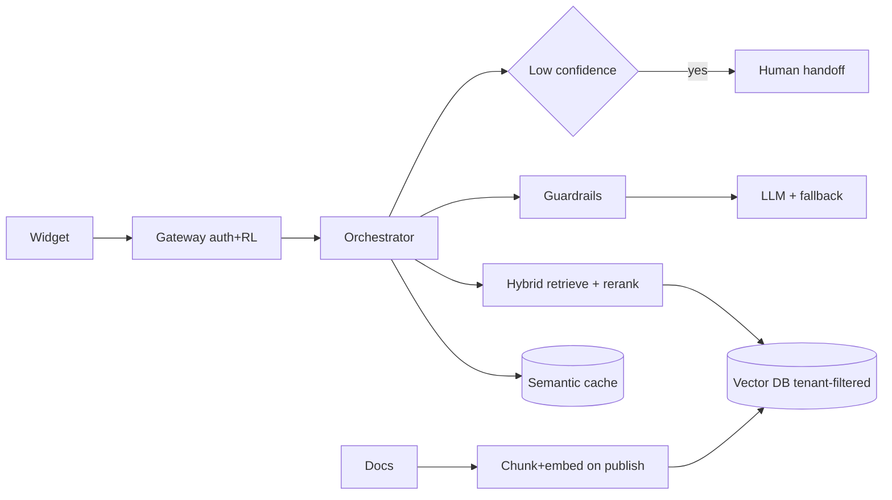
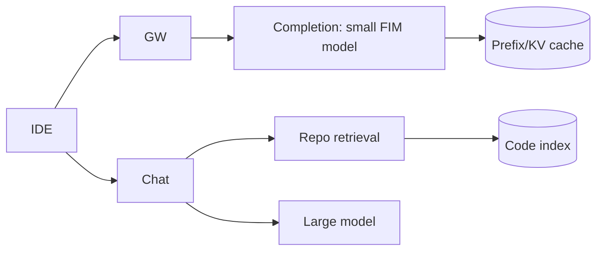
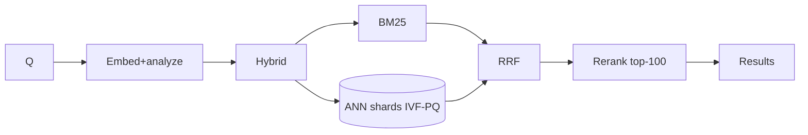
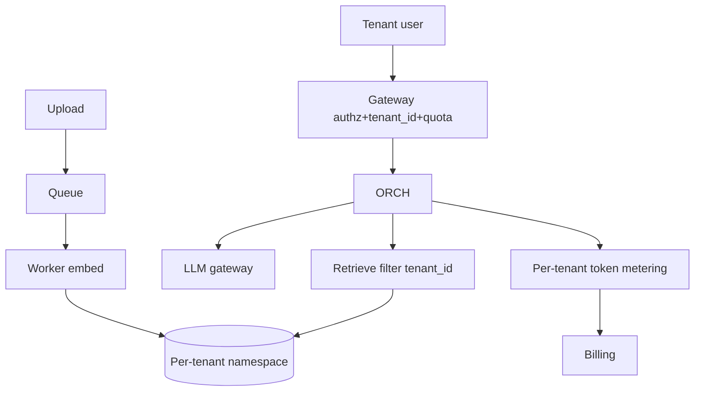
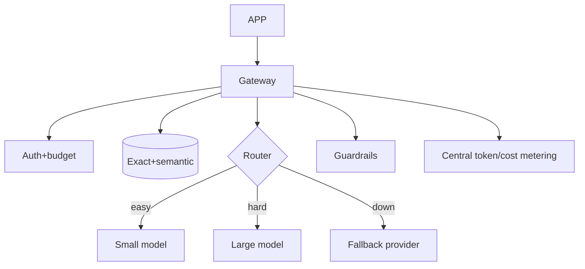
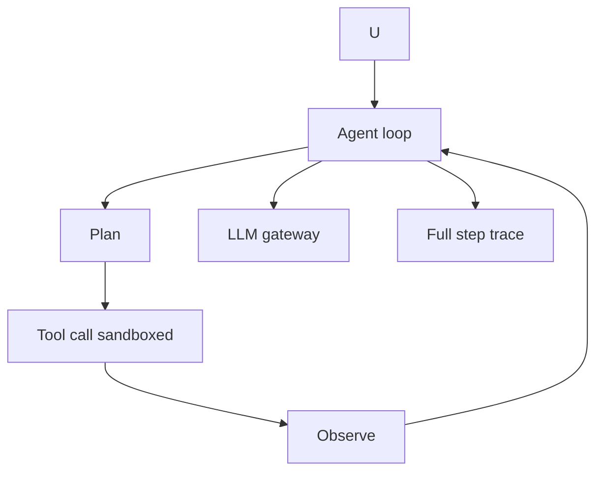
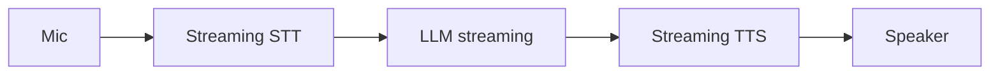

# AI System Design — Advanced / Expert Interview Questions (Senior & Staff)

> These are full **design-the-system** questions with the kind of follow-ups a staff interviewer piles on: scale, cost, latency, reliability, and security. Each answer drives an architecture, does the math, and names the trade-offs. Tone is conversational — the way you'd actually talk through it at the whiteboard.

## Quick Coverage Map
| # | Design prompt | Stress axes |
|---|---------------|-------------|
| 1 | Support chatbot over company docs | Freshness, hallucination, cost |
| 2 | Copilot-like code assistant | Latency, scale, isolation |
| 3 | Semantic search over 500M docs | Scale, sharding, recall |
| 4 | Multi-tenant RAG SaaS | Isolation, noisy neighbor, billing |
| 5 | LLM gateway | Routing, failover, cost governance |
| 6 | Agent platform with tools | Safety, cost caps, reliability |
| 7 | LLM batching/inference service | GPU throughput, KV cache |
| 8 | Real-time voice assistant | End-to-end latency |
| 9 | Guardrails / moderation pipeline | Safety at scale |
| 10 | RAG vs fine-tune vs long-context decision | Trade-off reasoning |
| 11 | Insurance-claims decision agent | Accuracy, cost, auditability |
| 12 | Global multi-region LLM service | Availability, data residency |

---

### 1. Design a customer-support chatbot over company docs
**Drive it:** clarify (50k tenants, 100k q/day, cite sources, p95 first token <700 ms, <$0.02/query), then RAG.

**Follow-ups:**
- *Hallucination?* "Answer only from context; below similarity threshold → 'I don't know' + handoff; cite sources."
- *Freshness?* Webhook-triggered incremental re-embed on doc publish.
- *Cost?* ~3k in/400 out ≈ $0.01–0.02; semantic cache (30–50% hit) cuts it hard.
- *Isolation?* Every chunk tagged `tenant_id`; retrieval always filtered; semantic cache per tenant.

---

### 2. Design a Copilot-like code assistant
**Key insight:** two latency regimes. Inline completions must feel instant (~100–300 ms); chat tolerates 1–3 s.

**Follow-ups:**
- *Latency?* Small self-hosted model + speculative decoding + KV/prefix cache; client-side debounce & cancellation (don't pay for tokens the user never sees).
- *Scale?* Millions of req/day → self-host on GPUs with continuous batching for per-token economics.
- *Quality metric?* Suggestion **acceptance rate**, online — not offline exact match.
- *Security?* Strong tenant isolation on the code index; VPC/on-prem option for enterprise; never cross-pollinate private code.

---

### 3. Design semantic search over 500M documents
**Reframe:** mostly an IR/retrieval problem; generation is optional summarization.

**Follow-ups:**
- *Storage?* 500M × 768 × 4B ≈ ~1.5 TB float32 → shard + replicate; int8/PQ quantization ~4× smaller.
- *Latency p95 <200 ms?* ANN candidate gen (tuned `nprobe`/`ef`) + rerank only top ~100; cache hot queries.
- *Freshness?* Hot index for recent writes merged into main; tombstones for deletes + periodic compaction.
- *Recall vs speed?* Tune index params against an eval set; hybrid fusion to recover keyword recall.

---

### 4. Design a multi-tenant RAG SaaS
**Central tension:** pool for cost vs silo for isolation.

**Follow-ups:**
- *Isolation?* `tenant_id` on every vector + mandatory query filter; per-tenant namespaces/collections; enterprise tier gets dedicated indexes. Test cross-tenant leakage explicitly.
- *Noisy neighbor?* Per-tenant rate limits, token quotas, priority queues; async ingestion so a big upload doesn't block chat.
- *Billing?* Meter in/out tokens per tenant at the gateway; hard budget caps; usage dashboards.
- *Cost?* Shared model fleet with continuous batching; per-tenant semantic cache (no leakage).
- *Security?* Encryption at rest per tenant, PII redaction on ingest, audit logs.

---

### 5. Design an LLM gateway
**Why:** one choke point for cost, safety, logging, and failover so every team doesn't reinvent it.

**Follow-ups:**
- *Routing?* Difficulty classifier → cheap-first cascade with a verifier; route by capability + SLA.
- *Reliability?* Multi-provider, circuit breakers, retries w/ backoff, graceful degradation.
- *Cost governance?* Per-team budgets, quotas, alerts, and full token/cost attribution.
- *Caching risks?* Shared cache must respect sensitivity/tenancy — scope carefully, set TTLs.

---

### 6. Design an agent platform with tool execution
**Loop:** reason → act (tool) → observe → repeat. The whole game is keeping it safe, bounded, and observable.

**Follow-ups:**
- *Runaway cost/loops?* Hard **step caps**, **per-run token budgets**, timeouts, loop detection.
- *Unsafe actions?* Tool **allow-lists**, sandboxed execution, least-privilege scopes, **human approval** for risky/irreversible actions.
- *Reliability?* Idempotent tools, retries, checkpoint state so a run can resume.
- *Prompt injection?* Treat tool outputs and retrieved text as untrusted; don't let them escalate permissions; validate before acting.
- *Observability?* Trace every step (plan, tool in/out, tokens) — essential for debugging non-deterministic agents.

---

### 7. Design an LLM batching / inference service (self-hosted)
**Goal:** maximize GPU throughput at acceptable latency.

**Approach:** a serving engine (vLLM/TGI/TensorRT-LLM) with **continuous (in-flight) batching** — new requests join the running batch each step instead of waiting for a static batch. **Paged attention** manages KV-cache memory efficiently; **speculative decoding** uses a small draft model to propose tokens the big model verifies.

**Follow-ups:**
- *Bottleneck?* Usually **KV-cache memory**, which grows with context length × concurrency — often before compute. Cap context, evict, or shard.
- *Throughput math?* `GPUs ≈ peak_output_tokens_per_sec / per_GPU_throughput`; size for peak concurrency + headroom, autoscale.
- *Latency vs throughput?* Bigger batches raise throughput but can hurt per-request latency — set a max batch/queue-time SLO.
- *Multi-model?* Route by model; use LoRA adapters to serve many fine-tunes on one base model; quantize (int8/fp8) to fit more on a GPU.

---

### 8. Design a real-time voice assistant
**Chain:** audio → STT → LLM (often + RAG) → TTS → audio, all inside a tight latency budget (feel of conversation: <~1 s to first audio).

**Follow-ups:**
- *Latency?* **Stream every stage** and overlap them — start TTS on the first sentence while the LLM keeps generating; use small fast models; edge/regional deployment.
- *Barge-in?* Detect user interruption → cancel in-flight generation/TTS.
- *Reliability?* Partial results, fallbacks per stage; degrade to text if TTS fails.
- *Cost?* Voice sessions are long — cap context, summarize history.

---

### 9. Design a guardrails / moderation pipeline at scale
**Layers:** input moderation + PII redaction + injection detection → model → output moderation + schema/groundedness validation.

**Follow-ups:**
- *Latency?* Run cheap checks inline (regex/classifiers, ~ms), heavier LLM-based checks selectively or async; parallelize with generation where safe.
- *Scale?* Guardrail models are their own fleet — cache decisions, batch, keep them small.
- *Prompt injection?* Separate trusted system content from untrusted input/retrieved text; constrain tool permissions; canary/allow-list outputs.
- *False positives?* Tune thresholds against an eval set; log flags; human review loop.

---

### 10. RAG vs fine-tune vs long-context — how do you decide?
Talk through it, don't pick blindly:
- **Changing/private facts, need citations →** RAG.
- **Stable behavior/style/format, latency & cost sensitive, have labeled data →** fine-tune (often a small model).
- **Small input, prototype, one-off doc →** long context.
- **They compose:** fine-tune a small model for the task *and* use RAG for facts; use long context to hold the retrieved chunks.

**Follow-up (cost/latency):** long context balloons token cost and attention cost (~quadratic) and suffers "lost in the middle"; RAG adds a retrieval hop but keeps prompts small; fine-tuning front-loads training cost but is cheap at inference.

---

### 11. Design an insurance-claims decision agent (RAG + tools) with cost control
**Flow:** ingest claim → retrieve policy docs + precedents → reason → call tools (fraud check, coverage lookup) → output approve/deny/escalate **with justification**.

**Follow-ups:**
- *Accuracy/auditability?* Ground every decision in cited policy text; log the full reasoning trace; require human review above a risk/amount threshold.
- *Cost?* Cheap model triages simple claims; escalate complex ones; cache policy retrieval; cap tokens per claim.
- *Reliability?* Idempotent processing (claim id), retries, dead-letter queue for failures.
- *Safety/compliance?* No decision without grounding; refuse/escalate on low confidence; strict PII handling and audit logs (regulated domain).

---

### 12. Design a global, multi-region LLM service
**Follow-ups:**
- *Availability?* Active-active regions behind global load balancing; failover across regions and providers.
- *Latency?* Route users to nearest region; regional vector DB replicas; edge caching.
- *Data residency?* Keep tenant data (and vectors/logs) in-region for compliance (GDPR etc.); route requests to the tenant's region.
- *Consistency?* Async replication of the index; accept eventual freshness across regions; pin write path per tenant.
- *Cost?* Regional GPU capacity is uneven — blend self-host + managed; autoscale to follow the sun.

---

## Further Reading
- Anthropic — building effective agents — https://www.anthropic.com/research/building-effective-agents
- vLLM (continuous batching, paged attention) — https://docs.vllm.ai
- OWASP Top 10 for LLM Applications — https://owasp.org/www-project-top-10-for-large-language-model-applications/
- System Design Primer — https://github.com/donnemartin/system-design-primer
- RAG survey — https://arxiv.org/abs/2312.10997

---

*Content synthesized from general domain knowledge and current (2025-2026) interview trends; rephrased for compliance with licensing restrictions.*
