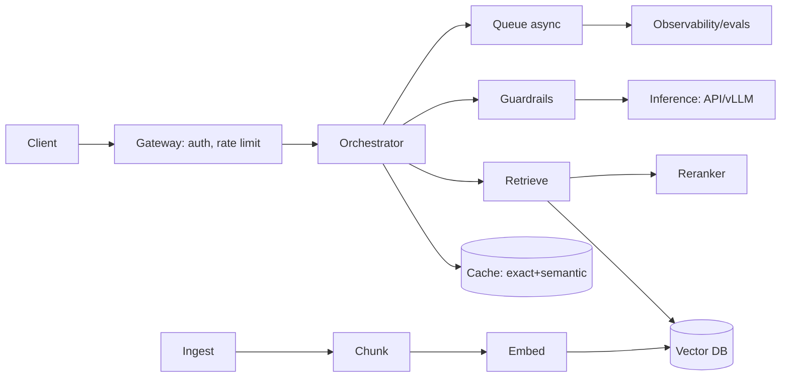

# AI System Design — Cheatsheet (Dense Reference)

> One-page-ish revision sheet. Skim the night before the interview.

---

## The 6-Step Framework
1. **Clarify** — users, scale (DAU/QPS), latency SLO, quality bar, budget, data (size/freshness/PII), build-vs-buy.
2. **Requirements** — functional + non-functional (turn adjectives into numbers).
3. **High-level architecture** — draw request path + offline/ingestion path.
4. **Deep dive** — retrieval, inference layer, caching, or evals (interviewer picks).
5. **Scale / cost / latency / failure** — do the math, name the bottleneck.
6. **Eval & monitoring** — how you know it works and stays working.

> Golden habits: clarify first · numbers not adjectives · name the bottleneck (usually GPU/inference + KV cache) · always mention caching + routing + fallback · treat evals/observability as components · call out prompt injection + tenant isolation.

---

## Building Blocks (draw these fast)

- **Gateway:** authn/z, rate limit, quotas, routing.
- **Orchestrator:** prompt build, retrieval, guardrails, model call — stateless.
- **Inference:** managed API *or* vLLM/TGI (continuous batching, paged attention, speculative decoding).
- **RAG:** chunk → embed → vector DB → (hybrid BM25) → rerank → prompt.
- **Cache:** exact, semantic, prompt/KV.
- **Queue:** long jobs, ingestion, agents; decouple stages.
- **Guardrails:** moderation, PII, injection, schema, groundedness.
- **Observability:** traces, token/cost, quality metrics, evals.

---

## Trade-Off Tables

**RAG vs Fine-tune vs Long-context**
| | RAG | Fine-tune | Long context |
|---|---|---|---|
| Injects | Knowledge (fresh/private) | Behavior/style | Convenience |
| Update | Re-index | Retrain | Just prompt |
| Cost | Retrieval + tokens | High upfront, cheap inference | Token cost grows |
| Pick when | Changing facts, citations | Stable narrow task | Small input |

**Managed vs Self-hosted**
| | Managed | Self-hosted |
|---|---|---|
| TTM | Minutes | Weeks |
| Ops | Low | High |
| Low volume | Cheap | Costly (idle GPU) |
| High volume | Can dominate | Cheaper/token |
| Privacy | Leaves VPC | Full control |

**Latency vs Cost vs Quality lever:** bigger model = +quality −latency −cost. Use **routing/cascade** (cheap→big), **streaming** (perceived latency), **caching** (all three).

**Sync/async/batch:** chat = sync+stream · long jobs = async queue · embeddings/backfill = batch.

**Vector DB:** pgvector (<5M, on Postgres) · Qdrant/Milvus/Weaviate (10M–1B+, filtering) · Pinecone (managed).

---

## Estimation Formulas
```
cost/req  = in_tok/1e6 * price_in + out_tok/1e6 * price_out
month     = cost/req * req/day * 30
latency   ≈ gw + embed(15ms) + search(20ms) + rerank(30ms) + prefill(~150ms) + decode(out_tok / (30–80 tok/s))
GPUs      ≈ peak_output_tokens_per_sec / per_GPU_throughput   (+headroom, autoscale)
vec bytes ≈ num_vectors * dim * 4   (÷4 with int8)
```
**Anchors:** decode ~30–80 tok/s · first-token target <500 ms · 10M×768 f32 ≈ ~30 GB · cache 30–50% hit on repetitive traffic.

---

## Reliability Checklist
- Fallback provider/model · circuit breaker · retries + backoff + jitter.
- 429 → token bucket + queue.
- Low-similarity retrieval → "I don't know" (no hallucinated junk).
- Per-tenant budgets + hard caps + spike alerts.
- **Degradation ladder:** full → cached → smaller model → template → retry-later.

---

## Security & Multi-Tenancy Checklist
- **Prompt injection** = #1 threat: separate system vs untrusted content, no secrets in prompt, least-privilege + sandboxed tools, validate outputs.
- **Isolation:** `tenant_id` on every vector + mandatory retrieval filter; per-tenant namespace/collection; per-tenant cache.
- **PII:** redact before embed/log; retention policies.
- **AuthN/Z:** JWT/OAuth at gateway; per-tenant keys; scoped tools.
- **Data residency:** in-region storage; zero-retention/self-host when regulated.
- Rate limits/quotas/budgets = also a security control.

---

## Evaluation Checklist
- **Retrieval:** recall@k, hit-rate.
- **Generation:** groundedness/faithfulness, relevance, correctness (LLM-as-judge).
- **Online:** 👍/👎, task success, deflection, latency p50/95/99, cost/query, cache hit, hallucination/refusal rate.
- **Trace** the full chain; **golden set** + run on every change; feed failures back.

---

## Worked-Design One-Liners
- **Support bot:** RAG + hybrid + rerank + semantic cache + "answer from context or handoff."
- **Code assistant:** small fast FIM model (completions) + large model (chat); KV cache; cancellation; acceptance-rate metric.
- **Semantic search 500M:** hybrid + RRF, ANN shards + PQ, rerank top-100, hot index for freshness.
- **RAG SaaS:** tenant_id filter, per-tenant namespace, async ingest queue, per-tenant metering + budgets.
- **LLM gateway:** routing/cascade + multi-provider fallback + cache + central cost/guardrails.
- **Agent platform:** step/token caps, tool allow-list, sandbox, human approval, full trace.

---

*Content synthesized from general domain knowledge and current (2025-2026) interview trends; rephrased for compliance with licensing restrictions.*
