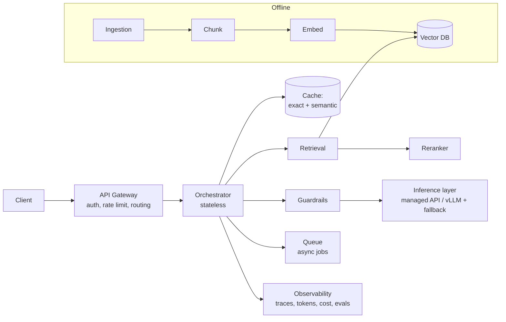
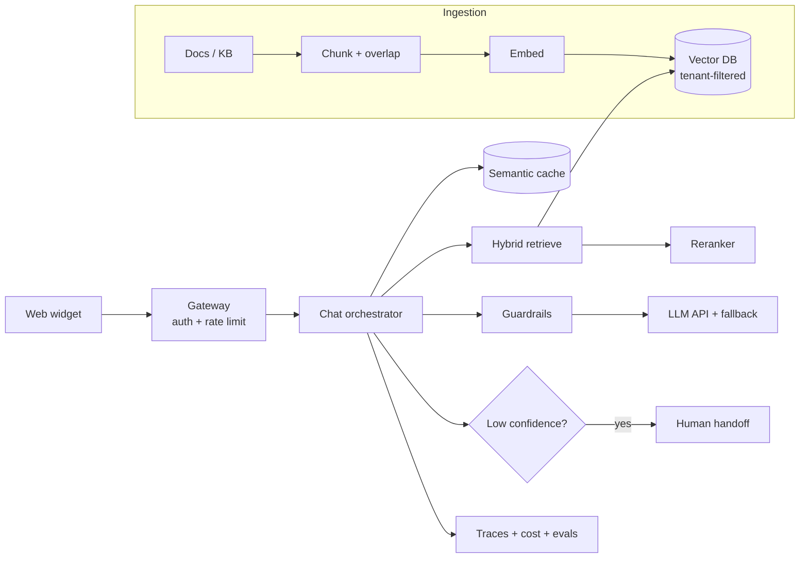
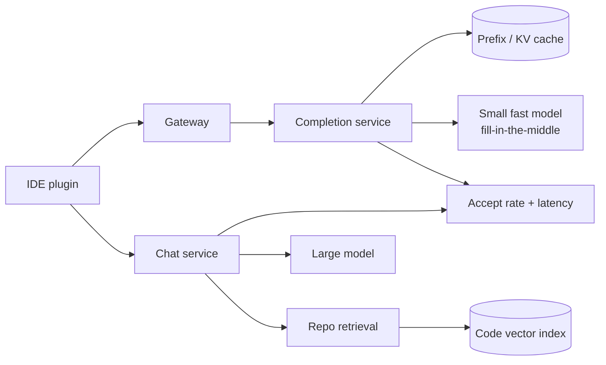
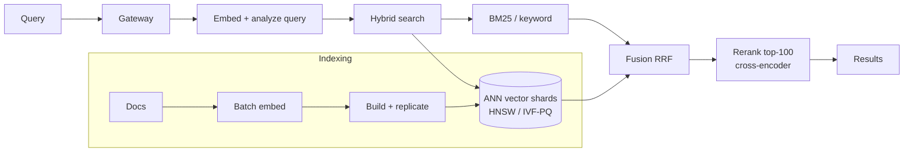
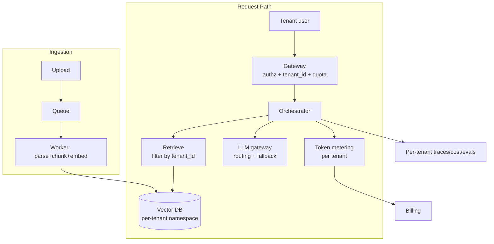
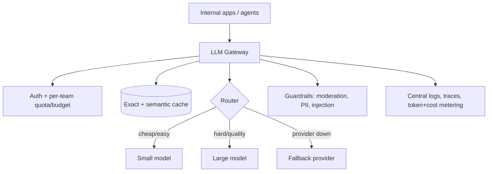
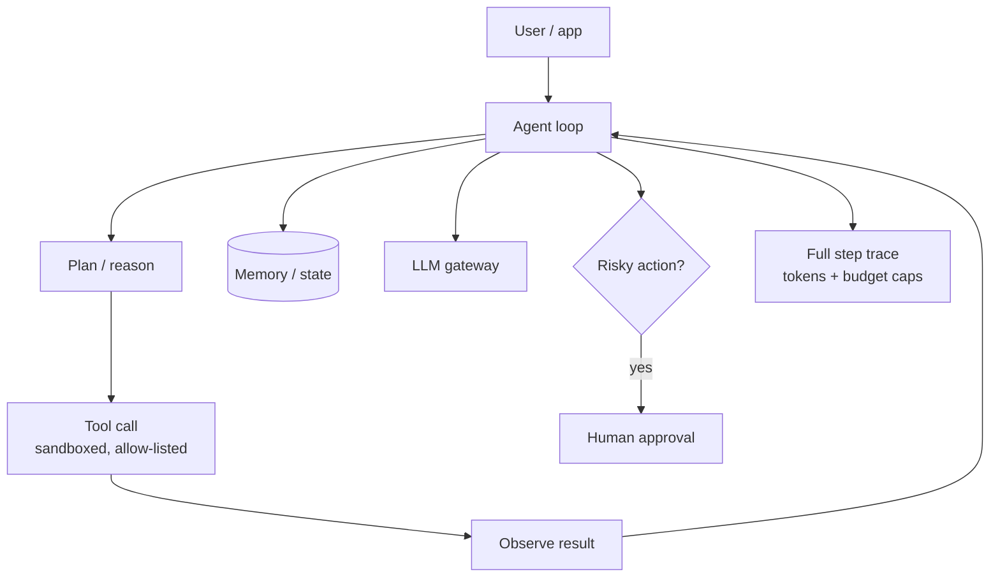
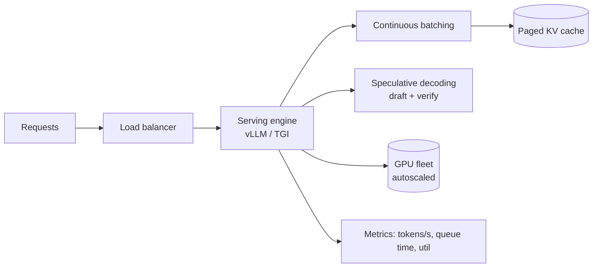
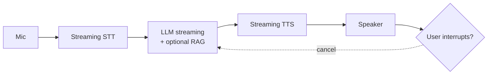
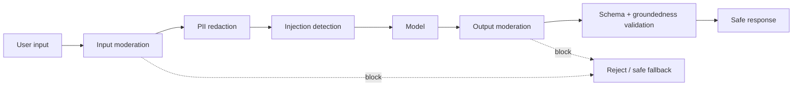

# AI System Design — Use-Case & Architecture Diagrams

> Mermaid architecture diagrams for the worked designs plus a generic reference architecture. Use these to practice sketching fast on a whiteboard.

---

## 0. Generic Reference Architecture (memorize this shape)

---

## 1. Support Chatbot over Docs (RAG)

---

## 2. Code Assistant (Copilot-like)

---

## 3. Semantic Search at Scale (500M docs)

---

## 4. Multi-Tenant RAG SaaS

---

## 5. LLM Gateway

---

## 6. Agent Platform with Tools

---

## 7. Self-Hosted Inference Service

---

## 8. Real-Time Voice Assistant

---

## 9. Guardrails / Moderation Pipeline

---

*Content synthesized from general domain knowledge and current (2025-2026) interview trends; rephrased for compliance with licensing restrictions.*
