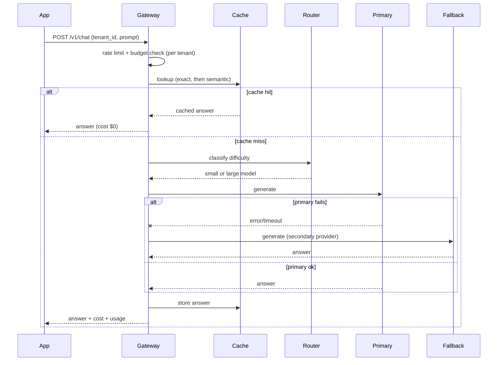

# Architecture Notes — LLM Gateway Example

> Design reasoning behind `llm_gateway_fastapi.py`. Read this to connect the code to the *why*.

## What the gateway is for
A gateway is a **single choke point** that every app/team calls instead of hitting model providers directly. That one architectural decision buys you:
- **Cost governance** — one place to meter tokens, enforce budgets, and route to cheaper models.
- **Reliability** — one place to add retries, circuit breakers, and multi-provider fallback.
- **Safety** — one place to apply guardrails (moderation, PII, injection).
- **Observability** — one place to trace every request and attribute cost per tenant/team.

Without it, every team re-implements caching, retries, and rate limiting — badly and inconsistently.

## Request sequence

## Key decisions (and the trade-offs)
| Decision | Why | Trade-off / risk |
|----------|-----|------------------|
| Per-tenant cache | Prevents cross-tenant data leakage | More memory than a shared cache |
| Exact + semantic cache | Exact is free & safe; semantic catches paraphrases | Loose semantic threshold can serve a wrong answer — tune it |
| Cheap→large routing | Cuts cost 50–80% on easy traffic | A bad routing call sends a hard query to a weak model; measure quality per tier |
| Fallback provider | Survives a single-provider outage | Fallback may be pricier / different behavior; keep it behind a circuit breaker |
| Rate limit + token budget | Stops noisy neighbors and cost blowups; also a security control | Legitimate bursts may be throttled; expose clear quota errors (429/402) |

## What's simplified vs production
- **Model & embedding calls are mocked** — swap in real SDKs.
- **In-memory state** — production uses Redis (cache, rate-limit counters) so state is shared across stateless gateway replicas behind a load balancer.
- **Circuit breaker + exponential backoff/jitter** are described but not fully implemented.
- **Guardrails** (moderation/PII/injection) are omitted from the code but belong right before/after the model call.
- **Semantic cache** does a linear scan; production uses a vector index.

## How this scales
- The gateway is **stateless** (all shared state in Redis) → scale horizontally behind a load balancer.
- Caching + routing reduce load on the expensive inference layer, which is the real bottleneck.
- Per-tenant quotas keep one caller from consuming the whole fleet.

---

*Content synthesized from general domain knowledge and current (2025-2026) interview trends; rephrased for compliance with licensing restrictions.*
