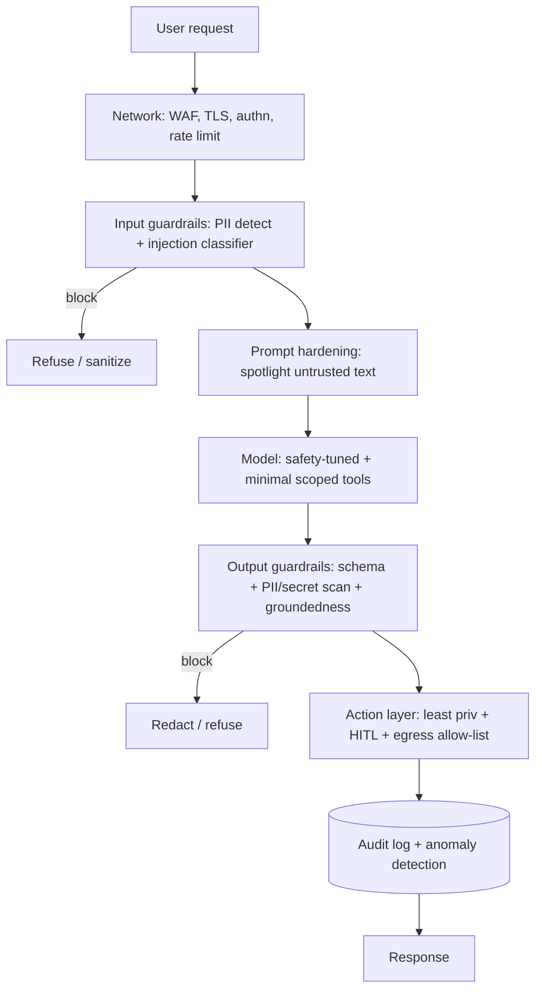
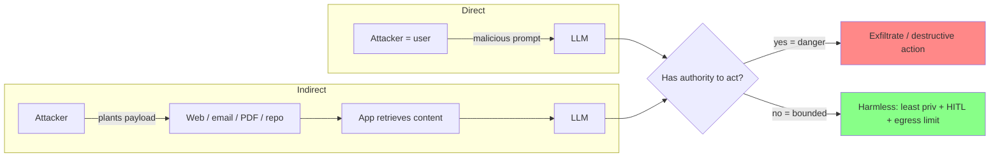
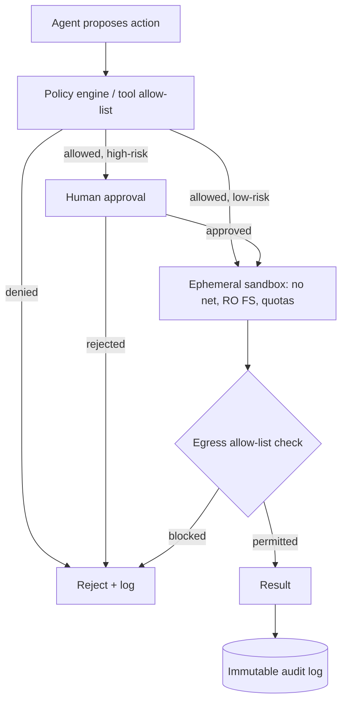
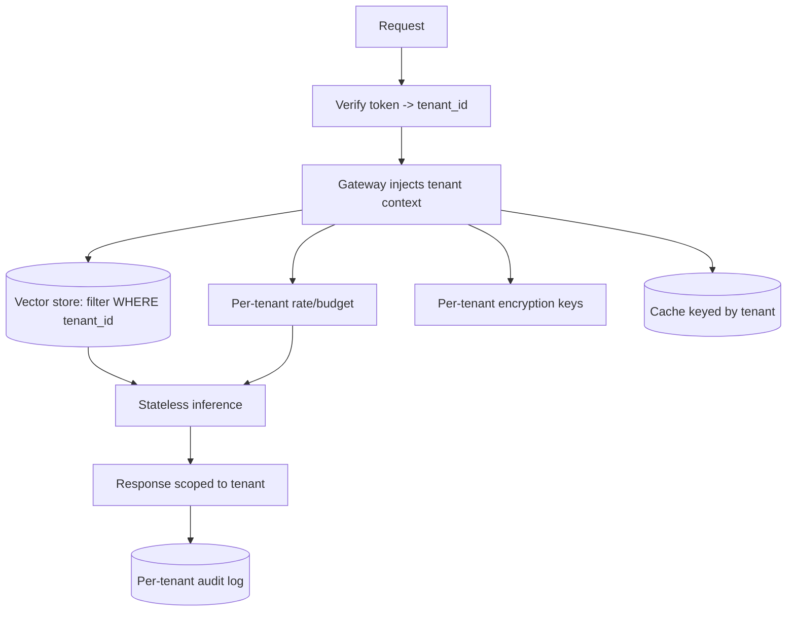
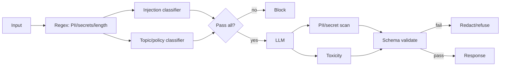
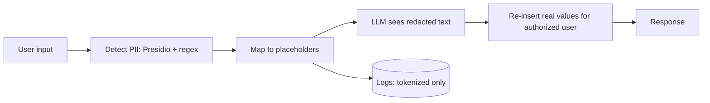
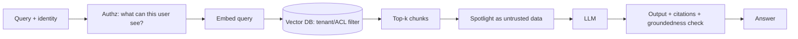
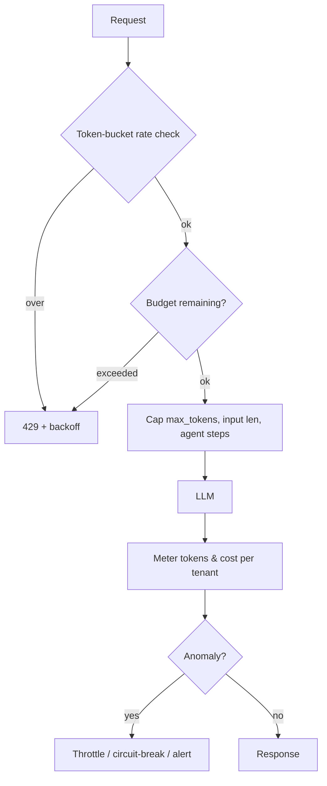
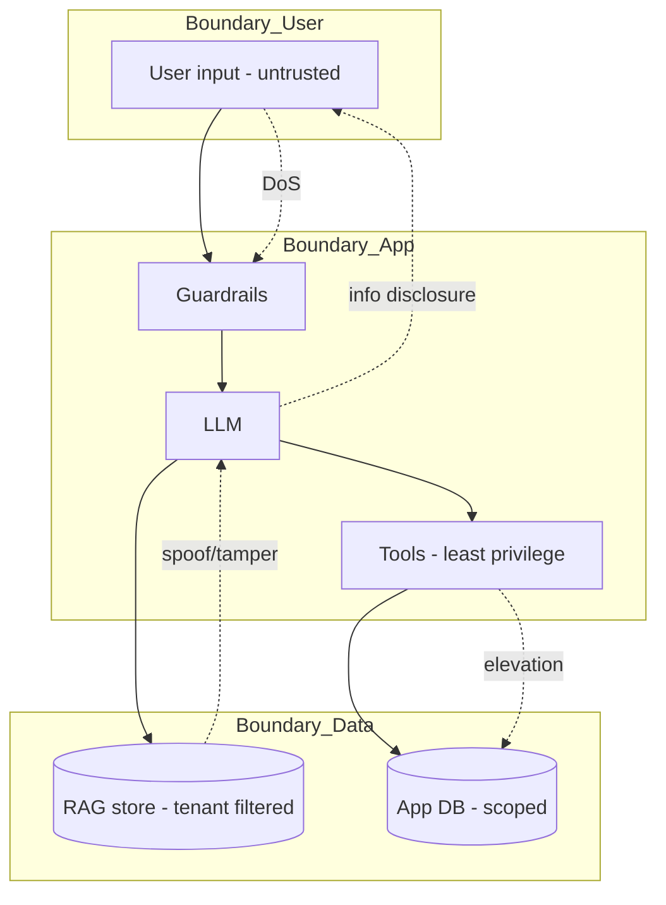

# AI Security — Use Case Diagrams

> Mermaid diagrams for the core AI security patterns. Use them to explain designs on a whiteboard.

---

## 1. Defense-in-depth pipeline
Every request passes through independent layers; no single layer is trusted alone.

---

## 2. Prompt injection flow (direct & indirect)
Two paths to the same failure: attacker text treated as a command.

---

## 3. Secure agent tool execution
Policy check → sandbox → HITL for risky actions → audit.

---

## 4. Multi-tenant isolation
Tenant context from the verified token drives every data access.

---

## 5. Guardrail layers (input & output)
Cheap deterministic checks first, model checks in parallel, schema last.

---

## 6. PII redaction flow
Detect → tokenize → process → re-insert only for the authorized user; logs stay tokenized.

---

## 7. Secure RAG retrieval
Authorize before retrieval; treat retrieved text as untrusted.

---

## 8. Unbounded consumption / rate & budget control
Reject over-limit, cap resources, meter spend, circuit-break on anomalies.

---

## 9. Threat model (STRIDE data-flow)
Trust boundaries around each component.

---

*Content synthesized from general domain knowledge and current (2025-2026) trends; rephrased for compliance with licensing restrictions.*
