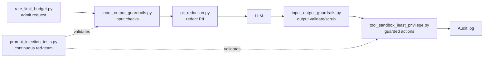

# AI Security — Implementation Code Examples

Runnable, heavily-commented Python examples for the core AI-security controls.
Every file is **pure-stdlib** so it runs with no dependencies or network
access — the model/guardrail calls are stubbed so you can focus on the
*security pattern*, not the plumbing. See `requirements.txt` for the packages
you'd add to make each one production-grade.

> The comments explain the **why** behind each control, mapped to the
> [OWASP LLM Top 10 (2025)](https://genai.owasp.org/llm-top-10/).

## Files

| File | Demonstrates | OWASP |
|------|--------------|-------|
| `prompt_injection_tests.py` | A red-team regression harness: a corpus of direct/indirect/encoding attacks run against a naive vs a defended app. | LLM01 |
| `input_output_guardrails.py` | Layered input+output guardrails, cheap→expensive ordering, deterministic schema validation of output. | LLM01, LLM02, LLM05 |
| `pii_redaction.py` | Reversible PII redaction: detect → tokenize → send redacted text → rehydrate only for the authorized user; logs stay tokenized. | LLM02, privacy |
| `tool_sandbox_least_privilege.py` | Least-privilege tool broker with HITL, run-as-user scope, egress allow-list, and bounded autonomy. | LLM06 |
| `rate_limit_budget.py` | Token-bucket rate limiting + hard token/cost budgets + per-request caps to stop denial-of-wallet/DoS. | LLM10 |

## Running

```bash
# No install needed — pure standard library:
python prompt_injection_tests.py
python input_output_guardrails.py
python pii_redaction.py
python tool_sandbox_least_privilege.py
python rate_limit_budget.py
```

## How they fit together



## Production upgrades (see requirements.txt)

- Swap the regex PII detector for **Microsoft Presidio** (NER-based).
- Replace the stub injection classifier with **Llama Guard**, **NeMo
  Guardrails**, **Rebuff**, or a provider moderation endpoint.
- Back the token bucket with **Redis** for limits that hold across instances.
- Validate model output with **Pydantic** schemas.
- Run **garak** / **promptfoo** in CI against the OWASP LLM Top 10.

## Further Reading
- [OWASP GenAI — LLM Top 10](https://genai.owasp.org/llm-top-10/)
- [Microsoft Presidio](https://github.com/microsoft/presidio)
- [NeMo Guardrails](https://github.com/NVIDIA/NeMo-Guardrails) · [Rebuff](https://github.com/protectai/rebuff) · [garak](https://github.com/NVIDIA/garak)

---

*Content synthesized from general domain knowledge and current (2025-2026) trends; rephrased for compliance with licensing restrictions.*
